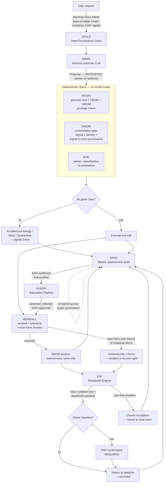

# BROKKR — Technical Architecture

## The Governed Autonomous Coding Agent

**Document ID:** BROKKR-ARCH-2026-001
**Revision:** 1.1
**Supersedes:** Rev 1.0 (13 July 2026), preserved immutably in git at the repository root commit. Rev 1.0 is not deleted; it is superseded. See §14 for the full record of what changed and why.
**Component:** BROKKR — a Rust-native autonomous coding agent governed end-to-end by OQGF-1.0
**Binds to:** OQGF-1.0 (five organs), the Physiology Layer (OQGF-P-1 through OQGF-P-9), and Amendments AMD-001 through AMD-007 in full
**Declared conformance level:** **Enhanced (OQGF-E)**, architected toward High-Assurance (OQGF-H). See §1.4.
**Author:** Jeremy Rose, CEO — Odin's LLC, Wasilla, Alaska
**Date:** 13 July 2026
**Status:** Architecture specification for the Odin's engineering team; input to the BROKKR build (Claude Code)
**Normative dependencies:** OQGF-M (Organ 3) and AMD-001 (costimulation) — load-bearing; OQGF-I (Organ 2), AMD-007 (Barrier); OQGF-G (Organ 1, genome/CBOM/AIBOM); OQGF-A (Organ 5); the full Physiology Layer — OQGF-P-1 (host-harm bound), P-2 (non-suppressible gate), P-3/P-4 (tolerance), P-5 (autoimmunity and storm), P-6 (adaptation, AMD-003), P-7 (coordinated signaling, AMD-004), P-8 (resolution, AMD-005), P-9 (accountable risk acceptance, AMD-006)

---

## 1. Purpose and scope

### 1.1 What BROKKR is

BROKKR is an autonomous coding agent, written in Rust, whose every action is governed by a deterministic control spine derived from OQGF-1.0. It reads a codebase, reasons about a task, and edits files, runs commands, and calls tools to complete that task — structurally comparable to existing agentic coding harnesses, with one difference that defines the whole design: **no action BROKKR takes reaches the real world without first passing a deterministic gate that the reasoning model cannot influence, suppress, or talk its way past.**

This document specifies the architecture that makes that claim true. It is the technical architecture only. The companion documents in the BROKKR set — the `CLAUDE.md` build rules, the OQGF Governance Binding, and the operator dashboard architecture — are deferred and referenced here where relevant.

### 1.2 What BROKKR is not, stated plainly

BROKKR does not contain a reasoning engine of its own, and this specification does not claim to build one. Like every current agentic coding tool, BROKKR is a **harness**: a body that manages context, dispatches tool calls, and asks a frontier reasoning model — reached over an API — what to do next. The reasoning lives in the model, not in BROKKR. What Odin's builds and owns is the harness and the governance around it; the reasoning is rented and swappable.

This has three consequences that shape the architecture:

- **The reasoner is a dependency, not a component.** It sits behind a stable Rust trait and can be replaced with any capable model without touching the governance spine. "Improving BROKKR's reasoning over time" means adopting each new model as it ships and improving the harness and the governance — not training a model in-house.
- **The reasoner is untrusted by construction.** Its outputs are proposals, not commands. A proposal carries no authority. This is not a hedge against a weak model; it is the correct posture toward *any* model, however capable, because a model can be manipulated through its context (prompt injection, poisoned files, adversarial tool output), and a manipulated brain must not be able to act outside the authority it was granted.
- **Model-agnosticism is the reasoning analog of cryptographic agility.** OQGF-G-5 forbids hard-coding a cryptographic algorithm; BROKKR forbids hard-coding a reasoning model. The model identifier is negotiated at configuration time, never compiled into the trust path — and it is **declared in the AIBOM** (§6.2), so a model swap is a recorded genome change, not an invisible one.

### 1.3 Binding to the full framework

BROKKR binds to the **full framework** — the five organs, the Physiology Layer, and all seven amendments — not to the five organs alone. The five organs establish anatomy; an autonomous agent that executes tool calls is defined as much by the amendments:

- **AMD-001 (Costimulation / Intent Provenance)** is the single most important requirement for BROKKR. An agent decomposes one authorized request into many tool calls across many reasoning hops. Identity alone (an agent proving it is BROKKR) does not prove that a given tool call is a faithful derivation of what the user authorized. AMD-001 is the mechanism that closes exactly this gap.
- **AMD-007 (the Barrier)** governs the substance a coding agent moves: source code, secrets, proprietary data crossing between the repository it works in and any destination outside it. Nothing in the five organs governs data content at the boundary; AMD-007 does.
- **The Physiology Layer** governs what happens *after* the gates fire. A defense with no bound on the harm it does to its own host is not a defense; a defense that can escalate but never de-escalate is a one-way ratchet; a defense that cannot learn repeats every mistake. These are AMD-002, AMD-005, and AMD-003 respectively, and all three are load-bearing for an agent whose entire value is doing useful work under constraint.

### 1.4 Declared conformance level and applicability

**BROKKR targets Enhanced (OQGF-E), architected toward High-Assurance (OQGF-H).** Per OQGF-1.0 §A.0.6, a system shall not claim a level higher than its lowest-level organ; BROKKR therefore claims Enhanced and forecloses nothing that High-Assurance will later require.

What Enhanced binds, that Baseline would not:

| Requirement | Enhanced obligation on BROKKR |
|---|---|
| **OQGF-R-1** | **Dual PQC families (ML-DSA + SLH-DSA) for audit signatures.** SAGA is an audit spine. This makes SLH-DSA a hard prerequisite, not a High-Assurance nicety. See §9. |
| **OQGF-M-9, M-10, M-12, M-13** | Monotonic attenuation cryptographically enforced; invariants evaluated at every hop; cross-hop reconciliation feeding the graded response; documented least-privilege Root Intent scoping |
| **OQGF-P-3** | Central-tolerance screening of every heuristic detector against the Self Set before activation |
| **OQGF-P-5** | Autoimmunity and response-storm detection, raised through the graded-response path |
| **OQGF-P-6.5, P-6.6** | Mandatory reversibility of learned detectors; **no autonomous activation** — DAP approval required |
| **OQGF-P-7.3, P-7.5, P-7.6** | Decentralized signaling; cascade bounding; Signal provenance in Organ 5 |
| **OQGF-P-8.4, P-8.5, P-8.6** | Memory preserved on stand-down; DAP-confirmed de-escalation above baseline; chronic-escalation detection |
| **OQGF-P-9.4, P-9.5** | Risk-acceptance register demonstrably distinct from the tolerance register; standing inventory of carried risks reportable on demand |
| **OQGF-I-11, I-12, I-14, I-15** | Ingress-provenance gating; screened content sentinel; enumerated Uncontrolled Channels with a reduction plan; barrier-bypass detection |

**Requirements not applicable to BROKKR, declared rather than omitted.** OQGF's assessment model (§A.9.3) permits `n.a.` with an evidence pointer. Silently dropping a requirement is not the same as declaring it inapplicable, and this architecture declares:

| Requirement | Status | Justification |
|---|---|---|
| OQGF-I-3 (quantum cloud trust model) | n.a. | BROKKR consumes no quantum cloud provider |
| OQGF-M-3 (quantum hardware attestation) | n.a. | No quantum workload; no circuit, calibration, or sampling distribution exists to reconcile |
| OQGF-A-2 (quantum computation records) | n.a. | As above |
| OQGF-A-4 (quantum explanation artifacts) | n.a. | No variational or kernel quantum model in the decision path |
| OQGF-R-5 (cross-jurisdictional audit replication) | n.a. at Enhanced | High-Assurance requirement; deferred, not dismissed |
| OQGF-R-7 (quantum key distribution) | integration point only | Placeholder per the requirement's own terms; nothing depends on it |
| **OQGF-R-2 (no provider lock-in)** | **applicable, reinterpreted** | The cloud-lock-in requirement's analog for BROKKR is **model-provider lock-in**. Satisfied by the `Reasoner` trait and AIBOM-declared model identity (§6.1, §6.2). Lock-in to a single model provider would require DAP risk acceptance. |

---

## 2. The governing principle: the reasoner is never in the trust path

Every design choice below follows from one principle, carried directly from the Odin's engineering doctrine:

> **The model proposes; the deterministic spine disposes. The reasoning model is never in the trust path for any decision to block, permit, raise, or lower posture.**

Two kinds of governance are possible for an agent, and only one of them is structural.

**Behavioral governance** tells the model how to behave — rules written in natural language in a system prompt or a `CLAUDE.md` file, which the model is asked to follow. This is useful and BROKKR uses it, but it is advisory: a sufficiently manipulated or mistaken model can violate a behavioral rule, because the rule and the actor are the same system. A prompt cannot enforce itself.

**Structural governance** places a deterministic gate between the model's output and any real-world effect, such that violating the rule is not a behavior the model can choose — it is an operation the system refuses to perform. The rule and the enforcer are different systems, and the enforcer contains no model.

BROKKR's contribution is to make the governance of a coding agent **structural** rather than behavioral. Every path from a model output to a file written, a command run, or a byte sent over the network passes through a Rust gate that (a) contains no language model, (b) decides on cryptographic and policy evidence alone, and (c) cannot be addressed, persuaded, or bypassed by the model whose action it is gating. The model can propose anything; it can cause nothing that the spine does not independently authorize.

**The corollary that Rev 1.1 makes explicit:** this principle is symmetric. The spine cannot be talked *past* — and it also cannot be allowed to strangle the work it exists to enable. A gate so tight that BROKKR denies most legitimate coding actions is not a safe agent; it is a useless one, and under OQGF-P-1 that failure has *equal standing* to a missed threat. §6.6 gives that failure a number, a bound, and an alarm.

---

## 3. Architectural rationale

### 3.1 Why a Rust harness can enforce what a prompt cannot

The gate is code, not instruction. A costimulation check written in Rust (§6.4) evaluates a cryptographic chain and returns `Granted` or `Anergy`; there is no natural-language channel through which a model can argue with a boolean. The type system carries the safety properties: an `Anergy` value has no method that turns it into an authorization, a `Deny` verdict has no method that turns it into an `Allow`, and a `ToleranceGrant` cannot be constructed against a deterministic gate. These are the same structural encodings the OQGF reference implementation already uses (AMD-002 §5.1, AMD-007 §5.1); BROKKR inherits them and applies them to the agentic loop.

### 3.2 Why Rust specifically

The OQGF Part C rationale applies without modification and is not restated in full. In brief: memory safety where cryptography and untrusted input meet; predictable latency on the gate's hot path with no garbage-collection pauses; a type system strong enough to make "wrong algorithm" and "unauthorized action" compile-time or construction-time errors; and a `no_std` subset for the core governance types. The production-code discipline from OQGF Part C — no `panic!`, `unwrap`, or `expect` in production paths, enforced by `clippy` lints set to `deny` — is a hard requirement, because a gate that panics is a gate that fails open under the wrong conditions.

---

## 4. System topology

BROKKR is composed of one external dependency (the reasoner) and a set of Rust subsystems, each named for its function and each mapped to the OQGF requirements it satisfies.

| Subsystem | Role | Governs / satisfies |
|---|---|---|
| **MÍMIR** | The advisory reasoner (frontier LLM behind a trait). Proposes; never acts. Outside the trust path. | Model-agnostic reasoning; the untrusted proposal source |
| **REGIN** | The Genome. Three signed registers: the Tool Genome, the CBOM, and the AIBOM. What BROKKR *is made of*. | Organ 1 (OQGF-G-1…G-5); Self Set (OQGF-P-3) |
| **SKULD** | The Intent Provenance Chain. Carries the Root Intent through every reasoning hop; enforces attenuation and invariants. | AMD-001 (OQGF-M-8 … M-14) |
| **SINDRI** | The Costimulation Gate — the deterministic spine. Every tool call passes it: Signal 1 + Signal 2, or architectural anergy. | Organ 3 (OQGF-M-11); OQGF-P-2 |
| **HÚÐ** | The Barrier. Data-custody control on file and network crossings between governed and ungoverned compartments. | AMD-007 (OQGF-I-8 … I-15) |
| **HEIMDALL** | The Sentinel. Behavioral anomaly, cross-hop reconciliation, the tolerance controller, and the host-harm monitor. | Organ 2 (OQGF-I-6); OQGF-M-12; OQGF-P-1, P-3, P-4, P-5 |
| **EIR** | The Resolution Engine. The way down. Every escalation has a declared path back to baseline; de-escalation above baseline is DAP-confirmed. | AMD-005 (OQGF-P-8.1 … P-8.7) |
| **KVASIR** | The Maturation Pipeline. Learns refined detectors from DAP-confirmed incidents, under four poisoning gates. | AMD-003 (OQGF-P-6.1 … P-6.6) |
| **SAGA** | The Audit Spine. Signed, append-only record of every proposal, gate decision, and action; re-signed across crypto generations. | Organ 5 (OQGF-A) |

Naming glosses, for the record. **MÍMIR** — the counselor whose head gives Odin wisdom but has no hands; it speaks, it does not act. **REGIN** — Old Norse *regin*, "the powers"; the register of what BROKKR is made of and what it may wield, and also the smith of the Völsung legend. **SKULD** — the Norn of *that which shall be* and of obligation; the intent chain is what an action *shall* be, bound to what was owed by its authorization. (GARM's memory organ takes the past-Norn Urðr; BROKKR's intent chain takes the future-Norn Skuld — parallel, distinct.) **SINDRI** — the master smith who directs each strike at the forge; the gate that permits or refuses each action. **HÚÐ** — Old Norse for *hide/skin*; the selective epithelial barrier the AMD-007 analogy names directly. **HEIMDALL** — the watchman who sees to the edge of the world and hears the grass grow. **EIR** — the physician of the gods, the best of healers; the return to health *is* the return to baseline, and the asymmetry is in the naming: the watchman may raise the alarm alone, the healer may not stand the body down without the DAP. **KVASIR** — the wisest being, distilled from mingled sources, whose wisdom was later stolen and misused; the maturation pipeline distills better detection from confirmed incidents, and the cautionary half of the myth is precisely the poisoning residual AMD-003 names (§12). Kvasir is distinct from Mímir: Mímir advises in the moment and is untrusted; Kvasir refines detectors from history and is gated four ways. **SAGA** — *what is recorded and told*.

### 4.1 The governed action cycle



Three load-bearing observations about this diagram.

**MÍMIR feeds the spine but is never inside the decision.** Its only output is a proposal on the left; every box that decides — REGIN, SINDRI, HÚÐ, HEIMDALL, EIR, KVASIR — contains no model and cannot be reached by one.

**The fail-safe asymmetry is visible in the shape.** HEIMDALL raises posture on its own authority. Nothing lowers it on its own authority: the path down runs through EIR, and above baseline it runs through a DAP. Raising is cheap and reversible; lowering re-exposes the host. Where the system is uncertain, it stays escalated (OQGF-P-8.5).

**The learning loop closes through a human.** KVASIR draws only from DAP-confirmed incidents in SAGA and returns only detectors that survived four gates and a DAP approval. There is no arrow from MÍMIR to KVASIR. The agent does not teach itself.

---

## 5. The governed action cycle, step by step

1. **The request becomes a Root Intent.** A user (or an authenticated upstream principal) issues a task. BROKKR does not hand this to the model as free text with implied authority. It constructs a **Root Intent** (SKULD): a least-privilege scope (OQGF-M-13), an invariant set (OQGF-M-10) — for example `no network egress`, `read-only outside ./src`, `no secret material in committed output` — a freshness nonce and expiry (OQGF-M-14), the accountable natural person (DAP, OQGF-A-5), and a signature. This is the sole source of authority for everything that follows.

2. **MÍMIR proposes.** The reasoner receives the current context and the *current attenuated intent scope* — not the raw Root Intent, and never more authority than the present hop holds. It returns a `Proposal`: one concrete action (write this file, run this command, fetch this URL) plus an advisory rationale. The proposal is untrusted input to the spine.

3. **REGIN checks the genome.** The proposed tool must be a declared, signed member of the Tool Genome, and the calling hop must hold the tool's required privilege class. A tool not in the genome does not exist as far as BROKKR is concerned. A privileged tool proposed by a hop that lacks the privilege is refused here.

4. **SINDRI runs the costimulation gate.** This is the deterministic spine and the load-bearing gate. It requires **both** signals (OQGF-M-11): Signal 1, BROKKR's own attestation for this hop (OQGF-M-1); and Signal 2, a valid Intent Provenance Chain (OQGF-M-8) tracing this action back to the Root Intent. It walks the chain, verifies each link's hash and signature, confirms `emitted_intent ⊆ received_intent` at every hop (monotonic attenuation, OQGF-M-9), confirms the action lies within the current scope, and evaluates the action against the accumulated invariant set. If any check fails, the action is placed in **architectural anergy**: denied, a signed denial emitted to HEIMDALL, recorded in SAGA. Identity alone never suffices.

5. **HÚÐ governs the crossing, when there is one.** If the action moves data across a controlled boundary — reading a classified file and writing its content to a network destination, staging content into a commit that will leave the governed compartment, or bringing fetched content of unknown origin into the working tree — the Barrier evaluates it. Declared classification against an unauthorized destination is a **deterministic Deny** (OQGF-I-10), non-suppressible. Unprovenanced ingress into a privileged context is **quarantined** (OQGF-I-11) until provenance is established. Every crossing carries or is matched to a signed Boundary Custody Record (OQGF-I-9).

6. **The action executes only if all gates clear.** There is no other path to execution. The executed action is an `AuthorizedAction` — a type that can only be produced by the spine, never constructed directly.

7. **HEIMDALL reconciles behavior — and watches BROKKR's harm to its own host.** The sentinel compares the *sequence* of executed actions against the declared intent at each hop and against the Root Intent invariants (OQGF-M-12). Deviation raises posture through a coordinated signal (OQGF-P-7) into the graded-response path (OQGF-I-6). **Simultaneously and independently, HEIMDALL measures the host-harm rate** (OQGF-P-1): how often BROKKR denies, anergizes, or quarantines a *legitimate* coding action. A sustained breach of the declared bound is **autoimmunity**; a single response above the declared blast radius is a **response storm**. Either is a security incident in its own right, not a side effect to be tolerated (OQGF-P-5).

8. **EIR provides the way down.** Every escalation type is registered with a declared Resolution Path *before it may be used* — the clear condition, the target baseline posture, a minimum dwell time, a hold window, and a maximum duration (OQGF-P-8.1, P-8.3, P-8.6). There are no one-way ratchets. When the clear condition is met and the hysteresis is satisfied, EIR evaluates whether the escalation may resolve. **Above baseline, it may not resolve without DAP confirmation** (OQGF-P-8.5). Where the system is uncertain, it stays escalated. De-escalation preserves the incident record and any learned detector (OQGF-P-8.4): the response stands down, the intelligence does not. An escalation that persists past its maximum duration without resolving or being re-justified is flagged as a **Chronic Escalation** and treated as host harm (OQGF-P-8.6) — a defense that never switches off is pathology, not vigilance.

9. **SAGA records everything.** Every proposal (including refused ones), every gate decision, every executed action, every posture change and resolution, the DAP, and the intent chain state are written to a signed, append-only audit trail (Organ 5). Records are never deleted or overwritten; corrections are annotations. Audit signatures are dual-family (ML-DSA + SLH-DSA) per OQGF-R-1 at Enhanced, and re-signed under the prevailing cryptographic generation on schedule (OQGF-A-6).

10. **KVASIR learns, slowly and under guard.** When the DAP confirms a true positive in SAGA, that incident — and only that incident — may seed a Refined Detector (OQGF-P-6.1). The candidate must beat an *independent* evaluation corpus, not the sample that seeded it (OQGF-P-6.2); must pass central-tolerance screening against REGIN's Self Set, and is **discarded regardless of its detection gains** if it raises host harm above the bound (OQGF-P-6.3); must carry signed provenance (OQGF-P-6.4); must be versioned and reversible (OQGF-P-6.5); and at Enhanced **cannot be activated without DAP approval** (OQGF-P-6.6). BROKKR may get better at *noticing*. It cannot learn its way past a gate.

11. **The loop continues.** The result returns to MÍMIR. As the model spawns sub-tasks, SKULD appends chain entries that can only narrow authority. The cycle repeats until the task completes or the intent expires.

---

## 6. Per-subsystem architecture

The core governance types are those defined in `oqgf-core` by the amendments (`ResponseClass`, `IntentProvenanceChain`, `CostimulationGate`, `ToleranceController`, `HostHarmReport`, `SelfSet`, `ToleranceGrant`, `BarrierVerdict`, `Signal`, `EscalationType`, `ResolutionDecision`, `ResolutionEngine`, `RefinedDetector`, `DetectorProvenance`, `MaturationPipeline`, and their supporting types). Per the decoupling decision in §8, BROKKR carries its own implementation of these in `brokkr-core` rather than sharing a crate with ETERNAL WAR / FORSETI. The types below extend that base with the agent-specific surfaces.

### 6.1 MÍMIR — the advisory reasoner

MÍMIR is a trait, not a component Odin's builds. Its whole purpose is to keep the reasoning model swappable and outside the trust path.

```rust
/// A proposed action emitted by the advisory reasoner.
/// UNTRUSTED input to the deterministic spine. Carries no authority.
pub struct Proposal {
    pub action: Action,        // what the model wants to do
    pub rationale: String,     // the model's stated reason — advisory only
    pub hop: HopId,            // which reasoning hop produced it
}

/// The advisory reasoner: any capable frontier model behind a stable trait.
/// Model-agnostic by construction — the reasoning analog of crypto-agility.
/// MÍMIR proposes; the trust path never consults it.
pub trait Reasoner: Send + Sync {
    /// The model's declared identity, recorded in the AIBOM (OQGF-G-2).
    /// A model swap is a genome change, not an invisible configuration edit.
    fn identity(&self) -> ModelIdentity;

    fn propose(
        &self,
        ctx: &Context,
        scope: &IntentScope,   // the CURRENT attenuated scope, never the raw Root Intent
    ) -> Result<Proposal, ReasonerError>;
}
```

Three rules bind every `Reasoner` implementation: the model is passed only the current attenuated scope, never more authority than the present hop holds; the model receives no channel — none — to any gate's decision (there is no tool named "override," no invariant the model may edit, no path by which a rationale changes a boolean); and the model's identity, version, provider, and the system prompts it was given are declared in the AIBOM.

### 6.2 REGIN — the Genome

REGIN is what BROKKR is *made of*, in the Genetic-Layer sense (OQGF-G). It carries **three signed registers**, and it is simultaneously the declared known-good baseline against which detectors are screened (the Self Set, OQGF-P-3).

```rust
/// The signed, versioned declaration of what BROKKR is made of.
/// Genetic Layer (OQGF-G-1, G-2, G-3) and Self Set (OQGF-P-3).
pub struct Genome {
    pub version: GenomeVersion,
    pub tools: ToolGenome,     // what BROKKR may invoke
    pub cbom: Cbom,            // what cryptography BROKKR contains (OQGF-G-1)
    pub aibom: Aibom,          // what model BROKKR reasons with (OQGF-G-2)
    pub corpus_digest: Digest, // pinned; the whole genome, one hash
    pub owner: Dap,
    pub signature: DualSignature,  // ML-DSA + SLH-DSA (OQGF-R-1 at Enhanced)
}

pub struct ToolEntry {
    pub id: ToolId,
    pub schema: ToolSchema,            // typed inputs and outputs
    pub privilege: PrivilegeClass,     // Unprivileged | Privileged | SelfModifying
    pub response_class: ResponseClass, // gates on this tool are Deterministic
}

pub enum PrivilegeClass {
    /// Read-only within the working tree, no side effects outside it.
    Unprivileged,
    /// File writes, shell execution, network — requires costimulation.
    Privileged,
    /// Actions that modify BROKKR's own governance (genome, invariants,
    /// gate config, classification policy). Costimulated AND requires explicit
    /// DAP confirmation. The governor governs itself; there is no carve-out.
    SelfModifying,
}
```

**The CBOM (OQGF-G-1)** lists every cryptographic primitive, library, parameter set, and its FIPS validation reference: wolfCrypt's version and build provenance, ML-DSA, SLH-DSA, HMAC-SHA-384, AES-256. It is CycloneDX 1.6 conformant. The FFI honesty rule (§9) applies to every entry: BROKKR does not assert an algorithm identity the manifest cannot confirm.

**The AIBOM (OQGF-G-2)** is the register most people would forget, and it is the one that matters most for an agent. OQGF-G-2 requires an inventory of *models, weights provenance, frameworks, licenses, and — explicitly — prompts and system messages.* For BROKKR that means: **the model MÍMIR is bound to, its version and provider, and the digests of the governance corpus and system prompts it was given.** A swapped model is a genome change. A changed system prompt is a genome change. Neither is an invisible configuration edit, because both change what BROKKR will propose, and the AIBOM is what makes that visible.

**The gate (OQGF-G-4).** No BROKKR release is promoted without a present, signed CBOM and AIBOM free of disallowed algorithms. This is a **Deterministic Gate** under OQGF-P-2: fail-closed, non-suppressible. The only sanctioned way past a finding is an Accountable Risk Acceptance (§6.5, AMD-006) that keeps the finding visible.

### 6.3 SKULD — the Intent Provenance Chain

SKULD implements AMD-001 directly. The types are the amendment's (`RootIntent`, `IntentChainEntry`, `IntentProvenanceChain`); BROKKR's contribution is to maintain the chain across the reasoning loop — appending an entry at every hop, always narrowing.

```rust
/// Appends a hop to the chain. The emitted scope MUST be a subset of the
/// received scope (OQGF-M-9). Broadening is not an error to report — it is
/// an operation this method cannot perform; the return type has no widening path.
pub trait IntentChain: Send + Sync {
    fn attenuate(
        &self,
        current: &IntentProvenanceChain,
        hop: &Attestation,          // Signal 1 for the new hop
        emitted: IntentScope,       // checked ⊆ received at construction
        added_caveats: Vec<Caveat>,
        added_invariants: InvariantSet,
    ) -> Result<IntentProvenanceChain, AttenuationError>; // Err(WouldBroaden)
}
```

When a hop genuinely needs authority broader than it holds, it cannot self-broaden; it must surface a request for a new Root Intent to the DAP (OQGF-M-9). In BROKKR this is a visible, human-gated event, not a silent escalation.

### 6.4 SINDRI — the Costimulation Gate

SINDRI is the deterministic spine. It is the `CostimulationGate` of AMD-001, hardened by the non-suppressibility of OQGF-P-2.

```rust
/// Every privileged tool call passes here. Grants only if BOTH Signal 1
/// (identity) and Signal 2 (a valid Intent Provenance Chain) verify AND the
/// action lies within the attenuated scope AND violates no invariant.
/// Otherwise: Anergy. Contains no model and exposes no channel to one.
pub trait CostimulationGate: Send + Sync {
    fn authorize(
        &self,
        identity: &Attestation,          // Signal 1 (OQGF-M-1)
        chain: &IntentProvenanceChain,   // Signal 2 (OQGF-M-8)
        action: &Action,
    ) -> AuthorizationDecision;          // Granted(AuthorizedAction) | Anergy { reason, event }
}

/// Produced ONLY by a successful SINDRI authorization. There is no public
/// constructor. An action cannot be executed without one of these, and one of
/// these cannot exist without having passed the gate.
pub struct AuthorizedAction { /* private fields */ }
```

The `AuthorizedAction` type is the structural heart of BROKKR: the executor accepts nothing else, and only SINDRI can mint one. This is what makes "no ungoverned action" a property of the type system rather than a hope about control flow.

The verification algorithm is AMD-001 §5.3 unchanged: verify identity; verify the Root Intent signature and freshness; walk the chain verifying each hash link, HMAC, and signature and confirming subset attenuation; confirm the action is in the current scope; evaluate against the accumulated invariants; grant or return anergy with a signed event to HEIMDALL and a record in SAGA.

### 6.5 HÚÐ — the Barrier

HÚÐ implements AMD-007 for the file and network surfaces a coding agent touches. It is the enforcement counterpart to HEIMDALL's detection: HEIMDALL observes what crosses, HÚÐ decides whether it may.

```rust
pub enum BarrierVerdict {
    Allow,
    /// Deterministic, non-suppressible (OQGF-I-10, inheriting OQGF-P-2).
    /// The only sanctioned way past is an AMD-006 AcceptedRisk that keeps the
    /// finding visible — never suppression.
    Deny { finding: BarrierFinding },
    /// Unprovenanced ingress into a privileged context (OQGF-I-11).
    Quarantine { datum: DatumRef },
    /// A DAP has recorded a scoped, expiring, signed decision to proceed past a
    /// still-visible Deny (AMD-006 / OQGF-P-9). Distinct from Allow by construction.
    AcceptedRisk { entry: RiskAcceptanceId },
}

pub trait Barrier: Send + Sync {
    fn evaluate(&self, flow: &BoundaryFlow) -> BarrierVerdict;
}
```

There is deliberately no method that converts a `Deny` into an `Allow`. The egress classification gate is a deterministic gate; a model cannot suppress it, and neither can an operator by ordinary configuration. The single sanctioned path past it is an Accountable Risk Acceptance, which keeps the finding fully visible and attaches a named DAP to the decision.

**At Enhanced, the two registers must be demonstrably distinct** (OQGF-P-9.4): a Risk-Acceptance Entry is not a Tolerance Grant, no decision is expressible as both, and the standing inventory of currently carried accepted risks is reportable on demand (OQGF-P-9.5). A system that cannot enumerate the risks it is carrying does not satisfy OQGF-P-1.

**Uncontrolled Channels (OQGF-I-14).** BROKKR enumerates the channels through which governed data could leave outside HÚÐ's enforcement — the developer's own terminal in another window, a personal device, an editor's telemetry — records that enumeration, and treats reducing reliance on them as a standing obligation. The architecture does not claim to enforce on what it does not control. It names what it cannot reach.

### 6.6 HEIMDALL — the Sentinel, the Tolerance Controller, and the Host-Harm Monitor

HEIMDALL is Organ 2's heuristic layer for the agent (OQGF-I-6) plus cross-hop behavioral reconciliation (OQGF-M-12). It is the *trained*, tolerable layer — and therefore the layer to which self-tolerance applies. Its detectors are screened against REGIN's baseline before deployment (central tolerance, OQGF-P-3); confirmed false positives are suppressed only by signed, scoped, expiring Tolerance Grants (peripheral tolerance, OQGF-P-4). **HEIMDALL is heuristic and suppressible; SINDRI, HÚÐ's egress gate, and REGIN's genome gate are neither.** Tolerance reduces false alarms on HEIMDALL; it never opens a hole in a deterministic gate (OQGF-P-2), and a request to suppress one is *refused*, not silently honored.

**The host-harm bound (OQGF-P-1) — the requirement most likely to be skipped, and the one a coding agent can least afford to skip.**

Host harm, for BROKKR, is the application of a defensive response — anergy, deny, quarantine, throttle — **to a legitimate coding action**: one that was authorized and conformant with declared policy. A BROKKR that denies half the legitimate work is not a cautious agent. It is a broken one. OQGF-P-1 states this with unusual force: *disruption of a legitimate operation is a governance failure of equal standing to a missed threat.* A system that measures only what it blocks, and not what it *wrongly* blocks, does not conform.

BROKKR therefore declares a host-harm bound, measures its host-harm rate continuously as a first-class metric alongside the false-negative rate, and reports it.

```rust
/// Host-harm measurement against the declared bound (OQGF-P-1, OQGF-P-5).
pub struct HostHarmReport {
    pub rate: f64,                 // legitimate actions harmed / legitimate actions
    pub bound: f64,                // declared ceiling (OQGF-P-1)
    pub autoimmunity: bool,        // sustained breach of the bound (OQGF-P-5a)
    pub storm: Option<StormEvent>, // response exceeding declared blast radius (OQGF-P-5b)
}

pub trait ToleranceController: Send + Sync {
    /// Attach a Tolerance Grant. SHALL refuse if the target response is
    /// Deterministic (OQGF-P-2) — returns Err, never a silent no-op.
    fn grant(&self, grant: ToleranceGrant, class: ResponseClass)
        -> Result<GrantId, ToleranceError>;   // Err(NonSuppressibleGate) if Deterministic

    /// Screen a heuristic detector against the Self Set before deployment.
    /// Refuses deployment if host harm against the baseline exceeds the bound (OQGF-P-3).
    fn screen(&self, detector: &DetectorSpec, self_set: &SelfSet)
        -> Result<ScreenPass, ToleranceError>; // Err(FailsCentralTolerance)

    /// Current host-harm posture (OQGF-P-1, OQGF-P-5).
    fn host_harm(&self) -> HostHarmReport;
}
```

**Autoimmunity and storm (OQGF-P-5).** Two self-harm failure modes are monitored and each is treated as a security incident in its own right. **Autoimmunity** is a sustained rise in host-harm rate above the bound — BROKKR increasingly blocking the work it exists to do. **A response storm** is a single graded response whose magnitude threatens availability regardless of whether its target was correct: quarantining the entire working tree, denying every action in a session, revoking the whole tool genome. Autoimmunity is hitting the wrong target. The storm is hitting the right target far too hard. Both are raised through the graded-response path and recorded in SAGA, on the principle that *the defense harming the host is itself an incident, not a side effect to be tolerated.*

### 6.7 EIR — the Resolution Engine

**Rev 1.0 had no way down.** HEIMDALL raised posture and nothing ever lowered it. That is a one-way ratchet, and OQGF-P-8.1 forbids it in exactly those words: *"An Escalation with no declared Resolution Path SHALL NOT be permitted. There are no one-way ratchets."* EIR closes it.

EIR is a named sub-function of Organ 2 (the same structural precedent AMD-007 sets for the Barrier), housed in `brokkr-sentinel`.

```rust
/// Declared BEFORE an Escalation type may be used (OQGF-P-8.1, 8.3, 8.6).
/// Registration is refused without a resolution path and a baseline.
pub struct EscalationType {
    pub id: EscalationId,
    pub resolution_criteria: ClearCondition,  // when the trigger is "cleared"
    pub baseline: BaselinePosture,            // the homeostatic set point
    pub dwell_min: Duration,                  // minimum time escalated (OQGF-P-8.3)
    pub hold_window: Duration,                // clear must persist this long (OQGF-P-8.3)
    pub max_duration: Duration,               // chronic threshold (OQGF-P-8.6)
}

/// An explicit, recorded de-escalation decision (OQGF-P-8.2, 8.5).
pub struct ResolutionDecision {
    pub escalation: EscalationId,
    pub cleared_condition: ClearEvidence,
    pub dap: Dap,                 // REQUIRED above baseline (OQGF-P-8.5)
    pub at: SystemTime,
    pub signature: DualSignature,
}

pub trait ResolutionEngine: Send + Sync {
    /// May this escalation come down? Criteria met AND dwell/hold satisfied.
    /// Above baseline, returns NeedsDapConfirmation. Uncertain: stays escalated.
    fn may_resolve(&self, e: &EscalationId) -> ResolutionVerdict;
    // Eligible { needs_dap } | NotYet { reason } | Chronic

    /// Perform a confirmed de-escalation. SHALL preserve the SAGA incident record
    /// and any KVASIR-learned detector (OQGF-P-8.4). Records the decision.
    fn resolve(&self, d: ResolutionDecision) -> Result<ReturnedToBaseline, ResolveError>;

    /// Watchdog: flag escalations past max_duration as Chronic (OQGF-P-8.6).
    fn scan_chronic(&self) -> Vec<ChronicEscalation>;
}
```

Four properties carry the safety argument.

**Fail-safe asymmetry (OQGF-P-8.5).** Autonomous action may *raise* posture (OQGF-P-7.4). It may never autonomously *lower* it above baseline. Raising is cheap and reversible; lowering prematurely re-exposes the host. Where the system is uncertain, **it stays escalated.** The consequence is that a forged, replayed, or manipulated Signal cannot stand BROKKR down — at worst it over-tightens, and over-tightening is bounded and reported by the host-harm monitor (§6.6).

**Resolution is an act, not a timeout (OQGF-P-8.2).** BROKKR does not drift back to baseline because a timer expired and nobody noticed. De-escalation is an explicit, recorded decision naming the cleared condition, the time, and the accountable DAP.

**Hysteresis (OQGF-P-8.3).** A minimum dwell at the escalated posture and a hold window over which the clear condition must persist. The system contracts deliberately, not instantly, and does not flap.

**Chronic escalation is host harm (OQGF-P-8.6).** An escalation that outlives its declared maximum duration without resolving or being re-justified by a DAP is flagged, raised through the graded-response path, and treated as a host-harm condition under OQGF-P-1. A response that never switches off is pathology, not vigilance — and for a coding agent, a permanently-escalated posture is indistinguishable from a broken tool.

### 6.8 KVASIR — the Maturation Pipeline

KVASIR is how BROKKR gets better at noticing, and it is the subsystem most likely to be misread. The fear it must answer is precise: *an agent that learns will learn its way around its own guardrails.* KVASIR's design is the refutation, and the refutation is structural, not behavioral.

**Learned detectors are Heuristic. Always.** A Refined Detector is a HEIMDALL detector. It can never be a deterministic gate, and no learned artifact may modify SINDRI, HÚÐ's egress gate, or REGIN's genome gate. That is OQGF-P-2, and it is enforced at construction, not by policy. **BROKKR can learn to see better. It cannot learn to see less.**

Four poisoning gates, each of which must pass:

| Gate | Requirement | What it stops |
|---|---|---|
| **Seeding** | OQGF-P-6.1 | Only a **DAP-confirmed** true positive in SAGA may seed a refinement. Unconfirmed, auto-labeled, or heuristically-scored detections SHALL NOT seed adaptation. The system does not learn from events no accountable party has confirmed are real. |
| **Selection** | OQGF-P-6.2 | The candidate must beat an **independent evaluation corpus**, not the sample that seeded it. A candidate that improves only on its seed (overfit) or that degrades coverage elsewhere is disqualified. This kills single-sample poisoning. |
| **Tolerance** | OQGF-P-6.3 | The candidate must pass central-tolerance screening against REGIN's Self Set. **A refinement that improves detection but raises host harm above the bound is discarded regardless of its detection gains.** Improvement never overrides self-tolerance. |
| **Approval** | OQGF-P-6.6 | At Enhanced, **activation requires DAP approval.** Autonomous *generation* and autonomous *selection* are permitted. Autonomous *activation* is not. |

Plus **reversibility (OQGF-P-6.5)**: every activated detector is versioned, every activation returns a handle to the prior generation, and a rollback is itself a recorded event carrying its justification and the acting DAP. A bad lesson can be undone.

```rust
/// A DAP-confirmed true positive. The only thing that may seed learning (OQGF-P-6.1).
pub struct SeedingIncident {
    pub incident_id: IncidentId,   // recorded in SAGA
    pub confirmed_by: Dap,         // accountable confirmation — not a heuristic score
    pub attack_class: AttackClass,
}

/// Signed lineage. A detector whose provenance cannot be reconstructed SHALL NOT
/// be active (OQGF-P-6.4).
pub struct DetectorProvenance {
    pub seeding: IncidentId,
    pub corpus_version: CorpusVersion,  // the independent corpus (OQGF-P-6.2)
    pub screen_result: ScreenPass,      // self-tolerance pass (OQGF-P-6.3 / P-3)
    pub approver: Dap,                  // DAP approval (OQGF-P-6.6)
    pub signature: DualSignature,
}

pub trait MaturationPipeline: Send + Sync {
    /// Refuses unconfirmed seeds.
    fn generate(&self, seed: &SeedingIncident) -> Result<RefinedDetector, AdaptError>;

    /// Select against an independent corpus; disqualify overfit and coverage regressions.
    fn select(&self, cand: &RefinedDetector, corpus: &EvaluationCorpus)
        -> Result<SelectionPass, AdaptError>;   // Err(Overfit | CoverageRegression)

    /// Activate ONLY after selection + tolerance screen + DAP approval.
    /// Returns the prior generation handle, so every activation is reversible.
    fn activate(&self, cand: RefinedDetector, prov: DetectorProvenance)
        -> Result<PriorGeneration, AdaptError>; // Err(FailsTolerance | NeedsApproval)
}
```

Note what has no arrow into KVASIR: **MÍMIR.** The reasoning model plays no part in what BROKKR learns about its own defenses. The seed comes from a human-confirmed incident in the audit record, and the activation comes from a human. The agent does not teach itself.

### 6.9 SAGA — the Audit Spine

SAGA is Organ 5 (OQGF-A). Every proposal, decision, action, posture change, resolution, tolerance grant, risk acceptance, and detector activation is recorded, **dual-PQC-signed (ML-DSA + SLH-DSA per OQGF-R-1 at Enhanced)**, DAP-attributed (OQGF-A-5), and append-only. Records are never deleted or overwritten — corrections are strikethrough annotations pointing to the correcting entry, per the standing Odin's convention. Signatures are re-signed under the prevailing cryptographic generation on a schedule not exceeding five years (OQGF-A-6). A read-only signed export is available for lawful review (OQGF-A-7).

SAGA is also the **source of truth for KVASIR's seeding incidents** and for EIR's incident preservation on stand-down. De-escalation does not erase what happened (OQGF-P-8.4): the army stands down, the intelligence is kept.

---

## 7. The governor is itself governed

BROKKR is a governance product; it must not exempt itself from governance. Any action that would modify BROKKR's own control surface — editing the Tool Genome, altering an invariant set, changing gate configuration, adjusting classification policy, activating a learned detector, or issuing a Tolerance Grant — is a `SelfModifying` privilege-class action. It is costimulated like any other privileged action **and** requires explicit DAP confirmation (OQGF-M-13, cross-organ human oversight A.6.3). There is no privileged path that BROKKR can grant to itself, no invariant it can quietly relax, and no god-mode.

One corollary constrains the whole design: **any automated proposal may only add or tighten a constraint, never relax one.** MÍMIR can propose adding an invariant; it cannot propose removing one. KVASIR can propose a detector that catches more; it cannot propose one that catches less. The model proposes; the DAP ratifies; and even a ratified change may only narrow.

---

## 8. Crate and workspace layout

BROKKR is a single Cargo workspace, fully decoupled from ETERNAL WAR / FORSETI. The governance types are re-implemented in `brokkr-core` rather than shared through a common `oqgf-core` crate — a deliberate decision to keep BROKKR independently buildable and releasable, accepting the duplication of the governance types as the cost of that independence.

```
brokkr/
├── brokkr-core/        # Governance types + agent types. no_std + alloc where feasible.
│                       #   ResponseClass, IntentProvenanceChain, CostimulationGate,
│                       #   AuthorizedAction, BarrierVerdict, Signal, SignalClass,
│                       #   ToleranceController, ToleranceGrant, SelfSet, HostHarmReport,
│                       #   EscalationType, ResolutionDecision, ResolutionEngine,
│                       #   RefinedDetector, DetectorProvenance, MaturationPipeline,
│                       #   Proposal, Genome (ToolGenome + Cbom + Aibom), Reasoner trait.
├── brokkr-crypto/      # wolfCrypt (wolfSSL) FFI: ML-DSA, SLH-DSA, HMAC-SHA-384, AES-256.
│                       #   The sole crypto backend. FFI honesty rule (§9) applies.
├── brokkr-reasoner/    # MÍMIR: model backend adapters (swappable), context management.
├── brokkr-genome/      # REGIN: tool registry, CBOM, AIBOM, signing, privilege classes,
│                       #   the OQGF-G-4 promotion gate, Self-Set screening surface.
├── brokkr-intent/      # SKULD: IPC construction, monotonic attenuation, invariants.
├── brokkr-gate/        # SINDRI: the costimulation gate; the deterministic spine dispatcher.
├── brokkr-barrier/     # HÚÐ: classification, egress deny, ingress quarantine, custody records,
│                       #   the risk-acceptance registry, the uncontrolled-channel register.
├── brokkr-sentinel/    # HEIMDALL: behavioral anomaly, cross-hop reconciliation, the
│                       #   tolerance controller, the host-harm monitor, autoimmunity/storm.
│                       #   EIR: the resolution engine (a named sub-function of Organ 2).
├── brokkr-adapt/       # KVASIR: the maturation pipeline. Depends on sentinel + audit.
├── brokkr-audit/       # SAGA: signed append-only audit, re-signing scheduler, signed export.
├── brokkr-tools/       # The tool implementations (file read/write, shell, fetch), behind REGIN.
└── brokkr-cli/         # The binary: the orchestrator loop wiring MÍMIR → spine → tools → SAGA.
```

The dependency direction is strict and one-way: `brokkr-tools` and `brokkr-cli` depend on the governance crates; the governance crates never depend on the tool or reasoner crates. **The spine cannot be made to depend on the thing it governs.**

**Build-order consequence.** Rev 1.1 adds `brokkr-adapt`. It depends on `brokkr-sentinel` (the detectors it refines) and `brokkr-audit` (the confirmed incidents it seeds from), so it must be built after both, and before the executor. `CLAUDE.md` §5 requires a corresponding phase insertion; the executor remains last, and at no point in the build history does an ungoverned execution path exist in the tree.

---

## 9. Cross-cutting concerns

**Cryptographic backend — the verified facts, as of 13 July 2026.** wolfCrypt is the sole backend, consistent with FORSETI, GLEIPNIR, and TÝR. The build currently on the engineering machine has been verified, not assumed:

- **Version and provenance:** wolfSSL `v5.9.2-stable`, from the public repository. Confirmed by tag and commit.
- **FIPS status: none.** Zero FIPS symbols in the built shared library. This is a **stock, non-FIPS build.** It is entirely fine to develop against. It would be a **false CBOM entry** to record it as FIPS 140-3 validated, and BROKKR SHALL NOT do so.
- **SLH-DSA: natively available, not currently enabled.** `wolfcrypt/src/wc_slhdsa.c` is present in the source tree; SLH-DSA symbols are absent from the current build. This is a build-configuration task, **not an architecture conflict.** Dual-family signing with wolfCrypt alone is satisfiable.
- **Consequence for Enhanced.** OQGF-R-1 at Enhanced requires dual PQC families for audit signatures. SAGA is an audit spine. **SLH-DSA is therefore a hard prerequisite of the crypto phase, not a High-Assurance deferral.**

**FIPS posture, stated exactly.** wolfCrypt's classical FIPS 140-3 certificates exist as a licensed product; the PQC module validation is in CMVP submission and is not complete; and the library presently in use is neither. BROKKR's posture is therefore: **CNSA-2.0-aligned; FIPS module validation pending; current build non-FIPS.** No document, log line, console output, or CBOM entry may state otherwise.

**FFI honesty rule.** wolfCrypt is a general-purpose C library reached over FFI. BROKKR does not assert a specific algorithm identity the manifest cannot confirm; where identity cannot be proven from the manifest, it is emitted as *quantum-vulnerable, algorithm unspecified* — still gate-blocking, never a fabricated identity.

**Cryptographic agility (OQGF-G-5).** No algorithm identifier is hard-coded. Signature and KEM selection go through a negotiation layer supporting at minimum one classical and one PQC alternative per primitive class. An algorithm identifier is a typed enum, never a string.

**Model agility.** The reasoning model is configuration, resolved at startup, behind the `Reasoner` trait, and declared in the AIBOM. Adopting a new model touches `brokkr-reasoner` and the AIBOM — never a governance crate.

**Entropy (OQGF-R-4).** At Enhanced, two independent entropy sources with SP 800-90B continuous health tests. Non-local QRNG and non-FIPS RNGs SHALL NOT be the sole source of entropy for confidentiality, authenticity, or key establishment, per the DoW CIO memorandum of 18 Nov 2025.

**Production discipline.** No `panic!`, `unwrap`, or `expect` in production paths (`clippy::unwrap_used`, `clippy::expect_used` set to `deny`). `thiserror` in libraries, `anyhow` in the binary. `#![forbid(unsafe_code)]` everywhere except `brokkr-crypto`, where FFI requires it and every `unsafe` block carries a `// SAFETY:` comment. `tracing` throughout; audit-relevant events go to SAGA, signed — a log line is not an audit record.

**Supply chain.** `cargo-audit`, `cargo-deny`, `cargo-cyclonedx` (which feeds the CBOM), `cargo-vet` for high-risk imports, reproducible builds with `--locked` and a pinned `rust-toolchain.toml`, per OQGF Part C §5. A `THREAT_MODEL.md` ships per crate.

---

## 10. Threat model (agent-specific)

Each threat is stated with the mechanism that closes it. The honest residuals follow in §12.

- **Prompt injection / poisoned context.** A file, a tool result, or a crafted instruction manipulates MÍMIR into proposing a malicious action. *Closed structurally:* the proposal is untrusted; SINDRI enforces intent provenance, so a malicious action either fails to trace to the Root Intent or violates an invariant, and is driven into anergy. A compromised brain cannot act outside the granted, attenuated intent.
- **Intent broadening across reasoning hops.** *Closed structurally:* monotonic attenuation (OQGF-M-9) makes broadening an operation the chain type cannot perform, not merely one it detects.
- **Data exfiltration (secret in repo → network).** *Closed structurally:* HÚÐ's egress classification gate is a deterministic, non-suppressible Deny (OQGF-I-10).
- **Data poisoning (fetched content treated as authoritative).** *Closed structurally:* HÚÐ quarantines unprovenanced ingress into privileged contexts (OQGF-I-11).
- **Self-modification / privilege escalation.** *Closed structurally:* such actions are `SelfModifying`, costimulated and DAP-gated, with no carve-out (§7).
- **Gate suppression by the model.** *Closed structurally:* MÍMIR has no channel to any gate's decision; OQGF-P-2 makes deterministic gates non-suppressible; the only path past a Deny is a DAP-signed Accountable Risk Acceptance that keeps the finding visible (OQGF-P-9), never the model's say-so.
- **Silent model substitution.** A model is swapped for a weaker, cheaper, or compromised one and nobody notices. *Closed structurally:* the model's identity, version, and provider are declared in the AIBOM (OQGF-G-2), and a release without a present, signed AIBOM does not pass the promotion gate (OQGF-G-4).
- **The agent learns its way past its own guardrails.** *Closed structurally:* learned detectors are Heuristic by construction and can never be, or modify, a deterministic gate (OQGF-P-2). Learning is seeded only by DAP-confirmed incidents, selected on an independent corpus, tolerance-screened, and — at Enhanced — activated only by a DAP (§6.8). BROKKR can learn to see better. It cannot learn to see less.
- **Autoimmunity: the agent strangles the work it exists to do.** Gates too tight, tolerance too thin, detectors too eager. *Closed by measurement:* the host-harm rate is a first-class metric with a declared bound; a sustained breach is an incident (OQGF-P-1, P-5).
- **Chronic escalation: the agent locks itself up and stays there.** *Closed structurally:* every escalation type is registered with a declared resolution path before it may be used; there are no one-way ratchets, and an escalation past its maximum duration is flagged as host harm (OQGF-P-8.1, P-8.6).
- **Forged de-escalation: an attacker stands the agent down.** *Closed structurally:* autonomous Signals may only raise posture (OQGF-P-7.4). De-escalation above baseline requires the resolution criteria to be met *and* DAP confirmation (OQGF-P-8.5). A forged or replayed Signal can at worst over-tighten — which is bounded and reported by the host-harm monitor.

---

## 11. What this closes

Structurally:

- **Ungoverned action** — no `AuthorizedAction` exists without having passed SINDRI, and the executor accepts nothing else.
- **Model-in-the-trust-path** — the reasoner proposes only; every deciding component contains no model and exposes no channel to one.
- **Intent broadening, identity-only authorization, untraceable drift** — AMD-001.
- **Ungoverned data egress and unprovenanced ingress** — AMD-007.
- **An unknown genome** — CBOM, AIBOM, and Tool Genome are signed and gate-blocking (OQGF-G-1…G-4). What BROKKR is made of, including *which model it thinks with*, is declared.
- **Self-exemption of the governor** — the `SelfModifying` class and DAP gating.
- **Silent suppression of a finding** — the only path past a deterministic gate keeps the finding visible and named (AMD-006).
- **Unbounded self-harm** — the host-harm rate is measured against a declared bound; autoimmunity and storm are incidents (OQGF-P-1, P-5).
- **The one-way ratchet** — every escalation has a declared way down; chronic escalation is host harm (OQGF-P-8).
- **Ungoverned learning** — four poisoning gates, reversibility, DAP-approved activation, and no learned artifact may ever touch a deterministic gate (OQGF-P-6, OQGF-P-2).

## 12. What this does not close

Each residual has the same shape as a named residual in the amendment it inherits from. Named, not claimed eliminated.

- **In-scope semantic reframing.** If a Root Intent is scoped too broadly, a manipulated model can do harm that remains technically within scope. No cryptographic construction fixes authority over-granted at the root. Mitigation is least-privilege Root scoping (OQGF-M-13) and human review for high-consequence actions. *(AMD-001 residual.)*
- **Covert-channel exfiltration.** Steganography, paraphrase, or drip exfiltration in sub-threshold fragments. HÚÐ's content sentinel reduces this but cannot eliminate it; it is a fundamental limit of inspecting content rather than proving custody. *(AMD-007 residual.)*
- **Classification and Self-Set accuracy.** The deterministic gates enforce on correctly labeled data and a correct genome baseline. A mislabeled secret or a mislabeled tool creates a hole in the heuristic layer — but never in a deterministic gate, and never a path to suppress one. *(AMD-002 residual, bounded by OQGF-P-2.)*
- **Upstream provenance truth.** Signature verification proves *who* attested, not that the attestation is *true*. *(AMD-007 residual.)*
- **Adaptation poisoning.** An adversary who can engineer a falsely-confirmed incident, survive independent-corpus selection, and pass the self-tolerance screen could in principle teach a subtly harmful detector. The residual is the quality of incident confirmation and the evaluation corpus — a governance and data problem. Its blast radius is bounded by reversibility (OQGF-P-6.5) and by the hard fact that **no learned detector can ever touch a Deterministic Gate** (OQGF-P-2). *(AMD-003 residual.)*
- **Uncontrolled channels.** Data that leaves through a channel BROKKR does not operate — the developer's own terminal, a personal device — is outside HÚÐ's reach. Enumerated and reduced (OQGF-I-14), never claimed as enforced. *(AMD-007 residual.)*
- **The reasoner's competence.** BROKKR governs what the model may *do*, not how well it *reasons*. A capable model proposing a correct-but-suboptimal solution within authorized scope will be permitted to execute it. Quality of reasoning is a property of MÍMIR, improved by adopting better models — not a property the spine can enforce.

---

## 13. Traceability

| OQGF requirement | BROKKR implementation hook |
|---|---|
| OQGF-G-1 (CBOM) | `brokkr-genome::Cbom`, CycloneDX 1.6; `cargo-cyclonedx` feed |
| OQGF-G-2 (AIBOM) | `brokkr-genome::Aibom` — model identity, version, provider, system-prompt and corpus digests |
| OQGF-G-3 (signed artifacts) | `Genome::signature` dual-family; release artifacts embed CBOM/AIBOM digests |
| OQGF-G-4 (non-bypassable gate) | `brokkr-genome` promotion gate (Deterministic); `AuthorizedAction` minted only by `brokkr-gate` |
| OQGF-G-5 (crypto agility) | `brokkr-crypto` negotiation layer; typed algorithm enums, no strings |
| OQGF-M-1 (attestation, Signal 1) | `Attestation` per hop, verified in SINDRI |
| OQGF-M-8 … M-14 (AMD-001) | `brokkr-intent` (SKULD): IPC, attenuation, invariants, freshness |
| OQGF-M-11 (costimulation) | `brokkr-gate::CostimulationGate::authorize` → `Granted` \| `Anergy` |
| OQGF-M-12 (behavioral reconciliation) | `brokkr-sentinel` (HEIMDALL) cross-hop reconciliation |
| OQGF-I-6 (graded response) | `brokkr-sentinel` posture raise via coordinated signal |
| OQGF-I-8 … I-15 (AMD-007 Barrier) | `brokkr-barrier` (HÚÐ): egress Deny, ingress Quarantine, BCRs, bypass detection, uncontrolled-channel register |
| OQGF-A (accountability) | `brokkr-audit` (SAGA): dual-signed append-only, re-signing, signed export |
| OQGF-R-1 (dual PQC families) | ML-DSA + SLH-DSA on all audit signatures at Enhanced; `brokkr-crypto` |
| OQGF-R-2 (no provider lock-in) | `Reasoner` trait + AIBOM-declared model identity; lock-in requires DAP risk acceptance |
| OQGF-R-4 (entropy) | Two independent sources with SP 800-90B health tests |
| **OQGF-P-1 (host-harm bound)** | **`brokkr-core::HostHarmReport`; `ToleranceController::host_harm` in HEIMDALL** |
| OQGF-P-2 (non-suppressible gate) | `Deny` has no `→ Allow`; `ToleranceGrant` refused on `Deterministic` |
| OQGF-P-3 / P-4 (tolerance) | HEIMDALL detectors screened against REGIN's Self Set; scoped, expiring grants |
| **OQGF-P-5 (autoimmunity, storm)** | **Host-harm monitor → graded response; storm on blast-radius breach; incident in SAGA** |
| **OQGF-P-6.1 … 6.6 (adaptation)** | **`brokkr-adapt` (KVASIR): `MaturationPipeline`; four gates; reversible; DAP-activated** |
| OQGF-P-7 (coordinated signaling) | `Signal` emission across subsystems, raise-only, no central controller |
| **OQGF-P-8.1 … 8.7 (resolution)** | **`brokkr-sentinel` (EIR): `EscalationType`, `ResolutionEngine`, hysteresis, chronic scan** |
| OQGF-P-9 (AMD-006 risk acceptance) | `BarrierVerdict::AcceptedRisk`; register distinct from tolerance; standing inventory |

**Bold rows are new in Rev 1.1** — they were absent from Rev 1.0.

---

## 14. Change log

**v1.1 — 13 July 2026. Closes five conformance gaps found in DAP review of Rev 1.0.** Rev 1.0 is preserved immutably in git at the repository root commit; it is superseded, not deleted.

The five gaps, and what closes each:

1. **No resolution path — a one-way ratchet, in violation of OQGF-P-8.1.** Rev 1.0 had HEIMDALL raise posture with nothing in the architecture ever lowering it. AMD-005 states the prohibition in those words: *there are no one-way ratchets.* **Closed by EIR** (§6.7), a new named sub-function of Organ 2 implementing OQGF-P-8.1 through P-8.7: declared resolution paths, recorded (never silent) de-escalation, dwell/hold hysteresis, memory preservation on stand-down, fail-safe authority asymmetry with DAP-confirmed de-escalation above baseline, and chronic-escalation detection.

2. **No host-harm bound — OQGF-P-1, mandatory at Baseline, absent entirely.** Rev 1.0 measured what BROKKR blocked and never what it *wrongly* blocked. For a coding agent this is the failure mode with the highest operational cost: a gate too tight makes the agent useless, and OQGF-P-1 gives that failure equal standing to a missed threat. **Closed in §6.6**: a declared bound, continuous measurement of the host-harm rate as a first-class metric, and OQGF-P-5 autoimmunity and response-storm detection raised as incidents in their own right.

3. **No declared conformance level.** Rev 1.0 referenced "High-Assurance" in code comments and never declared a target, leaving every level-conditional requirement unresolved. **Closed in §1.4**: BROKKR declares **Enhanced (OQGF-E), architected toward High-Assurance.** The Enhanced obligations are tabulated, and requirements genuinely inapplicable to a coding agent (quantum cloud, quantum hardware attestation, quantum explanation artifacts) are **declared n.a. with justification** rather than silently omitted — including the reinterpretation of OQGF-R-2's no-lock-in requirement as **model-provider lock-in**, which is its true analog here.

4. **No adaptation.** OQGF-P-6 had no hook and no explicit scope-out. Per DAP decision, adaptation is **in scope, and must learn positively and safely within the framework.** **Closed by KVASIR** (§6.8), implementing AMD-003 in full: four poisoning gates (DAP-confirmed seeding, independent-corpus selection, tolerance-gated activation, DAP-approved activation at Enhanced), mandatory reversibility, signed detector provenance — and the load-bearing inheritance from OQGF-P-2 that **no learned detector may ever be, or modify, a Deterministic Gate.** BROKKR can learn to see better; it cannot learn to see less. MÍMIR has no path into KVASIR: the agent does not teach itself.

5. **No CBOM and no AIBOM.** OQGF-G-1 and G-2 are Baseline SHALLs and G-3/G-4 make them gate-blocking; Rev 1.0's Organ 1 surface covered only the Tool Genome. **Closed by broadening REGIN** (§6.2) from a tool registry into **the Genome — three signed registers: tools, CBOM, and AIBOM.** The AIBOM is the consequential half: OQGF-G-2 explicitly requires an inventory of *prompts and system messages*, which for BROKKR means the model MÍMIR is bound to, its version and provider, and the digests of the governance corpus it was given. **A swapped model is a genome change, and the AIBOM is what makes it visible** — the exact parallel to cryptographic agility. Silent model substitution is added to the threat model (§10) and closed by the OQGF-G-4 promotion gate.

Also in Rev 1.1: the wolfCrypt facts in §9 are replaced with **verified** ones — wolfSSL v5.9.2-stable, **stock non-FIPS build (zero FIPS symbols)**, and **`wolfcrypt/src/wc_slhdsa.c` present**, establishing that SLH-DSA is natively available and its absence from the current build is a **build-flag task, not an architecture conflict.** Because OQGF-R-1 at Enhanced requires dual PQC families for audit signatures and SAGA is an audit spine, **SLH-DSA is now a hard prerequisite of the crypto phase, not a High-Assurance deferral.** §8 adds the `brokkr-adapt` crate and notes the corresponding phase insertion required in `CLAUDE.md` §5; the executor remains last.

Two process findings are recorded here because they are architectural, not incidental. **First, the conformance check must be its own explicit task at every phase.** Rev 1.0's defects were not found by reading the corpus — the builder quoted OQGF-P-8.5 verbatim in its Phase 0 import proof and then reported zero gaps, because it was asked whether the corpus *loaded*, not whether the architecture *conformed to it*. Those are different jobs. **Second, a clean gap report is not evidence of a clean architecture.** Zero gaps may mean nothing was wrong, or it may mean nothing was checked. The distinguishing evidence is an independent verification against the requirement text, never a summary of the work by the party that did it.

**v1.0 — 13 July 2026.** Initial architecture specification. Defined BROKKR as a Rust-native autonomous coding agent governed end-to-end by OQGF-1.0, binding to the full framework rather than the five organs alone. Established the governing principle that the reasoning model is never in the trust path. Specified seven subsystems — MÍMIR, REGIN, SKULD, SINDRI, HÚÐ, HEIMDALL, SAGA — and the governed action cycle. Encoded the safety properties structurally through the `AuthorizedAction` type and the non-widening `BarrierVerdict` and attenuation types. Decoupled BROKKR from ETERNAL WAR / FORSETI. *Superseded by Rev 1.1: the Physiology Layer coverage was incomplete (OQGF-P-1, P-5, P-6, P-8 had no hooks; P-8's absence was a hard violation), no conformance level was declared, and the Genetic Layer surface omitted the CBOM and AIBOM.*

— End of BROKKR technical architecture, Rev 1.1.
