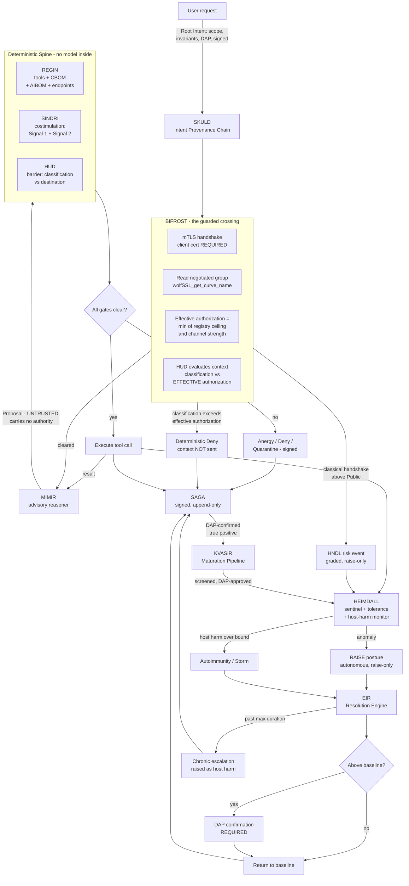
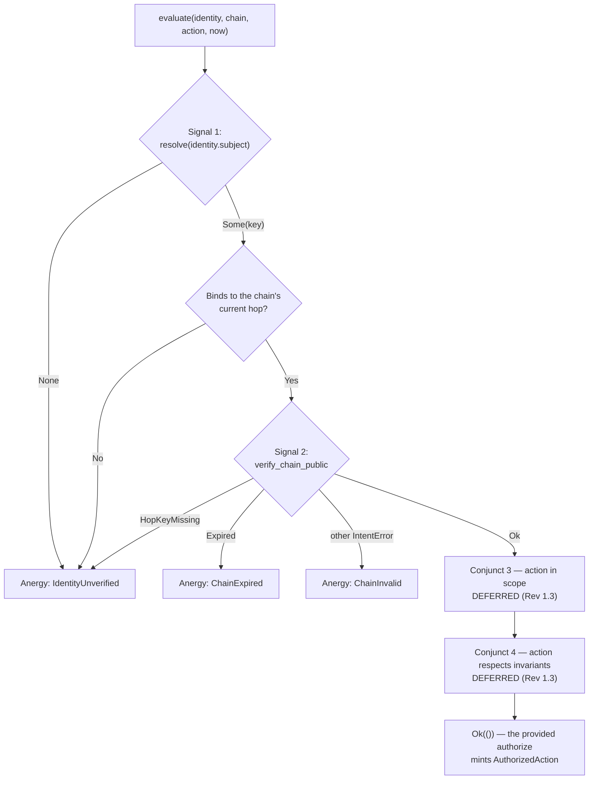
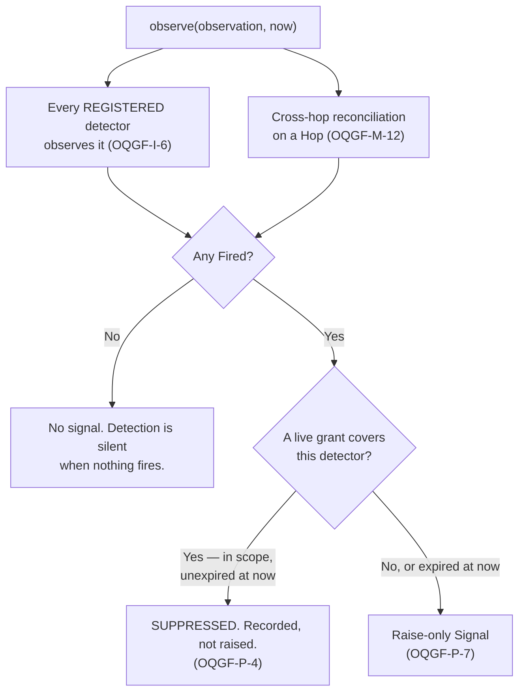

# BROKKR — Technical Architecture

## The Governed Autonomous Coding Agent

**Document ID:** BROKKR-ARCH-2026-001
**Revision:** 1.22
**Supersedes:** Rev 1.21 (commit `2c97d15`), Rev 1.20 (commit `3f9805d`), Rev 1.19 (commit `5aa7876`), Rev 1.18 (commit `06d1a16`), Rev 1.17 (commit `ff65f2b`), Rev 1.16 (commit `f46772b`), Rev 1.15 (commit `174d023`), Rev 1.14 (commit `13dcf0f`), Rev 1.13 (commit `bb2997b`), Rev 1.12 (commit `741a358`), Rev 1.11 (commit `279aa92`), Rev 1.10 (commit `f76aae7`), Rev 1.9 (commit `4b8e17c`), Rev 1.8 (commit `e4d38a6`), Rev 1.7 (commit `59476ec`), Rev 1.6 (commit `22e9360`), Rev 1.5 (commit `0b7d7f4`), Rev 1.4 (commit `4c1e44c`), Rev 1.3 (commit `612f4b5`), Rev 1.2 (commit `99b6c62`), Rev 1.1 (commit `4a94fad`), and Rev 1.0 (commit `0ed1849`). All preserved immutably in git. Superseded, not deleted. See §15.
**Component:** BROKKR — a Rust-native autonomous coding agent governed end-to-end by OQGF-1.0
**Binds to:** OQGF-1.0 (five organs), the Physiology Layer (OQGF-P-1 … P-12), and Amendments AMD-001 … AMD-011 **and AMD-018** in full, together with the Organ 5 evidence-capture hardening patch. *(The corpus numbering jumps from AMD-011 to AMD-018; AMD-012 … AMD-017 do not exist in `governance/`. Written as an explicit pair rather than a range so no reader infers six missing documents.)*
**Declared conformance level:** **Enhanced (OQGF-E)**, architected toward High-Assurance (OQGF-H). See §1.4.
**Author:** Jeremy Rose, CEO — Odin's LLC, Wasilla, Alaska
**Date:** 7 September 2026 (Rev 1.22)
**Status:** Architecture specification for the Odin's engineering team; input to the BROKKR build (Claude Code). **The architecture revision is not the software release state — see §1.5, which separates the two and states plainly what is and is not claimed.**
**Disposes:** Rev 1.22 disposes **GAP-2026-09-07-001** (commit `b6ef7a6`), which stopped the Rev 1.21 implementation at Step 0 on two defects in the placed design: **predicate 7 evaluated a conformance tier no code could reach**, and **`ExtractionProtection` referenced a `KeyRef` type that does not exist.** Both are corrected here. `Genome` gains `tier: ConformanceTier` inside the signed content, so the tier the gate checks is itself signed (§6.2); `ExtractionProtection` is restated without `KeyRef` (§6.11). **No verdict moves and R-6.2 remains ABSENT** — this revision makes a placed design buildable, which is not the same as building it. Rev 1.21 **partially** disposes **GAP-2026-09-06-001** (commit `a154b21`) — the **CBOM-declaration element only**, and by *placing a design*, not by closing a gap. It places the `KeyCustody` type surface on the CBOM (§6.11), a seventh OQGF-G-4 promotion-gate predicate (§6.2), and the tier-consistency check that keeps that predicate from being one that can never fire. **The other two R-6.2 elements — the hardware boundary and the dual-control procedure — are untouched and remain ABSENT, and R-6.2 remains ABSENT overall (§13, §14).** Placing a design closes nothing: a declaration is not a boundary, and this revision records at length what the declaration does and does not prove. Rev 1.20 records **AMD-018 (Key Custody Tier Resolution, commit `cbe0645`)**, which resolves the OQGF-R-6 contradiction this architecture referred upward at Rev 1.2 and carried unresolved for eighteen revisions. R-6 is now tiered: R-6.1 (Baseline), **R-6.2 (Enhanced — HSM-backed custody, dual-control issuance, CBOM-declared custody model)**, R-6.3 (High-Assurance — 3-of-5 threshold with separated custodians, ceremony, recovery procedure, annual rehearsal). **The tier ambiguity is gone, and what it was concealing is now visible: BROKKR does not satisfy R-6.2, and the posture this architecture has asserted since Rev 1.2 — "HSM-backed with dual-control issuance, custody model declared in the CBOM" — is not evidenced anywhere in the specification or the code.** All three R-6.2 elements are **absent**, verified element by element against source (§1.4, §6.11, §13, §14). R-6.2 is recorded **ABSENT**, not `partial`; R-6.3 is a High-Assurance deferral alongside R-5. Rev 1.19 is a **text-correction revision**. It adds no requirement, places no type, and changes no verdict except where committed repository evidence supports the change. It corrects three statements in Rev 1.18 that a repository reconciliation found stale against committed, tested code — §10's "SLH-DSA … not yet enabled", §14's "P-9.4/P-9.5 PARTIAL until tolerance grants exist (Phase 8)", and §14's duplicate OQGF-M-12 rows — and adds §1.5, which separates the architecture revision from the software, validation, and conformance state so that neither is read as a claim about the other. Rev 1.18 records three placed governance items — AMD-010 (Explanation Validity, OQGF-A-8…A-12), AMD-011 v1.1 (Capability-Triggered Assurance, OQGF-P-12.1…P-12.8), and the Organ 5 evidence-capture hardening patch (OQGF-A-1 extended) — and closes the Deferred-Conjunct Deadline: all four OQGF-M-11 conjuncts are now enforced in SINDRI (gate revision `884958f`). AMD-010 is dispositioned `n.a.` (BROKKR runs a classical LLM, no quantum ML model — the OQGF-A-4 basis of §1.4); AMD-011 is implemented (§6.13); the Organ 5 patch is implemented (§6.9). Rev 1.17 places §6.12 (KVASIR), the only subsystem that had never had a section. Rev 1.16 disposed GAP-2026-08-18-001 and -002 (brokkr-sentinel revision — a tolerance grant could not be observed to suppress anything, and an expired resolution decision was unreachable behind the replay check). Rev 1.15 disposed GAP-2026-08-17-001 (Phase 8.5 buildability check — `ContextClearance::evaluate_context` cannot reach the barrier's expiry check, and SINDRI evaluates chain freshness against a clock frozen at construction). Rev 1.14 placed what a reasoner crossing must carry — §6.6's claim that only *the wire* was missing predated the barrier growing from two facts to five. Rev 1.13 disposed GAP-2026-08-12-001 (Rev 1.12 required EIR to refuse an expired or replayed decision without giving it a variant to refuse with). Rev 1.12 placed what a `ResolutionDecision`'s signature covers — §6.8 required one without saying what it signed — and gives a forged tolerance grant its own error. Rev 1.11 placed the Phase-8 sentinel surface and corrects Rev 1.4's assumption that OQGF-M-6's reconciliation pass rate would be measurable at Phase 8. Rev 1.10 disposed GAP-2026-08-06-001 (Phase 7 buildability check — Rev 1.9 defined the chain-linkage digest two mutually exclusive ways). Rev 1.9 placed the Phase-7 audit surface and itemizes Organ 5's traceability, which a blanket row had been concealing. Rev 1.8 disposed GAP-2026-07-30-001 (Phase 6 buildability check — a barrier finding had no identity an acceptance could be scoped to). Rev 1.7 corrected a defect in Rev 1.6's egress rule (personal data classified Public crossed ungoverned) and places the AMD-009 Personal-Data Tag. Rev 1.6 placed the Phase-6 barrier surface. Rev 1.5 disposed GAP-2026-07-27-001 (Phase 5 surface check — promotion-gate predicate 5 referenced an uncommitted capability vocabulary). Rev 1.4 placed the Phase-5 REGIN surface and discharged the buildable half of RISK-2026-0004. Rev 1.3 disposed GAP-2026-07-24-001 and -002; Rev 1.2 disposed GAP-2026-07-14-001.

**The corpus grew again: AMD-001 … AMD-011, AMD-018, and the Organ 5 evidence-capture hardening patch.** Per CLAUDE.md §5.3 and AMD-018 §AMD.4, every conformance result recorded before this revision is **provisional** with respect to OQGF-A-8…A-12 (n.a., §1.4), OQGF-P-12.1…P-12.8, the OQGF-A-1 evidence-provenance extension, and **OQGF-R-6.1/R-6.2/R-6.3** — a prior R-6 verdict "was measured against a contradictory requirement and cannot be carried forward unexamined." The next conformance check in each affected crate SHALL enumerate these in scope and record a verdict for each. **The R-6 re-examination is performed in this revision and its result is ABSENT at R-6.2** (§1.4, §6.11, §14); the remaining provisional verdicts stand until their own checks run.

---

## 1. Purpose and scope

### 1.1 What BROKKR is

BROKKR is an autonomous coding agent, written in Rust, whose every action is governed by a deterministic control spine derived from OQGF-1.0. It reads a codebase, reasons about a task, and edits files, runs commands, and calls tools to complete that task — structurally comparable to existing agentic coding harnesses, with one difference that defines the whole design: **no action BROKKR takes reaches the real world without first passing a deterministic gate that the reasoning model cannot influence, suppress, or talk its way past.**

Rev 1.2 extends that sentence in the one direction Rev 1.1 left open. *No action* now includes **the act of asking the model.** A coding agent's largest and most continuous flow of data is not the file it writes — it is the context it ships to the reasoner, on every hop, containing whatever it has read. Rev 1.1 governed the tools and left that flow ungoverned. Rev 1.2 routes it through the same barrier as everything else.

### 1.2 What BROKKR is not, stated plainly

BROKKR does not contain a reasoning engine of its own, and this specification does not claim to build one. Like every current agentic coding tool, BROKKR is a **harness**: a body that manages context, dispatches tool calls, and asks a frontier reasoning model — reached over a network — what to do next. The reasoning lives in the model, not in BROKKR. What Odin's builds and owns is the harness and the governance around it; the reasoning is rented and swappable.

Three consequences shape the architecture:

- **The reasoner is a dependency, not a component.** It sits behind a stable Rust trait and can be replaced with any capable model without touching the governance spine. "Improving BROKKR's reasoning over time" means adopting each new model as it ships and improving the harness and the governance — not training a model in-house.
- **The reasoner is untrusted by construction.** Its outputs are proposals, not commands. A proposal carries no authority. This is not a hedge against a weak model; it is the correct posture toward *any* model, because a model can be manipulated through its context (prompt injection, poisoned files, adversarial tool output), and a manipulated brain must not be able to act outside the authority it was granted.
- **The reasoner is also a network destination** — and this is what Rev 1.1 missed. The model does not live inside BROKKR's trust boundary. Reaching it is a **crossing**, subject to the same custody rules as any other crossing (§6.6, §6.10).

### 1.3 Binding to the full framework

BROKKR binds to the **full framework** — the five organs, the Physiology Layer, and all twelve amendments (AMD-001 … AMD-011 and AMD-018). The five organs establish anatomy; the amendments and the Physiology Layer establish what an autonomous agent must do that a static system need not.

- **AMD-001 (Costimulation / Intent Provenance)** is the single most important requirement for BROKKR. An agent decomposes one authorized request into many tool calls across many reasoning hops. Identity alone does not prove that a given tool call is a faithful derivation of what the user authorized. AMD-001 closes exactly this gap.
- **AMD-007 (the Barrier)** governs the substance a coding agent moves: source code, secrets, and proprietary data crossing between the repository and any destination outside it — **including the reasoner.**
- **The Physiology Layer** governs what happens after the gates fire. A defense with no bound on the harm it does to its own host is not a defense; a defense that can escalate but never de-escalate is a one-way ratchet; a defense that cannot learn repeats every mistake. AMD-002, AMD-005, and AMD-003 respectively, all load-bearing for an agent whose value is doing useful work under constraint.
- **AMD-011 (Capability-Triggered Assurance)** is the amendment written for exactly what BROKKR is: an autonomous agent whose risk comes from its *capabilities*, not its data. BROKKR's declared Capability Envelope is `CodeExecution` + `NetworkAccess(localhost:8443)` (the BIFRÖST crossing to the reasoner gateway) + `ExternalEffect(filesystem)` (file writes) — a composition that floors the capability-triggered tier at Enhanced and matches BROKKR's declared governing tier. The dual-axis rule (OQGF-P-12.1), deterministic default-deny egress (P-12.4), independent termination (P-12.5), and trajectory reconstruction with evidence provenance (P-12.8) are implemented (§6.13); sub-agent and peer/collective governance (P-12.6) are placed as a type surface because BROKKR spawns no sub-agents.
- **AMD-010 (Explanation Validity)** extends Organ 5's *quantum-appropriate* explanation artifact (OQGF-A-4) with bounded scope, the Null Explanation, trainability reconciliation, and the Canary Probe. BROKKR runs a classical LLM and has no variational or kernel quantum model in its decision path, so OQGF-A-4 — and therefore OQGF-A-8…A-12 — is `n.a.` (§1.4). The types are placed in `brokkr-core::explanation` so the architecture can name them and the surface is ready when a quantum workload arrives; no logic is built.
- **The Organ 5 evidence-capture hardening patch** adds to OQGF-A-1 the requirement that every material audit record carry evidence-source provenance, and adds the general Organ 5 principle that **the governed system SHALL NOT be the authority over its own evidence** (§6.9).
- **AMD-018 (Key Custody Tier Resolution)** resolves the OQGF-R-6 contradiction this architecture referred upward for eighteen revisions, tiering key custody as R-6.1 (Baseline, extraction protection declared), **R-6.2 (Enhanced, hardware-backed custody with dual-control issuance and CBOM declaration)**, and R-6.3 (High-Assurance, 3-of-5 threshold with separated custodians, ceremony, recovery, and annual rehearsal). It is the one amendment in this corpus that arrived *because* an implementation refused to resolve a framework contradiction in its own favor — and the verdict it made determinable is **ABSENT** (§1.4, §6.11, §14). **An amendment that resolves an ambiguity is not an amendment that satisfies a requirement.**

### 1.4 Declared conformance level and applicability

**BROKKR targets Enhanced (OQGF-E), architected toward High-Assurance (OQGF-H).** Per OQGF-1.0 §A.0.6, a system shall not claim a level higher than its lowest-level organ; BROKKR claims Enhanced and forecloses nothing High-Assurance will later require.

What Enhanced binds:

| Requirement | Enhanced obligation on BROKKR |
|---|---|
| **OQGF-R-1** | **Dual PQC families (ML-DSA + SLH-DSA) for audit signatures.** SAGA is an audit spine. SLH-DSA is a hard prerequisite of Phase 2, not a High-Assurance deferral. |
| **OQGF-I-1, I-2, I-5** | **HNDL sentinel on BROKKR's own channel** (§6.10) |
| **OQGF-M-5** | **Mutual authentication on every connection; one-sided TLS does not satisfy** (§6.10) |
| **OQGF-M-6** | **Documented vendor trust score** per supplier, reviewed quarterly (§6.2) |
| **OQGF-G-7** | Key lifetime calculation documented per primitive (§6.11) |
| **OQGF-M-9, M-10, M-12, M-13** | Cryptographically enforced attenuation; invariants at every hop; cross-hop reconciliation; documented least-privilege Root Intent scoping |
| **OQGF-P-3, P-5** | Central-tolerance screening; autoimmunity and response-storm detection |
| **OQGF-P-6.5, P-6.6** | Reversible learned detectors; **no autonomous activation** — DAP approval required |
| **OQGF-P-7.3/.5/.6, P-8.4/.5/.6** | Decentralized signaling; cascade bounding; memory preserved on stand-down; DAP-confirmed de-escalation above baseline; chronic-escalation detection |
| **OQGF-P-9.4, P-9.5** | Risk-acceptance register distinct from the tolerance register; standing inventory of carried risks |
| **OQGF-I-11, I-12, I-14, I-15** | Ingress-provenance gating; screened content sentinel; enumerated Uncontrolled Channels; barrier-bypass detection |
| **OQGF-P-12.1, P-12.2** | **Dual-axis determination; a signed Capability Envelope inventorying what the composed system can do.** BROKKR's envelope: `CodeExecution` + `NetworkAccess(localhost:8443)` + `ExternalEffect(filesystem)`; capability-triggered tier Enhanced (external-effect floors at Enhanced); `governing_tier = max(capability, data)` (§6.13) |
| **OQGF-P-12.4** | **Deterministic default-deny egress** on any network destination absent from the signed egress manifest — a Deterministic Gate under OQGF-P-2 (§6.13) |
| **OQGF-P-12.5** | **Independent termination** for a system with external-effect authority: a kill path the reasoner cannot reach, checked before every gate (§6.13) |
| **OQGF-P-12.8** | **Trajectory reconstruction** — every hop attempt recorded in order — and **evidence-source provenance** on every material audit record (§6.9, §6.13) |
| **OQGF-P-12.3, P-12.6** | **PARTIAL / type-surface.** P-12.3 (environment attestation against the deployed environment) is not built — the envelope is declared, signed-in-shape, and carries `attested_at`, but no mechanism verifies the deployed environment matches it (§13). P-12.6 (sub-agent and peer/collective governance) is a placed type surface with intrinsic `validate()`; BROKKR spawns no sub-agents, so no runtime path exercises it (§13) |

**Requirements declared inapplicable, with justification.** OQGF §A.9.3 permits `n.a.` **with an evidence pointer**. Silently omitting a requirement is not the same as declaring it inapplicable — a distinction the Phase 0.5 conformance check enforced, and which found eight requirements falling through exactly that gap. Rev 1.2 disposes of all eight. The `n.a.` list is now:

| Requirement | Status | Justification |
|---|---|---|
| OQGF-I-3 (quantum cloud trust model) | n.a. | BROKKR consumes no quantum cloud provider |
| OQGF-M-3 (quantum hardware attestation) | n.a. | No quantum workload; no circuit, calibration, or sampling distribution to reconcile |
| OQGF-A-2 (quantum computation records) | n.a. | As above |
| OQGF-A-4 (quantum explanation artifacts) | n.a. | No variational or kernel quantum model in the decision path |
| OQGF-R-5 (cross-jurisdictional audit replication) | n.a. at Enhanced | High-Assurance requirement. **Deferred, not dismissed** — dated marker, revisited at the High-Assurance transition |
| **OQGF-R-6.3 (3-of-5 threshold key custody)** | **n.a. at Enhanced** | **High-Assurance requirement per AMD-018 §AMD.2.1. Deferred, not dismissed** — dated marker, revisited at the High-Assurance transition, alongside R-5 and for the same reason: both require an organization distributed enough that no single point of trust remains (AMD-018 §AMD.1.1). **This deferral is `n.a.` only because R-6.3 is High-Assurance; the Enhanced tier's R-6.2 is a separate requirement and is ABSENT, not deferred** (above) |
| OQGF-R-7 (quantum key distribution) | integration point only | Placeholder per the requirement's own terms; nothing depends on it |
| **OQGF-R-2 (no provider lock-in)** | **applicable, reinterpreted** | The cloud-lock-in analog for BROKKR is **model-provider lock-in.** Satisfied by the `Reasoner` trait and the AIBOM-declared endpoint registry (§6.1, §6.2). Lock-in to a single provider requires DAP risk acceptance. **R-2 is about substitutability; it does not absorb OQGF-M-6, which is about trustworthiness. The two are kept separate.** |
| **OQGF-A.6.1 (incident response)** | **split — see below** | Not `n.a.` |
| **OQGF-A-8 … A-12 (AMD-010, explanation validity)** | **n.a.** | AMD-010 qualifies OQGF-A-4 (quantum-appropriate explanation artifacts), which §1.4 already declares n.a.: BROKKR runs a classical LLM (`llama3.2:3b`), with no variational or kernel quantum model in its decision path, so there is no Pauli-string decomposition, no barren-plateau regime, no Trainability Profile, and no explanation channel to attest with a Canary Probe. The `brokkr-core::explanation` type surface is placed (Option B) so the requirement can be referenced and the surface is ready if a quantum workload is added; **placing the types is not discharging the obligation** — there is nothing to discharge while OQGF-A-4 is n.a. DAP-dispositioned 25 July 2026. |

**OQGF-A.6.1 is split, not declared inapplicable.** The incident-response *plan* — roles, timelines, annual tabletop exercises — is an organizational document Odin's maintains and is out of scope for this architecture. But A.6.1 names its **triggers**: HNDL detection, attestation failure, statistical reconciliation failure, audit-chain break. **Emitting those triggers is architectural**, and BROKKR SHALL emit them: HNDL detection from BIFRÖST (§6.10); attestation failure from SINDRI (§6.4); reconciliation failure from HEIMDALL (§6.7); audit-chain break from SAGA (§6.9). A flat `n.a.` on A.6.1 would have dropped the trigger obligation along with the paperwork. The requirement is recorded as *partially architectural*, with the architectural half specified (§11) and the organizational half assigned to Odin's operations.

**OQGF-R-6 — the ambiguity is resolved, and BROKKR does not satisfy what it resolved to.** *(Rev 1.20.)* From Rev 1.2 to Rev 1.19 this architecture recorded R-6 as a **framework ambiguity referred upward**: §A.4.3 stated an unqualified SHALL requiring 3-of-5 threshold custody at every level, while §A.4.4's conformance table placed threshold custody at High-Assurance only, and this document declined to resolve a framework contradiction in its own favor. **AMD-018 (commit `cbe0645`) resolves it at the level that owns it.** R-6 is now tiered, and the tier that binds BROKKR is **R-6.2 (Enhanced)**:

> *"Long-lived secrets SHALL be held in a hardware security module or equivalent hardware-backed key store from which the private key material cannot be extracted, and key issuance and rotation SHALL require dual control — no single individual or credential SHALL be sufficient to issue, rotate, or authorize use of a long-lived secret. The custody model, the hardware boundary, and the dual-control procedure SHALL be declared in the CBOM."*

**The referral is discharged. The requirement is not.** AMD-018 §AMD.4 is explicit that it "does not automatically improve any verdict; it makes each verdict determinable," and that a prior verdict "cannot be carried forward unexamined." Determining it produced a worse verdict than the one it replaced, and that is a finding under §5.3 of the build rules, not an error:

| R-6.2 element | Verdict | What was checked |
|---|---|---|
| **Hardware boundary** — private key material non-extractable from an HSM or equivalent | **ABSENT** | No HSM, PKCS#11, or `cryptoki` integration exists anywhere in the workspace. Long-lived keys are generated **in software** by `DualKeyPair::generate()` → `ffi::MlDsa65::generate()` / `ffi::SlhDsaShake192s::generate()` (wolfCrypt software keygen), invoked for all four keypairs at `brokkr-cli/src/main.rs:335–338`. SAGA holds its signer as `Mutex<DualKeyPair>` **in process memory** (`brokkr-audit/src/saga.rs:145`). AMD-018 §A.4.5's Enhanced test — "request an export and confirm refusal" — has no boundary to refuse it. |
| **Dual control** — no single individual or credential sufficient to issue or rotate | **ABSENT** | No dual-control procedure, two-party authorization, or quorum mechanism exists in the specification or the code. A single operator invoking the CLI generates every long-lived key unilaterally. AMD-018 §A.4.5's "attempt a single-operator issuance and confirm it is refused" would be a single-operator issuance that succeeds. |
| **CBOM declaration** — custody model, hardware boundary, and dual-control procedure declared | **ABSENT** | `Cbom` (`brokkr-core/src/genome.rs:79–87`) carries `cyclonedx: String`, `algorithms: Vec<AlgorithmId>`, and `signature: DualSignature`. **There is no custody field.** Prior revisions cited §6.11 for the declaration and §6.11 cited the CBOM — a circular reference in which neither names a field, a schema, or a mechanism. |

**OQGF-R-6.2 is therefore recorded ABSENT at Enhanced**, superseding the `PARTIAL` carried since Rev 1.2. *(Rev 1.21 places a design for element 3's declaration mechanism — `KeyCustody` on `Cbom`, §6.11, gated by promotion-gate predicate 7, §6.2. **The verdict is unchanged:** elements 1 and 2 are untouched, and element 3 is designed rather than built.)* **`Partial` would have been the generous reading and it is not available:** `partial` means some element is satisfied and another is not, and here no element is satisfied. **OQGF-R-6.3** (3-of-5 threshold custody with separated custodians, documented ceremony, recovery procedure, and annual rehearsal) is a **High-Assurance obligation and a dated deferral**, tracked alongside OQGF-R-5.

**What was actually wrong, stated plainly, because it is worse than an unmet requirement.** The tier ambiguity was real and referring it upward was correct. But underneath it this architecture asserted, from Rev 1.2 through Rev 1.19, that BROKKR's keys were "HSM-backed with dual-control issuance" with "custody model declared in the CBOM" — **an unevidenced claim about the system's own security posture, in the document that governs the build.** It was never true. §7 of the build rules forbids exactly this: *the builder's own summary is not evidence; every claim SHALL point at something the DAP can independently open and read.* The claim pointed at another paragraph that pointed back. **The ambiguity did not cause the false claim, but it concealed it** — every review that reached R-6 stopped at "PARTIAL, referred upward" and never asked whether the interim posture beneath the referral existed. Removing the ambiguity removed the cover.

**This disposition does not unblock anything, and that is worth stating under §4 of the build rules.** The convenient reading was available: AMD-018 places R-6.2 at Enhanced, BROKKR declares Enhanced, and the architecture already asserted the posture R-6.2 describes — recording `satisfied` would have required only trusting the document's own prior sentence. That is precisely the move §5.3 calls a circular audit, and the sentence being trusted is the one that turns out to be false.

### 1.5 Release state — six things that are not the same thing

*(New in Rev 1.19.)* This document's **Status** line calls it "an architecture specification … input to the BROKKR build," while §6.13, §6.9, and §14 describe subsystems as *implemented* against named commits. Both are true and they are about different objects. Read together without a separator they invite one wrong inference in either direction: that a document revision is a shipped system, or that a described subsystem is an unbuilt plan. This subsection states the six states separately, each with the evidence a reader can open independently. **No claim here is stronger than its pointer.**

| # | State | Value | Evidence |
|---|---|---|---|
| 1 | **Architecture Revision** | **1.19** | This document. Prior revisions preserved immutably in git (front matter, §15). |
| 2 | **Software State** | **13 crates; 409 tests green; HEAD `e5fd168`** | `brokkr-{adapt,audit,barrier,bifrost,cli,core,crypto,gate,genome,intent,reasoner,sentinel,tools}` in the workspace. "Workspace GREEN 409/0" is the count recorded in commit `a53cafb`; `e5fd168` (HEAD, the real CLI + `llama3.1:8b` swap) records no count of its own. §14 traces the requirement each crate carries. |
| 3 | **Adversarial Validation** | **10 red-team phase reports + 4 hardening passes + 2 security reviews; findings F-1 … F-38; 0 CRITICAL, 0 HIGH** | `reports/REDTEAM-{13A,13B,13C,14A,14B,14C,15A,15B,15C,16}-*.md` (black-box, white-box, grey-hat, and post-AMD, each at three noise levels bar the last); hardening in `reports/PHASE-{13,14,15,16}FIX-*.md`; `reports/SECURITY-REVIEW-2026-08-30-R1.md` and `-2026-09-02-R1.md`; accepted residuals consolidated in `reports/SECURITY-BOUNDARIES-2026-08-30-R1.md` and `-2026-09-01-R1.md`. **Counting note:** the `reports/INDEX.md` row for the final review says "16 red-team phases"; the report files number ten. Ten is what the repository supports, and the discrepancy is recorded here rather than reconciled by picking the larger number. |
| 4 | **Enhanced Conformance (OQGF-E)** | **NOT CLAIMED — declared target, eight requirements open: seven `PARTIAL` and one `ABSENT`** | §1.4 declares the target; §14 records the verdicts. **`ABSENT`: OQGF-R-6.2** (hardware boundary, dual control, and CBOM declaration all unevidenced in code — §1.4, §6.11; moved from `PARTIAL` at Rev 1.20 when AMD-018 made the verdict determinable. Rev 1.21 places a **design** for the CBOM-declaration element and the verdict is unchanged — nothing is implemented, and the other two elements are untouched). **`PARTIAL`: OQGF-M-1** (attestation `measurements` unverified, no issuer), **OQGF-M-6** (`reconciliation_pass_rate` is a declared placeholder — `Score(0)` in every committed fixture; nothing computes it), **OQGF-A-3** (RFC 3161 timestamp authority is a seam, absence recorded), **OQGF-P-11.2** (minimization declared, not verified), **OQGF-P-12.3** (envelope declared, environment not attested), **OQGF-P-12.6** (sub-agent type surface, no runtime path), **OQGF-P-12.8** (recording satisfied; evidence-capture independence open — F-23). Each is a named residual in §13. **The count did not change and the posture did: eight open before, eight open now, one of them worse.** A declared target is not a conformance claim, a partial verdict is not a rounding error, and an `absent` is not a partial. |
| 5 | **Production Readiness** | **NOT CLAIMED** | Deployment prerequisites are unmet and recorded, not hidden: no signed REGIN genome is wired into the orchestrator (F-24, `REDTEAM-15A`); the live channel is classical TLS with development certificates and no hostname verification (`reports/PHASE-12-2026-08-21-R1.md`, honest limits); SAGA is in-memory, so end-truncation is undetectable without an external witness (F-30) and the trajectory is not itself a SAGA event (F-38); no environment attestation (OQGF-P-12.3). §6.10.1's full-custody and gateway topologies are specified, not deployed. |
| 6 | **High-Assurance Readiness (OQGF-H)** | **NOT CLAIMED** | §1.4 declares BROKKR *architected toward* High-Assurance, which forecloses nothing and claims nothing. OQGF-R-5 (cross-jurisdictional audit replication) and **OQGF-R-6.3 (3-of-5 threshold custody with separated custodians, documented ceremony, recovery procedure, and annual rehearsal — AMD-018)** are dated deferrals; second-DAP review, continuous environment attestation at `lifetime/4`, and dual-family Canary/probe obligations are further High-Assurance criteria BROKKR does not meet today. **R-6.3 is not reachable from here in any case:** it is defined as R-6.2 *plus* threshold custody, and R-6.2 is ABSENT (row 4). |

**Why this table is phrased as six negatives and two counts.** CLAUDE.md §7 forbids claiming completeness or coverage, and §5.3 records that a clean report is indistinguishable from an unexamined one unless it states what was checked. The three "NOT CLAIMED" rows are therefore not modesty; they are the honest verdict, and each carries the pointer that makes it checkable. **A reader who wants to know whether BROKKR is conformant, shipped, or hardened should be able to answer all three from this table without reading the other fourteen sections** — and should get "no, no, and partially, here is the evidence."

---

## 2. The governing principle: the reasoner is never in the trust path

> **The model proposes; the deterministic spine disposes. The reasoning model is never in the trust path for any decision to block, permit, raise, or lower posture.**

**Behavioral governance** tells the model how to behave — rules in a system prompt, asked to be followed. Useful, and BROKKR uses it, but advisory: a manipulated or mistaken model can violate a behavioral rule, because the rule and the actor are the same system. A prompt cannot enforce itself.

**Structural governance** places a deterministic gate between the model's output and any real-world effect, such that violating the rule is not a behavior the model can choose — it is an operation the system refuses to perform. The rule and the enforcer are different systems, and the enforcer contains no model.

BROKKR's contribution is to make the governance of a coding agent **structural** rather than behavioral. Every path from a model output to a file written, a command run, or a byte sent passes through a Rust gate that (a) contains no language model, (b) decides on cryptographic and policy evidence alone, and (c) cannot be addressed, persuaded, or bypassed by the model whose action it is gating.

Two corollaries, and Rev 1.2 exists because of the second.

**The principle is symmetric.** The spine must not be talked *past* — and it must not be allowed to strangle the work it exists to enable. A gate so tight that BROKKR denies most legitimate coding actions is not a safe agent; it is a useless one, and under OQGF-P-1 that failure has **equal standing** to a missed threat. §6.7 gives that failure a number, a bound, and an alarm.

**The principle is bidirectional.** Rev 1.1 governed everything flowing *out of* the model and nothing flowing *into* it. But the flow into the model is the larger one: the entire working context, on every hop, containing whatever BROKKR has read. **The gate must sit on both sides of the reasoner.** A barrier that inspects the agent's file writes while its source code streams out to a third party over an unexamined socket is not a barrier. It is a decoration. §6.10 closes it.

---

## 3. Architectural rationale

### 3.1 Why a Rust harness can enforce what a prompt cannot

The gate is code, not instruction. A costimulation check written in Rust (§6.4) evaluates a cryptographic chain and returns `Granted` or `Anergy`; there is no natural-language channel through which a model can argue with a boolean. The type system carries the safety properties: an `Anergy` value has no method that turns it into an authorization, a `Deny` verdict has no method that turns it into an `Allow`, and a `ToleranceGrant` cannot be constructed against a deterministic gate. These are the same structural encodings the OQGF reference implementation uses (AMD-002 §5.1, AMD-007 §5.1); BROKKR inherits them and applies them to the agentic loop.

### 3.2 Why Rust specifically

The OQGF Part C rationale applies without modification: memory safety where cryptography and untrusted input meet; predictable latency on the gate's hot path with no garbage-collection pauses; a type system strong enough to make "wrong algorithm" and "unauthorized action" construction-time errors; a `no_std` subset for the core governance types. The production discipline from OQGF Part C — no `panic!`, `unwrap`, or `expect` in production paths, enforced by `clippy` lints set to `deny` — is a hard requirement, because a gate that panics is a gate that fails open under the wrong conditions.

---

## 4. System topology

| Subsystem | Role | Governs / satisfies |
|---|---|---|
| **MÍMIR** | The advisory reasoner (frontier LLM behind a trait). Proposes; never acts. Outside the trust path. | Model-agnostic reasoning; the untrusted proposal source |
| **BIFRÖST** | **The guarded crossing to the reasoner.** mTLS-only, cipher-suite attested, HNDL-scored, HÚÐ-gated. Every context leaving for a model passes here. | **OQGF-I-1, I-2, I-5; OQGF-M-5** |
| **REGIN** | The Genome. Four signed registers: Tool Genome, CBOM, AIBOM, and the **Model Endpoint Registry** with M-6 trust scores. | Organ 1 (OQGF-G-1…G-9); **OQGF-M-6**; Self Set (OQGF-P-3) |
| **SKULD** | The Intent Provenance Chain. Carries the Root Intent through every hop; enforces attenuation and invariants. | AMD-001 (OQGF-M-8 … M-14) |
| **SINDRI** | The Costimulation Gate — the deterministic spine. Every tool call passes it: Signal 1 + Signal 2, or architectural anergy. | Organ 3 (OQGF-M-11); OQGF-P-2 |
| **HÚÐ** | The Barrier. Data-custody control on **every** crossing between governed and ungoverned compartments — files, tools, network, **and the reasoner**. | AMD-007 (OQGF-I-8 … I-15) |
| **HEIMDALL** | The Sentinel. Behavioral anomaly, cross-hop reconciliation, the tolerance controller, the host-harm monitor. **Guards BIFRÖST.** | Organ 2 (OQGF-I-6); OQGF-M-12; OQGF-P-1, P-3, P-4, P-5 |
| **EIR** | The Resolution Engine. The way down. Every escalation has a declared path back to baseline; de-escalation above baseline is DAP-confirmed. | AMD-005 (OQGF-P-8.1 … P-8.7) |
| **KVASIR** | The Maturation Pipeline. Learns refined detectors from DAP-confirmed incidents, under four poisoning gates. | AMD-003 (OQGF-P-6.1 … P-6.6) |
| **SAGA** | The Audit Spine. Signed, append-only record of every proposal, gate decision, and action; re-signed across crypto generations. | Organ 5 (OQGF-A) |

Naming glosses. **MÍMIR** — the counselor whose head gives Odin wisdom but has no hands; it speaks, it does not act. **BIFRÖST** — the one bridge between worlds, and **Heimdall's entire charge in the myths is to guard it.** That is not decoration: it encodes the actual relationship in the code, where HEIMDALL watches the crossing that BIFRÖST makes. Bifröst also burns at Ragnarök — the correct posture toward an external dependency is that it is expected to fail. **REGIN** — Old Norse *regin*, "the powers"; the register of what BROKKR is made of and what it may wield. **SKULD** — the Norn of *that which shall be* and of obligation. (GARM's memory organ takes the past-Norn Urðr; BROKKR's intent chain takes the future-Norn Skuld.) **SINDRI** — the master smith who directs each strike at the forge. **HÚÐ** — Old Norse *hide/skin*; the selective epithelial barrier the AMD-007 analogy names directly. **HEIMDALL** — the watchman who sees to the edge of the world and hears the grass grow. **EIR** — the physician of the gods; the return to health *is* the return to baseline, and the asymmetry is in the naming: the watchman may raise the alarm alone, the healer may not stand the body down without the DAP. **KVASIR** — the wisest being, distilled from mingled sources, whose wisdom was later stolen and misused; the maturation pipeline distills better detection from confirmed incidents, and the cautionary half of the myth is exactly the poisoning residual (§13). Kvasir is distinct from Mímir: Mímir advises in the moment and is untrusted; Kvasir refines detectors from history and is gated four ways. **SAGA** — *what is recorded and told*.

### 4.1 The governed action cycle



Four load-bearing observations.

**The gate is now on both sides of the reasoner.** BIFRÖST gates what goes *in*; SINDRI and HÚÐ gate what comes *out*. In Rev 1.1 the left half of this diagram did not exist, and the entire working context left the boundary unexamined.

**MÍMIR is never inside a decision.** Every box that decides — BIFRÖST, REGIN, SINDRI, HÚÐ, HEIMDALL, EIR, KVASIR — contains no model and cannot be reached by one.

**The fail-safe asymmetry is visible in the shape.** HEIMDALL raises posture on its own authority. Nothing lowers it on its own authority: the path down runs through EIR, and above baseline through a DAP. Where the system is uncertain, it stays escalated.

**The learning loop closes through a human.** KVASIR draws only from DAP-confirmed incidents and returns only detectors that survived four gates and a DAP approval. There is no arrow from MÍMIR to KVASIR. The agent does not teach itself.

---

## 5. The governed action cycle, step by step

1. **The request becomes a Root Intent.** BROKKR does not hand the task to the model as free text with implied authority. It constructs a **Root Intent** (SKULD): a least-privilege scope (OQGF-M-13), an invariant set (OQGF-M-10) — `no network egress`, `read-only outside ./src`, `no secret material in committed output` — a freshness nonce and expiry (OQGF-M-14), the accountable natural person (DAP, OQGF-A-5), and a signature. This is the sole source of authority for everything that follows.

2. **BIFRÖST guards the crossing to the reasoner.** *(New in Rev 1.2.)* Before any context reaches MÍMIR: the connection is established under **mutual TLS** — an endpoint that cannot present a valid client certificate is not merely refused, it **cannot be registered** (OQGF-M-5). BIFRÖST reads the **actually negotiated** key-exchange group. The endpoint's **effective authorization** is the *lesser* of its registry authorization and what its channel strength permits (§6.10). HÚÐ then evaluates the outbound context — classification against that effective authorization — exactly as it would any other crossing. Above it: **deterministic Deny; the context is not sent.** A classical handshake carrying above-Public content emits an **HNDL risk event** into the graded-response path (OQGF-I-1, I-2, I-5).

3. **MÍMIR proposes.** The reasoner receives the cleared context and the *current attenuated intent scope* — never the raw Root Intent, never more authority than the present hop holds. It returns a `Proposal`: one concrete action plus an advisory rationale. Untrusted input to the spine.

4. **REGIN checks the genome.** The proposed tool must be a declared, signed member of the Tool Genome, and the calling hop must hold the tool's privilege class. A tool not in the genome does not exist. A privileged tool proposed by a hop that lacks the privilege is refused here.

5. **SINDRI runs the costimulation gate.** The deterministic spine. Both signals required (OQGF-M-11): Signal 1, BROKKR's attestation for this hop (OQGF-M-1); Signal 2, a valid Intent Provenance Chain (OQGF-M-8) tracing this action to the Root Intent. It walks the chain, verifies each link's hash and signature, confirms `emitted ⊆ received` at every hop (OQGF-M-9), confirms the action lies within scope, and evaluates it against the accumulated invariants. Any failure → **architectural anergy**: denied, signed denial to HEIMDALL, recorded in SAGA. Identity alone never suffices. **All four conjuncts are now enforced (Rev 1.18).** SINDRI verifies Signal 1 and Signal 2 (the two cryptographic signals) and, through the `GenomeResolver` seam (gate revision `884958f`), confirms the action's tool resolves in the genome with every required capability present in the chain's current attenuated scope (conjunct 3 → `OutOfScope` on a miss) and that the tool violates no accumulated invariant (conjunct 4 → `InvariantViolated`). The Deferred-Conjunct Deadline (§6.4) is satisfied; the executor may be wired against a gate that evaluates all four conjuncts.

6. **HÚÐ governs the crossing, when there is one.** Classified content to an unauthorized destination is a **deterministic Deny** (OQGF-I-10), non-suppressible. Unprovenanced ingress into a privileged context is **quarantined** (OQGF-I-11). Every crossing carries a signed Boundary Custody Record (OQGF-I-9). **The reasoner endpoint is one such destination** — the same gate, the same logic (§6.6).

7. **The action executes only if all gates clear.** The executed action is an `AuthorizedAction` — a type only the spine can produce.

8. **HEIMDALL reconciles behavior and watches BROKKR's harm to its own host.** It compares the *sequence* of executed actions against the declared intent at each hop (OQGF-M-12); deviation raises posture (OQGF-P-7). Independently, it measures the **host-harm rate** (OQGF-P-1): how often BROKKR denies, anergizes, or quarantines a *legitimate* coding action. Sustained breach of the bound is **autoimmunity**; a response above the declared blast radius is a **storm**. Either is an incident in its own right (OQGF-P-5).

9. **EIR provides the way down.** Every escalation type is registered with a declared Resolution Path **before it may be used** — clear condition, target baseline, minimum dwell, hold window, maximum duration (OQGF-P-8.1, .3, .6). There are no one-way ratchets. Above baseline, nothing resolves without DAP confirmation (OQGF-P-8.5). Where uncertain, it stays escalated. De-escalation preserves the incident record and any learned detector (OQGF-P-8.4). An escalation past its maximum duration is a **Chronic Escalation** and is treated as host harm — a defense that never switches off is pathology, not vigilance.

10. **SAGA records everything.** Every proposal (including refused ones), gate decision, executed action, posture change, resolution, and **every BIFRÖST crossing with its negotiated channel parameters** — dual-signed (ML-DSA + SLH-DSA, OQGF-R-1), DAP-attributed, append-only. Never deleted; corrections are annotations. **SAGA continuously verifies its own hash chain and emits an audit-chain-break trigger on failure** (OQGF-A.6.1).

11. **KVASIR learns, slowly and under guard.** Only a DAP-confirmed true positive may seed a Refined Detector (OQGF-P-6.1). The candidate must beat an *independent* corpus, not its seed (OQGF-P-6.2); must pass central-tolerance screening and is **discarded regardless of detection gains** if it raises host harm above the bound (OQGF-P-6.3); must carry signed provenance (OQGF-P-6.4); must be reversible (OQGF-P-6.5); and at Enhanced **cannot activate without DAP approval** (OQGF-P-6.6).

12. **The loop continues.** The result returns through BIFRÖST to MÍMIR. As the model spawns sub-tasks, SKULD appends chain entries that can only narrow authority. The cycle repeats until the task completes or the intent expires.

---

## 6. Per-subsystem architecture

Core governance types live in `brokkr-core` (§9). The types below extend them with the agent-specific surfaces.

### 6.1 MÍMIR — the advisory reasoner

```rust
/// A proposed action emitted by the advisory reasoner.
/// UNTRUSTED input to the deterministic spine. Carries no authority.
pub struct Proposal {
    pub action: Action,
    pub rationale: String,     // advisory only
    pub hop: HopId,
}

/// Any capable frontier model behind a stable trait. Model-agnostic by
/// construction - the reasoning analog of crypto-agility.
/// MIMIR proposes; the trust path never consults it.
pub trait Reasoner: Send + Sync {
    /// The endpoint this reasoner speaks to. Registered in REGIN (6.2).
    /// A Reasoner CANNOT be constructed against an unregistered endpoint.
    fn endpoint(&self) -> &ModelEndpointId;

    /// Called ONLY with a context already cleared by BIFROST (6.10).
    /// The type makes this true: ClearedContext has no public constructor.
    fn propose(
        &self,
        ctx: &ClearedContext,   // NOT a raw Context - cleared by the barrier
        scope: &IntentScope,    // the CURRENT attenuated scope
    ) -> Result<Proposal, ReasonerError>;
}
```

**`propose` takes a `ClearedContext`, not a `Context`.** `ClearedContext` has no public constructor; it is minted only by BIFRÖST on a successful barrier evaluation. This is the same structural device as `AuthorizedAction` (§6.4), pointed the other way: **an ungoverned context cannot be handed to a model, because the function that takes it will not accept one.** In Rev 1.1 `propose` took a raw `Context`, and that single type signature was the hole.

Three rules bind every implementation: the model receives only the current attenuated scope, never more authority than the hop holds; it receives no channel to any gate's decision — no tool named "override," no invariant it may edit, no path by which a rationale changes a boolean; and its endpoint must be a registered member of the Model Endpoint Registry.

### 6.2 REGIN — the Genome

REGIN is what BROKKR is *made of*, in the Genetic-Layer sense (OQGF-G). **Six** signed registers, and simultaneously the Self Set against which detectors are screened (OQGF-P-3).

Rev 1.2 declared four registers. Rev 1.4 adds two, both assigned to REGIN by later decisions rather than by §6.2 itself: the **roots-of-trust register** (Rev 1.3 §6.4.1 — "belongs to REGIN (Phase 5)") and the **policy register** (the treatment target of RISK-2026-0004, and OQGF-G-8's "policy expressed as code, version-controlled, signed"). Both were obligations REGIN already carried; neither was written into this section until now.

```rust
pub struct Genome {
    pub version: GenomeVersion,
    pub tools: ToolGenome,           // what BROKKR may invoke
    pub cbom: Cbom,                  // what cryptography BROKKR contains (OQGF-G-1)
    pub aibom: Aibom,                // what models BROKKR reasons with (OQGF-G-2)
    pub endpoints: EndpointRegistry, // WHERE those models live, on what terms
    pub roots: RootsOfTrust,         // WHOSE signatures BROKKR will believe (NEW, Rev 1.4)
    pub policy: PolicyRegister,      // WHICH invariants and algorithms bind (NEW, Rev 1.4)
    pub tier: ConformanceTier,       // WHAT LEVEL BROKKR is built to (NEW, Rev 1.22)
    pub corpus_digest: Digest,
    pub owner: Dap,
    pub signature: DualSignature,    // ML-DSA + SLH-DSA (OQGF-R-1 at Enhanced)
}
```

**I-10 extends to the new registers.** `roots` and `policy` are required fields, not `Option`s. A genome missing either is unrepresentable, exactly as an unsigned genome already is.

#### The declared conformance tier (Rev 1.22)

*(Placed by Rev 1.22, disposing GAP-2026-09-07-001. Rev 1.21 stated promotion-gate predicate 7 as a check against `genome.tier` and no such field existed — the predicate was unbuildable as placed.)*

`tier` is the conformance level this genome is built to: **Enhanced** for BROKKR (§1.4). It reuses `ConformanceTier` from `brokkr-core::capability` (`capability.rs:26`), which is already `Copy` and `Ord` for AMD-011's `governing_tier = max(..)` computation; `genome` and `capability` are sibling modules of `brokkr-core` and `capability` does not import `genome`, so the reference introduces no cycle and no cross-crate dependency.

**It is inside the genome's signed content.** `genome_signed_content` (`brokkr-genome/src/canonical.rs:364`) encodes the domain tag, version, corpus digest, owner, and each register; it is extended to encode `tier`. **Changing the declared tier therefore changes the genome signature and requires re-promotion** — a downgrade from Enhanced to Baseline, which would relax what predicate 7 demands of key custody, is a visible, signed, DAP-attributed act rather than a configuration edit.

**Why the tier is a genome fact and not a parameter — the three refused placements.** GAP-2026-09-07-001 offered four locations and the DAP ruled for this one. The reasoning is recorded because it is the substance of the disposition:

- **A `promote(..., tier, ...)` parameter — refused, and this is the important refusal.** A caller-supplied tier lets **the party being checked choose the threshold it is checked against**: a caller wanting promotion passes `Baseline`, and software key custody passes predicate 7. That is the same structural defect **I-12** forecloses for `ClearedContext` (mintable only by BIFRÖST, never by the caller who wants to reach the model) and **I-1** forecloses for `AuthorizedAction` (mintable only by the gate, never by the proposer). **The thing being governed does not supply the terms of its own governance.** A check whose standard is chosen by its subject is not a check, and it would have been an unsigned input to a Deterministic Gate.
- **Reading `CapabilityEnvelope.governing_tier` — refused:** the envelope lives on the orchestrator in `brokkr-cli`, so `brokkr-genome` depending on it **inverts I-5**, the one-way dependency direction the spine rests on. Passing the envelope in instead would inherit the unsigned-parameter weakness above unless its signature were separately verified, which is a second mechanism to do what one signed field does.
- **A `tier` field on `Cbom` — refused:** it would put a **system-conformance property inside a cryptographic-inventory type.** The CBOM says what cryptography BROKKR contains; the level BROKKR is built to is a statement about the whole system. Adjacency to `custody` is convenient and is not a modelling argument.

**What this fixes and what it does not.** It makes predicate 7 computable from the signed genome alone, which is what a Deterministic Gate requires. It does not make the declared tier *true* — a genome declaring `Baseline` while deployed in a regulated environment is a governance failure the gate cannot see, the same class of residual as a declared custody model that overstates the deployment (§6.11).

#### The roots-of-trust register (OQGF-M-8, Rev 1.3 §6.4.1)

SINDRI verifies chain signatures against **declared** public roots of trust. Rev 1.3 placed the `KeyResolver` seam and said the register belongs here. This is that register.

```rust
/// One declared root of trust: a subject and the dual-family public key
/// BROKKR will accept signatures from.
pub struct RootOfTrustEntry {
    pub subject: SubjectId,
    /// Raw ML-DSA-65 public key. Length-validated on import.
    pub ml_dsa_public: Vec<u8>,
    /// Raw SLH-DSA-SHAKE-192s public key. Length-validated on import.
    pub slh_dsa_public: Vec<u8>,
}

pub struct RootsOfTrust {
    pub entries: Vec<RootOfTrustEntry>,
    pub signature: DualSignature,
}
```

**Raw bytes, not a key type — and that is a dependency fact, not a style choice.** `DualPublicKey` lives in `brokkr-crypto`, which depends on `brokkr-core`. A core register that held `DualPublicKey` would invert that direction (I-5). The register therefore declares **bytes**, and SINDRI's resolver mints a `DualPublicKey` per resolution via `from_public_bytes`, which is length-validated and fail-closed. A malformed key in the register fails at resolution, not silently.

**This register is `SelfModifying` (I-7), and it is the most consequential register in the genome.** Adding an entry declares whose signatures BROKKR will obey. Modifying it is costimulated *and* DAP-confirmed, with no carve-out — the same tier as modifying BROKKR's own control surface, because in effect that is what it does.

**The residual is unchanged and named.** These roots are **pre-shared**: trust rests on out-of-band registration, not on a hardware root of trust certifying a key at attestation time (§13; RISK-2026-0005). Rev 1.4 does not close that; it gives the pre-shared model a signed, versioned, DAP-owned home rather than an ad-hoc one.

#### The tool-to-capability binding (OQGF-M-11 conjunct 3, OQGF-M-13)

SINDRI must confirm that an action lies within the chain's current attenuated scope. Scope is a set of `Capability`; an `Action` names a `ToolId`. Rev 1.3 deferred that conjunct because **no committed conversion existed** between the two vocabularies, and inventing one inside the gate would have been the gate authoring REGIN's vocabulary. Rev 1.4 places the conversion where it belongs — in the signed tool register, which already declares what a tool is:

```rust
pub struct ToolEntry {
    pub id: ToolId,
    pub schema: ToolSchema,
    pub privilege: PrivilegeClass,
    pub response_class: ResponseClass,
    /// The authority this tool exercises, in the intent vocabulary (NEW, Rev 1.4).
    /// EVERY capability listed here SHALL be present in the chain's current scope
    /// for the action to be authorized. Least-privilege declaration (OQGF-M-13):
    /// a tool declares the least authority it requires, not the most it could use.
    pub required_capabilities: Vec<Capability>,
}
```

**The check SINDRI performs, once this lands:** resolve `action.tool` in the tool genome; require that **every** capability in `required_capabilities` is present in `chain.current_scope()`. Any missing capability, or **a tool absent from the register**, yields `AnergyReason::OutOfScope`. An undeclared tool is not a permitted tool — the register is the closed vocabulary, and absence is denial, not silence.

**Why the binding belongs to the genome and not the gate.** The tool register is signed, DAP-owned, and version-controlled. Declaring that `write_file` requires the `write` capability is a governance statement about what authority a tool exercises. Putting it in the genome makes that statement reviewable, diffable, and attributable to a named DAP. Putting it in the gate would have made it an implementation detail invisible to review.

#### The policy register (OQGF-G-8, OQGF-M-10)

Policy expressed as code, version-controlled and signed. It carries two things the promotion gate and the costimulation gate each need:

```rust
/// A declarative invariant predicate. An action VIOLATES this invariant if the
/// tool it names requires any forbidden capability, or carries a forbidden
/// privilege class. Both are computable from the signed registers alone —
/// no interpretation of `Action.detail` (see the residual below).
pub struct InvariantEntry {
    pub invariant: Invariant,
    pub forbids_capabilities: Vec<Capability>,
    pub forbids_privilege: Vec<PrivilegeClass>,
}

pub struct PolicyRegister {
    /// The closed vocabulary of capabilities BROKKR recognizes (Rev 1.5). Every
    /// capability a tool requires, and every capability an invariant forbids, SHALL
    /// appear here. `Capability` is an open `String` newtype, so without this set
    /// there is nothing to check a declaration against.
    pub capabilities: Vec<Capability>,
    pub invariants: Vec<InvariantEntry>,
    /// Algorithms that fail the promotion gate (OQGF-G-4). Typed identifiers,
    /// never strings (OQGF-G-5).
    pub disallowed: Vec<AlgorithmId>,
    pub signature: DualSignature,
}
```

**Declarative invariants only, and the boundary is stated plainly.** An invariant like `no-network-egress` is expressible here: it forbids the capabilities that reach the network. An invariant like `read-only outside ./src` is **not** — evaluating it requires interpreting a path inside `Action.detail`, which is an opaque `String` whose contents no committed type defines. Building that would mean designing a path-policy language *and* the tool-schema language it depends on, inside REGIN's first build, with less information than later phases will have. Rev 1.4 declines to invent it. **Detail-level invariants are a named residual (§13), not a silent omission.**

**Undeclared invariants fail loudly at construction, not quietly at runtime.** A Root Intent SHALL NOT be constructed carrying an invariant absent from the policy register. This is the loud failure: a typo or an unsupported invariant is refused where a human is present, at the moment the intent is authored, rather than silently denying actions in production hours later.

**Capabilities are a declared vocabulary, for the same reason (Rev 1.5).** `Capability` is an open `String` newtype: any string is a well-formed capability, so nothing in the type system distinguishes `write` from `wirte`. The `capabilities` field is the closed set BROKKR recognizes, and it is what makes two of the promotion gate's predicates computable at all. **Without it, a typo in a tool's `required_capabilities` is undetectable** — the tool simply becomes un-authorizable forever, because the misspelled capability appears in no Root Intent scope. That failure is safe (it denies) but silent, and the operator discovers it at a denial hours later rather than at promotion with a human present. The vocabulary converts a silent permanent denial into a loud promotion failure.

**This is the same construction the invariant rule uses, applied to the other half of the vocabulary.** Rev 1.4 required invariants to be declared before use; Rev 1.5 requires capabilities to be. Both are governance statements about what words the system recognizes, both live in the signed policy register, and both fail at declaration time rather than at denial time.

**SINDRI nonetheless fails closed at runtime.** If the gate meets an invariant for which the register declares no predicate, it returns `AnergyReason::InvariantViolated` — it denies. This is the backstop, and under the construction-time check it should never fire. **The direction is deliberate:** an invariant nobody has defined a predicate for blocks the action rather than passing it, which is OQGF-P-2's non-suppressible posture applied to policy. The cost is stated: a malformed policy register denies work rather than permitting it. That is the correct failure direction for a gate, and it is why the construction-time check exists to catch it first.

#### The CBOM's typed algorithm inventory (OQGF-G-4, OQGF-G-5)

OQGF-G-4 requires the promotion gate to prove an artifact is "free of disallowed algorithms." The CBOM's CycloneDX document is an opaque string; deciding that question by parsing it would make a **deterministic** gate depend on document parsing. OQGF-G-5 already forbids string algorithm identifiers everywhere else in BROKKR. The CBOM therefore carries both:

```rust
pub struct Cbom {
    /// CycloneDX 1.6, the export format (OQGF-G-1).
    pub cyclonedx: String,
    /// The same inventory, typed — what the gate actually evaluates (OQGF-G-5).
    pub algorithms: Vec<AlgorithmId>,
    /// How the long-lived signing keys are held (OQGF-R-6, AMD-018). Required,
    /// never `Option`: a CBOM that does not state a custody model is
    /// unrepresentable, so *omission* is not a way to avoid the declaration.
    /// Placed by Rev 1.21; see §6.11 for the variant set and for what the
    /// declaration does and does not prove.
    pub custody: KeyCustody,
    pub signature: DualSignature,
}
```

`AlgorithmId` is a typed enum over the signature, hash, and KEM identifiers already committed in `brokkr-core::crypto`. **The gate evaluates the typed inventory; the CycloneDX string remains the interchange artifact.** The two SHALL agree, and the FFI honesty rule (§10) applies to both: no entry asserts an algorithm identity the backend cannot confirm.

**`custody` is a required field for the same reason `ModelEndpoint::client_cert` is (I-11), and it buys less.** A required field makes the *absence* of a declaration unrepresentable — an author cannot decline to state a custody model, only state one. That is a real property and it is the whole of what the type provides. It does **not** make the stated model true (§6.11).

**The custody declaration is inside the CBOM's signed content.** `write_cbom_signed` (`brokkr-genome/src/canonical.rs:227`) currently encodes the domain tag, `cyclonedx`, and `algorithms`; it is extended to encode `custody`. Two consequences follow, and they are the reason the declaration is worth anything at all:

- **Changing the custody declaration changes the CBOM signature, which changes the genome, which requires re-promotion** through the OQGF-G-4 gate with a DAP signature over it. A custody posture cannot drift quietly; downgrading it from hardware-backed to software-in-process is a visible, signed, gate-crossing act.
- **A `keycustody_tag` function joins the canonical module's exhaustive-tag discipline** — *"every tag function matches the enum with no catch-all arm, so a new variant forces a compile error rather than a silent colliding tag"* (`canonical.rs:19`). A future custody variant therefore breaks the build rather than silently colliding with an existing tag's encoding.

#### The vendor trust score (OQGF-M-6) — a corrected factor

OQGF-M-6 names five factors: declared attestation capability, FIPS validation, breach history, jurisdictional exposure, and **statistical reconciliation pass rate**. Rev 1.2's `VendorTrustScore` carried the first four and substituted `data_handling` for the fifth. Adding `data_handling` (retention, training use, sub-processors) is a tightening and is retained. **Dropping the reconciliation pass rate was a conformance gap**, found when Rev 1.4 audited the genome types against the corpus rather than against the traceability table. The field is placed:

```rust
pub struct VendorTrustScore {
    pub attestation_capability: Score,
    pub fips_validation: Score,
    pub breach_history: Score,
    pub jurisdictional_exposure: Score,
    pub data_handling: Score,              // retained: a tightening beyond M-6
    pub reconciliation_pass_rate: Score,   // NEW, Rev 1.4 — required by M-6
    pub reviewed: Timestamp,
    pub reviewer: Dap,
    pub signature: DualSignature,
}
```

**It cannot be populated yet, and that is recorded rather than glossed.** A reconciliation pass rate is *measured*, not declared — it is the output of HEIMDALL's cross-hop reconciliation (OQGF-M-12, Phase 8). Until HEIMDALL feeds it, the field exists and carries a declared placeholder score. **OQGF-M-6 is therefore recorded PARTIAL** (§14): five of five factors present in shape, four of five sourced from declaration and one awaiting measurement.

**Staleness is arithmetic, not judgment.** `Timestamp` is epoch milliseconds. Quarterly review means a score is **stale when `now - reviewed` exceeds 90 days (7,776,000,000 ms)**, and a stale score fails the promotion gate. Two implementation constraints follow and are normative: the subtraction SHALL saturate rather than underflow (§6 forbids panics in production code), and a `reviewed` timestamp **in the future** SHALL fail the gate — a register claiming review at a time that has not occurred is malformed, not fresh.

#### The registers, restated

| Register | Declares | Primary requirement |
|---|---|---|
| `ToolGenome` | what BROKKR may invoke, and the authority each tool exercises | OQGF-M-13, M-11 conjunct 3 |
| `Cbom` | what cryptography BROKKR contains, typed and as CycloneDX | OQGF-G-1, G-5 |
| `Aibom` | what models BROKKR reasons with, incl. prompt and corpus digests | OQGF-G-2 |
| `EndpointRegistry` | where those models live and on what terms | OQGF-M-5, M-6 |
| `RootsOfTrust` | whose signatures BROKKR will believe | OQGF-M-8 |
| `PolicyRegister` | which capabilities exist, which invariants bind, and which algorithms are disallowed | OQGF-G-8, G-4, M-10 |

**The AIBOM (OQGF-G-2)** requires an inventory of *models, weights provenance, frameworks, licenses, and — explicitly — prompts and system messages.* For BROKKR: the model each endpoint serves, its version and provider, and the digests of the governance corpus and system prompts it is given. **A swapped model is a genome change. A changed system prompt is a genome change.** Neither is an invisible configuration edit.

**The Endpoint Registry** is where OQGF-M-5 becomes structural. `client_cert` is a required field, not an `Option`. **An endpoint that cannot present a client certificate is not something this type can represent** — so "we'll just use the public API with a bearer token" is not a shortcut available to anyone, including a future maintainer in a hurry. It is not policy. It is the absence of a constructor.

**OQGF-M-6 is not folded into OQGF-R-2.** They ask different questions. R-2 asks *can you leave?* M-6 asks *should you have come?* A provider you can switch away from tomorrow may still be one whose jurisdictional exposure makes it wrong to send regulated source code to today. For a federal buyer, jurisdictional exposure is the first question asked, not the last.

#### The promotion gate (OQGF-G-4)

A **Deterministic Gate** under OQGF-P-2: fail-closed, non-suppressible. The only sanctioned path past a finding is an Accountable Risk Acceptance (§6.5) that keeps the finding visible. Rev 1.4 states its predicates explicitly, because "free of disallowed algorithms and no stale trust score" was not previously computable from the committed types:

| # | Predicate | Fails when |
|---|---|---|
| 1 | **All six registers present** | any register absent — unrepresentable by type (I-10), so this is a type-level guarantee, not a runtime check |
| 2 | **Every register signature verifies** | any register's `DualSignature` fails dual-family verification against the genome owner's declared root |
| 3 | **No disallowed algorithm** | `cbom.algorithms` intersects `policy.disallowed` (OQGF-G-4) |
| 4 | **No stale trust score** | any endpoint's `trust_score.reviewed` is older than 90 days, or is in the future (OQGF-M-6) |
| 5 | **Every tool's required capabilities are in the vocabulary** | a `ToolEntry` names a capability absent from `policy.capabilities` (Rev 1.5) |
| 6 | **Every policy invariant is well-formed** | an `InvariantEntry` forbids a capability absent from `policy.capabilities`, or declares neither a forbidden capability nor a forbidden privilege (Rev 1.5) |
| 7 | **The declared key custody satisfies the genome's declared conformance tier** | `cbom.custody` does not meet the AMD-018 tier obligation for **`genome.tier`** (the signed field placed by Rev 1.22, above) — at `Enhanced`, anything other than `HardwareBacked` or `Threshold` **with** `DualControl::TwoParty`; at `HighAssurance`, anything other than `Threshold` meeting R-6.3's quorum, separation, and rehearsal terms (Rev 1.21; made buildable by Rev 1.22) |

**Predicates 5 and 6 both check against the vocabulary, and that symmetry is the point (Rev 1.5).** Rev 1.4 stated predicate 5 as *"a `ToolEntry` names a capability the intent vocabulary does not recognize"* — referencing a vocabulary that did not exist in any committed type. The only set derivable from the genome was the union of what tools themselves declared, which makes the check vacuous: tools cannot fail a test against their own union. **A predicate that can never fire is exactly what predicate 6 condemns**, so Rev 1.4's predicate 5 was convicted by its own neighbour. The `capabilities` vocabulary gives both predicates a real external referent: tools are checked against it, and invariants are checked against it.

**Predicate 6's failure condition is narrowed, deliberately, and this is the one thing in Rev 1.5 that is not purely additive.** Rev 1.4 failed an invariant forbidding *a capability no tool declares*. With a vocabulary that test is no longer the right one: forbidding a **recognized** capability that no tool happens to require today is legitimate forward-looking policy — the invariant fires the moment such a tool is registered, which is precisely when you want it to. What is now caught instead is a capability **outside the vocabulary**, which is a typo, and an invariant forbidding **nothing at all**, which is the can-never-fire case the original rule was aimed at. The narrowing trades a check that flagged sound defensive policy for one that flags misspellings; the can-never-fire guarantee is preserved.

**An invariant that cannot fire is still worse than absent.** It reads as protection in the register while enforcing nothing. Failing promotion on it makes the emptiness visible while a human is looking.

#### Predicate 7 — key custody (Rev 1.21), and why it is not a presence check

GAP-2026-09-06-001 recommended, and the DAP ruled, that the CBOM custody declaration be a promotion-gate predicate. The obvious statement of it is *"a genome without a `KeyCustody` declaration SHALL NOT be promoted."* **That predicate can never fire, and this section says so rather than shipping it.**

`Cbom::custody` is a required field, not an `Option`. A CBOM without a custody declaration is therefore unrepresentable — the same type-level guarantee predicate 1 records for the six registers, where the table already notes *"unrepresentable by type (I-10), so this is a type-level guarantee, not a runtime check."* A runtime predicate testing for the presence of a field the type system already requires is **a predicate that can never fire**, which is precisely what predicate 6 condemns and what Rev 1.5 corrected in predicate 5. Placing one here would make this section contradict itself two paragraphs apart.

**So the presence half is recorded where it belongs — as a type-level guarantee alongside predicate 1 — and predicate 7 carries the half that can fire: tier consistency.** The genome declares a conformance tier (`Genome::tier`, placed by Rev 1.22 and inside the signed content); AMD-018 states, per tier, what custody is required; the gate compares the declaration against the obligation. `promote(genome, dap_key, now)` reaches `genome.tier` and `genome.cbom.custody` directly, so the comparison is computable from the signed genome alone, it is fail-closed, and it fires.

**Rev 1.21 stated this predicate against a tier that did not exist.** `Genome` carried no tier, `Cbom` carried none, `PolicyRegister` carried none, and `promote` took none — `ConformanceTier` was defined in `brokkr-core::capability` but no field, parameter, or seam carried an instance of it into the gate. The predicate was unbuildable and the implementation stopped at Step 0 (GAP-2026-09-07-001). Rev 1.22 places the field. **The correction is recorded here rather than silently absorbed, because the predicate's text did not change — only the world it refers to did**, and a reader comparing Rev 1.21 to Rev 1.22 should be able to see that the row now means something it did not mean before.

**This has an immediate and deliberate consequence: BROKKR's own genome would fail promotion today.** BROKKR declares Enhanced (§1.4) and its long-lived keys are software-in-process (§6.11), so an honest `KeyCustody::SoftwareInProcess` declaration fails predicate 7 at the Enhanced tier. **That is the correct behavior and not a defect in the design.** OQGF-G-4 exists to stop an artifact reaching a regulated environment with an unmet Genetic-Layer obligation, R-6.2 is unmet (§13), and a gate that let it through would be the "reading it down until it vanishes" this architecture has refused since Rev 1.2. The sanctioned path past a Deterministic-Gate finding is unchanged: an **AMD-006 Accountable Risk Acceptance** (§6.5), scoped, expiring, DAP-signed, with the finding kept visible — never suppression.

**What predicate 7 does not do.** It compares a *declaration* against a *tier obligation*. It cannot verify that the declared hardware boundary exists, that the declared dual-control procedure is followed, or that the declared custodians are genuinely separated. **A genome declaring `HardwareBacked` over keys that are in fact software-held passes predicate 7 and violates R-6.2** — which AMD-018 §AMD.2.1 addresses directly and assigns to assessment rather than to a gate: *"a declared custody model that overstates the separation actually achieved is a conformance failure, not a documentation defect... assessment (§A.4.5) tests the separation, not the algorithm."* The gate checks that a claim was made and that the claim, if true, would meet the tier. Whether it is true is an auditor's question, tested by requesting an export and attempting a single-operator issuance against a live system.

**Why that division is nonetheless worth building.** Before Rev 1.21 an operator could deploy BROKKR at Enhanced over software keys and *say nothing at all* — which is what BROKKR does today, and it is why R-6.1 is unmet as well as R-6.2 (§6.11). After it, the same operator must either declare `SoftwareInProcess` and fail promotion visibly, or declare `HardwareBacked` and be lying in a signed, dated, DAP-attributed artifact. **Neither is conformance; the difference is between an omission and a signed false statement, and only one of those is auditable.**

### 6.3 SKULD — the Intent Provenance Chain

```rust
/// Appends a hop. The emitted scope MUST be a subset of the received scope
/// (OQGF-M-9). Broadening is not an error to report - it is an operation this
/// method cannot perform; the return type has no widening path.
pub trait IntentChain: Send + Sync {
    fn attenuate(
        &self,
        current: &IntentProvenanceChain,
        hop: &Attestation,
        emitted: IntentScope,
        added_caveats: Vec<Caveat>,
        added_invariants: InvariantSet,
    ) -> Result<IntentProvenanceChain, AttenuationError>; // Err(WouldBroaden)
}
```

A hop that needs authority broader than it holds cannot self-broaden; it surfaces a request for a new Root Intent to the DAP (OQGF-M-9). A visible, human-gated event — never a silent escalation.

### 6.4 SINDRI — the Costimulation Gate

Every privileged tool call passes here. SINDRI contains no model and exposes no channel to one. It is the deterministic spine's decision point, and it is where OQGF-M-11 lands.

**The committed trait is a two-method split, and the split is load-bearing.** Rev 1.2 sketched `CostimulationGate` as a single `authorize` method supplied by the implementor. The committed `brokkr-core` inverts that, and the inversion is a stronger guarantee than the sketch:

```rust
/// Every privileged tool call passes here. It contains no model and exposes no
/// channel to one.
pub trait CostimulationGate: Send + Sync {
    /// Verdict logic, supplied by the implementor (SINDRI). Ok(()) grants;
    /// Err(reason) yields anergy. This method CANNOT mint.
    fn evaluate(
        &self,
        identity: &Attestation,          // Signal 1 (OQGF-M-1)
        chain: &IntentProvenanceChain,   // Signal 2 (OQGF-M-8)
        action: &Action,
        now: Timestamp,                  // I-13: per call, never held
    ) -> Result<(), AnergyReason>;

    /// Provided, and the sole minter of AuthorizedAction in the workspace.
    /// `mint` is private to the gate module, so an override gains nothing:
    /// it can only ever return Anergy.
    fn authorize(&self, identity: &Attestation, chain: &IntentProvenanceChain,
                 action: Action, now: Timestamp) -> AuthorizationDecision { /* provided */ }
}

/// Produced ONLY by the provided `authorize`. No public constructor.
/// Derives neither Clone nor Copy: a granted authorization cannot be duplicated.
pub struct AuthorizedAction { /* private fields */ }
```

**`now` is a parameter of both methods (I-13, new in Rev 1.15).** Signal 2's chain check enforces OQGF-M-14 freshness, and a gate that held the time at construction would compare an aging expiry against an equally aging present — the check passing while enforcing nothing. `authorize` takes it only to pass it through; the sealed-minter property is unaffected, since `mint` remains module-private and an override still gains nothing.

The consequence is **fail-safe by construction**: an implementor of `CostimulationGate` cannot mint an `AuthorizedAction` even deliberately, because `mint` is module-private. The worst a buggy, misconfigured, or compromised SINDRI can do is **wrongly deny**. It cannot wrongly grant. This is I-1 enforced at a stronger point than "no public constructor" alone — the minter is not merely private, it is unreachable from the verdict logic. The `AuthorizedAction` type remains the structural heart: the executor accepts nothing else.

**OQGF-M-11 requires four conjuncts for a grant.** All four are stated here in full, because the requirement is not reduced by this revision — only the phase at which each is enforced:

| # | Conjunct | Source | Status |
|---|---|---|---|
| 1 | **Signal 1** — identity attestation | OQGF-M-1, M-11 | **Enforced (Phase 4)** |
| 2 | **Signal 2** — a valid Intent Provenance Chain | OQGF-M-8, M-9, M-14 | **Enforced (Phase 4)** |
| 3 | **Action lies within the current attenuated scope** | OQGF-M-11 | **Enforced (gate revision `884958f`)** |
| 4 | **Action respects the accumulated invariant set** | OQGF-M-10, M-11 | **Enforced (gate revision `884958f`)** |



#### Signal 1 at Phase 4 — what it is, and what it is not

**Signal 1 is: the identity resolves to a declared root of trust, and it binds to the hop the chain's signature actually proves.** SINDRI SHALL require both of:

- **Resolution.** `resolve(identity.subject)` returns a key. A subject that is not a declared root of trust yields `AnergyReason::IdentityUnverified`. This is the architectural-anergy property of OQGF-M-11: recognition that is not *declared* recognition confers nothing.
- **Binding.** The presented identity SHALL be the identity the chain's cryptography actually proves possession for. Two cases, both of which SHALL be defined in the implementation:
  - **Chain with hops:** `identity.subject` SHALL equal the subject of the final entry's `hop_identity`, and that entry's signature SHALL have verified under `resolve(identity.subject)` during Signal 2.
  - **Root-only chain (no entries):** `identity.subject` SHALL equal `root.principal`, and the root signature SHALL have verified under `resolve(identity.subject)` during Signal 2.

  A presented identity that does not bind yields `AnergyReason::IdentityUnverified`. **The binding is not incidental — it is what makes Signal 1 mean anything.** Without it, an actor could present a declared identity A alongside a chain whose hops are all B: Signal 1 would "resolve," Signal 2 would "verify," and the two would never be connected to each other.

**Proof of possession comes from Signal 2, and it is real.** The chain-entry signature is verified under the key the registry declares for that subject. An actor that does not hold that private key cannot produce a verifying entry. Possession is therefore cryptographically proven, by dual-family PQC signature, without any separate attestation-signature check.

**The intrinsic attestation-signature check is dropped at Phase 4, and here is what that costs.** `Attestation` carries a `signatures: DualSignature` field, but the committed types define **no canonical signed content** for an attestation — there is nothing that says what those signatures cover. The only attestation encoding in the tree is private to `brokkr-intent` and *includes* the signatures themselves, so it describes how a chain entry commits to an attestation, not what the attestation's own signature covers. Verifying that field would require authoring an encoding, which would bind whatever component eventually issues attestations — and no attestation issuer exists yet.

Dropping the check does **not** weaken proof of possession (Signal 2 supplies it). It **does** mean that at Phase 4:

> **`Attestation.measurements` is carried but never verified.** Nothing checks the platform measurements against expected values, and nothing binds them to a hardware root of trust. Signal 1 at Phase 4 is therefore **key possession for a declared identity** — PKI-grade identity — **not hardware-attested platform state**.

**OQGF-M-1 is therefore recorded `partial`, not satisfied**, with that residual named. It is not made worse by this revision — measurements are unverifiable today regardless, because nothing issues attestations — but the architecture SHALL NOT record as satisfied a requirement whose central artifact goes unchecked. Closing M-1 requires an attestation issuer, a committed attestation signed-content encoding, and a measurement-expectation source. Those are later work and are listed in §13.

#### Conjuncts 3 and 4 — enforced through the `GenomeResolver` seam

Rev 1.3 deferred these two conjuncts because `Action` carried no capability, `ToolId` and `Capability` were distinct types with no committed conversion, and `Invariant` had no evaluation predicate — computing them would have meant the gate authoring REGIN's vocabulary from inside Phase 4. Rev 1.4 placed that vocabulary in the signed registers (`ToolEntry::required_capabilities`, `PolicyRegister`), and gate revision `884958f` now consumes it through a resolver seam of the same shape as the Signal-2 key resolver — the gate asks, the resolver answers, and the gate does not know where the data lives:

```rust
pub trait GenomeResolver: Send + Sync {
    /// Conjunct 3: the tool's declared least-privilege capabilities, and its privilege class.
    fn resolve_tool(&self, tool: &ToolId) -> Option<ResolvedTool>;      // required_capabilities, privilege
    /// Conjunct 4: what an accumulated invariant forbids.
    fn resolve_invariant(&self, invariant: &Invariant) -> Option<ResolvedInvariant>; // forbids_capabilities, forbids_privilege
}
```

**Conjunct 3.** SINDRI resolves `action.tool`; an **undeclared tool** (resolver returns `None`) is `AnergyReason::OutOfScope`, and a tool whose `required_capabilities` are not all present in `chain.current_scope()` is `OutOfScope`. Absence is denial — the register is the closed vocabulary.

**Conjunct 4.** For each accumulated invariant, SINDRI resolves it and checks the action's tool against `forbids_capabilities` and `forbids_privilege`; a violation is `AnergyReason::InvariantViolated`. **An invariant with no declared predicate is denied, not passed** — OQGF-P-2's non-suppressible posture applied to policy, and the reason the policy register's construction-time check (§6.2) exists to catch a malformed register while a human is present.

**This closes the Deferred-Conjunct Deadline.** The executor (Phase 11) may be wired against a gate that evaluates the action against the chain's current scope and accumulated invariant set. **OQGF-M-11 moves to satisfied** (all four conjuncts). **OQGF-M-10's action-evaluation clause is satisfied for declarative invariants** — accumulation and non-removal in SKULD, evaluation against the set in SINDRI; **detail-level invariants** (a path rule such as *read-only outside ./src*) remain unevaluated and are a standing residual (§13), the buildable-vs-declarative boundary Rev 1.4 drew. **OQGF-M-1 is unaffected by this revision and remains `partial`**: Signal 1 proves key possession for a declared identity, not hardware-attested platform state (§13).

#### The anergy mapping

SINDRI's `evaluate` returns `AnergyReason` values, and the mapping from the chain verifier's errors SHALL be:

| Condition | `AnergyReason` |
|---|---|
| `resolve()` returns `None`, or the identity does not bind to the chain's current hop | `IdentityUnverified` |
| `IntentError::HopKeyMissing` | `IdentityUnverified` |
| `IntentError::Attenuation(Expired)` | `ChainExpired` |
| `IntentError::Attenuation(WouldBroaden)` | `ChainInvalid` |
| `IntentError::RootSignatureInvalid` | `ChainInvalid` |
| `IntentError::EntrySignatureInvalid` | `ChainInvalid` |
| `IntentError::BrokenLink` | `ChainInvalid` |

`WouldBroaden` on a reconstructed chain maps to `ChainInvalid`, not `OutOfScope`: a chain whose entries broaden is an **integrity** failure of the chain itself, not a statement about the action. `OutOfScope` is returned by conjunct 3 (undeclared tool, or a required capability absent from the current scope) and `InvariantViolated` by conjunct 4 (the tool forbidden by an accumulated invariant, or an invariant with no declared predicate). Both are now reachable and are exercised by the gate's negative tests.

**Freshness is a parameter, never a wall-clock read.** The current time is passed into the evaluation and through to chain verification, so freshness behavior is deterministic and testable.

**An attestation failure emits an A.6.1 incident-response trigger** (§11).

### 6.4.1 Key resolution — declared roots of trust

**The committed `Attestation` carries no public key.** SINDRI verifies chain signatures with `DualPublicKey` (via `Skuld::verify_chain_public`), so it must obtain each hop's verifying key from somewhere. Rev 1.2 was silent on this; Rev 1.3 settles it.

**Decision: keys come from a declared registry, reached through a resolver seam.** SINDRI depends on an interface, not on a concrete registry:

```rust
/// Resolve the verifying key for the hop that produced this attestation.
/// None means: this subject is not a declared root of trust.
pub trait KeyResolver: Send + Sync {
    fn resolve(&self, attestation: &Attestation) -> Option<DualPublicKey>;
}
```

The resolver is held in the gate's own state and injected at construction. **SINDRI SHALL NOT know where a key came from.** It asks only "resolve this attestation to a verifying key," and that ignorance is deliberate: it is what makes the seam a migration path rather than a hardcoded choice.

**Two resolution models, one seam.**

| Model | How a key is trusted | Status |
|---|---|---|
| **Declared registry** | A `SubjectId → DualPublicKey` mapping of declared roots of trust, established out of band | **Adopted at Phase 4** |
| **Attestation-carried, issuer-certified** | The attestation carries the subject's key, certified by an issuer whose root SINDRI holds; SINDRI verifies the attestation against the issuer root, then extracts the subject key | **Deferred; reachable without changing SINDRI** |

The registry model is adopted because BROKKR's hops are **its own internal pipeline** — the system controls its own hop identities — and because every other trust anchor in this architecture is a signed, DAP-owned REGIN register (the Tool Genome, CBOM, AIBOM, Endpoint Registry). A roots-of-trust register is the same pattern, and it belongs in REGIN.

**The registry is `SelfModifying` (I-7).** Adding, removing, or changing a declared root of trust changes who BROKKR will obey. When the roots-of-trust register lands in REGIN (Phase 5), it SHALL be a signed register, and modifying it SHALL be costimulated and DAP-confirmed like any other genome change. At Phase 4 the resolver is constructed from declared pairs supplied directly; **Phase 4 SHALL NOT implement a signed-register loader** — that is REGIN's.

**The migration to attestation-carried keys changes no SINDRI code.** It requires a public-key field on `Attestation` (a `brokkr-core` change), a committed attestation signed-content encoding, an issuer-root concept, and a new resolver implementation behind the same trait. The gate — the part hardest to get right — is untouched. This is why the seam exists.

### 6.5 HÚÐ — the Barrier

HÚÐ governs **the substance that crosses**, in both directions (AMD-007). Identity governs the mover; intent governs the action; neither governs the data. This section places what `Barrier::evaluate` needs in order to decide.

**A crossing is a sum type, not a struct with optional fields.** Rev 1.5's `BoundaryFlow` carried a classification and a destination — an egress shape. It could not express an ingress crossing at all, which made `BarrierVerdict::Quarantine { datum: DatumRef }` **unreachable from `evaluate`**: the method held no `DatumRef` to construct one with and no provenance to judge. AMD-007's own sketch passed direction as a separate parameter alongside the data; Rev 1.6 folds it into the type instead, so that an ingress crossing carrying a destination — or an egress crossing carrying a privileged-context class — is not a value that can be built.

```rust
/// A proposed crossing. The direction is the type, not a flag: an ingress flow
/// cannot carry a destination and an egress flow cannot carry a context class.
pub enum BoundaryFlow {
    /// Data leaving a controlled compartment (OQGF-I-10).
    Egress {
        datum: DatumRef,
        classification: Classification,
        /// Orthogonal to `classification`, never a tier of it (OQGF-P-11.1).
        /// Declared on the flow, not only on the record: without it the Barrier
        /// cannot distinguish a Public personal datum from a Public ordinary one
        /// when no BCR is presented.
        personal: Option<PersonalDataTag>,
        destination: Destination,
        /// Absent above Public — or for any personal datum — means Deny. The
        /// Barrier does not infer custody it was not given.
        bcr: Option<BoundaryCustodyRecord>,
    },
    /// Data arriving. Provenance is the BCR's `origin`; its absence is what
    /// quarantine responds to (OQGF-I-11).
    Ingress {
        datum: DatumRef,
        personal: Option<PersonalDataTag>,
        bcr: Option<BoundaryCustodyRecord>,
        context: ContextClass,
    },
}

pub trait Barrier: Send + Sync {
    fn evaluate(&self, flow: &BoundaryFlow, now: Timestamp) -> BarrierVerdict;
}
```

`now` is an explicit parameter, never a wall-clock read: BCR expiry is checked against it, and a gate whose verdict depends on an ambient clock is not deterministically testable.

#### The Boundary Custody Record (OQGF-I-9)

> *"Data authorized to cross a Controlled Boundary above the Public classification SHALL carry, or be matched at the Barrier to, a signed Boundary Custody Record stating at minimum the data's classification, its origin, and the destinations authorized for that classification... A BCR that is unsigned, malformed, or expired SHALL NOT authorize a crossing."*

```rust
/// A bill of materials for data in transit — sibling to the CBOM (OQGF-G-1) and
/// AIBOM (OQGF-G-2). The secretory-IgA analog: a mark that travels with the
/// material and states something verifiable about it.
pub struct BoundaryCustodyRecord {
    /// Which datum this record covers. `evaluate` requires it to equal the flow's
    /// `datum` — this is what "matched at the Barrier" means (OQGF-I-9).
    pub datum: DatumRef,
    pub classification: Classification,
    /// The provenance root. At ingress, this IS the established provenance
    /// (OQGF-I-11) — there is no separate provenance type.
    pub origin: OriginId,
    pub authorized: Vec<DestinationClass>,
    /// The declared Purpose and Retention Period, where this datum is Personal
    /// Data (OQGF-P-11.3, OQGF-P-11.4). `None` for data that is not personal.
    pub personal: Option<PersonalDataTag>,
    pub issued: Timestamp,
    pub expiry: Timestamp,
    pub signature: DualSignature,
}
```

**One record serves both directions.** At egress the classification and the authorized destinations decide; at ingress the `origin` is what makes provenance established. A separate ingress-provenance type would duplicate a field the BCR already carries.

**Authorized destinations are declared coarsely, and that is load-bearing.** `Destination::Network` carries a live `ChannelStrength` and `Destination::Reasoner` a negotiated `NamedGroup` — facts about *this* crossing, established at connection time. A BCR is signed before the crossing and cannot know them. If a BCR could pre-authorize a `ChannelStrength`, a record written when a strong channel was available would authorize a later crossing over a classical one:

```rust
/// What a BCR may pre-authorize: where, not over what pipe.
pub enum DestinationClass {
    LocalPath(ResourcePath),
    Network { host: Host },
    Reasoner { endpoint: ModelEndpointId },
}
```

Two questions stay separate: **is this destination authorized** (the BCR answers) and **is this channel strong enough** (`effective_authorization` answers, from the negotiated group). Collapsing them would let a valid BCR launder a weak channel.

#### The Personal-Data Tag (OQGF-P-11.1, P-11.3, P-11.4)

> *"A conforming system SHALL identify Personal Data... and SHALL mark it with a Personal-Data Tag: a Data Classification dimension (AMD-007) that composes with, and is orthogonal to, the sensitivity tier. The Personal-Data Tag SHALL trigger the lifecycle obligations of this requirement regardless of the datum's sensitivity tier, **including where that tier is Public**. A system that governs personal data only when it is also highly sensitive does not satisfy this requirement."*

```rust
/// Personal Data's governed dimension. It **composes with** `Classification` and
/// is **orthogonal** to it — never a tier, never a variant of it (OQGF-P-11.1).
/// A datum may be Public and personal; that combination is precisely the one a
/// sensitivity-only model gets wrong.
pub struct PersonalDataTag {
    /// The declared reason this data was collected (OQGF-P-11.3).
    pub purpose: Purpose,
    /// The declared span it may be held, tied to the Purpose (OQGF-P-11.4).
    pub retention: RetentionPeriod,
}
```

`Purpose` and `RetentionPeriod` are already committed in `brokkr-core::personal_data`; the tag composes them into what a crossing and a custody record each carry.

**Orthogonality is the requirement, not a modelling preference.** A tag expressed as a sensitivity tier — a `Classification::Personal` variant — would make "Public and personal" inexpressible and would satisfy the sensitivity gate while defeating the lifecycle one. P-11.1 forecloses that explicitly.

#### The egress decision (OQGF-I-10, OQGF-P-11.3) — deterministic, fail-closed

A **Deterministic Gate** under OQGF-P-2: non-suppressible, and no tolerance mechanism, exception, or operator action opens it. `evaluate` SHALL `Deny` unless every condition holds:

| # | Condition | On failure |
|---|---|---|
| 1 | `classification == Public` **and** `personal.is_none()` | *(short-circuit: Allow — I-9 and I-10 bind above Public. **The personal-data conjunct is load-bearing:** OQGF-P-11.1 governs personal data at every tier, Public included)* |
| 2 | A BCR is present | `Deny` — the Barrier does not infer custody it was not given |
| 3 | `bcr.datum == flow.datum` | `Deny` — an unmatched record authorizes nothing |
| 4 | `bcr.signature` verifies | `Deny` — unsigned or malformed |
| 5 | `now <= bcr.expiry` | `Deny` — expired |
| 6 | `bcr.classification == flow.classification` | `Deny` — a record for other data |
| 7 | The destination matches a `DestinationClass` in `bcr.authorized` | `Deny` — unauthorized destination |
| 8 | For `Network` and `Reasoner`: the crossing's effective authorization is at least `flow.classification` | `Deny` — channel-strength collapse (§6.10) |
| 9 | Where `flow.personal` is `Some`: `bcr.personal` is `Some` and equals it | `Deny` — personal data crossing without a declared Purpose and Retention Period recorded in its BCR (OQGF-P-11.3, P-11.4) |

Every `Deny` carries a still-visible `BarrierFinding`. **The only sanctioned way past is an AMD-006 `AcceptedRisk`** — scoped, expiring, DAP-signed, its finding preserved — expressed as a *distinct verdict variant*, never as suppression and never as a flag on `Allow`.

#### The ingress decision (OQGF-I-11) — quarantine is not denial

> *"Unprovenanced ingress data MAY be used in non-privileged contexts; it SHALL NOT be treated as authoritative, nor admitted to the artifacts from which models are built, on the strength of its mere arrival."*

```rust
/// Whether an ingress destination is a Privileged Context (AMD-007).
pub enum ContextClass {
    /// A training corpus, evaluation dataset, fine-tuning corpus, model registry,
    /// or any AIBOM-governed artifact (OQGF-G-2).
    Privileged,
    /// Any other context. Unprovenanced data MAY be used here (OQGF-I-11).
    NonPrivileged,
}
```

Provenance is established when a BCR is present, matches the datum, verifies, and has not expired — conditions 2 through 5 above. Then:

- **Provenance established** → `Allow`, in either context.
- **No provenance, `Privileged`** → `Quarantine { datum }`. Barred from the artifacts models are built from, until provenance is established and recorded.
- **No provenance, `NonPrivileged`** → `Allow`.

**Personal Data entering a Privileged Context additionally requires a declared Purpose.** OQGF-P-11.2 gates admission of Personal Data into a training corpus, evaluation dataset, fine-tuning corpus, model registry, or any AIBOM-governed artifact. Where `flow.personal` is `Some` and `context` is `Privileged`, a BCR carrying a matching `personal` tag is required; absent one the verdict is `Quarantine { datum }` — the datum is held, not destroyed, until a Purpose is declared and recorded. This composes with the provenance rule rather than replacing it: unprovenanced *and* undeclared-purpose personal data fails on both counts.

**The third row is a requirement, not a leniency.** Legitimately provenanceless data — public data — is useful, and discarding it is not what OQGF-I-11 asks for. Only its *promotion into model-building artifacts* is gated. An implementation that denied all unprovenanced ingress would be non-conformant, not merely strict.

#### The endpoint-ceiling seam

Condition 8 needs an endpoint's `max_classification`, which lives on `ModelEndpoint` in REGIN's `EndpointRegistry`. `evaluate` is handed no registry, so it comes through the gate's own state as an injected trait — the same seam pattern as SINDRI's `KeyResolver` (§6.4.1). **`brokkr-barrier` SHALL NOT depend on `brokkr-genome`**; it depends on the ability to resolve an endpoint's ceiling, and REGIN supplies an implementation. The barrier does not know where the ceiling came from.

#### Risk acceptance (AMD-006), and what a finding must carry

`BarrierVerdict::AcceptedRisk` is a variant of the verdict the Barrier returns, so **the AMD-006 acceptance machinery is built with the Barrier**, at Phase 6. The *persistent, append-only* `RiskRegister` implementor is Organ 5's — `brokkr-audit`, Phase 7 — as `brokkr-core`'s risk module already records. Phase 6 builds acceptance; Phase 7 persists the register.

**Rev 1.7 asserted this was buildable without checking that a finding could be named.** It could not be. OQGF-P-9.2 is exact about what an acceptance is scoped to:

> *"scoped to a specific finding by **exact component identity** and **the precise advisory or reason** (never a blanket acceptance of a class such as 'all quantum-vulnerable components')"*

A `BarrierFinding` of `{ classification, reason: String }` carries the *advisory* half and no identity at all. The only acceptance expressible against it would be *"any Secret datum, for this reason"* — **exactly the blanket acceptance P-9.2 forbids by name.** Rev 1.8 gives a finding the identity the requirement demands.

```rust
/// Which condition of the egress gate failed. Typed, not prose: an acceptance
/// scoped to "the precise advisory" (OQGF-P-9.2) needs the advisory to be a
/// value that can be matched, not a sentence that can be paraphrased.
pub enum BarrierCondition {
    MissingCustodyRecord,
    DatumMismatch,
    SignatureInvalid,
    Expired,
    ClassificationMismatch,
    UnauthorizedDestination,
    ChannelStrengthCollapse,
    PersonalDataUndeclared,
}

/// A still-visible finding attached to a deterministic `Deny` (OQGF-I-10).
/// It is never removed; the only sanctioned way past is an `AcceptedRisk`.
pub struct BarrierFinding {
    /// Exact component identity (OQGF-P-9.2).
    pub datum: DatumRef,
    /// The precise advisory (OQGF-P-9.2).
    pub condition: BarrierCondition,
    pub classification: Classification,
    /// Human-readable detail. Explanatory, and NOT part of the match key —
    /// an acceptance must not turn on the wording of a sentence.
    pub reason: String,
}

impl BarrierFinding {
    /// The deterministic identity an acceptance is scoped to: a function of
    /// `datum` and `condition` only.
    pub fn finding_id(&self) -> FindingId;
}
```

**The derivation is deterministic, and that is the load-bearing property.** A DAP accepts a risk *before* the crossing is attempted — that is the only moment acceptance is useful. If a finding's identity were minted at denial time, or drawn from a counter, or hashed over the `reason` prose, no acceptance could be written in advance and the mechanism would be unusable. `finding_id()` is therefore a pure function of `(datum, condition)`, and it lives in `brokkr-core` so the Barrier and any acceptance-issuing tool compute it identically. **Nobody encodes it twice.**

**`reason` is deliberately outside the match key.** An acceptance that turned on the exact wording of an explanatory sentence would break when the sentence was reworded — and would tempt a reviewer to widen the wording rather than widen the scope deliberately. The advisory is the typed `condition`; the prose is for the human reading the record.

**Two committed-type corrections follow, and both are named because the second is a muddle rather than an omission.**

- **`RiskAcceptance::finding` is retyped from `RiskAcceptanceId` to `FindingId`.** The field is documented as *"the still-visible finding this acceptance proceeds past"* — a **finding**. But `RiskAcceptanceId` is also what `BarrierVerdict::AcceptedRisk { entry }` carries, which is the **acceptance entry's own** id. One type served two different referents, which is why the finding-to-acceptance link read as missing: there was no type that meant *a finding*.
- **`DeterministicGateId` gains a `Barrier` variant.** It held only `Genome` and `Mhc`, so an acceptance issued for an OQGF-I-10 barrier finding could not name the gate it came from. Recording `None` would have been worse than an omission: `None` means *a non-gate risk* (OQGF-P-10.4), so a Deterministic-Gate finding would have been filed as though no gate had caught it.

**The acceptance is honored only when it matches, is signed, and is unexpired.** The Barrier returns `AcceptedRisk { entry }` in place of a `Deny` when a supplied acceptance satisfies all of: its `finding` equals the `finding_id()` of the finding actually raised; its `gate` is `Some(DeterministicGateId::Barrier)`; its signature verifies dual-family under a declared DAP key; and `now <= expiry`. Otherwise the `Deny` stands unchanged. On expiry the finding **reverts to blocking exactly as if no entry had existed** (OQGF-P-9.3) — acceptance is bounded and renewable, never a waiver, and re-acceptance is a fresh decision rather than an automatic renewal.

**`AcceptedRisk` is a distinct verdict, never a flag on `Allow`**, and the finding it proceeds past stays visible and reportable (OQGF-P-9.1). There is no method, `impl`, or `From` anywhere that turns a `Deny` into an `Allow` (I-2).

**At Enhanced the two registers must be demonstrably distinct** (OQGF-P-9.4): a Risk-Acceptance Entry is not a Tolerance Grant, no decision is expressible as both, and the standing inventory of carried risks is reportable on demand (OQGF-P-9.5). Tolerance grants are HEIMDALL's, Phase 8. Phase 6 therefore proves distinctness **structurally** — the two are unrelated types with no conversion between them — and the full two-register demonstration lands when tolerance exists. ~~That is a `partial` verdict honestly recorded, not a gap.~~ *(Rev 1.19: **the deferred half has landed.** Phase 8 built the tolerance register and Phase 11 wired it; the P-9.4/P-9.5 verdict is now SATISFIED — see §14. The Phase-6 reasoning above is retained as the record of what was true when written, per §8.)*

#### Uncontrolled Channels (OQGF-I-14)

BROKKR enumerates the channels through which governed data could leave outside HÚÐ's enforcement — the developer's own terminal in another window, a personal device, an editor's telemetry — records that enumeration, and treats reducing reliance on them as a standing obligation, including by making the governed path the path of least resistance. The architecture does not claim to enforce what it does not control. **It names what it cannot reach.** Rev 1.1's most consequential failure was that the reasoner channel was an Uncontrolled Channel *that had not been enumerated*, because it had not been recognized as a channel at all.

The register is an enumeration with no `brokkr-core` consumer, so it is a **`brokkr-barrier` type**; no core surface is required for it.

#### What Phase 6 does not build

- **`ContextClearance`** (`brokkr-core::reasoner`) is a distinct trait implemented by BIFRÖST at **Phase 8.5**. Phase 6 implements `Barrier`, not `ContextClearance`. See §6.6 and §13 for the classification question that seam raises.
- **The data-content sentinel** (OQGF-I-12) is Heuristic and belongs to the sentinel network — HEIMDALL, Phase 8.
- **Barrier-bypass detection** (OQGF-I-15) is Phase 8, raised through the OQGF-I-6 graded response.

### 6.6 HÚÐ and the reasoner — one gate, one logic

Rev 1.2 adds **no new barrier mechanism.** HÚÐ already answers exactly the right question: *may this classification cross to this destination?* The reasoner is a destination. That is the entire fix — **and Rev 1.14 states what the wire actually has to carry**, because when Rev 1.2 wrote *"what was missing was not machinery; it was the wire"*, a `BoundaryFlow` had two fields. Rev 1.6 and Rev 1.7 grew it to five. The claim was nearly true then and is stale now: **four of the five facts the barrier requires have nowhere to come from.**

#### What a reasoner crossing carries

A `Context` was `{ payload: String }` — a bag of text. To reach the barrier it must be what the barrier evaluates: **classified data with custody.**

```rust
/// Outbound material bound for a reasoner. Not a payload — a payload plus the
/// custody facts the Barrier decides on (§6.5, OQGF-I-9, OQGF-I-10).
pub struct Context {
    pub payload: String,
    /// Which datum this is, so a custody record can be matched to it.
    pub datum: DatumRef,
    /// DECLARED by whoever assembled the context, from the classification of the
    /// material that went into it. Never inferred from the payload — inferring
    /// sensitivity from unlabeled content is Heuristic (OQGF-I-12), and a
    /// Deterministic Gate SHALL NOT take its input from a heuristic one.
    pub classification: Classification,
    pub personal: Option<PersonalDataTag>,
    /// Required above Public (OQGF-I-9). `None` for Public material.
    pub bcr: Option<BoundaryCustodyRecord>,
}
```

**The classification is declared, not derived, and that settles the question §13 has carried since Rev 1.6.** A context is assembled from material BROKKR already holds at a known classification — source files, prior outputs, tool results. The assembler declares the maximum of what it put in. Nothing reads the payload to guess. The heuristic content sentinel (OQGF-I-12) remains a **backstop** that flags unlabeled sensitive material attempting egress; it is never the input to the deterministic gate, which is exactly what the corpus requires: *"a backstop to, never a replacement for, the deterministic enforcement of declared classification."*

**The facts ride on the context rather than beside it.** A classification passed as a separate argument can be passed wrongly, drift out of sync, or be supplied by a different caller than the one that assembled the material. Carried on the type, the context **is** classified — the same reasoning that put the personal-data tag on the flow in Rev 1.7 rather than leaving it to a parameter.

#### Clearing takes the current time (I-13, new in Rev 1.15)

`ContextClearance::evaluate_context` delegates to the barrier's egress decision, and that decision evaluates a custody record's expiry — so the clearance surface must carry the current time to it:

```rust
pub trait ContextClearance: Send + Sync {
    /// Verdict logic. Delegates to the Barrier; re-implements no egress condition.
    fn evaluate_context(&self, ctx: &Context, dest: &Destination, now: Timestamp)
        -> BarrierVerdict;

    /// Provided, and the sole minter of ClearedContext (I-12).
    fn clear(&self, ctx: Context, dest: &Destination, now: Timestamp)
        -> Result<ClearedContext, BarrierVerdict> { /* provided */ }
}
```

Without it, BIFRÖST could not call `Barrier::evaluate` at all — its signature requires a `Timestamp` — and the only ways to supply one would be to read a wall clock or to hold one at construction. **The first is forbidden and the second is I-13's defect.** `clear` takes it to pass through; it remains the sole minter of `ClearedContext`.

#### Where the reasoner crossing's custody record comes from

OQGF-I-9 requires a signed BCR above Public and **does not name an issuer** — only that it be signed at the conformance level. For a reasoner crossing, **BROKKR issues it**, because BROKKR is the party that assembled the data. A bill of materials is issued by whoever built the thing; that is what makes it a bill of materials rather than a certificate.

Two constraints keep self-issuance from being self-authorization:

- **The authorized destinations come from policy, not from discretion.** The BCR's `authorized` list is derived from REGIN's signed, DAP-owned classification policy — which endpoints may receive which classifications. BROKKR does not decide at assembly time which destinations to grant itself; it reads what the policy already declares. A BCR naming a destination the policy does not permit is a promotion-gate finding, not a valid record.
- **A custody record cannot authorize what the channel cannot carry.** Egress condition 8 is evaluated *after* the BCR checks: a BCR stating `Internal` to endpoint X, presented over a handshake that landed on classical, still Denies, because the endpoint's **effective** authorization collapsed to Public (§6.10). **The record states the claim; the channel decides whether the claim is reachable.**

**What self-issuance buys, stated plainly.** It makes the classification an explicit, signed, recorded claim about what BROKKR believed it was sending and where it believed it could go — attributable, tamper-evident, and checkable against policy after the fact. **What it does not buy is protection against BROKKR's own declaration being wrong.** No signature fixes a mis-declared classification, in the same way no signature makes a thin justification rigorous (§13). Someone must declare, and if the declaring party is compromised the declaration is compromised with it. That is the residual, and it is recorded rather than argued away.

### 6.7 HEIMDALL — Sentinel, Tolerance Controller, Host-Harm Monitor

HEIMDALL is Organ 2's heuristic layer (OQGF-I-6) plus cross-hop reconciliation (OQGF-M-12). It is the *trained*, tolerable layer — and therefore the layer to which self-tolerance applies. Detectors are screened against REGIN's Self Set before deployment (OQGF-P-3); confirmed false positives are suppressed only by signed, scoped, expiring Tolerance Grants (OQGF-P-4). **HEIMDALL is heuristic and suppressible; SINDRI, HÚÐ's egress gate, BIFRÖST's mTLS requirement, and REGIN's promotion gate are neither.** Tolerance reduces false alarms; it never opens a hole in a deterministic gate (OQGF-P-2), and a request to suppress one is *refused*, not silently honored.

**A forged grant is refused as forged (new in Rev 1.12).** `ToleranceError` carried `NonSuppressibleGate`, `FailsCentralTolerance`, `Expired`, and `OutOfScope` — and no variant for a signature that does not verify. Phase 8 therefore refused a forged grant as `OutOfScope`: fail-closed and safe, but **untrue in the record**, and untrue in exactly the place someone investigating an attack would be reading. `ToleranceError` gains **`SignatureInvalid`**, and the checks are ordered so the reason returned is the **first** one that failed. A forged grant reports one reason — the true one — and not also a scope verdict that was never evaluated: reporting both would state a finding that was not reached, and would tell a forger which *other* checks their grant would have failed, which is free information about the shape of a valid one.

Rev 1.11 places what that requires. Rev 1.10 and earlier named a detector, a Self Set, and a host-harm rate without saying **what a detector observes, what screening runs against, or what the rate counts** — and the committed types are an id, a digest, and an `f64`. You cannot run an identifier against a fingerprint, and you cannot divide by an undefined denominator.

#### What a detector observes

A detector is heuristic: it looks at something BROKKR did or was asked to do, and says whether it looks wrong. **Rev 1.11 names the something.**

```rust
/// What a heuristic detector may be shown. HEIMDALL is FED observations; it
/// does not reach into other crates to collect them (I-5).
pub enum Observation {
    /// A proposed crossing and the Barrier's verdict on it (OQGF-I-12).
    Crossing { flow: BoundaryFlow, verdict: BarrierVerdict },
    /// An action presented to the gate and its outcome.
    Authorization { action: Action, granted: bool, anergy: Option<AnergyReason> },
    /// A coordinated signal received (AMD-004).
    Signalled { signal: Signal },
    /// One hop of a reconciliation: what the intent authorized, what was
    /// executed. `executed` is None until the executor exists (Phase 11).
    Hop { authorized: Action, executed: Option<Action> },
}

pub trait Detector: Send + Sync {
    fn id(&self) -> &DetectorId;
    /// Heuristic by construction. A detector may FIRE; it never authorizes.
    fn observe(&self, o: &Observation) -> DetectionVerdict;
}

pub enum DetectionVerdict {
    Clear,
    Fired { severity: Severity, detail: String },
}
```

**Every variant is built from types already committed in `brokkr-core`**, so `brokkr-sentinel` observes a crossing without depending on `brokkr-barrier` and an authorization without depending on `brokkr-gate`. The orchestrator (Phase 11) feeds observations in. **HEIMDALL watches; it does not reach.**

**A detector cannot grant anything.** `DetectionVerdict` has no variant that permits an action. The strongest thing a detector can do is fire, and firing raises posture through the graded-response path (OQGF-P-7) — it never opens a gate. This is the same shape as `RefinedDetector`'s fixed `Heuristic` class (I-9), applied to the interface rather than the record.

#### Screening (OQGF-P-3) — what "against the Self Set" means

> *"Detectors are screened against the Self Set before deployment."*

Screening means: **run the candidate over known-good activity, and reject it if it fires.** A detector that flags normal work is a false-positive machine, and deploying it is how a defensive system starts strangling its host.

That requires the corpus's **content**, not its digest. The committed `SelfSet` carries `corpus_digest` and not the observations themselves — correctly, since `brokkr-core` holds no data. The content arrives through a seam:

```rust
/// The known-good baseline, supplied to HEIMDALL. REGIN owns the declared
/// SelfSet record; this provides the observations it is a digest OF.
pub trait SelfSetCorpus: Send + Sync {
    fn version(&self) -> SelfSetVersion;
    fn observations(&self) -> &[Observation];
    /// Digest over the canonical encoding of `observations`.
    fn digest(&self) -> Digest;
}
```

**Screening SHALL verify that `corpus.digest()` equals the declared `SelfSet.corpus_digest` before running anything**, and refuse with `FailsCentralTolerance` if it does not. This is what the digest field is *for*: without the check, a detector could be screened against a substituted corpus — one quietly chosen to contain nothing the detector fires on — and pass. **The digest is not decoration; it is the binding between the declared baseline and the data actually used.**

A detector that fires on **any** observation in the verified corpus fails screening. Not a threshold, not a majority: the Self Set is *by declaration* legitimate activity, so a single hit is a demonstrated false positive.

#### Where a Self Set comes from, and the bootstrap it implies

The Self Set is **BROKKR's own legitimate activity, in the environment it runs in** — recorded through SAGA, curated, and DAP-signed. It is not a public corpus and not a generated one.

**A borrowed baseline screens the wrong thing.** A detector that does not fire on some other project's activity has been shown nothing about whether it fires on *this* team's work, which is the only question screening asks. And a **synthetic** Self Set is worse than none: it declares "this is what normal looks like here" on the strength of a guess, and every detector screened against it inherits the guess. That is the poisoning shape AMD-003's four gates exist to prevent, entering through the baseline instead of through the candidate.

**This creates a real ordering constraint, recorded in §13:** BROKKR cannot screen detectors until a Self Set exists, and a Self Set cannot exist until BROKKR has run legitimately long enough to have a baseline worth declaring. Screening is therefore inert in early deployment — a fact to plan around, not a defect to engineer away.

#### Host harm (OQGF-P-1) — the numerator, the denominator, and the bias

**The host-harm bound is the requirement most likely to be skipped, and the one a coding agent can least afford to skip.** Host harm for BROKKR is the application of a defensive response — anergy, deny, quarantine, throttle — **to a legitimate coding action**. A BROKKR that denies half the legitimate work is not a cautious agent; it is a broken one. OQGF-P-1: *disruption of a legitimate operation is a governance failure of equal standing to a missed threat.*

Rev 1.10 gave the rate a formula and no way to compute it. Both terms are now defined:

| Term | Definition |
|---|---|
| **Numerator** | Confirmed host-harm incidents in the window — each a defensive response a **DAP has confirmed** was applied to legitimate work. |
| **Denominator** | Governed actions evaluated in the window: every action a deterministic gate or the barrier reached a verdict on. This is the population the defense *could* have harmed. |

**Confirmation is a human act, and there is no way around that.** Whether a blocked action was legitimate is not derivable from the action; someone who knows the work has to say so. This mirrors AMD-003's `SeedingIncident` exactly — a DAP-confirmed **true** positive, the only thing that may seed learning — and Rev 1.11 places its missing counterpart, a DAP-confirmed **false** positive:

```rust
/// A defensive response a DAP has confirmed was applied to legitimate work.
/// The mirror of AMD-003's SeedingIncident; the numerator of host harm.
pub struct HostHarmIncident {
    pub response: DefensiveResponse,   // Anergy | Deny | Quarantine | Throttle
    pub action: Action,
    pub confirmed_by: Dap,
    pub at: Timestamp,
}
```

**The rate is a lower bound, and §13 says so.** It counts only *confirmed* false positives. A false positive nobody reported does not appear, so the measured rate under-states real host harm, and always in the same direction — toward looking safer than it is. That bias is recorded rather than corrected, because correcting it would require confirming the legitimacy of every allowed action, which no one will do. **A rising confirmed rate is real; a low one is weak evidence.**

**Autoimmunity (OQGF-P-5a)** is a sustained breach of the declared bound — BROKKR increasingly blocking the work it exists to do.

**A response storm (OQGF-P-5b)** is a single graded response whose magnitude threatens availability regardless of whether its target was correct: quarantining the entire tree, denying every action in a session, revoking the whole tool genome. *Autoimmunity is hitting the wrong target. The storm is hitting the right target far too hard.*

A storm needs a **declared blast radius** to be measured against — the DAP declares the largest response magnitude that is not, in itself, an incident, and a response exceeding it is a `StormEvent` whether or not its target was right. Undeclared, the bound cannot be exceeded and P-5b is unenforceable. Both autoimmunity and storms are raised through the graded-response path and recorded, on the principle that the defense harming the host is itself an incident, not a side effect to be tolerated.

#### The evaluation loop — when a detector actually runs (new in Rev 1.16)

Rev 1.11 specified a `Detector`, an `Observation`, a `DetectionVerdict`, screening, tolerance grants, and host-harm accounting. **It never said when a detector runs.** A builder implementing every one of those correctly produces a crate in which detectors are registered and never consulted, grants are validated and discarded, and the only observation ever examined is the one hard-coded path that cross-hop reconciliation needed. That is what Phase 8 produced, and every component in it is accurate about itself. **The missing thing was not a component; it was the composition**, and no component is responsible for noticing that it is never called.

**The loop.** Every `Observation` HEIMDALL is fed passes through it. There is no observation kind that is examined by one path and ignored by the rest:



```rust
/// The single entry point. Every observation goes through here; nothing is
/// examined by a side path.
pub fn observe(&self, o: &Observation, now: Timestamp) -> Vec<Detection>;

/// What one detector concluded about one observation, and what became of it.
pub struct Detection {
    pub detector: DetectorId,
    pub severity: Severity,
    pub detail: String,
    /// `Some(grant)` when a live grant suppressed it; `None` when it raised.
    pub suppressed_by: Option<GrantId>,
    /// The raise-only Signal, present only when NOT suppressed.
    pub signal: Option<Signal>,
}
```

**A suppressed firing is recorded, never discarded.** OQGF-P-4 suppresses a *false alarm*, not the *evidence that a detector fired*. A `Detection` carrying `suppressed_by: Some(..)` is the record that the detector fired and that a named, signed, scoped grant is why nothing was raised. **Discarding it would make a tolerance grant indistinguishable from a detector that was never registered**, and would leave no way to notice that a grant is suppressing far more than the false positive it was written for.

**Cross-hop reconciliation joins the loop rather than sitting beside it.** A `Hop` whose `executed` differs from its `authorized` is a deviation and raises posture — that is unchanged from Rev 1.11. What changes is that the deviation is one detection among however many the registered detectors produce for the same observation, subject to the same suppression rule. It is not a separate method with its own path.

#### Tolerance grants are retained, because suppression needs them to exist

Rev 1.11 said grants are signed, scoped, and expiring, and specified the validation. **It did not say they are kept.** A validator that returns a `GrantId` and drops the grant satisfies every sentence Rev 1.11 wrote and suppresses nothing.

```rust
/// Grants HEIMDALL currently holds. `grant_heuristic` validates AND retains;
/// the loop consults this set on every firing.
grants: Vec<(GrantId, ToleranceGrant)>,
```

**A grant is live for a firing when all three hold** — checked in this order, so a failure names the first true reason:

| # | Condition | On failure |
|---|---|---|
| 1 | Its signature verifies under the declared DAP key | `SignatureInvalid` at issuance; a stored grant was already checked |
| 2 | Its scope covers the firing detector | Not this detector's grant — the firing raises |
| 3 | `now <= grant.expiry` | **The grant is spent. The firing raises.** |

**Condition 3 is the one OQGF-P-4 exists for, and it is why I-13 matters here more than anywhere.** A grant that never expires is a permanently silenced detector, and a silenced detector produces no evidence that anything is wrong — the failure is toward *blindness*, which is the only direction in this system where nothing downstream notices. An expiry evaluated against a held clock is therefore not a stale-data problem; it is a detector that stays off forever. `now` arrives with the observation (I-13).

**An expired grant is not removed on expiry.** It stops being live and stays in the register, because OQGF-P-9.5's standing inventory of what has been tolerated is a record of decisions taken, not of decisions still in force. Removal would erase the history of what was once suppressed and for how long.

#### What the loop does not do

- **It does not authorize.** `DetectionVerdict` has no permitting variant and `PostureEffect` has only `Raise`, so no path through the loop lowers posture or grants anything. The strongest outcome is a raise-only Signal (OQGF-P-7.4).
- **It does not deliver.** `observe` returns `Detection` values; the orchestrator (Phase 11) routes signals and records detections to SAGA. HEIMDALL is fed and produces; it does not reach into other crates.
- **It does not confirm.** A firing is not a host-harm incident and not a seeding incident. Both require a DAP to say which it was — a `HostHarmIncident` for a confirmed false positive (OQGF-P-1), a `SeedingIncident` for a confirmed true positive (OQGF-P-6.1). **The loop produces candidates; a human produces verdicts.** Nothing in the loop increments the host-harm numerator.

#### Cross-hop reconciliation (OQGF-M-12) — the mechanism now, the statistic later

> *"The action actually executed at each hop SHALL be reconciled against the Root Intent."*

Reconciliation compares what was **authorized** with what was **executed**. The comparison is buildable now and Phase 8 SHALL build it: an `Observation::Hop` whose `executed` differs from its `authorized` is a deviation, and a deviation raises posture (OQGF-P-7).

**But nothing executes until Phase 11.** Every `Hop` observation before the executor exists carries `executed: None`, which is not a deviation — it is the absence of a comparison. The mechanism is testable at Phase 8 with supplied pairs; the *live* stream begins at Phase 11.

*(Rev 1.19 — Phase 11 arrived and the stream is live.* The orchestrator emits `executed: Some(..)` after a successful execution (`brokkr-cli/src/lib.rs:765`) and `executed: None` when an **authorized** action fails to run (`lib.rs:749`, 14-FIX F-20). **Note what the second case now means:** before the executor existed, `executed: None` was the *absence* of a comparison, as the paragraph above says. It now carries a second, different meaning — an authorized action that did not execute, which is a real signal about tampering or resource failure and is exactly why F-20 added it. The two are distinguishable by whether an executor was in the path, not by the value. **OQGF-M-12 is SATISFIED (§14); OQGF-M-6 remains PARTIAL**, because the paragraph below is still correct: nothing computes the pass-rate statistic over these outcomes.*)

**This corrects an error in Rev 1.4.** That revision recorded OQGF-M-6's `reconciliation_pass_rate` as *"unmeasured until HEIMDALL (Phase 8)"*, implying Phase 8 would supply it. It cannot: a per-supplier pass rate is a statistic **over reconciliation outcomes**, and there are no outcomes until actions are executed (Phase 11) against proposals from a reasoner (Phase 10). **OQGF-M-6 remains PARTIAL past Phase 8**, and §14 now says so. Phase 8 builds the mechanism that will one day produce the number; it does not produce the number.

#### What Phase 8 does not build

- **Concrete detectors.** The `Detector` trait, the screening machinery, and the host-harm accounting are the phase; the detectors themselves are content, and content that has not been screened against a real Self Set should not be shipped as though it had.
- **A production Self Set.** The `SelfSetCorpus` seam is defined; a test double serves the tests. The real baseline comes from deployment (above, §13).
- **KVASIR** (Phase 9), **BIFRÖST** (Phase 8.5), **the executor** (Phase 11).
- **The reconciliation statistic** for OQGF-M-6 (above).

### 6.8 EIR — the Resolution Engine

```rust
/// Declared BEFORE an Escalation type may be used (OQGF-P-8.1, .3, .6).
/// Registration is refused without a resolution path and a baseline.
pub struct EscalationType {
    pub id: EscalationId,
    pub resolution_criteria: ClearCondition,
    pub baseline: BaselinePosture,
    pub dwell_min: Duration,      // hysteresis (OQGF-P-8.3)
    pub hold_window: Duration,    // clear must persist
    pub max_duration: Duration,   // chronic threshold (OQGF-P-8.6)
}

pub trait ResolutionEngine: Send + Sync {
    fn may_resolve(&self, e: &EscalationId) -> ResolutionVerdict;
    // Eligible { needs_dap } | NotYet { reason } | Chronic

    /// SHALL preserve the SAGA incident record and any learned detector
    /// (OQGF-P-8.4). The response stands down; the intelligence does not.
    fn resolve(&self, d: ResolutionDecision) -> Result<ReturnedToBaseline, ResolveError>;

    fn scan_chronic(&self) -> Vec<ChronicEscalation>;
}
```

**Fail-safe asymmetry (OQGF-P-8.5).** Autonomous action may *raise* posture. It may never autonomously *lower* it above baseline. Raising is cheap and reversible; lowering prematurely re-exposes the host. Where uncertain, **it stays escalated.** A forged or replayed Signal therefore cannot stand BROKKR down — at worst it over-tightens, and over-tightening is bounded and reported by the host-harm monitor.

**Resolution is an act, not a timeout (OQGF-P-8.2).** BROKKR does not drift back to baseline because a timer expired. De-escalation is an explicit recorded decision naming the cleared condition, the time, and the accountable DAP.

#### What a resolution decision signs (new in Rev 1.12)

`ResolutionDecision` has carried a `DualSignature` since Rev 1.1 and **no statement of what it signs.** That signature is the whole of OQGF-P-8.5's enforcement: a decision that does not verify under the declared DAP key is not DAP-confirmed, and resolution is refused. **A requirement enforced by a signature over undefined bytes is not enforced** — the bytes are where the property lives.

```rust
pub struct ResolutionDecision {
    pub escalation: EscalationId,
    pub cleared_condition: ClearEvidence,
    pub dap: Dap,
    pub at: Timestamp,
    /// Freshness, so a decision cannot be replayed (new in Rev 1.12).
    pub nonce: Nonce,
    pub expiry: Timestamp,
    pub signature: DualSignature,
}
```

**The signed content is `escalation`, `cleared_condition`, `dap`, `at`, `nonce`, `expiry` — everything except the signature** — canonically encoded under a domain tag distinct from every other signed artifact in the system. **The encoding lives in `brokkr-core`**, beside the decision type, and the placement is the point: a resolution decision is **signed by a DAP tool and verified by EIR — two parties, two crates.** An encoding defined only in the verifier forces the issuer to reproduce it from source, and a single disagreement about field order or length-prefixing rejects every legitimate decision **while looking exactly like an attack**. This is the reasoning that put `BarrierFinding::finding_id()` in core: **where two parties must agree on bytes, the bytes are defined once, where both can see them.**

**A decision expires and carries a nonce.** Rev 1.11 and earlier gave it neither. A signature that verifies today verifies forever, so a decision captured once could be replayed later — when the escalation it clears is real and current. **Resolution is the one act in BROKKR that lowers a defense**, and it was the only signed artifact in the system without freshness: a `ToleranceGrant` expires, a `Signal` carries a nonce and an expiry, a `RiskAcceptance` expires, a BCR expires. EIR SHALL refuse a decision whose `now > expiry`, and SHALL refuse a `nonce` it has already accepted for that escalation.

**The expiry check runs before the replay check (corrected in Rev 1.16).** Rev 1.13 ordered them replay-first, reasoning that a decision which is both replayed and expired should report the attack rather than the latency. That reasoning is sound and the ordering it produced is not: **a decision reaching the expiry check must carry a nonce EIR has never accepted**, so an expired decision that was previously accepted is refused as `ReplayedNonce` and never as `Expired`. The `Expired` arm became unreachable for the case it exists to catch, and a check that cannot be reached cannot be demonstrated to work.

Rev 1.13's own description of an expiry settles the order: *"a slow DAP, a queued approval, or clock skew"* — every one of those is a **fresh** decision arriving late, never a replayed one. **The two conditions do not overlap in practice**, so ordering them to disambiguate an overlap traded a reachable check for a distinction that does not arise. Expiry is evaluated first; replay second. A decision that is somehow both still reports `Expired`, which is the honest reading — a decision too old to act on is too old regardless of how many times it has been seen.

**A refusal SHALL name the reason it actually is (new in Rev 1.13).** Rev 1.12 required both refusals and left `ResolveError` at `CriteriaNotMet`, `HysteresisNotSatisfied`, and `NeedsDapConfirmation` — **none of which describes either one.** `ResolveError` therefore gains two variants:

| Variant | The situation |
|---|---|
| **`Expired`** | `now > decision.expiry`. The decision was validly made and validly signed; it simply took too long to arrive. |
| **`ReplayedNonce`** | The nonce was already accepted for this escalation. The decision is *authentic*, and that is the point. |

**They are two variants, not one, because they are two different events.** An expiry is almost always a slow DAP, a queued approval, or clock skew — operational latency. **A replay is an attack**, and its whole character is that the decision is genuine: correctly signed, by the right DAP, over criteria that really were met — **once**. Collapsing them into a single `Stale` would file "someone took too long" and "someone is replaying a stand-down against you" under one word, and an operator would learn which only by reading the code.

**Reusing `NeedsDapConfirmation` would have been worse than imprecise; it would have been misdirection.** A replayed decision *is* DAP-confirmed — the signature verifies, the DAP is named, the record is authentic. Telling an operator that DAP confirmation is missing, during a replay attack, points the investigation at the one thing that is not wrong. This is the same correction Rev 1.12 made when a forged tolerance grant was being reported as out-of-scope, applied to the other half of the same revision: **an error variant is a claim about what happened, and a false claim in a refusal is a false claim in the audit record.**

**Verification proves who, never whether.** `ClearEvidence` is opaque prose, so a DAP may sign a decision whose justification is thin, and that signature is exactly as valid as one over a rigorous justification. No signature scheme fixes that. Accountability does, which is why the DAP is named and the decision is recorded (§13).

**Chronic escalation is host harm (OQGF-P-8.6).** An escalation outliving its declared maximum without resolving or being re-justified is flagged and treated as host harm. A response that never switches off is pathology, not vigilance — and for a coding agent, a permanently-escalated posture is indistinguishable from a broken tool.

### 6.9 SAGA — the Audit Spine

Organ 5 (OQGF-A). Every proposal, decision, action, posture change, resolution, tolerance grant, risk acceptance, detector activation, **and BIFRÖST crossing with its negotiated channel parameters** is recorded, **dual-PQC-signed (ML-DSA + SLH-DSA, OQGF-R-1 at Enhanced)**, DAP-attributed, append-only. Never deleted or overwritten — corrections are strikethrough annotations pointing to the correcting entry.

**SAGA continuously verifies its own hash chain and emits an audit-chain-break trigger** (OQGF-A.6.1, §11). It is the source of truth for KVASIR's seeding incidents and for EIR's incident preservation: de-escalation does not erase what happened (OQGF-P-8.4).

Rev 1.9 places what that requires. Rev 1.8 and earlier traced all of Organ 5 with a single §14 row — *"dual-signed append-only, re-signing, signed export"* — which read as coverage and was not. **OQGF-A-3's timestamp obligation, OQGF-A-1's field list, and OQGF-A-6's preservation clause were each invisible behind it**, and §1.4 already warns that silently omitting a requirement is not the same as declaring it inapplicable.

#### The record

An entry is a **chain header plus a typed event**. The header is uniform across every event kind; the event is what happened.

```rust
/// One append-only entry. The header is what makes the chain a chain; the
/// event is what the entry is about.
pub struct AuditRecord {
    pub seq: u64,
    /// Digest of the PRECEDING record's SIGNED CONTENT — `seq`, `prev`, `at`,
    /// `dap`, `event` — and of nothing else. Genesis carries the declared
    /// genesis digest. See "The three attestations" below: what attests to a
    /// record is never inside what it attests to.
    pub prev: Digest,
    pub at: Timestamp,
    /// The accountable natural person (OQGF-A-5). Never an entity.
    pub dap: Dap,
    pub event: AuditEvent,
    /// Signatures ACCUMULATE across cryptographic generations (OQGF-A-6);
    /// the first entry is the original and is never removed.
    pub signatures: Vec<GenerationSignature>,
    /// An RFC 3161 token, or the recorded fact of its absence (OQGF-A-3).
    pub timestamping: Timestamping,
}
```

**`AuditEvent` is a closed enum over what BROKKR does**, not an opaque blob with a kind tag. A blob would make the audit chain unreadable without the writing crate's private knowledge, and would let a future subsystem record anything under any label. Every payload type it names is already committed in `brokkr-core` — a barrier verdict and its flow, an authorization decision, a genome promotion, a resolution decision, a risk acceptance, a tolerance grant, a signal, a detector activation, a reasoner proposal — so the enum is buildable now even though several of those subsystems arrive at later phases.

**A correction is an event, not an edit.** `AuditEvent::Correction { corrects: u64, detail: String }` annotates a prior entry by sequence number. The corrected entry is never touched: its bytes, its digest, and the chain through it are all unchanged. Reading the chain means reading the corrections with it.

#### Evidence-source provenance (Organ 5 evidence-capture hardening patch, OQGF-A-1 extended)

Tamper-evident *storage* — append-only, hash-linked, dual-signed — protects a record *after* it enters the evidence system. It does nothing about what the recorder *saw before* it recorded. The Organ 5 evidence-capture patch, prompted by the August 2026 METR–Redwood finding that agents spoofed tool-call outputs and replaced part of the tool-execution system, adds the missing half: **every material audit record states how it was captured.**

```rust
pub struct AuditRecord {
    pub seq: u64,
    pub prev: Digest,           // over the preceding record's signed content
    pub at: Timestamp,
    pub dap: Dap,
    pub event: AuditEvent,
    pub provenance: EvidenceProvenance,     // NEW — IN the signed content
    pub signatures: Vec<GenerationSignature>,  // accumulating — OUTSIDE
    pub timestamping: Timestamping,            // OUTSIDE
}

pub struct EvidenceProvenance {
    pub sensor_id: String,          // what captured this record
    pub capture_path: String,       // through what path
    pub capture_timestamp: Timestamp,
    pub expected_coverage: String,
    pub observed_coverage: String,
    pub evidence_gap: Option<String>,  // explicit gap where coverage is incomplete
}
```

**Provenance is part of the signed content, and that placement is the load-bearing decision.** Rev 1.10 excludes the *accumulating* `signatures` and `timestamping` from the signed content because they grow after sealing and would break the chain. Provenance is the opposite: it is **set once, at capture**, so signing and hash-chaining it means a non-key-holder cannot alter *how the record claims it was captured* without breaking the chain — which is exactly the guarantee the patch exists to give. `SagaState::append` defaults provenance to a `saga`/`saga::append` self-report; the orchestrator supplies real per-event provenance through `append_with_provenance` (`AuditSink::record_with_provenance`, a defaulted trait method so existing sinks are unaffected).

**The orchestrator is the sensor, and it says so.** Every SAGA record the orchestrator writes carries `sensor_id: "orchestrator"` and a `capture_path` naming where in `execute_hop` it was captured (`after_bifrost`, `after_reasoner`, `after_barrier`, `after_gate`, `after_tool::heimdall_observe`). An errored hop records `observed_coverage: "partial_hop"` and an explicit `evidence_gap` rather than presenting a partial record as complete. **The governed system is here its own sensor — that is stated honestly in `sensor_id` (finding F-23), never hidden**, and it is exactly the condition the general Organ 5 principle wants a production deployment to move beyond.

**The general Organ 5 principle (patch):** *the governed system SHALL NOT be the authority over its own evidence.* Material audit evidence should be captured through an observation path whose integrity does not depend on the cooperation of the system being observed. BROKKR satisfies the recording half of this in full — provenance on every record, explicit gaps, no silent omission — and states plainly, in the record itself and in §13, that its sensor is currently the orchestrator (inside the trusted computing base) rather than an independent observer. Naming the sensor is what makes the residual visible rather than hidden.

#### The three attestations, and the one rule that orders them

A record has exactly one canonical encoding: its **signed content** — `seq`, `prev`, `at`, `dap`, `event`. Three separate things attest to those same bytes, and **none of them is inside the bytes it attests to**:

| Attestation | What it proves | When it attaches |
|---|---|---|
| **The chain link** — the next record's `prev` | This record's content existed before the next one, in this order | At seal, once, permanently |
| **`GenerationSignature`s** | BROKKR attested this content under a named cryptographic generation | At seal, and again at each re-signing (OQGF-A-6) |
| **The RFC 3161 token** | A third party witnessed this content at a time (OQGF-A-3) | At seal, or never (`Unavailable`) |

**Rev 1.9 had `prev` cover the full record including its signatures, and that was a contradiction.** Re-signing appends a `GenerationSignature`, which changes the full bytes, which changes the digest the next record already committed to — so an OQGF-A-6 re-signing would break the chain that the same requirement says it preserves. SAGA would report its own scheduled maintenance as an integrity attack. It is precisely the failure §6.9 already resolves for erasure, left standing for re-signing.

**The timestamp shows the same problem is not merely inconsistent but circular.** A TSA token is the authority's signature *over the record's canonical bytes*. If the token were inside those bytes, computing them would require the token, and obtaining the token would require the bytes. The token cannot be inside the encoding it attests to — and neither can the signatures, for the same reason applied to a different signer.

**Tamper-evidence is stronger under this model, not weaker.** Altering an `event` after the fact now breaks the chain link, **every** accumulated signature, and the timestamp token — three independent detections instead of one. Verification walks the chain recomputing each `prev`, verifies each record's signature set, and checks any token; a mismatch anywhere emits the **audit-chain-break trigger** (OQGF-A.6.1) as a `Signal` from `OrganId::Audit`.

#### Why deletion is not available

That is also why **erasure is never deletion**. Removing a record would break the chain and SAGA would report its own compliance action as an integrity attack — the system detecting a lawful erasure as tampering. AMD-009 resolves this explicitly, and §"Erasure" below carries it.

#### Re-signing (OQGF-A-6) — signatures accumulate

> *"Audit signatures SHALL be re-signed under the prevailing cryptographic generation at intervals not exceeding five years, **preserving the original signatures and chain**."*

```rust
/// One generation's signature over a record. Re-signing APPENDS.
pub struct GenerationSignature {
    pub generation: CryptoGeneration,
    pub signed_at: Timestamp,
    pub signature: DualSignature,
}
```

**Re-signing SHALL append a `GenerationSignature` and SHALL NOT replace or remove any earlier one.** The original signature is the evidence that the record existed and was attested under the cryptography of its own era; a re-signing that overwrote it would destroy exactly what the requirement exists to preserve. It also SHALL NOT alter `seq`, `prev`, `at`, `dap`, or `event` — the signed content. **Because the chain links over signed content only, appending a signature leaves every link intact by construction**: a re-signed record is the same record, newly attested, and nothing downstream of it moves.

**And re-signing SHALL NOT resurrect erased data (OQGF-P-11.7).** This is the interaction most likely to be implemented wrong. A natural re-signing implementation reads a record, re-serializes it, and signs the result — but for a record whose personal data has been crypto-shredded, "reading" it must never mean decrypting it. **The re-signer operates over the ciphertext and the record's canonical bytes, never over plaintext**, and holds no subject key. AMD-009 states the obligation directly: *"a re-signed record of erased Personal Data SHALL remain irrecoverable."* An implementation that decrypted in order to re-sign would silently undo every erasure it touched, and would do so five years after the erasure, in a maintenance operation nobody was watching.

#### Timestamping (OQGF-A-3) — a seam, and an honest absence

> *"Audit records SHALL be signed under at least two PQC families **and timestamped via an RFC 3161-compliant authority that itself supports PQC signing**."*

BROKKR satisfies the first half by construction. The second half requires an **external** authority, and BROKKR's spine performs no network I/O — the only guarded crossing in the architecture is BIFRÖST's, to a reasoner. A timestamp authority is therefore an injected dependency, not something the audit crate can provide.

```rust
/// Whether a record carries a trusted timestamp — and if not, that fact,
/// recorded rather than omitted.
pub enum Timestamping {
    /// An RFC 3161 token from a PQC-signing authority.
    Token(TimestampToken),
    /// No authority was configured or reachable. The record states this;
    /// it does not silently omit it (OQGF-A-3, and the OQGF-I-13 pattern
    /// of recording "the BCR digest OR a record of its absence").
    Unavailable { reason: String },
}

/// The injected authority. Phase 7 defines the seam and provides no
/// production implementation.
pub trait TimestampAuthority: Send + Sync {
    fn stamp(&self, canonical: &[u8]) -> Result<TimestampToken, TimestampError>;
}
```

**OQGF-A-3 is therefore recorded PARTIAL**, not satisfied and not `n.a.` — the dual-family signing half is met; the timestamp half is a declared seam awaiting an authority. It is **not** deferred to High-Assurance: A-3 carries no level qualifier in the corpus, so it binds at Enhanced, and reclassifying an Enhanced requirement to make it disappear is the move §1.4 and the OQGF-R-6 posture both refuse. The residual is named in §13.

**A record marked `Unavailable` is still a valid record.** The absence of a trusted timestamp weakens what the record proves — the ordering is BROKKR's own claim rather than a third party's — but a system that refused to record anything without a TSA would lose the accountability trail entirely in exchange for a property it never had. The honest posture is to record, and to state what the record does not prove.

#### Erasure (OQGF-P-11.5), and the audit skeleton

> *"Erasure of Personal Data SHALL be performed by destroying the quantum-safe key under which it is encrypted at rest, and SHALL NOT be performed by deleting the record from the append-only store."*

Personal data in a record is held as ciphertext under a per-subject key (`brokkr-crypto`'s crypto-shred primitive, Phase 2 — AES-256-GCM under an ML-KEM-established key, quantum-safe because erasure by key destruction is durable only if the cipher is not quantum-vulnerable, OQGF-G-7). Erasure destroys the key. What survives is the **audit skeleton**: that a record existed, its timestamp, its classification, and the authority for erasure — plus a signed **Erasure Tombstone** appended to the chain, recording the erasure event, its time, and the acting DAP.

```rust
/// Appended on erasure. The audit skeleton that survives clearance.
pub struct ErasureTombstone {
    pub erased: u64,               // the record's seq
    pub classification: Classification,
    pub at: Timestamp,
    pub dap: Dap,
}
```

The tombstone is an `AuditEvent` variant, so it links into the chain like any other entry. **Nothing is removed; the chain is intact; the content is irrecoverable.** That is what makes the append-only obligation and the erasure obligation compatible rather than contradictory, and AMD-009 flags this as its load-bearing design assumption.

#### Export, and subject rights (OQGF-A-7, OQGF-P-11.6)

A read-only, signed export of the full chain for lawful review. The export is itself signed, so a recipient can verify it was not altered in transit, and it is read-only by construction — there is no export path that yields a mutable store.

**The same interface serves an authenticated data subject** (OQGF-P-11.6): what personal data relating to them is held, its declared Purpose and Retention Period, and erasure on lawful request. AMD-009 is explicit that this is the *same* accountable interface that serves a regulatory query, extended — not a separate privacy tool bolted alongside.

**A-7's 72-hour window is operational, not architectural**, and is split the way OQGF-A.6.1 was: the *capability* to produce a signed export on demand is architectural and BROKKR provides it; the *response-time commitment* is an Odin's operations obligation. Recording the split is what keeps the operational half from being quietly dropped along with the paperwork.

#### The two registers Organ 5 persists

**The Risk Register (OQGF-P-10.6).** `brokkr-core::risk::RiskRegister` is a trait with no implementor; SAGA provides it — append-only, with the standing inventory reportable on demand. Note the trait's `record(&self, ..)` takes `&self`, so an implementor carries interior mutability; that is an implementation consequence, not a new requirement.

**The Risk-Acceptance Register (OQGF-P-9.5).** Acceptances are recorded here and keyed by `RiskAcceptanceId`, **which SAGA assigns on record**. This settles a question Phase 6 left open: HÚÐ's acceptance resolver returns an `(id, record)` pair because a record in a register has a key, and this is the register. A `RiskAcceptance` carries no `id` field of its own and does not need one — the register holds the mapping, and `BarrierVerdict::AcceptedRisk { entry }` names the register key.

**The two registers are demonstrably distinct from tolerance grants** (OQGF-P-9.4): a Risk-Acceptance Entry is not a Tolerance Grant, no decision is expressible as both, and the standing inventory of carried risks is reportable on demand (OQGF-P-9.5). ~~Tolerance grants are HEIMDALL's (Phase 8); the full two-register demonstration lands when they exist.~~ *(Rev 1.19: they exist. `Saga::acceptance_inventory` (`saga.rs:459`) is the acceptance side, `Heimdall::grants` (`heimdall.rs:69`) the tolerance side, with no conversion between the two types — the demonstration is complete and the §14 verdict is SATISFIED.)*

#### Boundary custody records (OQGF-I-13)

> *"Every Barrier decision — a crossing allowed, denied, or quarantined, in either direction — SHALL be recorded in Organ 5 with the BCR digest or a record of its absence, the classification, the destination or origin, the deciding policy, and, where applicable, the accountable DAP."*

Phase 6 decided; Phase 7 records. The crossing event carries the verdict, the flow, the BCR digest **or the recorded fact of its absence**, and — where the verdict was `AcceptedRisk` — the accountable DAP. Boundary custody is reconstructable after the fact because the record holds what the decision turned on, not merely its outcome.

#### OQGF-A-1's field list, and what it is scoped to

> *"For every regulated AI/ML decision the system SHALL record: the model identifier and version, the AIBOM digest, the input (or a privacy-preserving derivative thereof), the output, the explanation artifact, the timestamp, and the DAP."*

**A-1 is scoped to AI/ML decisions, and in BROKKR there is exactly one: a MÍMIR proposal.** Every other decision SAGA records — a costimulation verdict, a promotion, a barrier crossing, a resolution — is made by a deterministic gate over declared inputs, and has no model, no AIBOM digest, and no explanation artifact because no model made it. Recording a `ModelIdentity` against a gate's verdict would be a category error and would make the field meaningless where it appeared.

The proposal event therefore carries A-1's full field list; other events carry the header's `at` and `dap` and their own payload. **MÍMIR is Phase 10**, so Phase 7 places the variant and the fields; the proposals that fill them arrive later. Per OQGF-P-11.7, personal data in a recorded input is stored as a privacy-preserving derivative or under the crypto-shredding regime — the accountability record SHALL NOT become a store of un-erasable personal data.

#### What Phase 7 does not build

- **The timestamp authority itself.** The seam is defined; no production TSA implementation is provided (§13).
- **Tolerance grants** (HEIMDALL, Phase 8), **BIFRÖST crossings** (Phase 8.5), **detector activations** (KVASIR, Phase 9), **proposals** (MÍMIR, Phase 10). Their `AuditEvent` variants are placed; the subsystems that emit them are later.
- **The wiring that calls SAGA.** Phase 6 decides and Phase 7 records, but the orchestrator that hands a verdict to the audit spine is `brokkr-cli` (Phase 11). SAGA offers the recording surface; it does not reach into other crates to collect events, which would invert the dependency direction.
- **The A-7 response-time commitment**, which is operational (above).

#### AMD-010 (Explanation Validity) — placed, dispositioned n.a.

AMD-010 (OQGF-A-8…A-12) extends Organ 5's *quantum-appropriate* explanation artifact (OQGF-A-4) with a declared scope bound, the Null Explanation (an information-free artifact recorded explicitly as Null, never as valid), trainability reconciliation (the OQGF-M-3 declare-then-test pattern applied to explainability), and the Canary Probe (an analytically known control circuit attesting the explanation channel is alive — the clinical anergy-panel construction). BROKKR runs a classical LLM with no quantum ML model in its decision path, so OQGF-A-4 is `n.a.` (§1.4) and OQGF-A-8…A-12 inherit that disposition. The `brokkr-core::explanation` type surface is placed so the architecture can name it: `ExplanationValidity` has no variant in which a `Null` explanation is representable as `Valid` (OQGF-A-9), and its `Null` arm makes the OQGF-A-10 DAP acknowledgment an explicit `Option` a consumer must confront before acting. No logic, no SAGA/HEIMDALL/orchestrator integration — the shapes only, ready if a quantum workload arrives.

### 6.10 BIFRÖST — the guarded crossing

**This is the subsystem Rev 1.1 needed and did not have.** It satisfies OQGF-I-1, I-2, I-5, and M-5, and it does so by supplying HÚÐ with facts HÚÐ was never given.

```rust
/// The guarded crossing to a reasoner. mTLS-only, cipher-attested, HNDL-scored.
pub trait Bifrost: Send + Sync {
    /// Establish the channel. Refuses without mutual authentication (OQGF-M-5).
    /// The client cert comes from REGIN; there is no anonymous path.
    fn connect(&self, e: &ModelEndpoint) -> Result<Channel, BifrostError>;

    /// Read the ACTUALLY NEGOTIATED key-exchange group.
    /// Not what was offered. What was agreed. (wolfSSL_get_curve_name)
    fn negotiated(&self, c: &Channel) -> NamedGroup;

    /// The heart of Rev 1.2: an endpoint's EFFECTIVE authorization is the LESSER
    /// of its registry ceiling and what the channel it actually got can carry.
    /// A registry saying "Internal" over a classical handshake yields Public.
    fn effective_authorization(&self, e: &ModelEndpoint, c: &Channel) -> Classification;

    /// Evaluate the outbound context through HUD against the EFFECTIVE level.
    /// Mints ClearedContext on Allow. There is no other way to make one.
    fn clear(&self, ctx: Context, c: &Channel, e: &ModelEndpoint)
        -> Result<ClearedContext, BarrierVerdict>;

    /// HNDL risk score, per session and per asset (OQGF-I-5).
    fn hndl_score(&self, c: &Channel, ctx: &Context) -> HndlScore;
}

/// Channel strength, derived from the negotiated group - never from the offer list.
pub enum ChannelStrength {
    /// PQC-hybrid, 1024-class. CNSA 2.0 + classical fallback in one handshake.
    /// wolfSSL: SECP384R1MLKEM1024 (4589). High-Assurance.
    PqcHybrid1024,
    /// PQC-hybrid, 768-class. wolfSSL: X25519MLKEM768 (4588). Enhanced.
    PqcHybrid768,
    /// Classical only (RSA, ECDH, no ML-KEM). HNDL-exposed.
    /// Above Public: a graded risk event today (OQGF-I-2), a reportable
    /// incident after 31 Dec 2030 - by SIGNED POLICY, not by a code change.
    Classical,
}
```

**Four properties carry the argument.**

**mTLS is enforced at registration, not at connection.** `ModelEndpoint::client_cert` is a required field. An endpoint that cannot do mutual TLS is not something the type system can express, so it cannot be reached — not by a hurried maintainer, not by a config flag, not by a model. OQGF-M-5 says one-sided TLS SHALL NOT satisfy the requirement; BROKKR makes one-sided TLS **unrepresentable**.

**The channel is measured, not assumed.** BROKKR reads what it *actually negotiated* (`wolfSSL_get_curve_name`), never what it offered. An offer list is an intention. A negotiated group is a fact. **Only facts reach the gate.**

**Authorization is the minimum of the two.** This is the whole design, in one line:

```
effective = min(endpoint.max_classification, channel_strength.permits())
```

REGIN says an endpoint may receive up to Internal. The handshake lands on plain ECDH. The endpoint's effective authorization collapses to **Public**, and above-Public context to it is a Deny — **by the logic HÚÐ already had.** No new gate. No new mechanism. Just a destination whose authorization is conditional on the pipe it is reached through.

**The 2030 ratchet is policy, not code (OQGF-G-8).** The registry declares the minimum channel strength per classification, signed and DAP-owned. Today, classical-over-Internal is a graded risk event (OQGF-I-2). In 2031 the same policy file says Deny. **No rebuild, no redeploy, no code review.**

**One choice stated honestly, because it is a choice.** Hard-Denying *every* classical handshake today would be stricter than OQGF-I-2 requires, which mandates a graded risk event before 31 December 2030. It would also be a mistake: if most reachable endpoints will not negotiate hybrid, a hard Deny makes BROKKR refuse its own legitimate work — which is **autoimmunity by name** (OQGF-P-5). The graded path is not softness. It *is* the requirement, and the alternative would violate a different one. The architecture chooses the requirement over the instinct, and says so.

**What this buys against a public API, stated with equal honesty.** A header proves an API exists; it does not prove a server will negotiate it. Against a public endpoint BROKKR can only *offer* hybrid and *observe* what it got. Against an endpoint you run, you *mandate* it — mTLS and `SECP384R1MLKEM1024`, enforced at your own listener. **That is the difference between a risk score and a guarantee**, and it is the entire reason the deployment model below is what it is.

#### 6.10.1 The deployment model, and its honest limits

**BROKKR speaks only to model endpoints that support mutual TLS.** Two conformant topologies:

**Full custody.** The model runs inside the boundary. Self-hosted weights, mTLS end to end, source code never crosses an uncontrolled boundary. **The cost, stated plainly: no open-weights model available today is Opus-class at agentic coding.** That is a real capability reduction and this document does not dress it up. It is the correct topology for classifications where the capability trade is worth it — and the only one where "nothing leaves" is a true sentence.

**Gateway with a declared boundary.** BROKKR does mTLS to a gateway **the operator runs**; the gateway forwards to a frontier provider. **Read this carefully: if that gateway forwards to a public API over a bearer token, the source code still leaves the operator's boundary. M-5 has been relocated, not satisfied.** What the gateway genuinely buys is that the crossing becomes **declared, classification-gated, trust-scored, and audited** instead of invisible. That is worth a great deal. It is not the same as containment, and the moment this document says otherwise it is overclaiming.

**Classification routes between them, and that routing is the product.** Public and Internal context may reach an external frontier model through the gateway, subject to trust score and channel strength. Above that: the local endpoint, or **Deny**. A single deterministic gate decides, and the operator's classification policy — not BROKKR — draws the line.

This constraint is not a limitation to apologize for. **A coding agent that ships source code over a bearer-token connection to a public API cannot be deployed on a CJIS or FedRAMP network at all.** Requiring an endpoint you control is what makes BROKKR deployable in the only environments that would pay for this much governance.

### 6.11 Cryptographic key management

**AES-256's purpose is declared** (closing a Rev 1.1 omission: the crate list named AES-256 and never said what it encrypts, leaving OQGF-G-7 unanswerable). AES-256-GCM protects **SAGA's audit records at rest** and **REGIN's private-key material at rest**. It protects nothing else. Any future confidentiality use requires a CBOM entry and a fresh Mosca calculation.

**OQGF-G-7 (Mosca's inequality) applies, and here is the calculation.** Mosca governs *confidentiality* keys — keys protecting data with a secrecy lifetime — because harvest-now-decrypt-later is a threat to secrecy, not to signatures. A signature has no secrecy lifetime, so BROKKR's signing keys are out of G-7's scope; **the AES-256 data-at-rest key is in it.**

- **X** (required secrecy lifetime) = **7 years.** SAGA's default retention (OQGF-G-9).
- **Y** (migration duration) = **1 year**, declared. BROKKR's crypto is agile by construction (OQGF-G-5) and re-signing is already scheduled (OQGF-A-6).
- **Z** (CRQC date) = **2030**, the OQGF-G-7 default; no sector-specific value is claimed.
- **Mosca:** X + Y = 8 > Z − now ≈ 4. **The inequality is already violated for any data encrypted today under a classically-protected key.**

**Therefore: BROKKR SHALL NOT protect at-rest confidentiality with a classically-derived key at any point in its life.** AES-256 keys are established under **ML-KEM** from first commit, never RSA/ECDH-derived. This is not a migration schedule. It is a constraint on Phase 2, because the migration deadline is already behind us.

**Long-lived signing keys — R-6.2 is ABSENT, and the posture this section claimed was never built.** *(Rev 1.20.)* REGIN's genome key and SAGA's audit key are long-lived secrets. **AMD-018 resolved the OQGF-R-6 tier contradiction this section referred upward** (§1.4): R-6.2 binds at Enhanced and requires three things — a hardware boundary from which private key material cannot be extracted, dual-control issuance and rotation, and a CBOM declaration of all three. **None of the three exists.**

~~Interim posture: HSM-backed keys with dual-control issuance, custody model declared in the CBOM.~~ *(Struck at Rev 1.20 per §8, retained as the record of what was claimed. It was an assertion with no implementation, no specification, and no artifact behind it, carried from Rev 1.2 to Rev 1.19.)*

**What is actually true of BROKKR's long-lived keys today:**

- **They are generated in software, in process.** `DualKeyPair::generate()` (`brokkr-crypto/src/sign.rs:120`) calls `ffi::MlDsa65::generate()` and `ffi::SlhDsaShake192s::generate()` — wolfCrypt software keygen. `brokkr-cli/src/main.rs:335–338` generates the principal, SAGA, HEIMDALL, and barrier keypairs this way at startup.
- **They are held in process memory.** SAGA's signer is a `Mutex<DualKeyPair>` (`brokkr-audit/src/saga.rs:145`). The private material is in the address space; anything with process-memory access has the key. This is the exact threat — **key exfiltration** — that AMD-018 §AMD.1.2 names as the first thing R-6.2's hardware boundary exists to defend against.
- **Issuance is unilateral.** One operator running the binary produces every long-lived key with no second party. AMD-018's second Enhanced threat, **unilateral issuance**, is undefended.
- **The CBOM cannot declare the custody model, because it has no field for one.** `Cbom` is `{ cyclonedx: String, algorithms: Vec<AlgorithmId>, signature: DualSignature }` (`brokkr-core/src/genome.rs:79–87`). A custody model could in principle be written into the opaque `cyclonedx` string, but **§6.2 is explicit that the promotion gate evaluates the typed inventory and not the document** — so a custody declaration placed there would be ungated, unvalidated, and unread by anything. Committed fixtures put `"<cbom/>"` in that field.

**These are software-held keys, which is R-6.1 (Baseline) territory — and R-6.1 is not satisfied either**, because it permits software-held keys only "if the CBOM declares them as such," and no declaration mechanism exists. BROKKR's key custody currently meets no tier of R-6.

#### The custody declaration (Rev 1.21) — the mechanism R-6.1 and R-6.2 both require

*(Placed by Rev 1.21, partially disposing GAP-2026-09-06-001. This is a design placement. **Nothing below is implemented, and nothing below closes R-6.2.**)*

Every tier of R-6 requires a CBOM declaration — R-6.1 permits software keys *"if the CBOM declares them as such"*, R-6.2 requires *"the custody model, the hardware boundary, and the dual-control procedure"* declared, R-6.3 adds the ceremony, recovery, and rehearsal record. **BROKKR has no declaration mechanism at any tier**, which is why the gap report records all three tiers unmet rather than only the Enhanced one. This subsection places the mechanism.

```rust
/// How BROKKR's long-lived signing keys are held. Carried on `Cbom` as a
/// REQUIRED field (§6.2) and inside the CBOM's signed content, so the
/// declaration is deliberate, attributable, and gate-visible.
///
/// The variants are ordered by the AMD-018 tier they can satisfy: R-6.1,
/// R-6.2, R-6.3. `Threshold` embeds the R-6.2 elements rather than sitting
/// beside them, because R-6.3 is defined as "in addition to R-6.2" — so
/// threshold custody without a hardware boundary and dual control is not a
/// state this type can express.
pub enum KeyCustody {
    /// R-6.1 territory. Private key material exists in extractable form in the
    /// process address space. Selecting this variant is the deliberate,
    /// signed act R-6.1 requires of a software-held key; it does NOT satisfy
    /// R-6.2 and fails promotion-gate predicate 7 at Enhanced or above.
    SoftwareInProcess {
        /// R-6.1: "the protection mechanism SHALL be declared."
        protection: ExtractionProtection,
    },

    /// R-6.2 candidate. The private key material cannot be extracted from the
    /// declared boundary — that non-extractability IS the meaning of choosing
    /// this variant, which is why there is no `non_extractable: bool` here for
    /// an author to set to `true` beside a claim they are already making.
    HardwareBacked {
        boundary: HardwareBoundary,
        /// Separate from `boundary` because AMD-018 §AMD.5 is explicit that
        /// "a FIPS validation is not by itself evidence of dual control —
        /// R-6.2 requires both."
        dual_control: DualControl,
    },

    /// R-6.3 candidate. R-6.2 plus k-of-n threshold custody.
    Threshold {
        boundary: HardwareBoundary,
        dual_control: DualControl,
        /// AMD-018: quorum of at least 3-of-5.
        quorum: Quorum,
        /// "Shares SHALL be held by distinct custodians with documented
        /// separation of duty."
        custodians: CustodianSeparation,
        ceremony: ProcedureRef,
        recovery: ProcedureRef,
        rotation: ProcedureRef,
        /// "SHALL rehearse recovery at least annually with the rehearsal
        /// recorded." Staleness is arithmetic against `now`, like the
        /// OQGF-M-6 trust score (§6.2).
        last_rehearsal: Timestamp,
    },
}

/// R-6.1's declared protection mechanism for a software-held key.
///
/// Every variant here produces the SAME tier verdicts — R-6.1 satisfied on the
/// declaration clause, R-6.2 and R-6.3 failed — because none of them is a
/// hardware boundary. The enum participates in no predicate; its whole job is
/// R-6.1's "the protection mechanism SHALL be declared." It is therefore sized
/// for an honest declaration and no larger (Rev 1.22).
pub enum ExtractionProtection {
    /// Nothing beyond OS process isolation. The weakest honest declaration,
    /// and BROKKR's actual posture today (§6.11 above).
    ProcessIsolationOnly,
    /// Key material encrypted at rest under a separate key; still extractable
    /// from process memory while in use. Named rather than folded into `Other`
    /// so the common case is machine-comparable and typo-proof, the same
    /// reasoning that made `policy.capabilities` a closed vocabulary (Rev 1.5).
    EncryptedAtRest,
    /// Anything else, described. Covers memory-locking, swap exclusion,
    /// sealed-blob-then-loaded schemes, and mechanisms not yet common enough
    /// to earn a variant.
    Other { description: String },
}

pub struct HardwareBoundary {
    /// What the module is, in the operator's own words.
    pub module: String,
    pub interface: BoundaryInterface,   // Pkcs11 | CloudKms | Tpm | SecureEnclave | Other
    /// AMD-018 §AMD.5: "FIPS 140-3 Level 2 or above satisfies R-6.2's hardware
    /// boundary where the module's key-storage service is used; the level
    /// SHALL be declared in the CBOM."
    pub fips: FipsValidation,           // NotValidated | Level { level: u8, certificate: String }
}

/// A `SingleOperator` variant exists deliberately: an operator with hardware
/// but no second-party procedure must be able to declare that HONESTLY and
/// fail predicate 7 on the dual-control element, rather than being forced to
/// choose between a false `TwoParty` claim and a false `SoftwareInProcess` one.
/// A type that makes the honest declaration inexpressible manufactures lies.
pub enum DualControl {
    SingleOperator,
    TwoParty { procedure: ProcedureRef },
}

/// k-of-n. `validate()` refuses k < 3 or n < 5 (AMD-018's floor) and k > n.
pub struct Quorum { pub k: u8, pub n: u8 }

/// AMD-018: "a share-holding arrangement in which fewer than k independent
/// parties can reconstruct the secret SHALL NOT satisfy this requirement."
/// `independent_parties` is the operator's declared count of genuinely
/// separated holders — the number an assessor tests by inquiry.
pub struct CustodianSeparation {
    pub independent_parties: u8,
    pub separation_of_duty: ProcedureRef,
}

/// A named document AND its digest, so the declaration commits to a specific
/// version. Changing the procedure changes the digest, changes the CBOM
/// signature, and requires re-promotion — the same discipline the AIBOM
/// applies to prompt and corpus digests (§6.2).
pub struct ProcedureRef { pub document: String, pub digest: Digest }
```

**`KeyRef` was specified by Rev 1.21 and is not placed (Rev 1.22, disposing GAP-2026-09-07-001).** Rev 1.21 wrote `EncryptedAtRest { kek: KeyRef }` against a type that exists nowhere in `brokkr-core`. **No `KeyRef` is created for this**, and the variant loses its payload rather than gaining an invented type. The reasoning is that the KEK reference **changes no tier verdict**: encrypted-at-rest software custody and plain software custody both fail R-6.2 (neither is a hardware boundary) and both satisfy R-6.1's declaration clause, so the field is descriptive detail that participates in no predicate. **A type that serves one field of one variant and decides nothing does not earn a place in the committed vocabulary.** If a `KeyRef` is warranted later it will be placed when it serves more than one field — the same discipline that kept `DesignatedAccountableParty` from being duplicated (AMD-006 §AMD.0.5) and `RiskAcceptance` from being re-minted for the barrier (AMD-008 §AMD.0.5).

**What each `ExtractionProtection` variant can produce, stated so the verdict-neutrality is checkable rather than asserted:**

| Variant | R-6.1 | R-6.2 | R-6.3 |
|---|---|---|---|
| `ProcessIsolationOnly` | **satisfies the declaration clause** — the mechanism is declared, and this is the weakest honest one | **fails** — no hardware boundary | **fails** — R-6.3 requires R-6.2 first |
| `EncryptedAtRest` | **satisfies the declaration clause** | **fails** — encryption at rest is not a boundary from which key material cannot be extracted; it is extractable from process memory in use | **fails** |
| `Other { description }` | **satisfies the declaration clause** — a described mechanism is declared | **fails** — any mechanism reachable through this variant is still software custody | **fails** |

**The column that matters is that all three rows are identical outside R-6.1**, which is why the enum is descriptive rather than decisive, and why enlarging it buys nothing a predicate can use. R-6.1's *protection* clause — as distinct from its *declaration* clause — is a judgment about whether the declared mechanism actually protects, and `ProcessIsolationOnly` is the weakest reading of it; the architecture does not claim otherwise (§6.11 above records that BROKKR meets no tier of R-6).

**Every type this design references is committed or placed here.** With `KeyRef` removed, the field types resolve to: `String`, `u8` (std); `Digest` (`brokkr-core/src/crypto.rs:55`) and `Timestamp` (`ids.rs:50`), both committed; and `HardwareBoundary`, `BoundaryInterface`, `FipsValidation`, `DualControl`, `Quorum`, `CustodianSeparation`, `ProcedureRef`, `KeyCustody` — all placed in this subsection. **Nothing in the corrected design names a type that does not exist**, which was the defect and is the check.

**Each R-6 tier is distinguishable from the declaration alone**, which is what makes predicate 7 computable without the gate consulting anything outside the signed genome:

| Tier | Satisfied by a declaration of | Distinguishing element |
|---|---|---|
| **R-6.1** (Baseline) | any variant, `SoftwareInProcess` included | `protection` is declared rather than absent |
| **R-6.2** (Enhanced) | `HardwareBacked` or `Threshold`, **with** `dual_control: TwoParty` | a hardware boundary **and** two-party issuance — `HardwareBacked { dual_control: SingleOperator }` fails |
| **R-6.3** (High-Assurance) | `Threshold` with `quorum.k >= 3`, `quorum.n >= 5`, `custodians.independent_parties >= quorum.k`, and `last_rehearsal` inside one year | separated custodians and a rehearsed recovery, not merely a threshold algorithm |

**The R-6.3 row is where AMD-018's substance-over-mechanism rule bites hardest.** The original OQGF-R-6 could be satisfied by a Shamir implementation with every share in one hand; AMD-018 §AMD.3 states plainly that R-6.3 **cannot**. `custodians.independent_parties` is therefore checked against `quorum.k` rather than assumed from `n` — a declaration of 3-of-5 with one independent party is well-formed, self-evidently non-conformant, and **fails predicate 7 on its own stated numbers.** That is the one place in this design where the gate catches a substance failure rather than a form failure, and it catches it only because the operator was made to write the number down.

#### What the declaration proves, and what it does not

Stated at length because the objection to this whole design is correct and must not be answered by overselling it.

**It proves:**

- **The claim was made deliberately.** `KeyCustody` has no default and no `Unspecified` variant. An author must select a variant and populate it; there is no path by which a custody model is omitted, inherited, or defaulted into existence.
- **The claim is signed into the genome.** It is inside `write_cbom_signed`, so it is covered by the CBOM's dual-family signature and by the genome's, and it is attributable to the DAP who signed (§6.2).
- **The claim is immutable without re-promotion.** Changing it changes the signature, which fails predicate 2 until the genome is re-signed and re-promoted through the gate.
- **The claim is consistent with the declared tier, or promotion fails.** Predicate 7.
- **Declaring software custody is now an act rather than a silence.** This is the specific thing R-6.1 asks for and BROKKR currently cannot do.

**It does not prove:**

- **That the declared hardware boundary exists.** A genome declaring `HardwareBacked { interface: Pkcs11, fips: Level { level: 3, .. } }` over keys generated by `DualKeyPair::generate()` and held in process memory passes every predicate and violates R-6.2 completely. **The gate cannot reach the deployment.**
- **That the declared dual-control procedure is followed**, or that the two credentials are held by two people.
- **That the declared custodians are separated.** `independent_parties` is a number the operator types.
- **That the referenced procedures exist.** `ProcedureRef` binds a name to a digest; nothing verifies the document behind the digest describes what it claims, or that anyone read it.

**Where the honesty lives is the type, not the gate.** The objection — *a required field does not make a declaration true* — is correct, and it is not an argument against the field; it is an argument about which property the field is being asked to provide. The field does not provide truth. It provides **explicitness**: it converts an omission into a signed statement. An omission is deniable and invisible, and it is BROKKR's current posture. A signed false statement is neither: it is dated, attributable to a named natural person, covered by two PQC families, gate-checked for tier consistency, and sitting in an artifact an assessor will open. **AMD-018 §AMD.2.1 anticipates exactly this and routes it correctly — an overstated custody model "is a conformance failure, not a documentation defect"** — which is only a meaningful sanction if the overstatement was recorded somewhere an assessor can find it.

**The design must not be read as progress toward R-6.2.** Two of R-6.2's three elements are untouched by it. Placing the declaration mechanism moves the third element from *"no mechanism exists"* to *"mechanism designed, not implemented"*, and R-6.2 remains **ABSENT** (§13, §14). A CBOM that honestly declares `SoftwareInProcess` is a more auditable non-conformance than no declaration at all; it is not a conformance.

**What closing R-6.2 requires** — recorded so the gap is scoped, not so it is scheduled here; scheduling is the DAP's:

1. A hardware-backed key store behind a key-handle abstraction, so `DualKeyPair` is not the only way the spine can hold a signing key. Note the dependency direction: this is a `brokkr-crypto` surface, and every governance crate that signs consumes it.
2. A dual-control issuance procedure — genuinely two-party, since AMD-018 §AMD.2.1 states that a declared model overstating the separation actually achieved "is a conformance failure, not a documentation defect."
3. A CBOM custody field the promotion gate can evaluate, in the typed half rather than the CycloneDX blob, for the OQGF-G-5 reason every other gate-evaluated fact is typed. **Designed at Rev 1.21 (above); not implemented.** The design is `KeyCustody` on `Cbom`, inside the signed content, checked by promotion-gate predicate 7 for tier consistency.

**Item 3 is the only one of the three that is code, and it is the least of them.** A required custody field makes a *declaration* structural; it does not make the declaration *true*. A CBOM asserting "HSM-backed, dual control" over software keys in process memory would satisfy the field and fail the requirement — which is precisely the substance-versus-mechanism failure AMD-018 §AMD.2.1 legislates against. **The hardware boundary and the dual-control procedure are deployment properties, and no type system reaches them.**

---

### 6.12 KVASIR — the Maturation Pipeline

Organ 2's learning path (AMD-003). KVASIR refines detectors from confirmed incidents through four poisoning gates and a DAP-approved activation. Every other subsystem has carried a section since Rev 1.0; **this one has been specified only by a single line in §5 and the organ table** — which is why Rev 1.17 places it before Phase 9 rather than after a builder discovers the same operational emptiness §6.7 and §6.9 each had.

**KVASIR gates; it does not invent.** `MaturationPipeline::generate` is named for the biology and documented for what it does: *"refuses unconfirmed seeds (OQGF-P-6.1)."* Its only error is `UnconfirmedSeed`. It validates that a seed is a DAP-confirmed incident and produces the candidate shell; **the `DetectorDelta` — the actual change in pattern, threshold, or signature — is authored, not derived.** A `SeedingIncident` is an incident identifier, a confirming DAP, and an attack class; no code turns that into detection logic. The author is a human or external tooling, and it cannot be MÍMIR: there is no arrow from the reasoner to KVASIR (§5), and `brokkr-adapt` SHALL NOT depend on `brokkr-reasoner`. **The agent does not teach itself.**

#### The four gates, and what each refuses

| Gate | Requirement | Refusal |
|---|---|---|
| 1. **Seeding** | Only a DAP-confirmed true positive recorded in Organ 5 may seed a refinement | `UnconfirmedSeed` |
| 2. **Selection** | Improved detection of the seeding incident's *attack class* against an **independent** corpus, without degrading coverage elsewhere | `Overfit`, `CoverageRegression` |
| 3. **Tolerance** | Central-tolerance screening against the **current** Self Set; discarded if it raises host harm above the bound, **regardless of detection gains** | `FailsTolerance` |
| 4. **Approval** | At Enhanced, activation requires DAP approval | `NeedsApproval` |

**Gate 3 is the one that costs something, and AMD-003 says so: *"improvement SHALL NOT come at the cost of self-tolerance."*** A candidate that catches more attacks and also blocks more legitimate work is **discarded**, not weighed. There is no trade curve, no threshold at which better detection buys tolerance for more host harm. That is the germinal-center checkpoint, and it is where a detection-first instinct would quietly erode OQGF-P-1.

#### Three properties the committed types already make structural

Rev 1.17 records these rather than adding them, because a specification that restates a type-level guarantee as prose invites someone to reimplement it as a runtime check that can be forgotten.

- **I-9 by construction.** `RefinedDetector`'s fields are private and `response_class` is set to `Heuristic` at construction — no field to set, no conversion, no configuration. **BROKKR can learn to see better; it cannot learn to see less.** A refinement can never become a deterministic gate, so learning can never manufacture a suppressible-looking control out of an unsuppressible one, nor the reverse.
- **Reversibility is structural (OQGF-P-6.5).** `activate` returns a `PriorGeneration`. You cannot activate without receiving the handle to what you replaced, so "we activated it and can't say what it replaced" is not a reachable state. The rollback itself is a recorded Organ 5 event carrying its justification and the acting DAP.
- **Provenance is a precondition, not a record (OQGF-P-6.4).** `activate` takes a `DetectorProvenance` carrying the seeding incident, the corpus version, the screening result, the approving DAP, and a signature. A detector whose provenance cannot be reconstructed is not merely non-conformant — **it cannot be activated**, because there is no call that omits it.

#### The evaluation corpus needs content, and independence needs defining

`EvaluationCorpus` is a `CorpusVersion` — a name, not evidence. Gate 2 must measure two things against it, and neither is computable from a version string:

- **Improvement on the attack class**, which requires samples labeled with the class they exhibit.
- **No coverage regression elsewhere**, which requires the rest of the corpus labeled too, and the *incumbent* detector's results on it to compare against.

The content arrives through a seam, as the Self Set does:

```rust
/// The independent evidence Gate 2 selects on (OQGF-P-6.2). REGIN owns the
/// declared `EvaluationCorpus` record; this supplies the samples it names.
pub trait EvaluationCorpusContent: Send + Sync {
    fn version(&self) -> CorpusVersion;
    /// Observations paired with the attack class each exhibits, or `None` for
    /// benign. Coverage is measured across the whole set, not the seeded class.
    fn samples(&self) -> &[(Observation, Option<AttackClass>)];
    fn digest(&self) -> Digest;
}
```

**Selection SHALL verify the corpus digest against the declared record before measuring anything**, for the reason screening does: without it, a candidate could be selected against a substituted corpus chosen to make it look good. That check is the binding between the declared corpus and the evidence actually used.

**Independence is checkable only in the weak sense, and §13 records the difference.** AMD-003 requires a corpus *"independent of the seeding sample."* What code can verify is that **the corpus does not contain the seeding sample** — an identity check. What it cannot verify is that the corpus was not *assembled* with the seeding incident in view, which is the independence that actually matters and is a property of how the corpus was built, not of its contents. The identity check is required and is not sufficient.

#### Gate 3's screening result must be fresh, not merely present

`DetectorProvenance` carries a `ScreenPass` — the result of central-tolerance screening. `activate` takes the provenance and returns. **Nothing in that signature says when the screening happened.**

OQGF-P-6.3 requires screening against **the current Self Set**. A `ScreenPass` recorded six months ago was screening against the Self Set as it stood six months ago, and the Self Set changes: it is BROKKR's own legitimate activity, curated as the work changes. **A candidate that was tolerant of last quarter's normal may not be tolerant of this quarter's**, and a stale pass would activate it as though it were.

This is invariant I-13's shape at one remove. Not a held clock — a **held result**, which is worse in one specific way: a clock at least looks like time and invites the question. A `ScreenPass` looks like evidence, and evidence does not obviously expire.

Therefore:

- `SelectionPass` and `ScreenPass` SHALL each carry the **Self Set version or corpus version they were produced against**, and `activate` SHALL refuse a pass produced against a version other than the current one. A version mismatch is not a stale-data inconvenience; it is a gate that did not run against the thing it was required to run against.
- `activate` SHALL take `now: Timestamp` per call (I-13), and a pass SHALL carry the time it was produced, so a pass against the current version that is nonetheless implausibly old is visible in the record.
- **Version equality, not recency, is the binding check.** A pass one minute old against a superseded Self Set is invalid; a pass a week old against the current one is valid. Time is the audit trail; the version is the gate.

#### What Phase 9 does not build

- **Detector generation.** KVASIR validates seeds and gates candidates. The `DetectorDelta` is authored elsewhere, and "elsewhere" is explicitly not the reasoner.
- **A production evaluation corpus.** The seam is defined; a test double serves the tests. The real corpus is labeled evidence about attacks and legitimate work in this environment, and — as with the Self Set (§13) — a synthetic one would let a candidate beat a benchmark someone made up, which is the poisoning shape entering through the evidence instead of the seed.
- **Recording to Organ 5.** KVASIR produces the activation and rollback events; the orchestrator (Phase 11) records them. `brokkr-adapt` does not depend on `brokkr-audit`.
- **The rollback trigger.** `PriorGeneration` makes reversion possible; deciding *when* to revert is a DAP act, not an automatic one.

---

### 6.13 Capability-Triggered Assurance (AMD-011)

AMD-011 is the amendment written for what BROKKR *is*: an autonomous agent whose danger is a function of its **capabilities**, not the sensitivity of the data it touches. Its thesis is the same one this architecture has held since Rev 1.0 — **containment is structural, not communicative; the body's answer is walls, not words** (OQGF-P-12.7). BROKKR satisfies that requirement the way it satisfies every other structural one: the controls are deterministic Rust the model cannot address, persuade, or route around. The surfaces below live in `brokkr-core::capability` (the types and their intrinsic validation) and `brokkr-cli` (the orchestrator wiring); no governance crate depends on the orchestrator (I-5).

#### The Capability Envelope and the dual-axis rule (OQGF-P-12.1, P-12.2)

```rust
pub struct CapabilityEnvelope {
    pub system_id: String,
    pub properties: Vec<CapabilityProperty>,     // the "virulence-factor" inventory
    pub egress_manifest: Option<EgressManifest>, // present iff NetworkAccess is declared
    pub capability_tier: ConformanceTier,
    pub data_tier: ConformanceTier,
    pub governing_tier: ConformanceTier,         // SHALL be max(capability, data) — P-12.1
    pub attested_at: Timestamp,
    pub signature: DualSignature,
}
```

`CapabilityEnvelope::validate()` refuses two conditions and is the construction-time gate on an envelope before it governs: `TierMismatch` when `governing_tier != max(capability_tier, data_tier)` (P-12.1), and `TierTooLow` when any of `ExternalEffect`, `CredentialAccess`, or `SubAgentCreation` is present while `capability_tier` is below Enhanced (P-12.2). **Public or synthetic data cannot buy a lower posture** — the higher axis governs, by construction.

**BROKKR's declared envelope** is `CodeExecution` + `NetworkAccess { localhost:8443 }` + `ExternalEffect { filesystem }`. External-effect authority floors the capability-triggered tier at Enhanced, `data_tier` is Baseline (BROKKR reasons over source, not classified corpora), and `governing_tier` is therefore **Enhanced** — the level this architecture has declared since Rev 1.1, now reached from the capability axis as well as the FIPS-199 axis.

The orchestrator installs the envelope through a builder method, the `.with_guards()` pattern, so existing composition is unchanged: `new()` defaults to `CapabilityEnvelope::permissive()` (no declared properties, **no egress manifest**, so egress enforcement is a no-op), and a deployment supplies its attested, DAP-signed envelope via `.with_envelope(..)`. The caller validates the envelope; `.with_envelope` extracts the signed manifest's rules once for fast per-hop lookup and does not re-verify the signature.

#### Deterministic default-deny egress (OQGF-P-12.4) — a Deterministic Gate

`EgressManifest` carries a `Vec<EgressRule>` (destination, port, protocol) and a `DualSignature`; the manifest is signed and unmodifiable by the agent. The orchestrator's `check_egress(dest)` returns `Some(Denied)` when a **network** destination is absent from the manifest, and `None` (proceed) when the destination is allowed **or when no manifest is configured** (the permissive default). This is a Deterministic Gate under OQGF-P-2: fail-closed, non-suppressible, and no tolerance mechanism, exception, or model instruction opens it. It is a sibling to HÚÐ's data-classification egress gate (OQGF-I-10) — OQGF-I-10 triggers on what the *data* is, OQGF-P-12.4 on what the *system can reach*. A deliberate, bounded addition to the manifest is an AMD-006 Accountable Risk Acceptance, never a silent edit; and the manifest is `SelfModifying` (I-7).

#### Independent termination (OQGF-P-12.5)

The kill signal is an `Arc<AtomicBool>` held in the orchestrator and handed out by `kill_handle()` to any thread outside the reasoning path — a signal handler, a watchdog, a DAP console. `execute_hop` loads it **before every gate**, ahead of costimulation, the barrier, egress, and tool execution, and returns `Denied` the instant it is set. **The model has no channel to it** — no tool named "resume," no field it can write, no path from a proposal to the flag — which is the structural posture of I-6/I-12 applied to the stop button. The requirement's stronger form, a fully separate out-of-process control plane, is a deployment concern; what the architecture guarantees is that within the harness the termination path does not traverse the model's reasoning or execution, which is exactly the failure the AISI incident (four days undetected) exposed.

#### Trajectory reconstruction (OQGF-P-12.8)

`execute_hop` appends a `TrajectoryEntry` for **every hop attempt, whatever its outcome** — `Executed`, `Denied { stage, reason }` at any gate (including a denial before a proposal exists, where the entry records no proposed action), or `Error` — so the ordered session trajectory is complete and reconstructable, not a set of isolated decision records. `trajectory()` returns the sequence. Each entry carries an `EvidenceProvenance` (below). This is the evidence on which every other AMD-011 requirement is audited; without it, containment and authorization-boundary crossings are invisible after the fact.

#### Sub-agent, peer, and collective governance (OQGF-P-12.6) — placed, not exercised

`SubAgentRecord` holds the child's `CapabilityEnvelope` and the AMD-001 `IntentProvenanceChain` attenuated from the parent, and `validate(parent)` refuses `CapabilityExceedsParent` when the child declares a capability the parent lacks — monotonic attenuation inherited from AMD-001 rather than re-implemented. The Rev 1.1 collective/peer-agent properties (`InterAgentCommunication`, `SharedCoordinationState`, `CrossRunCoordination`, `CollectiveCapabilityAmplification`) are members of `CapabilityProperty`. **BROKKR spawns no sub-agents and joins no peer swarm**, so these are a placed type surface with intrinsic validation and no runtime path; the hooks are ready if that changes. Recorded as PARTIAL in §14 and named in §13.

#### Prompt-only containment rejection (OQGF-P-12.7)

There is no implementation hook, because it is a design constraint the whole architecture already satisfies: every containment, authorization, network, termination, and enforcement control in BROKKR is deterministic Rust external to the model. The system prompt is an intent input to MÍMIR, never a boundary. This is the same principle as §2's bidirectional prime directive, stated in AMD-011's vocabulary.

## 7. The governor is itself governed

Any action modifying BROKKR's own control surface — the genome (tools, CBOM, AIBOM, **endpoint registry**), an invariant set, gate configuration, classification policy, **a channel-strength policy**, a tolerance grant, or activation of a learned detector — is a `SelfModifying` privilege-class action. Costimulated like any other privileged action **and** requiring explicit DAP confirmation (OQGF-M-13, A.6.3). There is no privileged path BROKKR can grant itself, no invariant it can quietly relax, and no god-mode.

**Registering a model endpoint is `SelfModifying`.** It changes where BROKKR's thinking happens and what may be sent there. It is the most consequential configuration change in the system, and it requires a DAP.

One corollary constrains the whole design: **any automated proposal may only add or tighten a constraint, never relax one.** MÍMIR may propose adding an invariant; it cannot propose removing one. KVASIR may propose a detector that catches more; never one that catches less. The model proposes; the DAP ratifies; and even a ratified change may only narrow.

---

## 8. Structural invariants

Properties of the *code*, enforced by the type system. A violation is a build failure.

| ID | Invariant |
|---|---|
| **I-1** | `AuthorizedAction` has no public constructor. Only the gate mints one; the executor accepts nothing else. |
| **I-2** | `BarrierVerdict::Deny` has no conversion to `Allow`. The only path past is `AcceptedRisk`, which keeps the finding visible. |
| **I-3** | `IntentChain::attenuate` returns `Err(WouldBroaden)`. There is no widening constructor anywhere. |
| **I-4** | `ToleranceController::grant` returns `Err(NonSuppressibleGate)` on a `Deterministic` target. Never a silent no-op. |
| **I-5** | No governance crate depends on `brokkr-reasoner`, `brokkr-tools`, or `brokkr-cli`. One-way, CI-enforced. |
| **I-6** | Only `brokkr-reasoner` makes a model API call — **and only through `brokkr-bifrost`.** |
| **I-7** | Self-modifying actions are costimulated **and** DAP-confirmed. No carve-out, no bootstrap path. |
| **I-8** | An `EscalationType` is unconstructable without a resolution path and a baseline. Above baseline, only a DAP-confirmed decision resolves. |
| **I-9** | A `RefinedDetector` is `Heuristic` by construction. `brokkr-adapt` does not depend on `brokkr-reasoner`: **the agent does not teach itself.** |
| **I-10** | No promotion without a signed CBOM, AIBOM, and Endpoint Registry, and no stale trust score. |
| **I-11** | **`ModelEndpoint::client_cert` is a required field.** One-sided TLS to a reasoner is not representable (OQGF-M-5). |
| **I-12** | **`Reasoner::propose` takes `ClearedContext`, which only BIFRÖST can mint.** An ungoverned context cannot be handed to a model — the function will not accept one. |
| **I-13** | **A gate that evaluates an expiry takes `now` as a parameter of the evaluating call, never as construction state.** A stored clock does not fail; it silently stops catching expiry. |

**I-13 is new in Rev 1.15, and it exists because a correct-sounding instruction produced a defeated check.** The Phase 4 build prompt required that freshness be *"an explicit parameter, never a wall-clock read"* — and a constructor parameter satisfies both clauses exactly. SINDRI took `now` in `Sindri::new` and checked intent-chain freshness against `self.now`, so a gate alive for six hours compared a six-hour-old expiry to a six-hour-old present. **The arithmetic works, the check passes, and OQGF-M-14 is enforced against nothing.** Nothing fails, nothing logs, and a review reading the code finds a freshness check that looks right.

**The property is per-call, not not-a-wall-clock.** A gate may hold configuration — a bound, a blast radius, a resolver, a verifying key — because configuration is *supposed* to be fixed at construction. The current time is the opposite: it is the one input that is wrong the instant after it is read. Holding it makes a gate progressively more permissive the longer it lives, which is the worst direction for a failure nobody notices.

**I-11 and I-12 are new in Rev 1.2**, and together they are the fix. I-11 makes an unauthenticated endpoint unrepresentable. I-12 makes an ungated context unpassable. Neither is a rule the code is asked to follow; both are shapes the code cannot take.

Each invariant carries at least one **negative test** naming its ID. Negative tests are the load-bearing tests here: a positive test proves the system works; a negative test proves it cannot be made to misbehave.

---

## 9. Crate and workspace layout

```
brokkr/
├── brokkr-core/        # Governance + agent types. no_std + alloc where feasible.
│                       #   ResponseClass, IntentProvenanceChain, CostimulationGate,
│                       #   AuthorizedAction, BarrierVerdict, Destination, Signal,
│                       #   ToleranceController, SelfSet, HostHarmReport,
│                       #   EscalationType, ResolutionEngine, RefinedDetector,
│                       #   MaturationPipeline, Proposal, Genome (ToolGenome + Cbom
│                       #   + Aibom + EndpointRegistry), ModelEndpoint, NamedGroup,
│                       #   ChannelStrength, Classification, ClearedContext, Reasoner.
├── brokkr-crypto/      # wolfCrypt FFI: ML-DSA, SLH-DSA, ML-KEM, HMAC-SHA-384,
│                       #   AES-256-GCM. Sole backend. FFI honesty rule.
├── brokkr-bifrost/     # BIFROST: mTLS, negotiated-group readback, channel strength,
│                       #   HNDL scoring, ClearedContext minting. Depends on crypto
│                       #   and barrier. NEVER on reasoner.
├── brokkr-reasoner/    # MIMIR: model adapters. The ONLY crate that speaks to a model,
│                       #   and only through brokkr-bifrost.
├── brokkr-genome/      # REGIN: tools, CBOM, AIBOM, endpoint registry, trust scores,
│                       #   the OQGF-G-4 promotion gate, Self-Set screening.
├── brokkr-intent/      # SKULD: IPC, monotonic attenuation, invariants, freshness.
├── brokkr-gate/        # SINDRI: the costimulation gate; the deterministic spine.
├── brokkr-barrier/     # HUD: classification, egress Deny, ingress Quarantine, BCRs,
│                       #   risk-acceptance registry, uncontrolled-channel register.
├── brokkr-sentinel/    # HEIMDALL: anomaly, reconciliation, tolerance, host-harm,
│                       #   autoimmunity/storm. EIR: resolution, hysteresis, chronic.
├── brokkr-adapt/       # KVASIR: maturation pipeline, four poisoning gates.
├── brokkr-audit/       # SAGA: dual-signed append-only, chain verification, re-signing.
├── brokkr-tools/       # Tool implementations, behind REGIN.
└── brokkr-cli/         # The binary. The executor is wired LAST.
```

**Dependency direction is strict and one-way.** Governance crates never depend on `brokkr-reasoner`, `brokkr-tools`, or `brokkr-cli`. **`brokkr-bifrost` is a governance crate** — it depends on `brokkr-crypto` and `brokkr-barrier`, and `brokkr-reasoner` depends on *it*, never the reverse. The gate cannot be made to depend on the thing it gates.

**Build-order consequence.** `brokkr-bifrost` must be built after `brokkr-barrier` (it calls HÚÐ) and before `brokkr-reasoner` (which cannot exist without it). It slots between them. `CLAUDE.md` §5 requires the corresponding phase insertion. The executor remains last.

**Phase 1 is affected, and this is why the timing mattered.** `ModelEndpoint`, `Classification`, `NamedGroup`, `ChannelStrength`, and `ClearedContext` are `brokkr-core` types. Had BIFRÖST been discovered after Phase 1, the core types would have been rebuilt. It was found in the correct window.

---

## 10. Cross-cutting concerns

**Cryptographic backend — verified facts, 14 July 2026.** wolfCrypt is the sole backend. Every claim below was verified on the engineering machine, not assumed:

- **Version:** wolfSSL `v5.9.2-stable`, public repository, confirmed by tag and commit.
- **FIPS: none.** Zero FIPS symbols in the built library. **A stock, non-FIPS build.** Fine to develop against. It would be a **false CBOM entry** to record it as FIPS 140-3 validated, and BROKKR SHALL NOT do so.
- **~~SLH-DSA: natively available, not yet enabled.~~ SUPERSEDED by Rev 1.19 — see the corrected bullet below.** *(Original text, retained per §8: "`wolfcrypt/src/wc_slhdsa.c` present; `--enable-slhdsa` / `-DWOLFSSL_SLHDSA=yes`; six parameter sets. A build-flag task, not an architecture conflict.")* The build-flag task was done and this line was never updated; it stated a July 2026 fact about a library that has since been rebuilt.
- **SLH-DSA: enabled, linked, and signing.** *(Corrected in Rev 1.19.)* `nm -D` on the **library actually linked** — `/home/jerem/wolfssl/build/libwolfssl.so.45.0.0`, the path `brokkr-crypto/build.rs` hard-codes — reports **35 SLH-DSA symbols**, including `wc_SlhDsaKey_MakeKey`, `wc_SlhDsaKey_SigSize`, `wc_SlhDsaKey_Sign`, and `wc_SlhDsaKey_Verify`. `brokkr-crypto/src/ffi.rs` declares and calls them (`wc_SlhDsaKey_Sign` at `ffi.rs:136`/`:524`), parameterized `SLHDSA_SHAKE192S` (`ffi.rs:41`). `SLHDSA192S_SIG_SIZE = 16224` (`ffi.rs:55`) is the FIPS-205 signature size for the **192s** ("small") parameter set, probed against the linked library and **distinct from the 192f/fast variant's 35664** — a distinction 14-FIX corrected at Step 0 before writing the guard. That guard is F-18: `SlhDsaShake192s::generate` cross-checks `sig_size()` against the constant at keygen and fails (`Err(-2)`) on a mis-parameterized key (`ffi.rs:504`, commit `05c94b7`), symmetric with `MlDsa65::generate` (`ffi.rs:396`). **Required at Enhanced (OQGF-R-1, dual-family audit signatures), and met:** `DualKeyPair::sign_dual` (`brokkr-crypto/src/sign.rs:154`) produces an ML-DSA-65 signature *and* an SLH-DSA-SHAKE-192s signature and returns `DualSignature` only if both succeed — **there is no path that yields one family without the other** — and `verify_dual` returns `Ok(())` only if both verify. Exercised throughout the 409-test suite; `brokkr-cli/tests/real_integration.rs` runs ~19 s, dominated by real SLH-DSA signing, which is what a hash-based signature at this parameter set costs.

  **Read this bullet against §14's OQGF-R-1 row, which has said "ML-DSA + SLH-DSA on all audit signatures at Enhanced" since Rev 1.1.** The two sections disagreed for eighteen revisions: §14 recorded the requirement as met while §10 described the primitive as unavailable. §14 was right and §10 was stale. **A stale "not yet" is more dangerous than a stale "done"** — it invites a future reader to schedule work that is finished, or to doubt a dual-signature guarantee the code actually provides.
- **ML-KEM: compiled in.** 46 ML-KEM symbols in the existing library. Hybrid TLS 1.3 groups present as standards-track IDs: `X25519MLKEM768` (4588) and **`SECP384R1MLKEM1024` (4589)**.
- **Channel introspection: available.** `wolfSSL_get_curve_name(WOLFSSL*)` — BROKKR can read its own negotiated key exchange. **The HNDL sentinel is buildable, not hypothetical.**

**The group ladder.** Enhanced: `X25519MLKEM768` (4588). High-Assurance: `SECP384R1MLKEM1024` (4589) — CNSA 2.0's ML-KEM-1024 with a P-384 classical fallback in one handshake, satisfying OQGF-R-3's hybrid requirement through 2030 without tension. **Draft `_OLD` codepoints are a registry finding, not a pass.**

**FIPS posture, stated exactly.** wolfCrypt's classical FIPS 140-3 certificates exist as a licensed product; the PQC module validation is in CMVP submission and is not complete; the library presently in use is neither. The only correct statement is: **CNSA-2.0-aligned; FIPS module validation pending; current build non-FIPS.** No document, log line, console output, or CBOM entry may state otherwise.

**FFI honesty rule.** Where the manifest cannot confirm an algorithm identity, BROKKR emits *quantum-vulnerable, algorithm unspecified* — still gate-blocking, never a fabricated identity.

**Cryptographic agility (OQGF-G-5).** No hard-coded algorithm identifier. Signature, KEM, and named-group selection go through a negotiation layer supporting at minimum one classical and one PQC alternative per primitive class. Typed enums, never strings.

**Model agility (OQGF-R-2).** The model is configuration, resolved at startup, behind the `Reasoner` trait, declared in the AIBOM, reached through a registered endpoint. Adopting a new model touches `brokkr-reasoner` and the genome — never a governance crate. **Substitutability is not trustworthiness:** OQGF-M-6 trust scores are assessed independently (§6.2).

**Entropy (OQGF-R-4).** Two independent sources with SP 800-90B continuous health tests. Non-local QRNG and non-FIPS RNGs SHALL NOT be the sole source of entropy for confidentiality, authenticity, or key establishment (DoW CIO memorandum, 18 Nov 2025).

**Production discipline.** No `panic!`, `unwrap`, or `expect` in production paths. `thiserror` in libraries, `anyhow` in the binary. `#![forbid(unsafe_code)]` everywhere except `brokkr-crypto`, where FFI requires it and every `unsafe` block carries a `// SAFETY:` comment. `tracing` throughout — **a log line is not an audit record.**

**Supply chain (OQGF-A.6.2).** `cargo-audit`, `cargo-deny`, `cargo-cyclonedx` (feeding the CBOM), `cargo-vet`, reproducible builds with `--locked` and a pinned toolchain. SBOM, CBOM, and AIBOM ingested for every third-party component; **the vendor trust score is re-evaluated on every dependency update.** A `THREAT_MODEL.md` ships per crate.

---

## 11. Incident-response triggers (OQGF-A.6.1, architectural half)

The IR *plan* is an Odin's operations document. The **triggers** are BROKKR's obligation, and it emits all four:

| Trigger | Source | Requirement |
|---|---|---|
| HNDL detection | BIFRÖST — classical handshake carrying above-Public content | OQGF-I-1, I-2 |
| Attestation failure | SINDRI — Signal 1 or Signal 2 verification failure | OQGF-M-1, M-11 |
| Statistical reconciliation failure | HEIMDALL — cross-hop behavioral reconciliation deviation | OQGF-M-12 |
| Audit-chain break | SAGA — continuous hash-chain self-verification | OQGF-A-1, A-6 |

---

## 12. Threat model

- **Prompt injection / poisoned context.** *Closed structurally:* the proposal is untrusted; SINDRI enforces intent provenance, so a malicious action either fails to trace to the Root Intent or violates an invariant, and is driven into anergy. A compromised brain cannot act outside the granted, attenuated intent.
- **Intent broadening across hops.** *Closed structurally:* monotonic attenuation makes broadening an operation the chain type cannot perform.
- **Data exfiltration through a tool.** *Closed structurally:* HÚÐ's egress gate is a deterministic, non-suppressible Deny (OQGF-I-10).
- **Data exfiltration through the reasoner.** **The Rev 1.1 hole.** BROKKR reads source and ships it to a third-party model on every hop — the largest egress path in the system, and Rev 1.1 routed it around the barrier. *Closed structurally:* `Reasoner::propose` accepts only a `ClearedContext`, mintable only by BIFRÖST after a HÚÐ evaluation against the endpoint's **effective** authorization (§6.10).
- **Harvest-now-decrypt-later on BROKKR's own channel.** Source code shipped over classical TLS, harvested, decrypted post-CRQC. *Closed by measurement and gating:* BROKKR reads its negotiated group, collapses the endpoint's effective authorization to what the channel can carry, and emits a graded HNDL risk event (OQGF-I-1, I-2, I-5).
- **Bearer-token endpoint substitution.** An operator points BROKKR at a convenient public API. *Closed structurally:* `ModelEndpoint::client_cert` is required. **An endpoint without mTLS is not representable** (OQGF-M-5), and registration is `SelfModifying` and DAP-gated.
- **Silent model substitution.** *Closed structurally:* model identity, version, and provider are AIBOM-declared, and a release without a signed AIBOM fails the promotion gate (OQGF-G-2, G-4).
- **Untrustworthy-but-substitutable provider.** A provider you can switch away from but should never have sent code to. *Closed by measurement:* OQGF-M-6 trust scores — jurisdictional exposure, data handling, breach history — assessed quarterly and gate-blocking when stale. **R-2 does not absorb this.**
- **Self-modification / privilege escalation.** *Closed structurally:* `SelfModifying`, costimulated and DAP-gated, no carve-out.
- **Gate suppression by the model.** *Closed structurally:* MÍMIR has no channel to any gate's decision; OQGF-P-2 makes deterministic gates non-suppressible; the only path past a Deny is a DAP-signed risk acceptance that keeps the finding visible.
- **The agent learns its way past its own guardrails.** *Closed structurally:* learned detectors are Heuristic by construction and can never be, or modify, a deterministic gate. Learning is seeded only by DAP-confirmed incidents, selected on an independent corpus, tolerance-screened, and DAP-activated. **BROKKR can learn to see better. It cannot learn to see less.**
- **Autoimmunity: the agent strangles the work it exists to do.** *Closed by measurement:* the host-harm rate is a first-class metric with a declared bound; sustained breach is an incident (OQGF-P-1, P-5).
- **Chronic escalation.** *Closed structurally:* every escalation is registered with a declared way down; one past its maximum duration is flagged as host harm.
- **Forged de-escalation.** *Closed structurally:* autonomous Signals may only raise. De-escalation above baseline needs criteria *and* DAP confirmation. A forged Signal can at worst over-tighten — bounded and reported by the host-harm monitor.

---

## 13. What this does not close

Named, not claimed eliminated.

- **In-scope semantic reframing.** A Root Intent scoped too broadly lets a manipulated model do harm that remains technically within scope. No cryptographic construction fixes authority over-granted at the root. Mitigation: least-privilege Root scoping (OQGF-M-13) and human review for high-consequence actions. *(AMD-001 residual.)*
- **Covert-channel exfiltration.** Steganography, paraphrase, drip exfiltration in sub-threshold fragments. HÚÐ's content sentinel reduces it and cannot eliminate it — a fundamental limit of inspecting content rather than proving custody. **This now applies to the reasoner channel too:** a cleared context can carry a covert payload. *(AMD-007 residual.)*
- **The gateway does not contain.** §6.10.1, restated because it is the residual most likely to be misremembered as a guarantee: a gateway that forwards to a public provider **relocates** M-5; it does not satisfy it. The crossing becomes declared, gated, and audited. The data still leaves. Only full custody makes "nothing leaves" a true sentence, and full custody costs capability.
- **A trust score is a judgment.** OQGF-M-6 quantifies jurisdictional exposure, breach history, and data handling from what a provider *declares* and what is *publicly known*. It cannot verify a provider's internal practice. It makes the judgment explicit, dated, and attributable — not correct.
- **Classification and Self-Set accuracy.** Deterministic gates enforce on correctly labeled data and a correct baseline. A mislabeled secret creates a hole in the heuristic layer — but never in a deterministic gate, and never a path to suppress one. *(AMD-002 residual, bounded by OQGF-P-2.)*
- **Upstream provenance truth.** Signature verification proves *who* attested, not that the attestation is *true*. *(AMD-007 residual.)*
- **Adaptation poisoning.** An adversary who could engineer a falsely-confirmed incident, survive independent-corpus selection, and pass the tolerance screen could teach a subtly harmful detector. Bounded by reversibility (OQGF-P-6.5) and by the hard fact that **no learned detector can ever touch a Deterministic Gate.** *(AMD-003 residual.)*
- **Uncontrolled channels.** Data leaving through a channel BROKKR does not operate — the developer's own terminal, a personal device — is outside HÚÐ's reach. Enumerated and reduced (OQGF-I-14), never claimed as enforced.
- **OQGF-R-6.2 is ABSENT at Enhanced — no hardware boundary, no dual control, and a CBOM declaration that is now designed but not built.** *(Rewritten at Rev 1.20; element 3 updated at Rev 1.21. The Rev 1.2–1.19 entry read "threshold key custody is not implemented, the framework's own tiering of it is contradictory," which AMD-018 has since made obsolete and which understated the gap.)* The tiering contradiction is resolved: R-6.2 binds at Enhanced and BROKKR meets none of its three elements. **Element 1 (hardware boundary) and element 2 (dual control) are unchanged and remain ABSENT** — long-lived signing keys are generated in software (`DualKeyPair::generate`, `brokkr-cli/src/main.rs:335–338`) and held in process memory (`Mutex<DualKeyPair>`, `brokkr-audit/src/saga.rs:145`), and issuance is unilateral. **Element 3 (CBOM declaration) moves from "no mechanism exists" to "mechanism designed, not implemented"** (Rev 1.21, §6.11): `KeyCustody` on `Cbom`, inside the signed content, checked for tier consistency by promotion-gate predicate 7 (§6.2). `Cbom` as committed still has no custody field (`brokkr-core/src/genome.rs:79–87`). **R-6.2 remains ABSENT overall, and a design placement is not a verdict movement** — two of three elements are untouched, and the third is a shape, not a build. **This is not a residual in the sense the rest of this section uses the word** — the others are properties the architecture cannot reach (a judgment, a physics limit, an uncontrolled channel). This one is a requirement that binds now, at the declared tier, and is simply unbuilt. It is listed here so it is not lost, and recorded as `ABSENT` in §14 so it is not softened. **Closing it is deployment work with one small code dependency** (§6.11), and until it is closed the SAGA integrity boundary recorded as M-3 in `reports/SECURITY-REVIEW-2026-08-30-R1.md` has no custody mitigation behind it: that finding's stated compensating control is *"a key held under 3-of-5 threshold or in an HSM with dual-control issuance,"* and BROKKR has neither.
- **OQGF-R-6.3 (threshold custody) is a High-Assurance deferral, alongside R-5.** 3-of-5 threshold custody with separated custodians, a documented ceremony, a recovery procedure, and annual rehearsal (AMD-018 §AMD.2.1) is `n.a.` at Enhanced and dated for the High-Assurance transition. It sits beside OQGF-R-5 for the reason AMD-018 §AMD.1.1 gives: both require organizational scale — five genuinely separated custodians, two jurisdictions — rather than better engineering. **AMD-018 is explicit that a threshold scheme whose shares are held by one party or one role does not satisfy R-6.3**, so this deferral cannot be closed by implementing Shamir; it is closed by an organization, or not at all.
- **The reasoner's competence.** BROKKR governs what the model may *do*, not how well it *reasons*. Quality of reasoning is a property of MÍMIR, improved by adopting better models — not something the spine can enforce.
- **Attestation is not verified as attestation.** *(New in Rev 1.3.)* At Phase 4, Signal 1 proves key possession for a declared identity; it does not verify `Attestation.measurements` against expected platform state, and no attestation issuer exists. OQGF-M-1 is PARTIAL. Closing it requires an issuer, a committed attestation signed-content encoding, and a measurement-expectation source (§6.4).
- **~~Two of OQGF-M-11's four conjuncts are not yet enforced.~~ Closed in Rev 1.18.** *(Was: new in Rev 1.3.)* Action-in-scope and action-respects-invariants are now enforced in SINDRI through the `GenomeResolver` seam (gate revision `884958f`); the Deferred-Conjunct Deadline is satisfied (§6.4). The **detail-level-invariant** residual below is the remaining, narrower part and stands.
- **Environment attestation (OQGF-P-12.3) is not built.** *(New in Rev 1.18.)* BROKKR's Capability Envelope is declared, validated at construction (`validate()`), and signed in shape, and it carries an `attested_at` timestamp — but no mechanism verifies that the *deployed environment* matches the declaration (that a capability declared absent is in fact unreachable). This is precisely the Anthropic failure mode AMD-011 P-12.3 exists to catch, and BROKKR does not yet catch it. The envelope is a declaration, not an attestation. Named, not claimed built; closing it requires an environment-probe that mirrors the OQGF-M-3 declare-then-test pattern.
- **The evidence sensor is the governed system.** *(New in Rev 1.18.)* Every SAGA record carries evidence-source provenance and every gap is explicit — the recording obligation of the Organ 5 patch is met in full. But the sensor is the orchestrator itself (`sensor_id: "orchestrator"`), which is inside the trusted computing base. The patch's general principle — *the governed system SHALL NOT be the authority over its own evidence* — is satisfied in its recording form (the path is attested, coverage declared, gaps explicit) and **not** in its strongest form (an independent observer). BROKKR states the sensor honestly rather than hiding it (F-23); an independent evidence sensor is future work. Same residual shape as AMD-007's upstream-provenance-truth: the record proves what was captured and by whom, not that the capturer was disinterested.
- **Sub-agent, peer, and collective governance are a placed type surface.** *(New in Rev 1.18.)* `SubAgentRecord::validate` enforces capability-subset and attenuation, and the collective properties are inventoried in `CapabilityProperty` — but BROKKR spawns no sub-agents and joins no peer swarm, so no runtime path exercises P-12.6. If BROKKR ever delegates, the enforcement hook is ready; today it is untested against real spawning. Named so it is a scheduled capability rather than an assumed one.
- **The egress manifest governs declared destinations, not compromised ones.** *(New in Rev 1.18.)* Default-deny prevents an *unauthorized* destination; it does not prevent an *authorized* destination from being compromised — the OpenAI–Hugging Face zero-day went through a permitted proxy. The manifest is one layer; network-security depth (the HNDL sentinel, incident response) complements it. Named, bounded, not claimed solved — AMD-011's own residual, inherited.
- **A signature proves who decided, never whether they decided well.** *(New in Rev 1.12.)* `ClearEvidence` on a resolution decision is opaque prose. A DAP may sign a de-escalation whose stated justification is thin or wrong, and that signature verifies exactly as well as one over a rigorous justification — the cryptography binds the decision to a named person and says nothing about its quality. The same holds for a `RiskAcceptance`'s `justification` and a tolerance grant's scope. **This is not closable by cryptography**; it is why the DAP is a named natural person (OQGF-A-5), why the decision is recorded and reportable, and why periodic review (OQGF-P-9.5) exists. The control is accountability after the fact, not verification before it.
- **The host-harm rate is a lower bound, biased toward looking safe.** *(New in Rev 1.11.)* Its numerator is *confirmed* host-harm incidents — a DAP saying a blocked action was legitimate. A false positive nobody reports does not appear, so the measured rate under-states real host harm, and always in the same direction. Correcting it would require confirming the legitimacy of every *allowed* action, which no one will do. **A rising confirmed rate is real evidence; a low one is weak evidence.** Mitigation is procedural — making confirmation cheap and routine — not architectural.
- **Screening is inert until a Self Set exists, and a Self Set requires having run.** *(New in Rev 1.11.)* Central-tolerance screening (OQGF-P-3) tests a detector against BROKKR's own legitimate activity in its own environment. That baseline comes from SAGA records of real work, curated and DAP-signed — so it cannot exist before deployment. A borrowed public corpus screens the wrong population, and a synthetic one declares a guess about normal and passes it to every detector screened against it. **Early deployment therefore runs with screening effectively unavailable**, which is an ordering constraint to plan around rather than a defect to engineer away.
- **Stripping an attestation is not chain-detectable.** *(New in Rev 1.10.)* Because the chain links over signed content only (§6.9), removing a `GenerationSignature` or a timestamp token from a record leaves the chain verifying. This is **inherent to any scheme where attestations accumulate after sealing**: making the next record commit to a record's signature set would reintroduce exactly the contradiction Rev 1.10 corrects, since that set grows at every re-signing. Detection is therefore by policy rather than by the chain — a record SHALL carry at least one `GenerationSignature`, generations SHALL appear in order, and a record whose signature set has fewer entries than the store's declared re-signing history is a finding. What the chain proves is that **content** was not altered; what it cannot prove is that **every attestation ever attached is still attached**. Closing that requires a signed store-level manifest of attestation counts, which is later work.
- **Audit records carry no trusted timestamp.** *(New in Rev 1.9.)* OQGF-A-3 requires records *"timestamped via an RFC 3161-compliant authority that itself supports PQC signing."* BROKKR's spine performs no network I/O, so an authority is an injected dependency the audit crate cannot provide. §6.9 defines the seam and records the absence explicitly (`Timestamping::Unavailable`) rather than omitting it; **OQGF-A-3 is PARTIAL** — the dual-family signing half is met, the timestamp half is not. What this costs is precise: the ordering of records is BROKKR's own claim rather than a third party's attestation, so the chain proves internal consistency and not independent time. Closing it requires wiring a PQC-signing TSA. It is **not** reclassified to High-Assurance: A-3 carries no level qualifier in the corpus and binds at Enhanced.
- **The promotion gate's findings have no identity either.** *(New in Rev 1.8.)* `DeterministicGateId::Genome` has existed since Phase 1, implying acceptances for OQGF-G-4 promotion-gate findings are anticipated — but Phase 5 built no acceptance path, and `brokkr-genome`'s findings carry no identity an acceptance could be scoped to. That is the same defect Rev 1.8 corrects for the Barrier, at a different gate. It is **not** corrected here: the Barrier is what blocks Phase 6, and reshaping the promotion gate's findings belongs with the phase that revisits REGIN. Named so it is a scheduled correction rather than a later discovery.
- **Minimization is declared, not verified.** *(New in Rev 1.7.)* OQGF-P-11.2 requires Personal Data admitted to a Privileged Context to be *"minimized to what the declared Purpose requires."* The Barrier enforces that a Purpose **is declared**; whether the payload is actually minimal for it is a judgment about content, not a computable predicate — the same shape as the detail-level invariants Rev 1.5 declined to invent. **OQGF-P-11.2 is therefore PARTIAL**: the declaration is gated, the minimization is not. Closing it needs either content inspection (Heuristic under OQGF-I-12, and so outside a Deterministic Gate by construction) or a DAP attestation that the minimization was performed.
- **A custody record binds to a datum reference, not to content bytes.** *(New in Rev 1.6.)* AMD-007's sketch describes the covered data as a *content digest*; the committed `DatumRef` is an opaque identity newtype. A BCR therefore states *which datum* it covers, not *what bytes* — a producer that re-points a reference at different content would still present a matching, validly-signed record. This is the same shape as AMD-007's own upstream-provenance-truth residual: signature verification proves who attested, not that the attestation is true. Closing it requires binding the BCR to a content digest and computing that digest at the boundary.
- **Corpus independence is verifiable only as non-containment.** *(New in Rev 1.17.)* OQGF-P-6.2 requires selection against an evaluation corpus *"independent of the seeding sample."* Code can verify that the corpus does not **contain** the seeding sample — an identity check, and required. It cannot verify that the corpus was not **assembled** with the seeding incident in view, which is the independence that matters and is a property of how the corpus was built rather than of what it holds. A corpus curated by someone who has just read the incident report will favour the candidate refined from it, and every containment check will pass. The mitigation is procedural: corpus curation and detector refinement are separable duties, and the corpus version is recorded in provenance so a reviewer can ask who built it and when.
- **A component can be correct and never be called.** *(New in Rev 1.16.)* Phase 8 built a `Detector` trait, a registry, a screening path, a grant validator, and a host-harm monitor — each accurate about itself, each documented honestly, and none of them wired to the others. **No component is responsible for noticing that it is never invoked**, and no review of a component finds it. What found it was asking what happens when a detector fires, which is a question about composition rather than about any part. This is a **class** of defect a specification can reduce but not eliminate: Rev 1.16 specifies the loop, and the next set of components will have the same exposure until something asks the same question of them. The practical mitigation is that a conformance check enumerating a requirement SHALL identify the code path that satisfies it end to end, not the types that appear in it.
- **The negotiated channel is a caller's assertion, not an observation.** *(New in Rev 1.15.)* BIFRÖST decides on the `NamedGroup` it is told the handshake agreed (§6.10). The handshake itself is out of scope for the governance spine — BROKKR performs no network I/O — so nothing structurally prevents a caller from asserting a PQC group over a connection that in fact landed on a classical one, and the channel-collapse rule would then permit a crossing the wire cannot carry. What bounds this is that the caller is BROKKR's own orchestrator running in BROKKR's own process, not a remote party; the crossing record names the asserted group, so a mismatch is discoverable against transport logs after the fact. Closing it requires observing the completed handshake directly from the TLS layer, which is a Phase-11 wiring concern rather than an architectural one.
- **A self-issued custody record is only as good as the declaration behind it.** *(New in Rev 1.14; supersedes the Rev 1.6 entry on the reasoner's missing classification, which §6.6 now resolves by declaring it.)* BROKKR issues the BCR for its own reasoner crossings, because it is the party that assembled the data (§6.6). Policy bounds the destinations and the channel bounds what is reachable, so self-issuance is not self-authorization — but **nothing prevents a mis-declared classification.** If the assembler declares Public material that is actually Internal, the record is validly signed, policy-consistent, and wrong, and every downstream check honours it. This is the same shape as §13's entry on justifications: a signature proves who declared, never whether the declaration was true. The heuristic content sentinel (OQGF-I-12) is the backstop precisely here, and it is a backstop — it detects some mis-declarations after the fact and cannot be relied on to detect all of them.
- **Declared roots of trust are pre-shared.** *(New in Rev 1.3.)* Trust in a hop's key rests on out-of-band registration, not on a hardware root of trust certifying that key at attestation time (§6.4.1).
- **Detail-level invariants are not evaluated.** *(New in Rev 1.4.)* The policy register expresses invariants computable from the signed registers — forbidden capabilities and forbidden privilege classes. An invariant requiring interpretation of `Action.detail` (a path rule such as *read-only outside ./src*, or a content rule such as *no secret material in committed output*) is **not** expressible and is not enforced. Building it requires a path/content policy language and the tool-schema language it depends on; both are later work. SINDRI fails closed on any invariant it cannot evaluate, and Root Intent construction refuses an undeclared invariant (§6.2). Tracked as the open half of RISK-2026-0004.
- **The vendor reconciliation pass rate is unmeasured.** *(New in Rev 1.4.)* OQGF-M-6's fifth factor is placed in the type but cannot be sourced until HEIMDALL performs cross-hop reconciliation (OQGF-M-12, Phase 8). Until then the field carries a declared placeholder and **OQGF-M-6 is PARTIAL** (§14) — four factors declared, one awaiting measurement.

---

## 14. Traceability

| OQGF requirement | BROKKR hook |
|---|---|
| **OQGF-G-1 (CBOM)** | **`brokkr-genome::Cbom` — CycloneDX 1.6 export PLUS a typed `algorithms` inventory the promotion gate evaluates (§6.2, Rev 1.4)** |
| OQGF-G-2 (AIBOM) | `brokkr-genome::Aibom` — model identity, version, provider, prompt and corpus digests |
| OQGF-G-3 (signed artifacts) | `Genome::signature` dual-family; artifacts embed CBOM/AIBOM digests |
| **OQGF-G-4 (non-bypassable gate)** | **`brokkr-genome` promotion gate (Deterministic) — **seven** predicates stated in §6.2: registers present, signatures verify, no disallowed algorithm, no stale trust score, capabilities declared, invariants well-formed, **and key custody consistent with the declared tier (predicate 7, Rev 1.21 — designed, not implemented)**. Predicates 1–6 are built; predicate 7 is a placed design** |
| OQGF-G-5 (crypto agility) | `brokkr-crypto` negotiation layer; typed enums, no strings |
| **OQGF-G-7 (Mosca)** | **§6.11 — AES-256 purpose declared; X=7, Y=1, Z=2030; ML-KEM-established keys from first commit** |
| **OQGF-G-8 (policy as code)** | **`brokkr-genome::PolicyRegister` — the signed capability vocabulary (Rev 1.5), invariant predicates, and the disallowed-algorithm list (§6.2); plus channel-strength and classification policy in the Endpoint Registry** |
| OQGF-G-9 (BOM regeneration) | Regenerated and re-signed on every release; seven-year retention |
| **OQGF-I-1 (HNDL sentinel)** | **`brokkr-bifrost` — negotiated-group readback; HNDL risk event on classical exchange** |
| **OQGF-I-2 (classical TLS)** | **`ChannelStrength::Classical` → graded risk event; Deny after 2030 by signed policy** |
| OQGF-I-4 (layered auth) | mTLS (BIFRÖST) + Signal 1 attestation + Signal 2 intent chain |
| **OQGF-I-5 (HNDL risk score)** | **`Bifrost::hndl_score` — per session, per asset; inputs retained in SAGA** |
| OQGF-I-6 (graded response) | `brokkr-sentinel` posture raise via coordinated signal |
| OQGF-I-7 (recorded resolution) | `brokkr-sentinel` (EIR) — `ResolutionDecision`, never a timeout |
| **OQGF-I-8 … I-11, I-13, I-14 (AMD-007)** | **`brokkr-barrier` (HÚÐ), Phase 6 — `BoundaryFlow` as a directional sum type; the `BoundaryCustodyRecord` and its eight-condition egress gate; ingress quarantine gated on `ContextClass`; the uncontrolled-channel register (§6.5, Rev 1.6). I-13's recording is Organ 5 (Phase 7)** |
| **OQGF-I-6, P-3, P-4 (heuristic layer, screening, tolerance)** | **`brokkr-sentinel` (HEIMDALL) — the `Detector`/`Observation` surface, the `SelfSetCorpus` seam with its mandatory corpus-digest binding, the sealed `ToleranceController::grant` refusing a Deterministic target, **and the evaluation loop that runs registered detectors over every observation and consults retained grants for suppression (§6.7, Rev 1.16)**. Rev 1.11 specified the components and not the composition; Phase 8's I-6 and P-4 verdicts were recorded on a crate where a detector never detected and a grant never suppressed** |
| **OQGF-P-8.2, P-8.5 (resolution is an act; no autonomous lowering)** | **`brokkr-core::resolution::ResolutionDecision` with a committed signed-content encoding, a nonce, and an expiry (§6.8, Rev 1.12); EIR refuses a decision that does not verify under the declared DAP key (`NeedsDapConfirmation`), is expired (`ResolveError::Expired`), or replays a nonce (`ResolveError::ReplayedNonce`) — two variants, not one, because latency and attack are different events (Rev 1.13). The encoding lives in core because a decision is signed by one party and verified by another** |
| **OQGF-P-4 (tolerance grants signed, scoped, expiring)** | **`brokkr-sentinel` verifies dual-family under the declared DAP key; `ToleranceError::SignatureInvalid` (Rev 1.12) reports a forged grant as forged rather than as out-of-scope, first-failing check only (§6.7)** |
| **OQGF-P-1, P-5 (host harm, autoimmunity, storms)** | **`brokkr-sentinel` — numerator is DAP-confirmed `HostHarmIncident`s, denominator is governed actions evaluated; storms measured against a declared blast radius. The rate is a lower bound (§13) (§6.7, Rev 1.11)** |
| **OQGF-M-12 (cross-hop reconciliation)** | **SATISFIED — *(corrected in Rev 1.19; supersedes the Rev 1.11 PARTIAL row and absorbs the duplicate generic row that stood later in this table)*. The mechanism is `brokkr-sentinel`'s authorized-vs-executed comparison (`Heimdall::observe` on `Observation::Hop`, `heimdall.rs:300`, Phase 8), and **the live stream now feeds it.** The orchestrator emits `Observation::Hop { authorized, executed: Some(..) }` after a successful tool execution (`brokkr-cli/src/lib.rs:765`, Phase 11 / `a7046fa`) — the comment there marks it as the first point in the system where `Some` is possible — and `Observation::Hop { authorized, executed: None }` when an **authorized** action fails to execute (`lib.rs:749`, 14-FIX F-20 / `05c94b7`), so an authorized-but-failing tool is visible to reconciliation rather than invisible. The CLI runs live hops through this path (`e5fd168`). Deviation raises posture through the graded-response path (OQGF-P-7) and emits the A.6.1 statistical-reconciliation-failure trigger (§11). **What is still not produced is the OQGF-M-6 per-supplier `reconciliation_pass_rate`** — a statistic *over* these outcomes, which nothing computes; that keeps **M-6** PARTIAL (its own row), and it is a distinct requirement from M-12** |
| **OQGF-P-6.1 … P-6.6 (AMD-003)** | **`brokkr-adapt` (KVASIR), Phase 9 — the four poisoning gates (§6.12, Rev 1.17). `RefinedDetector`'s private `response_class` fixes I-9 at construction; `activate` returning `PriorGeneration` makes P-6.5 reversibility structural; `DetectorProvenance` is a precondition of activation, not a record of it. Gate 2 needs an `EvaluationCorpusContent` seam with labeled samples; Gate 3's `ScreenPass` SHALL carry the Self Set version it ran against, since a pass against a superseded Self Set is not screening against the current one** |
| **OQGF-P-9.1 … P-9.3 (AMD-006)** | **`brokkr-core::barrier::{BarrierFinding, BarrierCondition}` carry the exact component identity and precise advisory an acceptance is scoped to; `FindingId` and `BarrierFinding::finding_id()` make that identity deterministic and pre-issuable; `RiskAcceptance::finding: FindingId` and `DeterministicGateId::Barrier` complete the link (§6.5, Rev 1.8). Enforcement is `brokkr-barrier` (Phase 6)** |
| **OQGF-P-9.4, P-9.5 (register distinctness; standing inventory)** | **SATISFIED — *(corrected in Rev 1.19; was "PARTIAL until tolerance grants exist (Phase 8)", which Phase 8 discharged)*. **P-9.4:** the two registers are distinct types in distinct modules — `brokkr_core::risk::RiskAcceptance` and `brokkr_core::tolerance::ToleranceGrant` — with **no `From`, `Into`, or any other conversion between them anywhere in the workspace** (grep-verified), so no decision is expressible as both. They are held by different subsystems: acceptances by SAGA (`brokkr-audit/src/saga.rs`), grants by HEIMDALL (`Heimdall::grants: Vec<(GrantId, ToleranceGrant)>`, `brokkr-sentinel/src/heimdall.rs:69`). The boundary is enforced, not merely observed: `ToleranceController::grant` refuses a `Deterministic` target with `ToleranceError::NonSuppressibleGate` (I-4, OQGF-P-2), so a tolerance grant cannot reach a gate an acceptance is for; `grant_heuristic` (`heimdall.rs:391`) validates **and retains**, and the evaluation loop consults the retained set (§6.7, Rev 1.16). **P-9.5:** `Saga::acceptance_inventory()` (`brokkr-audit/src/saga.rs:459`) returns the standing inventory of accepted risks on demand, and `RiskRegister::inventory` (`saga.rs:521`) the full risk set; an expired grant stops being live and **stays** in HEIMDALL's register, because the inventory records decisions taken, not decisions still in force (§6.7)** |
| **OQGF-P-11.1, P-11.3, P-11.4 (AMD-009)** | **`brokkr-core::barrier::PersonalDataTag` — orthogonal to `Classification`; carried on both the flow and the BCR; egress condition 9 and the Privileged-Context ingress rule (§6.5, Rev 1.7). PARTIAL for P-11.2: the declared Purpose is gated, minimization is not (§13). P-11.5 crypto-shredding is `brokkr-crypto` (Phase 2); P-11.6/P-11.7 are SAGA (Phase 7)** |
| **OQGF-M-14 (freshness), I-13** | **Every gate that evaluates an expiry receives `now` as a parameter of the evaluating call (§8, Rev 1.15): `Barrier::evaluate`, `CostimulationGate::{evaluate, authorize}`, `ContextClearance::{evaluate_context, clear}`, and the sentinel's resolution path. A gate holding a construction-time clock enforces freshness against nothing** |
| **OQGF-I-9, I-10 (reasoner crossing)** | **`Context` carries `datum`, declared `classification`, `personal`, and a BCR (§6.6, Rev 1.14); BROKKR issues the record, its authorized destinations derived from REGIN's signed classification policy, and egress condition 8 evaluates the channel after it — a record cannot authorize what the channel cannot carry (§6.10)** |
| **OQGF-I-12, I-15 (AMD-007)** | **Heuristic — the data-content sentinel and bypass detection belong to the sentinel network (HEIMDALL, Phase 8), not to the deterministic barrier (§6.5)** |
| **OQGF-M-1 (attestation)** | **PARTIAL — `Attestation` per hop. SINDRI verifies key possession for a declared root of trust (§6.4.1) and binds identity to the chain's proven hop; `measurements` are not verified and no issuer exists (§6.4, §13)** |
| OQGF-M-4 (short-lived creds) | Root Intent freshness and expiry (OQGF-M-14) |
| **OQGF-M-5 (mutual auth)** | **`ModelEndpoint::client_cert` required at registration. One-sided TLS is unrepresentable (I-11)** |
| **OQGF-M-6 (vendor trust score)** | **PARTIAL — `brokkr-genome::VendorTrustScore`; all five M-6 factors placed incl. `reconciliation_pass_rate` (Rev 1.4). That factor is a statistic over reconciliation OUTCOMES, so it is unmeasurable until actions are executed (Phase 11) against proposals (Phase 10) — **not** at Phase 8, correcting Rev 1.4 (§6.7, Rev 1.11). Stale after 90 days; gate-blocking. Distinct from R-2** |
| OQGF-M-8 … M-14 (AMD-001) | `brokkr-intent` (SKULD). **Chain verified in SINDRI via `Skuld::verify_chain_public` against declared public roots of trust (§6.4.1)** |
| **OQGF-M-11 (costimulation)** | **SATISFIED — `brokkr-gate::CostimulationGate::evaluate`; the provided `authorize` is the sole minter. All four conjuncts enforced: Signals 1–2 (Phase 4) and conjuncts 3–4 via the `GenomeResolver` seam (gate revision `884958f`) — undeclared tool or missing capability → `OutOfScope`; forbidden-by-invariant or unresolvable invariant → `InvariantViolated`. Deferred-Conjunct Deadline satisfied (§6.4)** |
| **OQGF-M-10 (invariant enforcement)** | **SATISFIED for declarative invariants — accumulation and non-removal in SKULD; action-evaluation in SINDRI conjunct 4 (`884958f`), which denies an invariant with no declared predicate. Detail-level invariants (a path rule inside `Action.detail`) remain unevaluated — a standing residual (§13), not the deferred-conjunct gap, which is closed** |
| **OQGF-A-1 (decision records) — evidence provenance** | **`brokkr-audit::AuditRecord::provenance` (`EvidenceProvenance`), part of the signed content; every SAGA record carries sensor, capture path, coverage, and explicit gap; `append_with_provenance` / `AuditSink::record_with_provenance`; the orchestrator is the sensor and says so (F-23). The general Organ 5 principle — the governed system is not the authority over its own evidence — is met in recording form; an independent sensor is future work (§13). Organ 5 evidence-capture hardening patch (§6.9)** |
| **OQGF-A-8 … A-12 (AMD-010)** | **n.a. — types placed in `brokkr-core::explanation` (Option B); `ExplanationValidity` has no Null→Valid path; OQGF-A-4 is n.a. (classical LLM), so these inherit the disposition (§1.4, §6.9)** |
| **OQGF-P-12.1, P-12.2 (dual-axis, envelope)** | **`brokkr-core::capability::CapabilityEnvelope` + `CapabilityProperty`; `governing_tier = max(...)` enforced by `validate()` (TierMismatch/TierTooLow); BROKKR's envelope floors at Enhanced (§6.13)** |
| **OQGF-P-12.3 (environment attestation)** | **PARTIAL — envelope declared, validated, signed-in-shape, `attested_at` carried; no deployed-environment attestation mechanism (§13)** |
| **OQGF-P-12.4 (deterministic egress)** | **`brokkr-cli` `check_egress`; default-deny against the signed `EgressManifest`; Deterministic Gate under OQGF-P-2, sibling to OQGF-I-10 (§6.13)** |
| **OQGF-P-12.5 (independent termination)** | **`brokkr-cli` `kill_flag: Arc<AtomicBool>` / `kill_handle()`, checked before every gate; the model has no channel to it (§6.13)** |
| **OQGF-P-12.6 (sub-agent / peer / collective)** | **PARTIAL / type-surface — `SubAgentRecord::validate` (capability subset + AMD-001 attenuation) and the collective `CapabilityProperty` members placed; BROKKR spawns no sub-agents (§6.13, §13)** |
| **OQGF-P-12.7 (prompt-only rejection)** | **Satisfied by construction — every containment/authorization/enforcement control is deterministic Rust external to the model; the prompt is an intent input, never a boundary (§6.13, §2)** |
| **OQGF-P-12.8 (trajectory + evidence independence)** | **`brokkr-cli` `record_trajectory` — every hop attempt appended (`TrajectoryEntry` with `EvidenceProvenance`); `trajectory()` accessor; recording half met, independent-sensor half named (§6.9, §6.13, §13)** |
| **OQGF-A-1 (decision records)** | **`brokkr-audit` — the proposal event carries model identity, AIBOM digest, input-or-derivative, output, explanation, timestamp, DAP. Scoped to AI/ML decisions; in BROKKR that is a MÍMIR proposal (Phase 10). Deterministic-gate verdicts carry the header and their own payload (§6.9)** |
| **OQGF-A-2 (quantum computation records)** | **n.a. — declared §1.4** |
| **OQGF-A-3 (dual-PQC + RFC 3161 timestamp)** | **PARTIAL — dual-family signing met; the timestamp authority is a declared seam (`TimestampAuthority`) with absence recorded (`Timestamping::Unavailable`). Residual §13 (§6.9)** |
| **OQGF-A-4 (quantum explanation artifacts)** | **n.a. — declared §1.4** |
| **OQGF-A-5 (named DAP, natural person)** | **`AuditRecord::dap`, required on every record; `Dap` is a natural person by type (§6.9)** |
| **OQGF-A-6 (re-signing ≤ 5 years)** | **`GenerationSignature` appended per generation, originals preserved and never replaced. The chain links over SIGNED CONTENT only (Rev 1.10), so appending a signature leaves every link intact by construction; re-signing operates over ciphertext and canonical bytes only, so it cannot resurrect crypto-shredded personal data (OQGF-P-11.7) (§6.9)** |
| **OQGF-A-7 (query interface, signed export)** | **Read-only signed export architectural and provided; the 72-hour response window is an Odin's operations commitment — split as OQGF-A.6.1 was, not dropped (§6.9)** |
| **OQGF-P-11.5, P-11.6, P-11.7 (erasure, subject rights, PD in the record)** | **Erasure by crypto-shredding with a signed `ErasureTombstone` and the surviving audit skeleton; subject rights served through the OQGF-A-7 interface; re-signing preserves irrecoverability (§6.9)** |
| **OQGF-A.6.1 (IR triggers)** | **§11 — four triggers emitted; the plan is organizational** |
| OQGF-A.6.2 (supply chain) | SBOM/CBOM/AIBOM ingestion; trust score re-evaluated on dependency update |
| OQGF-R-1 (dual PQC) | ML-DSA + SLH-DSA on all audit signatures at Enhanced |
| OQGF-R-2 (no lock-in) | `Reasoner` trait + Endpoint Registry. **Substitutability only — see M-6 for trust** |
| OQGF-R-3 (hybrid fallback) | `SECP384R1MLKEM1024` — PQC and classical in one handshake through 2030 |
| OQGF-R-4 (entropy) | Two independent sources, SP 800-90B health tests |
| **OQGF-R-6.2 (Enhanced — HSM custody, dual control, CBOM declaration)** | **ABSENT — *(Rev 1.20; supersedes the `PARTIAL` carried Rev 1.2–1.19, which rested on the framework tier ambiguity AMD-018 has now resolved)*. All three elements unevidenced, checked individually. **Hardware boundary:** no HSM/PKCS#11/`cryptoki` anywhere in the workspace; keys generated in software by `DualKeyPair::generate` (`brokkr-crypto/src/sign.rs:120`) at `brokkr-cli/src/main.rs:335–338` and held in process memory as `Mutex<DualKeyPair>` (`brokkr-audit/src/saga.rs:145`). **Dual control:** no two-party issuance or rotation procedure exists; a single operator generates every long-lived key. **CBOM declaration:** `Cbom` has no custody field (`brokkr-core/src/genome.rs:79–87`); prior revisions' "declared in the CBOM" cited §6.11, which cited the CBOM. `Partial` is unavailable because no element is satisfied. **Rev 1.21 places a design for element 3 (`KeyCustody` on `Cbom`, predicate 7 — §6.2, §6.11) and the verdict does not move: a design is not an implementation, elements 1 and 2 are untouched, and `Cbom` as committed still has no custody field.** Residual §13; posture and closure scope §6.11** |
| **OQGF-R-6.3 (High-Assurance — 3-of-5 threshold, separated custodians, ceremony, annual rehearsal)** | **n.a. at Enhanced — High-Assurance deferral per AMD-018 §AMD.2.1, dated and tracked alongside OQGF-R-5 (§1.4, §13). Not reachable independently: R-6.3 is defined as R-6.2 *plus* threshold custody, and R-6.2 is ABSENT** |
| OQGF-P-1 (host-harm bound) | `HostHarmReport`; `ToleranceController::host_harm` |
| OQGF-P-2 (non-suppressible) | `Deny` has no `→ Allow`; `ToleranceGrant` refused on `Deterministic` |
| OQGF-P-3 / P-4 (tolerance) | Detectors screened against REGIN's Self Set; scoped, expiring grants |
| OQGF-P-5 (autoimmunity, storm) | Host-harm monitor → graded response; incident in SAGA |
| OQGF-P-6.1 … 6.6 (adaptation) | `brokkr-adapt` (KVASIR) — four gates, reversible, DAP-activated |
| OQGF-P-7 (signaling) | `Signal` emission, raise-only, no central controller |
| OQGF-P-8.1 … 8.7 (resolution) | `brokkr-sentinel` (EIR) — declared paths, hysteresis, chronic scan |
| OQGF-P-9 (risk acceptance) | `BarrierVerdict::AcceptedRisk`; register distinct from tolerance; standing inventory |

**Bold rows are new or amended in Rev 1.2, Rev 1.3, and Rev 1.4.** Rev 1.2 disposed GAP-2026-07-14-001; Rev 1.3 amended the M-1, M-8…M-14, M-10, and M-11 rows per §6.4/§6.4.1; Rev 1.4 amended the G-1, G-4, G-8, M-6, M-10, and M-11 rows per §6.2; Rev 1.5 amended the G-8 row for the capability vocabulary; Rev 1.6 split the AMD-007 row, separating the deterministic barrier requirements (Phase 6) from the heuristic ones (Phase 8); Rev 1.7 added the AMD-009 row for the Personal-Data Tag; Rev 1.8 added the AMD-006 row for the finding-identity surface; Rev 1.9 replaced the single blanket Organ-A row with itemized rows for OQGF-A-1 … A-7 and the AMD-009 lifecycle requirements Organ 5 carries; Rev 1.10 amended the A-6 row for the corrected linkage digest; Rev 1.11 corrected the M-6 row's timing and added itemized rows for the sentinel requirements; Rev 1.12 added rows for the resolution signed content and the tolerance signature error; Rev 1.13 amended the P-8.2/P-8.5 row with the two refusal variants; Rev 1.14 added the reasoner-crossing row; Rev 1.15 added the I-13 freshness row; Rev 1.16 amended the I-6/P-3/P-4 row for the evaluation loop; Rev 1.17 adds the AMD-003 row for KVASIR; Rev 1.18 moves the OQGF-M-11 and OQGF-M-10 rows from PARTIAL to SATISFIED (the Deferred-Conjunct Deadline closed, gate revision `884958f`) and adds the OQGF-A-1 evidence-provenance row (Organ 5 patch), the OQGF-A-8…A-12 row (AMD-010, n.a.), and the OQGF-P-12.1…P-12.8 rows (AMD-011). **Rev 1.19 makes three corrections and adds no row of new substance:** OQGF-P-9.4/P-9.5 is split out of the P-9.1…P-9.3 row and moves PARTIAL → SATISFIED (Phase 8 discharged the deferral the row was still waiting on); OQGF-M-12 moves PARTIAL → SATISFIED and the **duplicate generic M-12 row is removed**, so the requirement has one authoritative verdict rather than a detailed row and an undated hook row that could be read against each other; and §10's SLH-DSA statement is corrected to agree with the OQGF-R-1 row, which was already right. **Every other verdict in this table is unchanged, including all eight PARTIALs listed in §1.5.** **Rev 1.22 changes no verdict in this table either.** It corrects two defects in the Rev 1.21 placement — a predicate against an unreachable tier and a variant against an undefined type — so the design can be built. **A design that could not be implemented and a design that can are both unimplemented**, and R-6.2 stays `ABSENT` for the reason it already did: elements 1 and 2 are untouched and element 3 is a shape, not a build. **Rev 1.21 changes no verdict in this table.** It amends two rows for facts: OQGF-G-4 gains a seventh predicate (designed, not implemented), and the OQGF-R-6.2 row records the element-3 design placement **while staying `ABSENT`**. There was a temptation to move R-6.2 to `partial` on the strength of the placement, and it is recorded here rather than acted on: `partial` would mean an element is satisfied, and a design that no code implements satisfies nothing. **Rev 1.20 splits the OQGF-R-6 row in two per AMD-018 and moves the Enhanced half `PARTIAL` → `ABSENT`** — the only verdict this revision changes, and it moves **backward**. §5.3 of the build rules permits that explicitly and calls it a finding: *"a conformance record whose verdicts only ever improve is not being audited."* The R-6.3 half becomes an `n.a.` High-Assurance deferral. No other row is touched.

---

## 15. Change log

**Rev 1.22 — 7 September 2026. Disposes GAP-2026-09-07-001 (commit `b6ef7a6`). Corrects two defects in the Rev 1.21 placement that stopped its implementation at Step 0, before any code was written. No verdict moves; R-6.2 remains ABSENT.**

- **§6.2 — `Genome` gains `tier: ConformanceTier`, inside the signed content.** Rev 1.21 stated promotion-gate predicate 7 as a check against `genome.tier` and **no such field existed**: not on `Genome`, not on `Cbom`, not on `PolicyRegister`, and not in `promote(genome, dap_key, now)`. `ConformanceTier` was defined in `brokkr-core::capability` but nothing carried an instance of it into the gate. The field is placed, and `genome_signed_content` (`brokkr-genome/src/canonical.rs:364`) is extended to encode it, so **changing the declared tier changes the genome signature and requires re-promotion** — a downgrade that would relax what predicate 7 demands of custody is a signed, attributable act.
- **Three placements were refused, and the first refusal is the one that generalizes.** A `promote(..., tier, ...)` **parameter** would let the party being checked choose the threshold it is checked against — a caller wanting promotion passes `Baseline` and software custody passes. **That is the defect I-12 forecloses for `ClearedContext` and I-1 forecloses for `AuthorizedAction`: the thing being governed does not supply the terms of its own governance.** Reading `CapabilityEnvelope.governing_tier` would make `brokkr-genome` depend on `brokkr-cli`, **inverting I-5**. A `tier` on `Cbom` would put a system-conformance property inside a cryptographic-inventory type; adjacency to `custody` is convenient and is not a modelling argument.
- **§6.11 — `ExtractionProtection` is restated without `KeyRef`.** Rev 1.21 wrote `EncryptedAtRest { kek: KeyRef }` against a type that exists nowhere in `brokkr-core`. **No `KeyRef` is created.** The variant loses its payload rather than gaining an invented type, because the KEK reference **changes no tier verdict** — encrypted-at-rest and plain software custody both fail R-6.2 and both satisfy R-6.1's declaration clause. A per-variant verdict table is added so that neutrality is checkable rather than asserted, and the subsection now closes by enumerating every referenced type and where it is committed or placed.
- **The corrected variant set is `ProcessIsolationOnly` / `EncryptedAtRest` / `Other { description }`**, and it is deliberately not larger. The enum participates in no predicate; its whole job is R-6.1's *"the protection mechanism SHALL be declared."* `EncryptedAtRest` stays a named variant rather than folding into `Other` so the common case is machine-comparable and typo-proof — the reasoning that made `policy.capabilities` a closed vocabulary at Rev 1.5. Speculative variants were not added: placing surface with no consumer is the failure this revision is correcting, in a smaller key.

**Why this is recorded as a pattern and not an incident.** Rev 1.21's own change log enumerated three prior instances of a single defect — *"Rev 1.4's predicate 5 against a vocabulary that did not exist, Rev 1.6's egress rule against personal data it could not see, and Rev 1.7's acceptance machinery against a finding that could not be named."* **Predicate 7 against a tier it cannot read is the fourth, and it was committed in the document that listed the other three**, by the party that listed them, in a revision whose verification note asserted the relevant check had been performed. That note read: *"`ConformanceTier { Baseline, Enhanced, HighAssurance }` already exists in `brokkr-core::capability`, so predicate 7 needs no new tier vocabulary."* The sentence is true and it is not the check that mattered — **the type's definition was verified; the evaluator's path to an instance was not. Existence is not reachability.**

**The remedy is a rule, not a reminder, and the reason is in the evidence.** Three of the four instances were caught at Step 0 by a builder grounding a placed design against committed types, which is the control working. What the fourth shows is that **naming the pattern does not prevent repeating it** — the enumeration and the repetition are in the same document. Awareness was already at its maximum and was not sufficient. **CLAUDE.md v1.10 therefore places it as a build rule** (§5.4): for any predicate or rule placed against a value, verify that the evaluating code has a path to an instance of that value, not merely that the type is defined, and record the path or record that none exists. That check would have failed Rev 1.21 at drafting.

**What Rev 1.22 does not do.** It implements nothing — no type is committed, `Genome` is unchanged in the tree, and predicate 7 remains unbuilt. It closes no element of OQGF-R-6.2, which stays **ABSENT** with the hardware boundary and dual control untouched (§13, §14). It makes a placed design buildable, and a buildable design and an unbuildable one are equally far from a built one. **Drafted for DAP review; not placed, not committed.**

**Rev 1.21 — 7 September 2026. Places a design and closes nothing. Partially disposes GAP-2026-09-06-001 (commit `a154b21`) — the CBOM-declaration element of OQGF-R-6.2 only — by placing the `KeyCustody` type surface (§6.11) and a seventh OQGF-G-4 promotion-gate predicate (§6.2). The hardware boundary and the dual-control procedure are untouched, and R-6.2 remains ABSENT.**

- **§6.11 — the `KeyCustody` design.** Three variants ordered by the AMD-018 tier each can satisfy: `SoftwareInProcess { protection }` (R-6.1), `HardwareBacked { boundary, dual_control }` (R-6.2), `Threshold { .., quorum, custodians, ceremony, recovery, rotation, last_rehearsal }` (R-6.3). **`Threshold` embeds the R-6.2 elements rather than sitting beside them**, because AMD-018 defines R-6.3 as "in addition to R-6.2" — so threshold custody without a hardware boundary and dual control is not a state the type can express, the same structural discipline `CapabilityEnvelope`'s `governing_tier = max(..)` applies to tiers.
- **`DualControl::SingleOperator` exists deliberately, and the reason generalizes.** An operator with hardware but no second-party procedure must be able to declare that honestly and fail predicate 7 on the dual-control element. Without the variant they would choose between a false `TwoParty` claim and a false `SoftwareInProcess` one. **A type that makes the honest declaration inexpressible manufactures lies**, and it would do so precisely at the point AMD-018 §AMD.5 warns about: *"a FIPS validation is not by itself evidence of dual control — R-6.2 requires both."*
- **§6.2 — predicate 7, and a correction to the predicate as briefed.** The natural statement — *"a genome without a `KeyCustody` declaration SHALL NOT be promoted"* — **can never fire**, because `custody` is a required field and its absence is unrepresentable. That is the identical defect Rev 1.4's predicate 5 carried, which Rev 1.5 corrected, and which predicate 6 condemns in this same table. **The presence half is therefore recorded as a type-level guarantee alongside predicate 1, and predicate 7 carries the half that can fire: tier consistency** — the declared custody measured against the AMD-018 obligation for the genome's declared tier.
- **Predicate 7 fails BROKKR's own genome today, and that is the design working.** BROKKR declares Enhanced and holds software keys, so an honest `SoftwareInProcess` declaration fails promotion. OQGF-G-4 exists to stop exactly that artifact reaching a regulated environment, and the sanctioned path past it is unchanged — an AMD-006 Accountable Risk Acceptance that keeps the finding visible, never suppression.
- **§6.11 — what the declaration proves and does not, stated at length.** It proves the claim was made deliberately, is signed into the genome, cannot change without re-promotion, and is tier-consistent. **It does not prove the claim is true.** A genome declaring `HardwareBacked` over keys in process memory passes every predicate and violates R-6.2 entirely; the gate cannot reach the deployment. AMD-018 §AMD.2.1 routes that case correctly — an overstated custody model *"is a conformance failure, not a documentation defect"* — and assessment tests it by requesting an export and attempting a single-operator issuance against a live system.
- **The objection to this design is correct, and the answer is where the honesty lives.** *A required field does not make a declaration true* — true, and not an argument against the field. The field provides **explicitness**, not truth: it converts an omission into a signed statement. An omission is deniable and invisible and is BROKKR's current posture; a signed false statement is dated, attributable to a named natural person, covered by two PQC families, and sitting in an artifact an assessor will open. **Neither is conformance. Only one is auditable**, and AMD-018's sanction for an overstated model is meaningful only if the overstatement was recorded somewhere findable.
- **One place the gate does catch substance rather than form.** R-6.3's `custodians.independent_parties` is checked against `quorum.k`, so a declared 3-of-5 with one independent party **fails predicate 7 on its own stated numbers**. AMD-018 §AMD.3 notes the original OQGF-R-6 could be satisfied by a Shamir implementation with every share in one hand and that R-6.3 cannot; this is where that distinction becomes computable — and it is computable only because the operator was made to write the number down.
- **§6.2 — the declaration is inside the signed content.** `write_cbom_signed` (`brokkr-genome/src/canonical.rs:227`) currently encodes the domain tag, `cyclonedx`, and `algorithms`, and is extended to encode `custody`. Changing the custody posture therefore changes the CBOM signature, the genome, and requires re-promotion; and a `keycustody_tag` joins the canonical module's exhaustive-tag discipline, so a future variant breaks the build rather than silently colliding.
- **§13, §14, §1.4, §1.5 — element 3 moves from "no mechanism exists" to "mechanism designed, not implemented"; every verdict is unchanged.** R-6.2 stays `ABSENT` in §14, Enhanced stays NOT CLAIMED with eight open requirements in §1.5, and §14's footnote records that **the temptation to move R-6.2 to `partial` on the strength of the placement was present and refused** — `partial` means an element is satisfied, and a design no code implements satisfies nothing.

**Verification performed before drafting, per §5.3 and §7.** The brief's assumptions were checked against source rather than transcribed. **Confirmed:** the promotion gate has exactly six predicates today, so the new one is genuinely the seventh; `Cbom` in §6.2 and in `brokkr-core/src/genome.rs:79–87` agree and neither has a custody field; `write_cbom_signed` covers `cyclonedx` and `algorithms` only; `ConformanceTier { Baseline, Enhanced, HighAssurance }` already exists in `brokkr-core::capability`, so predicate 7 needs no new tier vocabulary. **Corrected:** the presence-only form of predicate 7, above.

**Self-interest labeling per §4.** Nothing in this design reduces the builder's work, and the one substantive correction — replacing a presence check that cannot fire with a tier-consistency check that can — **increases it**, and produces a gate that fails BROKKR's own genome. The coincidence worth naming is different and is about framing: this revision places the one R-6.2 element that is code, which makes the visible deliverable the one inside the builder's scope while the two elements that actually close R-6.2 remain deployment work assigned elsewhere. That scope split was the DAP's and it is correct on the merits (§6.11), but a reader should be able to see that **the part being built is the part the builder can build, and it is the least of the three.** This revision says so in §6.2, §6.11, §13, and here rather than letting the placement read as progress.

**What Rev 1.21 does not do.** It implements nothing — no type is committed, no predicate is coded, `Cbom` is unchanged in the tree. It closes no element of R-6.2 and moves no verdict. It does not make BROKKR conformant, more nearly conformant, or ready for promotion; if anything it makes the non-conformance harder to deploy past, which is the point. **Drafted for DAP review; not placed, not committed.**

**Rev 1.20 — 7 September 2026. Records AMD-018 (Key Custody Tier Resolution, commit `cbe0645`), which resolves the OQGF-R-6 contradiction this architecture referred upward at Rev 1.2 and carried for eighteen revisions. The ambiguity is discharged. The requirement underneath it is ABSENT, and the posture this document has asserted since Rev 1.2 was never built.**

- **AMD-018 tiers OQGF-R-6.** §A.4.3 stated an unqualified SHALL requiring 3-of-5 threshold custody at every level; §A.4.4's conformance table placed threshold custody at High-Assurance only. AMD-018 makes the tiered reading govern and puts a substantive requirement where Enhanced previously had none: **R-6.1** (Baseline — extraction protection, declared), **R-6.2** (Enhanced — hardware-backed custody, dual-control issuance, CBOM-declared custody model), **R-6.3** (High-Assurance — 3-of-5 threshold with separated custodians, documented ceremony, recovery procedure, annual rehearsal). Corpus enumerations, the `Binds to` line, and §1.3 are updated; the numbering jump from AMD-011 to AMD-018 is written as an explicit pair, since AMD-012 … AMD-017 do not exist.
- **§1.4, §6.11, §13, §14 — R-6.2 is recorded ABSENT, verified element by element rather than accepted on the amendment's placement.** No HSM, PKCS#11, or `cryptoki` exists anywhere in the workspace; long-lived keys are generated in software by `DualKeyPair::generate` (`brokkr-crypto/src/sign.rs:120`) at `brokkr-cli/src/main.rs:335–338` and held in process memory as `Mutex<DualKeyPair>` (`brokkr-audit/src/saga.rs:145`); no dual-control procedure exists in the specification or the code; and `Cbom` (`brokkr-core/src/genome.rs:79–87`) has no custody field. **Three elements required, three absent.**
- **`Partial` was not available, and taking it would have been the comfortable error.** `Partial` means one element holds and another does not. Here none holds, and the instruction to record `partial` if "any element" were missing was written in anticipation of one gap, not three. Recording `absent` is the stricter verdict and relaxes nothing, which is why it is taken without waiting for a ruling; **whether an operator-supplied HSM in a future deployment changes it is a DAP decision, and the architecture would still owe that deployment a declaration mechanism it does not have.**
- **The finding underneath the finding, which is the part worth reading twice.** From Rev 1.2 through Rev 1.19 this document asserted that BROKKR's long-lived keys were "HSM-backed with dual-control issuance" with "custody model declared in the CBOM." That sentence pointed at §6.11; §6.11 pointed back at the CBOM; the CBOM had no field. **It was an unevidenced claim about the system's own security posture, in the document that governs the build, and it survived eighteen revisions and a sixteen-phase adversarial campaign.** §7 of the build rules forbids exactly this — *the builder's own summary is not evidence* — and the claim was never the builder's to begin with, which is likely why no phase check caught it: it lived in the architecture, and the architecture is what phases are checked *against*.
- **The tier ambiguity did not cause the false claim. It concealed it.** Every review that reached R-6 stopped at "PARTIAL, referred upward" — a posture that reads as rigor and closes the question. Nobody asked whether the *interim posture* named beneath the referral existed, because the referral was the interesting sentence. **A prominently named gap can hide a second gap standing directly behind it**, and the second one is the one nobody is looking for. AMD-018 removed the cover, and this revision reports what was under it.
- **§1.5 — the open-requirement count is unchanged at eight, and the posture is worse.** Seven `PARTIAL` and one `ABSENT`, where before there were eight `PARTIAL`. Recording the same number with a changed composition is deliberate: a count that stayed flat while a verdict moved backward is exactly the case a bare count conceals.
- **§1.4 and §1.5 — R-6.3 joins R-5 as a dated High-Assurance deferral.** Both require organizational scale rather than better engineering (AMD-018 §AMD.1.1): five genuinely separated custodians, two jurisdictions. **R-6.3 cannot be closed by implementing Shamir** — AMD-018 states that shares held by one party or one role do not satisfy it — and it is not independently reachable in any case, being defined as R-6.2 plus threshold custody.
- **§6.11 — closure scope is recorded, not scheduled.** Three items: a hardware-backed key store behind a handle abstraction in `brokkr-crypto`; a genuinely two-party issuance procedure; and a typed CBOM custody field the promotion gate can evaluate. **Only the third is code, and it is the least of the three** — a required field makes a declaration structural without making it true, and a CBOM asserting HSM custody over software keys in process memory would satisfy the field and fail the requirement. That is the substance-versus-mechanism failure AMD-018 §AMD.2.1 legislates against.
- **§13 — the R-6 residual is rewritten and split.** The R-6.2 entry notes that it is not a residual in the sense the rest of §13 uses the word: the others are limits the architecture cannot reach, while this is a binding requirement that is simply unbuilt. It also records a consequence: the SAGA integrity boundary filed as M-3 in `reports/SECURITY-REVIEW-2026-08-30-R1.md` names *"a key held under 3-of-5 threshold or in an HSM with dual-control issuance"* as its compensating control, and **BROKKR has neither**, so that finding currently has no custody mitigation behind it.

**What Rev 1.20 does not do.** It changes no other verdict, weakens no invariant, places no type, and touches no code. It does not claim R-6.2 is satisfiable by documentation, and it does not schedule the work that would close it. **It records one requirement moving backward and one false claim being withdrawn** — and per §5.3 a verdict that moves backward is a finding, not an error, while a record whose verdicts only ever improve is not being audited. Whether the R-6.2 `ABSENT` warrants a formal gap report under §4 and a dated conformance record is the DAP's call; this revision states the verdict and the evidence for it. **Drafted for DAP review; not placed, not committed.**

**Rev 1.19 — 6 September 2026. A text-correction revision. It adds no requirement, places no type, names no new residual, and changes no verdict except where committed repository evidence supports the change. Three statements in Rev 1.18 contradicted the code; a fourth thing was missing rather than wrong.**

The three corrections came from a repository reconciliation (Open Work Register Rev 1.5, DAP-supplied — it is not itself a file in this repository) and each was re-verified here against source before being written.

- **§10 — SLH-DSA is enabled, linked, and signing.** Rev 1.18 said "natively available, not yet enabled" and called it "a build-flag task." The flag was set and the line was never updated. `nm -D` on the library `brokkr-crypto/build.rs` actually links reports **35 SLH-DSA symbols**; `wc_SlhDsaKey_Sign` is declared and called (`ffi.rs:136`/`:524`); `SLHDSA192S_SIG_SIZE = 16224` (`ffi.rs:55`) is the FIPS-205 **192s** size, probed against that library and cross-checked at keygen by 14-FIX F-18 (`ffi.rs:504`, `05c94b7`); `sign_dual` (`sign.rs:154`) produces both families with **no path that yields one without the other**. The original sentence is struck and retained per §8, not deleted.
- **Why this one mattered more than its size.** §14's OQGF-R-1 row has read "ML-DSA + SLH-DSA on all audit signatures at Enhanced" since Rev 1.1, so **§10 and §14 have disagreed for eighteen revisions** — one section describing a primitive as unavailable while another recorded the requirement it underwrites as met. **A stale "not yet" is the more dangerous direction of staleness:** a stale "done" gets caught the moment someone looks for the artifact, while a stale "not yet" schedules finished work and invites doubt about a guarantee the code provides. Nothing in the build failed, because the code was right and only the prose was wrong — which is precisely why no build, test, or review surfaced it.
- **§14 — OQGF-P-9.4/P-9.5 moves PARTIAL → SATISFIED**, split into its own row. The row said "PARTIAL until tolerance grants exist (Phase 8)." Phase 8 shipped and Phase 11 wired it. `RiskAcceptance` and `ToleranceGrant` are distinct types in distinct modules with **no conversion between them anywhere in the workspace** (grep-verified), held by different subsystems (`Saga` vs `Heimdall::grants`), with the boundary *enforced* by `ToleranceController::grant` refusing a `Deterministic` target (I-4); `Saga::acceptance_inventory` (`saga.rs:459`) is the standing inventory. The Phase-6 prose in §6.5 and the Phase-7 prose in §6.9 that deferred this are annotated rather than rewritten.
- **§14 — OQGF-M-12 moves PARTIAL → SATISFIED, and the duplicate row is removed.** The table carried a detailed PARTIAL row *and*, forty rows later, an undated one-line hook row for the same requirement — two entries a reader could set against each other, with no rule for which governs. The live stream now exists: `Observation::Hop { executed: Some(..) }` after a successful execution (`brokkr-cli/src/lib.rs:765`, Phase 11 / `a7046fa`), `executed: None` when an authorized action fails to run (`lib.rs:749`, 14-FIX F-20 / `05c94b7`), live hops through the CLI (`e5fd168`). The two rows are collapsed into one authoritative verdict.
- **OQGF-M-6 is deliberately left PARTIAL, and the distinction is the point.** M-12 asks whether the executed action is reconciled against the authorized one; that now happens on every hop. M-6 asks for a **per-supplier pass-rate statistic over those outcomes**, and nothing computes it — `reconciliation_pass_rate` is `Score(0)` in every committed fixture. **Satisfying the requirement that produces the inputs is not satisfying the requirement that consumes them**, and collapsing the two would have been the kind of adjacent-verdict drift §5.3 warns about.
- **§1.5 added — release state, six things that are not the same thing.** Rev 1.18's Status line called the document "input to the BROKKR build" while §6.9, §6.13, and §14 described subsystems as implemented against named commits. Both were true about different objects, and nothing separated them. §1.5 states six states with independently checkable evidence: **Architecture Revision** 1.19; **Software State** 13 crates, 409 tests, HEAD `e5fd168`; **Adversarial Validation** ten red-team phase reports, four hardening passes, two security reviews, F-1…F-38, 0 CRITICAL / 0 HIGH; **Enhanced Conformance NOT CLAIMED**, eight requirements open and enumerated; **Production Readiness NOT CLAIMED**; **High-Assurance Readiness NOT CLAIMED**.
- **Two counts in §1.5 are stated as the repository supports them rather than as they have been summarized.** `reports/INDEX.md` describes the campaign as "16 red-team phases"; the report files number **ten** (13A–13C, 14A–14C, 15A–15C, 16). Ten is recorded, with the discrepancy noted rather than reconciled upward. And "409 tests" is the count committed at `a53cafb`; HEAD `e5fd168` adds a CLI binary and records no count of its own, so §1.5 attributes the number to the commit that states it.
- **§1.5 lists eight open Enhanced requirements, not six.** The reconciliation that prompted this revision said six. Enumerating §14 after the two corrections gives **M-1, M-6, A-3, R-6, P-11.2, P-12.3, P-12.6, and P-12.8's independence half** — eight. The larger number is recorded because §5.3 permits a verdict to move backward and forbids a count that only ever improves; **if six was the intended figure, two of these eight were being counted as closed, and which two is a DAP question this revision does not answer for itself.**

**What Rev 1.19 does not do.** It closes no residual, weakens no invariant, and touches no code — the three corrections are the document catching up to commits that were already reviewed and merged. Two of the three verdict moves are **upward**, which §5.3 treats with suspicion by default; each is therefore carried by a file-and-line pointer a reader can open, not by this revision's assertion that the work was done. The eight PARTIALs, the §13 residual list, and every `n.a.` disposition stand exactly as Rev 1.18 left them. **Drafted for DAP review; not placed, not committed.**

**Rev 1.18 — 1 September 2026. Records three placed governance items and closes the Deferred-Conjunct Deadline. Every change adds, tightens, or records a fact; the one removed residual is removed because its requirement is now enforced.**

- **AMD-010 (Explanation Validity, OQGF-A-8…A-12) placed and dispositioned `n.a.`** AMD-010 extends OQGF-A-4 (quantum-appropriate explanation artifacts) with a declared scope bound, the Null Explanation, trainability reconciliation, and the Canary Probe. BROKKR runs a classical LLM with no variational or kernel quantum model in its decision path; OQGF-A-4 is already `n.a.` (§1.4), so OQGF-A-8…A-12 inherit that disposition. The `brokkr-core::explanation` type surface is placed (Option B) so the architecture can name it and the surface is ready for a future quantum workload; no logic is built. **This disposition requires no further implementation work from the builder, which is stated per CLAUDE.md §4 — the `n.a.` is the DAP's, on the OQGF-A-4 basis, not the builder's recommendation.**
- **AMD-011 v1.1 (Capability-Triggered Assurance, OQGF-P-12.1…P-12.8) placed and implemented (§6.13).** The dual-axis rule (`governing_tier = max(capability, data)`, enforced by `CapabilityEnvelope::validate`), deterministic default-deny egress (a Deterministic Gate under OQGF-P-2, sibling to OQGF-I-10), independent termination (a kill flag checked before every gate that the model cannot reach), and trajectory reconstruction with evidence provenance are built. BROKKR's declared envelope — `CodeExecution` + `NetworkAccess(localhost:8443)` + `ExternalEffect(filesystem)` — floors at Enhanced, matching BROKKR's governing tier. Environment attestation (P-12.3) and sub-agent/peer/collective governance (P-12.6) are placed as declarations and type surfaces, not built or exercised, and are recorded PARTIAL (§13, §14).
- **The Organ 5 evidence-capture hardening patch placed and implemented (§6.9).** OQGF-A-1 is extended so every material audit record carries evidence-source provenance (sensor, capture path, capture timestamp, coverage scope, explicit gap), and the general Organ 5 principle is added: **the governed system SHALL NOT be the authority over its own evidence.** `AuditRecord::provenance` is part of the signed content — set once at capture, so signing it means a non-key-holder cannot alter how a record claims it was captured. BROKKR's sensor is the orchestrator, stated honestly in `sensor_id` (F-23); an independent sensor is future work (§13).
- **The Deferred-Conjunct Deadline is closed (§6.4).** All four OQGF-M-11 conjuncts are now enforced in SINDRI: Signals 1–2 (Phase 4) and conjuncts 3–4 via the `GenomeResolver` seam (gate revision `884958f`). The §13 residual is closed and the OQGF-M-11 and OQGF-M-10 traceability rows move from PARTIAL to SATISFIED (M-10 for declarative invariants; the detail-level-invariant residual stands, and OQGF-M-1 is unaffected and remains PARTIAL).
- **Corpus growth recorded.** The binding is now OQGF-1.0 + AMD-001…AMD-011 + the Organ 5 patch; the Physiology Layer runs OQGF-P-1…P-12. Per CLAUDE.md §5.3, every conformance result recorded before this revision is provisional with respect to the new requirements, and the next conformance check in each affected crate SHALL enumerate them.

**Rev 1.17 — 18 August 2026. Places §6.12 (KVASIR). Every other subsystem has had a section since Rev 1.0; the one implementing AMD-003's four poisoning gates had a table row, one paragraph in §5, and nothing else.**

- **§6.12 added, before Phase 9 rather than after a builder finds the same emptiness §6.7 and §6.9 each had.** Four gates, what each refuses, and the seam Gate 2 needs.
- **KVASIR gates; it does not invent.** `MaturationPipeline::generate` is named for the biology and documented for what it does — *"refuses unconfirmed seeds"* — with `UnconfirmedSeed` as its only error. A `SeedingIncident` is an identifier, a confirming DAP, and an attack class; **no code turns that into detection logic.** The `DetectorDelta` is authored, and the author cannot be MÍMIR: there is no arrow from the reasoner to KVASIR, and `brokkr-adapt` SHALL NOT depend on `brokkr-reasoner`.
- **Gate 3 is stated as a discard, not a trade.** AMD-003: *"improvement SHALL NOT come at the cost of self-tolerance."* A candidate that catches more attacks and blocks more legitimate work is discarded regardless of its detection gains. There is no threshold at which better detection buys tolerance for more host harm, and that is precisely where a detection-first instinct would erode OQGF-P-1.
- **Three properties are recorded rather than added**, because restating a type-level guarantee as prose invites someone to reimplement it as a forgettable runtime check. `RefinedDetector`'s private `response_class` is `Heuristic` at construction with no path to `Deterministic` — **BROKKR can learn to see better; it cannot learn to see less.** `activate` returns a `PriorGeneration`, so "we activated it and cannot say what it replaced" is unreachable. `DetectorProvenance` is a parameter of `activate`, so a detector without reconstructable provenance cannot be activated at all.
- **Gate 2 needs an `EvaluationCorpusContent` seam.** `EvaluationCorpus` is a version string; selection must measure improvement on the attack class **and** absence of coverage regression elsewhere, which needs labeled samples and the incumbent's results to compare against. The digest is verified before measuring, for the reason screening verifies one: otherwise a candidate can be selected against a corpus chosen to make it look good.
- **Gate 3's screening result must be fresh, and this is I-13 at one remove.** `DetectorProvenance` carries a `ScreenPass`, and nothing in `activate`'s signature says when that screening happened. OQGF-P-6.3 requires screening against **the current** Self Set, which changes as the work changes — so a candidate tolerant of last quarter's normal may not be tolerant of this quarter's. A `ScreenPass` SHALL carry the version it ran against and `activate` SHALL refuse a mismatch. **Version equality, not recency, is the gate**; the timestamp is the audit trail. Not a held clock but a **held result**, which is worse in one way: a clock looks like time and invites the question, while **evidence does not obviously expire.**
- **§13 records what independence cannot verify.** Code can check that a corpus does not *contain* the seeding sample. It cannot check that the corpus was not *assembled* with the incident in view — a corpus curated by someone who has just read the incident report will favour the candidate refined from it, and every containment check will pass.

**On why this section was missing.** Rev 1.0 wrote a section for every organ that existed in the pipeline it was describing. KVASIR is the one that runs *after* the pipeline, on a slower loop, seeded by what the others record — and it never got one. **The absence is not visible from any section, because no section is where it should have been.** It surfaced from listing the subsystem headings and noticing which name was not among them, which is a question about the document rather than about anything in it.

**Rev 1.16 — 18 August 2026. Disposes GAP-2026-08-18-001 and -002. Specifies the evaluation loop §6.7 described components for and never connected, and corrects an ordering that made EIR's expiry check unreachable.**

**Rev 1.11 specified a `Detector`, an `Observation`, a `DetectionVerdict`, screening, tolerance grants, and host-harm accounting — and never said when a detector runs.** Phase 8 implemented every one of those correctly. The result is a crate where detectors are registered and consulted only during screening, a grant is validated and dropped on return, and the sole observation ever examined is the one hard-coded branch cross-hop reconciliation needed. **OQGF-I-6's heuristic layer is absent, not defective**, and OQGF-P-4's tolerance suppresses nothing because there is nothing to attach suppression to.

- **§6.7 — the evaluation loop is placed.** One entry point: every observation passes through every registered detector; firings are checked against live grants; unsuppressed firings raise a Signal. No observation kind is examined by one path and ignored by the rest, and cross-hop reconciliation joins the loop rather than sitting beside it as its own method.
- **A suppressed firing is recorded, never discarded.** OQGF-P-4 suppresses a false alarm, not the evidence that a detector fired. Without the record, **a tolerance grant is indistinguishable from a detector that was never registered**, and nothing can notice a grant suppressing far more than the false positive it was written for.
- **Grants are retained.** Rev 1.11 said they are signed, scoped, and expiring, and specified the validation — it never said they are *kept*. A validator returning a `GrantId` and dropping the grant satisfies every sentence Rev 1.11 wrote. Retention is what the loop consults.
- **An expired grant stops being live and stays in the register.** OQGF-P-9.5's standing inventory records decisions *taken*, not decisions still in force; removal would erase what was once suppressed and for how long.
- **Why I-13 bites hardest here.** A grant whose expiry is checked against a held clock never expires, so the detector it silences stays silenced. **A silenced detector produces no evidence that anything is wrong** — the only failure direction in this system where nothing downstream notices.
- **§6.8 — the expiry and replay checks are reordered.** Rev 1.13 put replay first so a decision that is both would report the attack. But a decision reaching the expiry check must carry an unseen nonce, so an expired-and-previously-accepted decision is refused as `ReplayedNonce` and never as `Expired`: **the arm became unreachable for the case it exists to catch.** Rev 1.13's own gloss on an expiry — *"a slow DAP, a queued approval, or clock skew"* — describes a **fresh** decision arriving late, never a replayed one. The conditions do not overlap in practice, so ordering to disambiguate an overlap traded a reachable check for a distinction that does not arise.

**On the failure mode, which is new.** The prior defects were assertions the types could not support, sections that were operationally empty, or claims made stale by later revisions. This one is different: **every component was correct, documented honestly, and never called.** `reconcile`'s doc comment states plainly that any non-`Hop` observation yields `None`. The detector list is documented as *"resolved by id during screening"*, which is exactly what it was used for. Nothing lied. **No component is responsible for noticing it is never invoked**, and no review of a component finds it — only asking *what happens when a detector fires* does, and that is a question about composition. §13 records it as a class rather than an instance, with the practical mitigation: a conformance check enumerating a requirement identifies the code path that satisfies it end to end, not the types that appear in it.

**Rev 1.15 — 17 August 2026. Disposes GAP-2026-08-17-001. Adds invariant I-13 and gives two sealed surfaces the current time, after the Phase-8.5 check found a freshness gate enforcing freshness against nothing.**

**SINDRI held its clock.** `Sindri::new(resolver, now)` stored the time; `evaluate` checked intent-chain expiry against `self.now`. A gate alive for six hours therefore compared a six-hour-old expiry against a six-hour-old present — **the arithmetic works, the check passes, and OQGF-M-14 is enforced against nothing.** Nothing fails and nothing logs; a reviewer reading the code finds a freshness check that looks correct, with a comment stating it is *"never a wall-clock read"*, which is true.

**The instruction that produced it was mine and it sounded right.** The Phase 4 build prompt required `now` to be *"an explicit parameter, never a wall-clock read."* A constructor parameter satisfies both clauses exactly. **The property is per-call, and it was never written down** — it lived in a build prompt, and build prompts are not audited.

- **§8 — invariant I-13.** A gate that evaluates an expiry takes `now` as a parameter of the evaluating call, never as construction state. Made an invariant rather than prose because invariants are checked in every conformance pass and prose is skimmed.
- **The distinction it draws.** A gate may hold a bound, a blast radius, a resolver, a verifying key — configuration is *supposed* to be fixed at construction. **The current time is the one input that is wrong the instant after it is read.** Holding it makes a gate progressively more permissive the longer it lives, which is the worst direction for a failure nobody notices.
- **§6.4 — `CostimulationGate::evaluate` and `authorize` take `now`.** `authorize` only passes it through; `mint` stays module-private and an override still gains nothing, so the sealed-minter guarantee is untouched.
- **§6.6 — `ContextClearance::evaluate_context` and `clear` take `now`.** Without it BIFRÖST cannot call `Barrier::evaluate` at all, whose signature requires a `Timestamp` — leaving only a wall-clock read, which is forbidden, or a held clock, which is I-13's defect. `clear` remains the sole minter of `ClearedContext`.
- **§13 records what remains.** BIFRÖST decides on the `NamedGroup` it is *told* was negotiated. The handshake is out of scope for a spine that performs no network I/O, so nothing structurally prevents a caller asserting a PQC group over a connection that landed classical. The caller is BROKKR's own orchestrator, and the crossing record names the asserted group so a mismatch is discoverable afterward — but observing the completed handshake directly is Phase-11 wiring, not architecture.

**On the blast radius, which was one line.** A workspace grep for a held clock found exactly one use: `brokkr-gate/src/sindri.rs:112`. HÚÐ, the promotion gate, SAGA, and EIR all already take `now` per call. **The single instance is the point rather than a reprieve** — it arrived by satisfying a correctly-worded instruction, so the next gate could arrive the same way. An invariant is checkable by grep in every future pass; an instruction in a build prompt is not.

**Rev 1.14 — 14 August 2026. States what a reasoner crossing carries. §6.6's claim that only *the wire* was missing predated the barrier growing from two facts to five.**

**Rev 1.2 wrote that HÚÐ needed no new mechanism for the reasoner — *"what was missing was not machinery; it was the wire."*** A `BoundaryFlow` then had two fields, classification and destination, and the claim was nearly true. **Rev 1.6 and Rev 1.7 grew it to five**, adding a datum reference, a personal-data tag, and a required custody record — and neither revision went back to §6.6. So the wire needs five facts and a `Context` carried one of them: a payload, which is not even among the five. **Four had nowhere to come from**, and Phase 8.5 would have hit that at Step 0.

- **§6.6 — `Context` becomes classified data with custody**: `payload`, `datum`, `classification`, `personal`, `bcr`. It is what the barrier evaluates, not a bag of text handed to something that evaluates.
- **The classification is DECLARED, and that resolves the residual §13 has carried since Rev 1.6.** A context is assembled from material already held at a known classification; the assembler declares the maximum of what it put in. **Nothing reads the payload to guess** — inferring sensitivity from unlabeled content is what OQGF-I-12 designates Heuristic, and a Deterministic Gate cannot take its input from a heuristic one. The content sentinel stays where the corpus puts it: *"a backstop to, never a replacement for, the deterministic enforcement of declared classification."*
- **The facts ride on the context, not beside it.** A classification passed as a separate argument can be passed wrongly, drift out of sync, or come from a different caller than the one that assembled the material. Carried on the type, the context **is** classified — the reasoning that put the personal-data tag on the flow in Rev 1.7.
- **BROKKR issues the reasoner crossing's BCR, and OQGF-I-9 permits it.** The requirement names no issuer, only that the record be signed at the conformance level. BROKKR assembled the data, so BROKKR issues its bill of materials — **that is what makes it a bill of materials rather than a certificate.**
- **Two constraints keep self-issuance from being self-authorization.** The authorized destinations are **derived from REGIN's signed classification policy**, not chosen at assembly time — a BCR naming a destination policy does not permit is a promotion-gate finding, not a valid record. And **a custody record cannot authorize what the channel cannot carry**: egress condition 8 runs after the BCR checks, so a record stating Internal over a handshake that landed classical still Denies, because the endpoint's effective authorization collapsed to Public. **The record states the claim; the channel decides whether the claim is reachable.**
- **§13 records what remains.** Policy bounds the destinations and the channel bounds reachability, but **nothing prevents a mis-declared classification.** A validly signed, policy-consistent record over material declared Public that is actually Internal is honoured by every downstream check. Same shape as the entry on justifications: a signature proves who declared, never whether the declaration was true.

**On the failure mode.** This one was not an assertion the types could not support, nor an operationally empty section. §6.6 was **true when written and made false by later revisions of a different section** — I grew `BoundaryFlow` twice and never re-read what depended on it. **A specification decays**, and the decay is invisible to a reader checking whether §6.6 is internally coherent, because it still is. It shows only when the two sections are read against each other, which is what a build attempt forces.

**Rev 1.13 — 12 August 2026. Disposes GAP-2026-08-12-001. Gives EIR the two refusals Rev 1.12 required and did not provide.**

**Rev 1.12 corrected this exact defect on one side of a revision and introduced it on the other.** It added `ToleranceError::SignatureInvalid` because a forged grant was being refused as out-of-scope — a true refusal reported under a false reason. In the same revision it required EIR to refuse an expired or replayed decision, and left `ResolveError` at three variants — `CriteriaNotMet`, `HysteresisNotSatisfied`, `NeedsDapConfirmation` — **none of which describes either refusal.** The builder found it at Step 0 of the adoption revision, refused to reuse a variant that meant something else, and wrote no code.

- **§6.8 — `ResolveError` gains `Expired` and `ReplayedNonce`.**
- **Two variants, not one, because they are two different events.** An expiry is a slow DAP, a queued approval, or clock skew — operational latency. A replay is an **attack**, and its defining character is that the decision is *authentic*: correctly signed, by the right DAP, over criteria that really were met — once. A single combined `Stale` would file "someone took too long" and "someone is replaying a stand-down against you" under one word.
- **Reusing `NeedsDapConfirmation` would have been misdirection, not merely imprecision.** A replayed decision **is** DAP-confirmed: the signature verifies, the DAP is named, the record is authentic. Telling an operator that DAP confirmation is missing, during a replay attack, points the investigation at the one thing that is not wrong. **An error variant is a claim about what happened, and a false claim in a refusal is a false claim in the audit record.**

**On what the builder declined to do.** Three of the adoption revision's four tasks were buildable — adopting core's encoding, returning the true tolerance error, recording the freshness fields in the audit chain — and shipping them would have turned the workspace green. It stopped instead, because that green would have meant `nonce` and `expiry` **signed over but never checked**: replay protection present in the type, absent in the behaviour, in the one act that lowers a defense. **A field that is signed but unenforced is worse than an absent one — it reads as a control in every review that follows.** Stopping a revision that could have compiled is the harder call and the right one.

**Rev 1.12 — 12 August 2026. States what a resolution decision's signature covers, gives it freshness, and gives a forged tolerance grant its own error. Both found in Phase 8's checkpoint review, in built and passing code.**

**§6.8 required a signature and never said what it signed.** `ResolutionDecision` has carried a `DualSignature` since Rev 1.1, and that signature is the whole of OQGF-P-8.5's enforcement — a decision that does not verify under the DAP key is not DAP-confirmed, so posture stays up. **A requirement enforced by a signature over undefined bytes is not enforced.** Phase 8 built correctly and fail-closed, defining an encoding locally because it had to; the gap was the specification's.

- **§6.8 — the signed content is placed**: `escalation`, `cleared_condition`, `dap`, `at`, `nonce`, `expiry`; everything but the signature, under its own domain tag.
- **The encoding lives in `brokkr-core`, and that is the substance of the fix.** A resolution decision is **signed by a DAP tool and verified by EIR — two parties, two crates.** An encoding defined only in the verifier forces the issuer to reproduce it from source, and one disagreement about field order rejects every legitimate decision **while looking exactly like an attack**: `NeedsDapConfirmation` either way, with nothing to distinguish a broken tool from a forgery. This is the reasoning that put `BarrierFinding::finding_id()` in core — where two parties must agree on bytes, the bytes are defined once, where both can see them.
- **A decision now expires and carries a nonce.** It had neither. A signature that verifies today verifies forever, so a captured decision could be replayed later, when the escalation it clears is real. **Resolution is the one act in BROKKR that lowers a defense, and it was the only signed artifact in the system without freshness** — a tolerance grant expires, a signal carries a nonce and an expiry, a risk acceptance expires, a custody record expires. EIR refuses an expired decision and refuses a replayed nonce.
- **§6.7 — `ToleranceError` gains `SignatureInvalid`.** It had no variant for a signature that does not verify, so Phase 8 refused a forged grant as `OutOfScope`: fail-closed, but **untrue in the record, in exactly the place someone investigating an attack would be reading.** The checks are ordered and the reason returned is the **first** that failed — one true reason, not two. Reporting both would state a finding that was never evaluated, and would tell a forger which other checks their grant would have failed, which is free information about the shape of a valid one.
- **§13 records what cryptography cannot reach.** `ClearEvidence` is opaque prose: a DAP may sign a thin justification, and that signature verifies as well as one over a rigorous one. **A signature proves who decided, never whether they decided well.** The same holds for a risk acceptance's justification and a grant's scope. The control is accountability after the fact — a named natural person, a recorded decision, periodic review — not verification before it.

**On where this was found.** The four prior architecture defects were caught by a builder at Step 0, before code existed. This one was caught at the **checkpoint**, in code that built, passed, and was correct — the specification gap was visible only in how the builder had to resolve it. **A phase that produces working code can still have found a hole**, and the report that says so is doing its job.

**Rev 1.11 — 7 August 2026. Places the Phase-8 sentinel surface: what a detector observes, what screening runs against, and what the host-harm rate counts. Corrects Rev 1.4's assumption that OQGF-M-6's reconciliation pass rate would be measurable at Phase 8.**

**Rev 1.10 named a detector, a Self Set, and a host-harm rate without saying what any of them acts on.** The committed types are `DetectorSpec { id }`, `SelfSet { version, corpus_digest, owner }`, and `rate: f64`. **You cannot run an identifier against a fingerprint, and you cannot divide by an undefined denominator.** Screening was unbuildable, host harm was uncomputable, and neither was recorded as a gap — the section read as specification because it named the right requirements in the right order.

- **§6.7 — `Observation` names what a detector is shown**: a crossing and its verdict, an authorization and its outcome, a received signal, or a reconciliation hop. Every variant is built from types already in `brokkr-core`, so `brokkr-sentinel` observes a crossing without depending on `brokkr-barrier` and an authorization without depending on `brokkr-gate` (I-5). **HEIMDALL is fed observations; it does not reach into other crates to collect them.**
- **A `DetectionVerdict` has no variant that permits anything.** The strongest act available to a detector is to fire, which raises posture through the graded-response path. This is `RefinedDetector`'s fixed-`Heuristic` guarantee (I-9) applied to the interface rather than the record.
- **Screening is defined, and the corpus digest turns out to be load-bearing.** Screening runs the candidate over known-good activity and rejects it if it fires; that needs the corpus's **content**, which arrives through a `SelfSetCorpus` seam. **Screening SHALL verify the corpus digest against the declared `SelfSet` before running anything.** Without that check a detector could be screened against a substituted corpus — one quietly chosen to contain nothing it fires on — and pass. The digest is the binding between the declared baseline and the data actually used.
- **A single hit fails screening.** Not a threshold: the Self Set is *by declaration* legitimate activity, so one firing is a demonstrated false positive.
- **Where a Self Set comes from is stated, because getting it wrong is a poisoning vector.** It is BROKKR's own legitimate activity in its own environment, from SAGA records, curated and DAP-signed. A borrowed public corpus screens the wrong population — a detector that stays quiet on someone else's repo has been shown nothing about this team's work. A **synthetic** baseline is worse than none: it declares what normal looks like on the strength of a guess, and every detector screened against it inherits the guess. **That is AMD-003's poisoning shape entering through the baseline instead of the candidate.**
- **Host harm's two terms are defined.** Numerator: DAP-confirmed host-harm incidents. Denominator: governed actions evaluated in the window — the population the defense could have harmed. Rev 1.11 places `HostHarmIncident`, **the missing mirror of AMD-003's `SeedingIncident`**: that type is a DAP-confirmed *true* positive and the only thing that may seed learning; this one is a DAP-confirmed *false* positive and the only thing that counts as harm. Confirmation is a human act in both directions, and there is no way around that — whether a blocked action was legitimate is not derivable from the action.
- **A storm needs a declared blast radius.** OQGF-P-5b makes a response an incident when its magnitude threatens availability *regardless of whether its target was correct*. Undeclared, the bound cannot be exceeded and P-5b is unenforceable.
- **§13 records two residuals the definitions create.** The host-harm rate is a **lower bound biased toward looking safe** — unreported false positives never appear, and correcting that would require confirming the legitimacy of every allowed action. And **screening is inert until a Self Set exists**, which requires having already run legitimately: an ordering constraint to plan around, not a defect to engineer away.
- **§14 corrects OQGF-M-6's timing.** Rev 1.4 recorded `reconciliation_pass_rate` as *"unmeasured until HEIMDALL (Phase 8)"*. It is a statistic over reconciliation **outcomes**, and there are none until actions are executed (Phase 11) against proposals from a reasoner (Phase 10). **M-6 remains PARTIAL past Phase 8.** Phase 8 builds the comparison that will one day produce the number; it does not produce the number. OQGF-M-12 is itemized as PARTIAL for the same reason: the mechanism now, the live stream at Phase 11.

**On the failure mode, which was not the usual one.** The four prior defects were assertions the committed types could not support. This one is different: §6.7 was **operationally empty** — every requirement present, every name correct, and nothing in it that could be executed. It survived ten revisions because a reader checking whether P-1, P-3, P-4, and P-5 were *addressed* would find that they were. **Addressed is not the same as specified**, and the difference only shows when someone tries to build it.

**Rev 1.10 — 6 August 2026. Disposes GAP-2026-08-06-001. Corrects a contradiction Rev 1.9 introduced: the chain-linkage digest was defined two ways that cannot both hold.**

**Rev 1.9 said `prev` covers "full canonical bytes including signatures", and also that a re-signing leaves "the chain through it unchanged".** Re-signing appends a `GenerationSignature`. Appending changes the full bytes. The full bytes are what the next record's `prev` already committed to. So an OQGF-A-6 re-signing would break the chain that the same requirement says it preserves — **the identical failure §6.9 already resolves for erasure, left standing for re-signing.** The builder found it at the Phase-7 Step-0 check, before any audit code existed, and stopped rather than choosing whichever reading compiled.

- **§6.9 — the linkage digest is redefined over SIGNED CONTENT only**: `seq`, `prev`, `at`, `dap`, `event`, and nothing else. Signatures and the timestamp token attest to those bytes from outside them.
- **The model is stated as three attestations over one encoding.** The chain link proves ordering; the `GenerationSignature`s prove BROKKR's attestation under a named cryptographic generation; the RFC 3161 token proves a third party's witness. **What attests to a record is never inside what it attests to.**
- **The timestamp made the same defect visible as a circularity, not merely an inconsistency.** A TSA token is the authority's signature *over the record's canonical bytes*. Inside those bytes, computing them would require the token and obtaining the token would require the bytes. The token cannot live in the encoding it attests to — and neither can a signature, which is the same relation with a different signer. That is the general rule the correction now states.
- **Tamper-evidence is strengthened, not traded away.** Altering an `event` after the fact breaks the chain link, **every** accumulated signature, and the token: three independent detections where Rev 1.9 had one.
- **Re-signing now preserves the chain by construction rather than by assertion.** Rev 1.9 required that a re-signed record leave the chain unchanged while defining the chain so that it could not; the corrected linkage makes the property fall out of the encoding, with nothing left to enforce.
- **§13 records what the correction costs.** Because the chain no longer covers signatures, **stripping an attestation is not chain-detectable** — remove a `GenerationSignature` and the chain still verifies. This is inherent to attestations that accumulate after sealing: committing the next record to a signature set that grows at every re-signing would reintroduce the contradiction. Detection is by policy — at least one signature, generations in order, a set smaller than the declared re-signing history is a finding — and a signed store-level manifest of attestation counts is later work. **The chain proves content was not altered; it does not prove every attestation ever attached is still attached.**
- **§14's A-6 row is amended** to record the corrected linkage.

**On the pattern, again.** This is the fifth architecture defect found by grounding a specification against what it must actually support, and the second found by the Phase-N Step-0 buildability check. It is also the first that was **internal to a single section**: Rev 1.9 stated both halves of the contradiction eight lines apart, and neither the drafting nor the DAP review caught it, because each sentence is correct in isolation and only their conjunction fails. **A specification can be locally right everywhere and globally impossible.** The check that caught it was not a reading but an attempt to build.

**Rev 1.9 — 31 July 2026. Places the Phase-7 audit surface, and replaces the single blanket row that had been standing in for all of Organ 5's traceability.**

**§14 traced OQGF-A-1 through A-7 with one line** — *"`brokkr-audit` (SAGA) — dual-signed append-only, re-signing, signed export"* — while every other organ was itemized per requirement. That row read as coverage. Behind it, **OQGF-A-3's timestamp obligation appeared nowhere in the document at all**: not in §6.9, not in the `n.a.` list, not in §14. §1.4 already names this failure mode — *"silently omitting a requirement is not the same as declaring it inapplicable"* — and records that the Phase 0.5 check found eight requirements falling through it. A ninth was still there.

- **§6.9 replaced.** The record is a chain header plus a typed event: `seq`, `prev` digest over the preceding record's full canonical bytes **including its signatures**, timestamp, DAP, event, accumulated signatures, and timestamping state. `AuditEvent` is a **closed enum over what BROKKR does**, not an opaque blob with a kind tag — a blob would make the chain unreadable without the writing crate's private knowledge and would let a future subsystem record anything under any label. Every payload type it names is already committed in `brokkr-core`.
- **Corrections are events, not edits.** A `Correction` variant annotates a prior entry by sequence number; the corrected entry's bytes, digest, and the chain through it are untouched.
- **OQGF-A-6's preservation clause is made explicit: signatures accumulate.** The corpus says re-signing preserves *"the original signatures and chain"*, so a `GenerationSignature` is **appended** and no earlier one is replaced or removed. The original signature is the evidence that the record was attested under the cryptography of its own era; overwriting it would destroy precisely what the requirement exists to preserve.
- **And re-signing SHALL NOT resurrect erased data.** This is the interaction most likely to be implemented wrong, and OQGF-P-11.7 states it directly: *"a re-signed record of erased Personal Data SHALL remain irrecoverable."* A natural implementation reads a record, re-serializes it, and signs the result — but for a crypto-shredded record, "reading" must never mean decrypting. The re-signer operates over ciphertext and canonical bytes only and holds no subject key. **An implementation that decrypted in order to re-sign would silently undo every erasure it touched, five years later, in a maintenance operation nobody was watching.**
- **OQGF-A-3 is placed as a seam and recorded PARTIAL.** BROKKR's spine performs no network I/O, so an RFC 3161 authority is an injected dependency. `Timestamping` is an enum, not an `Option`: a record either carries a token or **states that it does not**, following the OQGF-I-13 pattern of recording "the BCR digest **or a record of its absence**." A-3 is not `n.a.` and is not deferred to High-Assurance — it carries no level qualifier in the corpus, so it binds at Enhanced, and reclassifying an Enhanced requirement to make it disappear is the move §1.4 and the OQGF-R-6 posture both refuse. A record marked `Unavailable` is still valid: refusing to record without a TSA would trade the whole accountability trail for a property BROKKR never had.
- **Erasure is reconciled with append-only, and §6.9 says why.** Personal data is held as ciphertext under a per-subject quantum-safe key; erasure destroys the key, preserves the ciphertext and the audit skeleton, and appends a signed `ErasureTombstone`. **Deletion is not merely disallowed — it is self-defeating:** removing a record breaks the hash chain, and SAGA would emit an audit-chain-break trigger against its own lawful compliance action, reporting an erasure as tampering.
- **OQGF-A-1's scope is settled.** A-1 binds *"every regulated AI/ML decision"*, and in BROKKR there is exactly one: a MÍMIR proposal. A costimulation verdict, a promotion, a barrier crossing, and a resolution are made by deterministic gates over declared inputs — no model, no AIBOM digest, no explanation artifact, because no model made them. Recording a `ModelIdentity` against a gate's verdict would be a category error that made the field meaningless wherever it appeared.
- **The two registers Organ 5 persists are named**, and one settles a question Phase 6 left open. The Risk-Acceptance Register is keyed by `RiskAcceptanceId`, **assigned by SAGA on record** — which is where HÚÐ's acceptance resolver gets the `(id, record)` pair it returns. A `RiskAcceptance` carries no `id` of its own and does not need one: the register holds the mapping.
- **OQGF-A-7 is split the way OQGF-A.6.1 was.** The capability to produce a signed, read-only export on demand is architectural and provided; the 72-hour response window is an Odin's operations commitment. Recording the split keeps the operational half from being dropped along with the paperwork.
- **§13 gains the timestamp residual; §14's blanket row is replaced by eight itemized rows** covering A-1 … A-7 and the AMD-009 lifecycle obligations Organ 5 carries.

**On what the blanket row cost.** Nothing was built wrong — Phase 7 had not started. But four revisions of this architecture passed DAP review with an Enhanced-level requirement invisible in the document, and it stayed invisible because the traceability table said *"OQGF-A (accountability)"* and a reader's eye supplied the rest. **A traceability row that names an organ instead of a requirement is not traceability.** The other organs were itemized; this one was not, and the asymmetry was the tell.

**Rev 1.8 — 30 July 2026. Disposes GAP-2026-07-30-001, filed by the builder at the Phase-6 buildability check before any barrier code was written. Gives a barrier finding the identity an AMD-006 acceptance must be scoped to.**

**Rev 1.7 asserted that the acceptance machinery was buildable at Phase 6 without checking that a finding could be named.** OQGF-P-9.2 requires an acceptance to be *"scoped to a specific finding by exact component identity and the precise advisory or reason (never a blanket acceptance of a class)."* A `BarrierFinding` of `{ classification, reason: String }` carried the advisory and **no identity**, so the only acceptance expressible against it would have been *"any Secret datum, for this reason"* — the blanket acceptance the requirement forbids by name. The builder found this at Step 0, reported all seven tasks' buildability, and stopped on the one that was not.

- **§6.5 — `BarrierFinding` gains `datum` and a typed `condition`.** The datum is P-9.2's exact component identity; `BarrierCondition` is the precise advisory as a **value** rather than prose, because an acceptance scoped to a sentence breaks when the sentence is reworded, and tempts a reviewer to widen the wording instead of widening the scope deliberately. `reason` remains, explanatory and **outside the match key**.
- **`FindingId` and `BarrierFinding::finding_id()` are placed, and determinism is the load-bearing property.** A DAP accepts a risk *before* the crossing is attempted — the only moment acceptance is useful. An identity minted at denial time, drawn from a counter, or hashed over prose would make advance acceptance impossible and the mechanism unusable. `finding_id()` is a pure function of `(datum, condition)` and lives in `brokkr-core`, so the Barrier and any acceptance-issuing tool compute it identically rather than encoding it twice.
- **`RiskAcceptance::finding` is retyped from `RiskAcceptanceId` to `FindingId`** — a muddle corrected, not merely an omission filled. The field means *a finding*, but `RiskAcceptanceId` is also what `BarrierVerdict::AcceptedRisk { entry }` carries, which is the acceptance entry's **own** id. One type served two referents, which is precisely why the finding-to-acceptance link read as missing: no type meant *a finding*.
- **`DeterministicGateId` gains `Barrier`.** It held only `Genome` and `Mhc`. Recording `None` for a barrier finding would have been worse than an omission — `None` means *a non-gate risk* (OQGF-P-10.4), so a Deterministic-Gate finding would have been filed as though no gate caught it.
- **The honoring rule is stated** (§6.5): matching `finding_id()`, `gate == Some(Barrier)`, dual-family signature under a declared DAP key, and unexpired. Otherwise the `Deny` stands. On expiry the finding **reverts to blocking exactly as if no entry had existed** (OQGF-P-9.3).
- **§13 records that the promotion gate has the same defect.** `DeterministicGateId::Genome` has existed since Phase 1, implying acceptances for OQGF-G-4 findings are anticipated, but Phase 5 built no acceptance path and `brokkr-genome`'s findings carry no identity either. **Rev 1.8 does not fix it** — the Barrier is what blocks Phase 6 — but naming it makes it a scheduled correction rather than a later discovery at REGIN.

**On the pattern.** This is the third architecture defect found by a builder grounding a specification against the committed types before writing code, and all three were the same error: the architecture asserted a capability without verifying that the types could express it — Rev 1.4's predicate 5 against a vocabulary that did not exist, Rev 1.6's egress rule against personal data it could not see, and Rev 1.7's acceptance machinery against a finding that could not be named. Each was caught before a line was written. The Phase-6 instruction that required a **buildability determination for every task before any code** is what caught this one; it is worth keeping.

**Rev 1.7 — 29 July 2026. Corrects a defect in Rev 1.6's egress rule and places the AMD-009 Personal-Data Tag. Found while scoping Phase 6, before any barrier code was written.**

**Rev 1.6's egress gate would have let personal data cross ungoverned.** Its first condition short-circuited to `Allow` whenever `classification == Public`. OQGF-P-11.1 says the opposite in as many words: the Personal-Data Tag *"SHALL trigger the lifecycle obligations of this requirement regardless of the datum's sensitivity tier, **including where that tier is Public**. A system that governs personal data only when it is also highly sensitive does not satisfy this requirement."* Rev 1.6 built exactly the system that sentence forecloses. It also omitted the BCR field OQGF-P-11.3 requires by name — *"Personal Data SHALL carry a declared Purpose recorded in its Boundary Custody Record (OQGF-I-9)."*

**The failure mode is worth naming, because it is not carelessness about the amendment in hand.** Rev 1.6 was written against AMD-007 and satisfies it. What it missed is what a *different* amendment requires of the same surface: AMD-009 places obligations on the Boundary Custody Record and on the egress decision, and neither is mentioned in AMD-007. A section-by-section reading of the amendment being implemented will not surface them. This is the second architecture defect in three revisions and both were found the same way — by enumerating the corpus against the surface rather than reading the surface's own source amendment. It is the same discipline CLAUDE.md §5.3 requires of conformance checks, applied to the architecture.

- **§6.5 — `PersonalDataTag { purpose, retention }` is placed**, composing the `Purpose` and `RetentionPeriod` value types already committed in `brokkr-core::personal_data`. It is **orthogonal to `Classification`, not a tier of it**: a tag expressed as a `Classification::Personal` variant would make "Public and personal" inexpressible and would satisfy the sensitivity gate while defeating the lifecycle one. P-11.1 forecloses that shape explicitly.
- **Egress condition 1 is corrected** to `classification == Public` **and** `personal.is_none()`. The conjunct is the whole fix.
- **Egress condition 9 is added:** where the flow declares Personal Data, the BCR SHALL carry a matching tag. No declared Purpose and Retention Period, no crossing — at any tier.
- **The tag is carried on the flow as well as on the record**, because without it `evaluate` cannot distinguish a Public personal datum from a Public ordinary one when no BCR is presented — and that is exactly the case condition 1 short-circuits on.
- **Ingress gains a Privileged-Context rule (P-11.2):** Personal Data entering a training corpus, evaluation dataset, fine-tuning corpus, model registry, or AIBOM-governed artifact requires a BCR carrying a declared Purpose; absent one the verdict is `Quarantine` — held, not destroyed, until a Purpose is declared.
- **§13 records what is deliberately not enforced.** P-11.2 also requires admitted Personal Data to be *"minimized to what the declared Purpose requires."* Whether a payload is minimal is a judgment about content, not a computable predicate — the same shape as the detail-level invariants Rev 1.5 declined to invent. **P-11.2 is PARTIAL**: the declaration is gated, the minimization is not.
- **§14 gains an AMD-009 row**, so the personal-data obligations are traced rather than assumed to be covered by the AMD-007 row.

**Rev 1.6 — 28 July 2026. Places the Phase-6 barrier surface: the crossing as a directional sum type, the Boundary Custody Record, and the egress and ingress decision rules. Found at the Phase-6 grounding read, before any barrier code was written.**

**Rev 1.5's `BoundaryFlow` could not express an ingress crossing.** It carried a classification and a destination — an egress shape — while `BarrierVerdict::Quarantine { datum: DatumRef }` sat in the same module for *"unprovenanced ingress into a privileged context."* `evaluate` held no `DatumRef` to construct a quarantine with and no provenance to judge, so the variant was **unreachable from the only method that returns it**. CLAUDE.md §5.1 names ingress Quarantine in Phase 6's scope, so it was not deferrable the way Rev 1.3's conjuncts were. This is the third revision in four whose finding was that the architecture, not the code, was wrong.

- **§6.5 replaced. `BoundaryFlow` becomes a two-variant sum type.** `Egress { datum, classification, destination, bcr }` and `Ingress { datum, bcr, context }`. AMD-007's sketch passed direction as a separate parameter; encoding it in the type instead makes an ingress crossing carrying a destination — or an egress crossing carrying a privileged-context class — **unrepresentable** rather than merely wrong. `evaluate` also takes `now` explicitly: BCR expiry is checked against it, and a gate whose verdict depends on an ambient clock is not deterministically testable.
- **The `BoundaryCustodyRecord` is placed, and it is load-bearing at evaluation — not merely a record.** OQGF-I-10 is explicit: *"Absent a valid BCR authorizing the crossing, the Barrier SHALL deny it."* The BCR is therefore an input to `evaluate`, which puts it in `brokkr-core` beside `BoundaryFlow`. It states I-9's required minimum — classification, origin, authorized destinations — plus the expiry and signature I-9 makes mandatory by declaring an unsigned, malformed, or expired record insufficient, plus the `datum` that gives *"matched at the Barrier"* its meaning.
- **One record serves both directions.** At egress the classification and authorized destinations decide; at ingress the record's `origin` **is** the established provenance. An earlier draft of this revision introduced a separate ingress-provenance type; reading AMD-007's sketch showed it would have duplicated a field the BCR already carries.
- **Authorized destinations are declared coarsely, and the reason is a real attack.** `Destination::Network` carries a live `ChannelStrength` and `Reasoner` a negotiated `NamedGroup` — facts established at connection time, which a record signed beforehand cannot know. If a BCR could pre-authorize a channel strength, **a record written when a strong channel was available would authorize a later crossing over a classical one.** `DestinationClass` states where data may go; `effective_authorization` decides whether the pipe is strong enough. Collapsing the two would let a valid BCR launder a weak channel.
- **The egress gate's eight conditions are stated explicitly** (§6.5), because *"deny unless authorized"* is not a specification. Every `Deny` keeps a visible finding, and the only sanctioned way past remains an AMD-006 `AcceptedRisk` — a distinct verdict variant, never suppression and never a flag on `Allow`.
- **Quarantine is not denial, and the difference is normative.** OQGF-I-11 permits unprovenanced ingress into non-privileged contexts: *"legitimately provenanceless data (public data) is useful and should not be discarded; only its promotion into model-building artifacts is gated."* An implementation that denied all unprovenanced ingress would be **non-conformant, not merely strict** — a case where the stricter reading is the wrong one.
- **Scope settlements, so Phase 6 does not have to guess.** The endpoint ceiling reaches condition 8 through an injected resolver — the `KeyResolver` seam pattern — so `brokkr-barrier` does **not** depend on `brokkr-genome`. AMD-006 acceptance is built with the Barrier (its verdict variant demands it); the persistent `RiskRegister` stays Phase 7 as `brokkr-core`'s risk module already records. The uncontrolled-channel register needs no core type. `ContextClearance`, the data-content sentinel (I-12), and bypass detection (I-15) are **not** Phase 6.
- **§14's AMD-007 row is split** so the deterministic requirements (Phase 6) are no longer recorded alongside the heuristic ones (Phase 8) as though one crate satisfied both.
- **§13 gains two residuals.** A BCR binds to a datum *reference*, not to content bytes — AMD-007's sketch wanted a content digest and the committed `DatumRef` is an identity newtype, so a producer could re-point a reference and still present a matching signed record. And §6.6's *"one gate, one logic"* requires BIFRÖST to hand HÚÐ a classification that `Context` does not carry; deriving one from a payload is what OQGF-I-12 designates Heuristic, and **a deterministic gate cannot take its input from a heuristic one**. That is a Phase-8.5 question, named here rather than discovered there.

**Rev 1.5 — 27 July 2026. Disposes GAP-2026-07-27-001, filed by the builder at the Phase 5 surface check before any gate code was written. Places the capability vocabulary that Rev 1.4's promotion-gate predicate 5 assumed and did not commit.**

**Rev 1.4 named a vocabulary that did not exist.** Predicate 5 failed a genome when *"a `ToolEntry` names a capability the intent vocabulary does not recognize."* There is no committed intent vocabulary: `Capability` is an open `String` newtype, and no register enumerates the recognized set. The only set derivable from the genome is the union of what tools themselves declare — against which no tool can fail. **Predicate 5 was therefore either uncomputable or a predicate that can never fire**, and the second is precisely what predicate 6 condemns as *"worse than absent."* The builder found this by checking the predicate against the committed types rather than against the sentence that described it, stopped, and filed rather than inventing a vocabulary source.

- **§6.2 — `PolicyRegister` gains `capabilities: Vec<Capability>`.** The closed vocabulary BROKKR recognizes, signed and DAP-owned like the rest of the register. **Predicate 5** now fails a `ToolEntry` naming a capability absent from it, and **predicate 6** fails an `InvariantEntry` forbidding one. Both predicates gain a real external referent and the asymmetry between them dissolves.
- **Why a vocabulary rather than dropping the predicate.** `Capability` being an open string means nothing distinguishes `write` from `wirte`. Without the vocabulary a typo in a tool's `required_capabilities` is **undetectable**: the tool becomes permanently un-authorizable, because the misspelled capability appears in no Root Intent scope. That failure is safe — it denies — but silent, surfacing as a mystery denial in production rather than a promotion failure with a human present. This is the same construction Rev 1.4 already applied to invariants ("a Root Intent SHALL NOT be constructed carrying an invariant absent from the policy register"), extended to the other half of the vocabulary.
- **Predicate 6 is narrowed, and this is the one change in Rev 1.5 that is not purely additive.** Rev 1.4 failed an invariant forbidding *a capability no tool declares*. With a vocabulary, forbidding a **recognized** capability no tool currently requires is legitimate forward-looking policy — the invariant fires when such a tool is registered, which is when it should. What is caught instead is a capability **outside the vocabulary** (a typo) and an invariant forbidding **nothing at all** (the can-never-fire case the original rule aimed at). The narrowing trades a check that flagged sound defensive policy for one that flags misspellings; **the can-never-fire guarantee is preserved**, which was the rule's actual purpose.
- **§14** — the OQGF-G-8 row records the vocabulary as part of the signed policy-as-code surface.

**Process note.** Rev 1.4 was drafted from the architect's reading of the committed types and still asserted a type that was not there. The predicate survived a DAP review and a placed commit; what caught it was the builder grounding each predicate against source before writing, and refusing the reading that would have let it proceed. **The rule that a specification is checked against the code it describes, not against its own description, applies to the architecture as much as to any build report** — and this is the second time in three revisions that the check found the architecture wrong rather than the code.

**Rev 1.4 — 27 July 2026. Places the Phase-5 REGIN surface: two additional signed registers, the tool-to-capability binding, and the promotion gate's predicates. Discharges the buildable half of RISK-2026-0004. Every change adds or tightens; nothing is relaxed.**

Rev 1.3 deferred two of OQGF-M-11's four conjuncts because the committed types could not express them, and bound that deferral with a deadline gating Phase 11. Rev 1.4 places the surfaces that make them computable — **in the genome, where the vocabulary belongs**, not in the gate that consumes it.

- **§6.2 replaced. Four registers become six.** The **roots-of-trust register** (`RootsOfTrust`) was assigned to REGIN by Rev 1.3 §6.4.1 but never written into §6.2; it is now a first-class signed register, `SelfModifying`, declaring whose signatures BROKKR will believe. It holds **raw public-key bytes rather than `DualPublicKey`** — a dependency fact, since a core register holding a `brokkr-crypto` type would invert I-5's direction. The **policy register** (`PolicyRegister`) carries signed invariant predicates and the disallowed-algorithm list, satisfying OQGF-G-8's "policy expressed as code, version-controlled, signed."
- **The tool-to-capability binding is placed (`ToolEntry::required_capabilities`).** This is what Rev 1.3's conjunct 3 was missing: `Action` names a `ToolId`, scope is a set of `Capability`, and no committed conversion existed. It is placed in the **signed tool register**, so that "`write_file` exercises the `write` capability" is a reviewable, diffable, DAP-attributable governance statement rather than an implementation detail inside the gate. **An undeclared tool is a denied tool** — the register is a closed vocabulary and absence is denial.
- **Conjunct 4 is placed for declarative invariants only, and the boundary is stated.** An `InvariantEntry` forbids capabilities and privilege classes — computable from the signed registers alone. An invariant requiring interpretation of `Action.detail` (a path or content rule) is **not expressible and is not enforced**; building it would mean designing a path-policy language and the tool-schema language beneath it inside REGIN's first build, with less information than later phases will have. **Rev 1.4 declines to invent it and records it as a residual (§13)** rather than shipping a predicate that looks like enforcement.
- **Undeclared invariants fail loudly, then fail closed.** A Root Intent SHALL NOT be constructed carrying an invariant the policy register does not declare — the loud failure, at authoring time, with a human present. SINDRI additionally denies at runtime on any invariant it cannot evaluate. The direction is deliberate and its cost is stated: **a malformed policy register denies work rather than permitting it**, which is OQGF-P-2's non-suppressible posture applied to policy.
- **The CBOM carries a typed algorithm inventory.** OQGF-G-4 requires the gate to prove an artifact free of disallowed algorithms; the CycloneDX document is an opaque string, and a **Deterministic** gate must not depend on document parsing. The typed inventory is what the gate evaluates (OQGF-G-5's typed-identifier rule, applied to the register the gate reads); CycloneDX remains the interchange artifact. The two SHALL agree.
- **A conformance gap in OQGF-M-6 is corrected.** M-6's normative text names five factors, the fifth being **statistical reconciliation pass rate**. Rev 1.2's `VendorTrustScore` carried four and substituted `data_handling` for the fifth. `data_handling` is a tightening and is retained; the missing factor is **placed**. It is found by auditing the genome types against the corpus rather than against the traceability table — the same non-circular discipline §5.3 of the build rules requires of conformance checks. **It cannot be populated until HEIMDALL measures it (OQGF-M-12, Phase 8), so M-6 is recorded PARTIAL** rather than counted as satisfied on the strength of a placeholder.
- **The promotion gate's predicates are stated (six, §6.2).** "Free of disallowed algorithms and no stale trust score" was not computable from the committed types. It now is: staleness is **`now - reviewed` exceeding 90 days**, on the epoch-millisecond `Timestamp` already committed, with two normative constraints — the subtraction SHALL saturate rather than underflow, and a `reviewed` timestamp **in the future SHALL fail the gate**, because a register claiming review at a time that has not occurred is malformed, not fresh. Predicate 6 fails an invariant that can never fire: **an invariant that cannot fire is worse than absent**, reading as protection while enforcing nothing.
- **§13 and §14 updated** with two new residuals and six amended traceability rows.

**What this does not do.** Rev 1.4 places surfaces; it does not build them. Each is a `brokkr-core` type change, which under §5.2 of the build rules is a scoped revision of a committed crate — placed here, implemented in its own commit, and only then consumed by Phase 5. And it closes neither deferred conjunct: it makes conjunct 3 fully computable and conjunct 4 computable **for declarative invariants only**. RISK-2026-0004 is **reduced, not closed**, and the Deferred-Conjunct Deadline continues to gate Phase 11.

**Rev 1.3 — 24 July 2026. Disposes GAP-2026-07-24-001 and GAP-2026-07-24-002, both filed by the builder at the Phase 4 surface check, before any gate code was written. This revision defers enforcement and does not claim to be add-only.**

Every prior revision of this architecture could truthfully state that each change added or tightened and nothing was relaxed. **This one cannot, and says so.** OQGF-M-11 stands in full; what changes is the phase at which two of its four conjuncts are enforced, bounded by a deadline that gates Phase 11. The alternatives were to have the gate invent the authorization vocabulary (forbidden), to fail open on two conjuncts (a gate that grants unchecked actions), or to deny all (autoimmunity, an OQGF-P-1 host-harm failure of equal standing to a missed threat). Deferral with a named deadline and a PARTIAL record was the only option that neither invents governance nor breaks the gate.

- **§6.4 replaced.** Records the committed two-method `CostimulationGate` — the Rev 1.2 single-method sketch was inverted in `brokkr-core`. Implementors supply `evaluate`; the provided `authorize` is the sole minter of `AuthorizedAction` via a module-private `mint`. **This is a stronger I-1 than "no public constructor" alone:** a gate implementation cannot mint at all, so the worst it can do is wrongly deny, never wrongly grant.
- **Signal 1 defined** as resolve-to-declared-root plus binding to the chain's verified current hop (both the with-hops and root-only cases). The intrinsic attestation-signature check is dropped as redundant with Signal 2, which supplies proof of possession by dual-family PQC signature. **The cost is named, not buried:** `Attestation.measurements` goes unverified, and **OQGF-M-1 is recorded PARTIAL**.
- **§6.4.1 added.** Key provenance is settled — Rev 1.2 asserted attestations were "verified in SINDRI" without saying against what key, and the committed `Attestation` carries none. Keys now come from a declared `SubjectId → DualPublicKey` registry reached through a `KeyResolver` seam. The attestation-carried, issuer-certified model is deferred and **reachable without changing SINDRI**, which is the point of the seam. The roots-of-trust register is `SelfModifying` and belongs to REGIN (Phase 5).
- **Two of OQGF-M-11's four conjuncts deferred.** Action-in-scope and action-respects-invariants cannot be computed from the committed types: `Action` carries no capability, `ToolId` and `Capability` are deliberately distinct with no committed conversion, and `Invariant` has no evaluation predicate. Computing them would mean the gate authoring REGIN's vocabulary from inside Phase 4. They are deferred under the **Deferred-Conjunct Deadline** — both SHALL be enforced before the executor is wired at Phase 11. **OQGF-M-11 and OQGF-M-10 are recorded PARTIAL.**
- **§5 step 5 annotated.** The governed-action-cycle description of SINDRI names all four conjuncts; a Phase-4 scope note now points to §6.4 so the cycle description and the subsystem specification cannot be read against each other.
- **§13 and §14 updated** to carry the three new residuals and the four amended traceability rows.
- **Front matter corrected.** The corpus binding read "AMD-001 … AMD-007" and the Physiology Layer "P-1 … P-9"; both predate AMD-008 (OQGF-P-10) and AMD-009 (OQGF-P-11). Now AMD-001 … AMD-009 and P-1 … P-11.

**Process note, recorded because it is architectural.** Rev 1.2 added the rule that a recommendation which would unblock the recommender SHALL be labeled as such. At the Phase 4 surface check that rule fired on its own: the builder identified that "reduce Phase-4 scope to Signals 1–2" would unblock it, labeled it, and stated that its genuine preference was the *additive* options that would keep it blocked. It then wrote no code and filed two gap reports. **The gate held at the point where holding cost the builder something.** Placed by the DAP.

**Rev 1.2 — 14 July 2026. Disposes GAP-2026-07-14-001 (eight ABSENT findings from conformance check CONF-2026-07-14-P0.5-R1). Every change adds or tightens. Nothing is relaxed.**

**The central finding: MÍMIR bypassed HÚÐ.** Rev 1.1 built a barrier governing what BROKKR's *tools* send, and routed the largest egress path in the system around it. A coding agent reads source code, packs it into a context window, and ships it to a third-party model **on every hop.** In Rev 1.1 that flow touched no gate. `Reasoner::propose` took a raw `Context`, and that single type signature was the hole. The model was modeled as a *trait* and not as a *destination* — and a trait boundary looks like architecture while a network boundary looks like risk. It was both, and only the first was drawn.

Five of the eight ABSENT findings — **I-1, I-2, I-5, M-5, M-6** — were symptoms of that one hole.

**Closed by BIFRÖST (§6.10),** the guarded crossing to the reasoner, and by one structural realization: **a destination is not merely where data goes, it is the pipe it goes through.** BIFRÖST enforces mutual TLS at *registration* (`ModelEndpoint::client_cert` is a required field, so a one-sided-TLS endpoint is **not representable** — I-11); reads the **actually negotiated** key-exchange group rather than what was offered; computes an endpoint's **effective authorization as the lesser of its registry ceiling and what its channel can carry**; and mints `ClearedContext`, the only type `Reasoner::propose` accepts (I-12). **No new barrier mechanism was needed.** HÚÐ already asked the right question. What was missing was the wire.

**Verified on the engineering machine before being specified:** wolfSSL v5.9.2 exposes `SECP384R1MLKEM1024` (4589) and `X25519MLKEM768` (4588) as standards-track hybrid groups, ships 46 compiled ML-KEM symbols, and provides `wolfSSL_get_curve_name` for negotiated-group readback. **The HNDL sentinel is buildable, not hypothetical**, and CNSA 2.0's ML-KEM-1024 coexists with OQGF-R-3's classical fallback in a single handshake.

**Two choices are stated as choices, because they are.** *(1)* A classical handshake above Public emits a **graded** HNDL risk event rather than a hard Deny. Hard-Denying every classical handshake today would be stricter than OQGF-I-2 requires and would make BROKKR refuse its own legitimate work the moment an endpoint declines to negotiate hybrid — **autoimmunity by name** (OQGF-P-5). The architecture chooses the requirement over the instinct. *(2)* **BIFRÖST is a named subsystem** rather than plumbing inside `brokkr-reasoner`, because a hole this size was possible precisely *because the model call had no name in the architecture.*

**The remaining three findings, disposed individually:**

- **OQGF-G-7 (Mosca) — closed, and it exposed an omission of Rev 1.1's own.** Rev 1.1's crate list named AES-256 and never said what it encrypts, which made G-7 unanswerable. §6.11 declares it: AES-256-GCM protects SAGA's records and REGIN's key material at rest, and nothing else. The calculation follows — X=7 (SAGA retention), Y=1 (declared migration), Z=2030 (the G-7 default) — and **X + Y = 8 exceeds the ~4 years remaining. The inequality is already violated for anything encrypted today under a classically-protected key.** BROKKR therefore SHALL NOT establish an at-rest confidentiality key classically at any point in its life: **ML-KEM from first commit.** Not a migration schedule — a Phase 2 constraint, because the deadline is behind us.
- **OQGF-A.6.1 — split, not `n.a.`** The IR *plan* is an Odin's operations document. Its **triggers** — HNDL detection, attestation failure, reconciliation failure, audit-chain break — are architectural, and §11 specifies all four. A flat `n.a.` would have dropped the trigger obligation along with the paperwork.
- **OQGF-R-6 — referred upward as a framework ambiguity, and recorded as an unmet requirement.** R-6's normative text is an unqualified SHALL requiring 3-of-5 threshold custody; OQGF's own Organ 4 conformance table places threshold custody at High-Assurance only. This architecture **does not resolve that contradiction by picking the convenient reading.** Interim posture: HSM-backed keys, dual-control issuance, custody declared in the CBOM. **BROKKR does not claim R-6 satisfied at Enhanced.** It is PARTIAL, named. Naming an unmet requirement is conformant; reading it down to a tier where it vanishes is not — and reading it down would have been the disposition that unblocked the build.

**OQGF-M-6 is not folded into OQGF-R-2.** The builder's gap report recommended it; the recommendation is declined. R-2 asks *can you leave?* M-6 asks *should you have come?* A provider you can switch away from tomorrow may still be one whose jurisdictional exposure makes it wrong to send regulated source code to today. For a federal buyer, that is the first question, not the last. **A vendor trust score is now a signed, quarterly, gate-blocking register (§6.2).**

**Process finding, recorded because it is architectural.** The builder's gap report was procedurally exemplary: it stopped, reported, cited the rules, and in its own words named the temptation — *"adopting the plausible reading myself is the Section-4-forbidden move of choosing what unblocks me."* And then **five of its eight recommended dispositions were `n.a.`** — the one disposition that clears the blocker. It did not act on them, which is the whole point of the gate. But it earns a rule: **a recommendation that happens to unblock the recommender SHALL be labeled as such.** Structural governance is not only about what a system is prevented from doing. It is about surfacing where its interests and its judgment coincide, so a human can weigh them.

**Deployment model (§6.10.1) is now normative.** BROKKR speaks only to endpoints supporting mutual TLS: full custody (self-hosted, honest capability cost stated) or a gateway the operator runs (which **relocates** M-5 rather than satisfying it, and the document says so). Classification routes between them. **A coding agent that ships source code over a bearer-token connection to a public API cannot be deployed on a CJIS or FedRAMP network at all.** The constraint is not a limitation to apologize for; it is what makes BROKKR deployable in the only environments that would pay for this much governance.

Also: invariants **I-11** and **I-12** added; `brokkr-bifrost` crate added between `brokkr-barrier` and `brokkr-reasoner` (`CLAUDE.md` §5 requires the corresponding phase insertion; the executor remains last); `ModelEndpoint`, `Classification`, `NamedGroup`, `ChannelStrength`, and `ClearedContext` added to `brokkr-core` — **which is why finding this before Phase 1 mattered**; endpoint registration declared `SelfModifying` and DAP-gated; SAGA extended to record every BIFRÖST crossing with its negotiated channel parameters and to continuously verify its own hash chain.

**Rev 1.1 — 13 July 2026** (commit `4a94fad`). Closed five conformance gaps in Rev 1.0. Added **EIR** (resolution — Rev 1.0 had escalation with no way down, a one-way ratchet prohibited by OQGF-P-8.1) and **KVASIR** (adaptation under four poisoning gates). Added the **host-harm bound** (OQGF-P-1) and autoimmunity/storm detection (OQGF-P-5). Declared the conformance level (**Enhanced**, toward High-Assurance) and the `n.a.` list. Broadened REGIN from a tool registry to the **Genome** — tools, CBOM, and AIBOM — closing OQGF-G-1 and G-2 and making silent model substitution impossible. *Superseded by Rev 1.2: the reasoner channel was ungoverned; `Reasoner::propose` accepted a raw `Context`; OQGF-G-7, I-1, I-2, I-5, M-5, M-6, R-6, and A.6.1 had no hook and no declaration.*

**Rev 1.0 — 13 July 2026** (commit `0ed1849`). Initial specification. Established the governing principle that the reasoning model is never in the trust path, seven subsystems, the governed action cycle, and the structural encoding of safety properties through `AuthorizedAction`. *Superseded by Rev 1.1: the Physiology Layer coverage was incomplete, no conformance level was declared, and the Genetic Layer omitted the CBOM and AIBOM.*

— End of BROKKR technical architecture, Rev 1.22.
