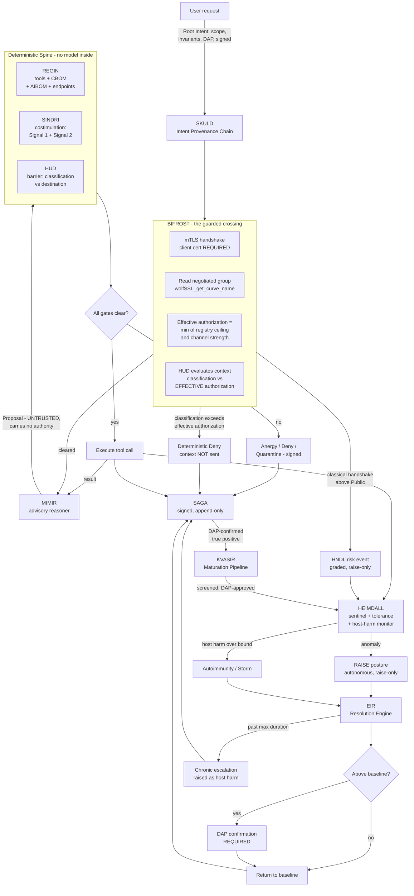

# BROKKR — Technical Architecture

## The Governed Autonomous Coding Agent

**Document ID:** BROKKR-ARCH-2026-001
**Revision:** 1.2
**Supersedes:** Rev 1.1 (commit `4a94fad`) and Rev 1.0 (commit `0ed1849`). Both preserved immutably in git. Superseded, not deleted. See §15.
**Component:** BROKKR — a Rust-native autonomous coding agent governed end-to-end by OQGF-1.0
**Binds to:** OQGF-1.0 (five organs), the Physiology Layer (OQGF-P-1 … P-9), and Amendments AMD-001 … AMD-007 in full
**Declared conformance level:** **Enhanced (OQGF-E)**, architected toward High-Assurance (OQGF-H). See §1.4.
**Author:** Jeremy Rose, CEO — Odin's LLC, Wasilla, Alaska
**Date:** 14 July 2026
**Status:** Architecture specification for the Odin's engineering team; input to the BROKKR build (Claude Code)
**Disposes:** GAP-2026-07-14-001 (eight ABSENT findings from conformance check CONF-2026-07-14-P0.5-R1)

---

## 1. Purpose and scope

### 1.1 What BROKKR is

BROKKR is an autonomous coding agent, written in Rust, whose every action is governed by a deterministic control spine derived from OQGF-1.0. It reads a codebase, reasons about a task, and edits files, runs commands, and calls tools to complete that task — structurally comparable to existing agentic coding harnesses, with one difference that defines the whole design: **no action BROKKR takes reaches the real world without first passing a deterministic gate that the reasoning model cannot influence, suppress, or talk its way past.**

Rev 1.2 extends that sentence in the one direction Rev 1.1 left open. *No action* now includes **the act of asking the model.** A coding agent's largest and most continuous flow of data is not the file it writes — it is the context it ships to the reasoner, on every hop, containing whatever it has read. Rev 1.1 governed the tools and left that flow ungoverned. Rev 1.2 routes it through the same barrier as everything else.

### 1.2 What BROKKR is not, stated plainly

BROKKR does not contain a reasoning engine of its own, and this specification does not claim to build one. Like every current agentic coding tool, BROKKR is a **harness**: a body that manages context, dispatches tool calls, and asks a frontier reasoning model — reached over a network — what to do next. The reasoning lives in the model, not in BROKKR. What Odin's builds and owns is the harness and the governance around it; the reasoning is rented and swappable.

Three consequences shape the architecture:

- **The reasoner is a dependency, not a component.** It sits behind a stable Rust trait and can be replaced with any capable model without touching the governance spine. "Improving BROKKR's reasoning over time" means adopting each new model as it ships and improving the harness and the governance — not training a model in-house.
- **The reasoner is untrusted by construction.** Its outputs are proposals, not commands. A proposal carries no authority. This is not a hedge against a weak model; it is the correct posture toward *any* model, because a model can be manipulated through its context (prompt injection, poisoned files, adversarial tool output), and a manipulated brain must not be able to act outside the authority it was granted.
- **The reasoner is also a network destination** — and this is what Rev 1.1 missed. The model does not live inside BROKKR's trust boundary. Reaching it is a **crossing**, subject to the same custody rules as any other crossing (§6.6, §6.10).

### 1.3 Binding to the full framework

BROKKR binds to the **full framework** — the five organs, the Physiology Layer, and all seven amendments. The five organs establish anatomy; the amendments and the Physiology Layer establish what an autonomous agent must do that a static system need not.

- **AMD-001 (Costimulation / Intent Provenance)** is the single most important requirement for BROKKR. An agent decomposes one authorized request into many tool calls across many reasoning hops. Identity alone does not prove that a given tool call is a faithful derivation of what the user authorized. AMD-001 closes exactly this gap.
- **AMD-007 (the Barrier)** governs the substance a coding agent moves: source code, secrets, and proprietary data crossing between the repository and any destination outside it — **including the reasoner.**
- **The Physiology Layer** governs what happens after the gates fire. A defense with no bound on the harm it does to its own host is not a defense; a defense that can escalate but never de-escalate is a one-way ratchet; a defense that cannot learn repeats every mistake. AMD-002, AMD-005, and AMD-003 respectively, all load-bearing for an agent whose value is doing useful work under constraint.

### 1.4 Declared conformance level and applicability

**BROKKR targets Enhanced (OQGF-E), architected toward High-Assurance (OQGF-H).** Per OQGF-1.0 §A.0.6, a system shall not claim a level higher than its lowest-level organ; BROKKR claims Enhanced and forecloses nothing High-Assurance will later require.

What Enhanced binds:

| Requirement | Enhanced obligation on BROKKR |
|---|---|
| **OQGF-R-1** | **Dual PQC families (ML-DSA + SLH-DSA) for audit signatures.** SAGA is an audit spine. SLH-DSA is a hard prerequisite of Phase 2, not a High-Assurance deferral. |
| **OQGF-I-1, I-2, I-5** | **HNDL sentinel on BROKKR's own channel** (§6.10) |
| **OQGF-M-5** | **Mutual authentication on every connection; one-sided TLS does not satisfy** (§6.10) |
| **OQGF-M-6** | **Documented vendor trust score** per supplier, reviewed quarterly (§6.2) |
| **OQGF-G-7** | Key lifetime calculation documented per primitive (§6.11) |
| **OQGF-M-9, M-10, M-12, M-13** | Cryptographically enforced attenuation; invariants at every hop; cross-hop reconciliation; documented least-privilege Root Intent scoping |
| **OQGF-P-3, P-5** | Central-tolerance screening; autoimmunity and response-storm detection |
| **OQGF-P-6.5, P-6.6** | Reversible learned detectors; **no autonomous activation** — DAP approval required |
| **OQGF-P-7.3/.5/.6, P-8.4/.5/.6** | Decentralized signaling; cascade bounding; memory preserved on stand-down; DAP-confirmed de-escalation above baseline; chronic-escalation detection |
| **OQGF-P-9.4, P-9.5** | Risk-acceptance register distinct from the tolerance register; standing inventory of carried risks |
| **OQGF-I-11, I-12, I-14, I-15** | Ingress-provenance gating; screened content sentinel; enumerated Uncontrolled Channels; barrier-bypass detection |

**Requirements declared inapplicable, with justification.** OQGF §A.9.3 permits `n.a.` **with an evidence pointer**. Silently omitting a requirement is not the same as declaring it inapplicable — a distinction the Phase 0.5 conformance check enforced, and which found eight requirements falling through exactly that gap. Rev 1.2 disposes of all eight. The `n.a.` list is now:

| Requirement | Status | Justification |
|---|---|---|
| OQGF-I-3 (quantum cloud trust model) | n.a. | BROKKR consumes no quantum cloud provider |
| OQGF-M-3 (quantum hardware attestation) | n.a. | No quantum workload; no circuit, calibration, or sampling distribution to reconcile |
| OQGF-A-2 (quantum computation records) | n.a. | As above |
| OQGF-A-4 (quantum explanation artifacts) | n.a. | No variational or kernel quantum model in the decision path |
| OQGF-R-5 (cross-jurisdictional audit replication) | n.a. at Enhanced | High-Assurance requirement. **Deferred, not dismissed** — dated marker, revisited at the High-Assurance transition |
| OQGF-R-7 (quantum key distribution) | integration point only | Placeholder per the requirement's own terms; nothing depends on it |
| **OQGF-R-2 (no provider lock-in)** | **applicable, reinterpreted** | The cloud-lock-in analog for BROKKR is **model-provider lock-in.** Satisfied by the `Reasoner` trait and the AIBOM-declared endpoint registry (§6.1, §6.2). Lock-in to a single provider requires DAP risk acceptance. **R-2 is about substitutability; it does not absorb OQGF-M-6, which is about trustworthiness. The two are kept separate.** |
| **OQGF-A.6.1 (incident response)** | **split — see below** | Not `n.a.` |

**OQGF-A.6.1 is split, not declared inapplicable.** The incident-response *plan* — roles, timelines, annual tabletop exercises — is an organizational document Odin's maintains and is out of scope for this architecture. But A.6.1 names its **triggers**: HNDL detection, attestation failure, statistical reconciliation failure, audit-chain break. **Emitting those triggers is architectural**, and BROKKR SHALL emit them: HNDL detection from BIFRÖST (§6.10); attestation failure from SINDRI (§6.4); reconciliation failure from HEIMDALL (§6.7); audit-chain break from SAGA (§6.9). A flat `n.a.` on A.6.1 would have dropped the trigger obligation along with the paperwork. The requirement is recorded as *partially architectural*, with the architectural half specified (§11) and the organizational half assigned to Odin's operations.

**OQGF-R-6 is not a BROKKR disposition. It is a framework ambiguity, referred upward.** R-6's normative text is an **unqualified SHALL**: long-lived secrets — root signing keys, audit-signing keys — sharded via Shamir's Secret Sharing or threshold cryptography, quorum at least 3-of-5. But OQGF's own Organ 4 conformance table places threshold custody **only at High-Assurance**. An unqualified SHALL that the conformance table gates to one level is a contradiction in the framework, not a question about BROKKR, and this architecture does not resolve it by choosing whichever reading is convenient.

**Interim posture, which relaxes nothing:** BROKKR's long-lived signing keys — REGIN's genome key and SAGA's audit key — are **HSM-backed with dual-control issuance**, and their custody model is **declared in the CBOM** (§6.11). BROKKR does not claim 3-of-5 threshold custody at Enhanced, and does not claim R-6 satisfied. It is recorded **PARTIAL**, with the gap named, pending an OQGF amendment that resolves the tier ambiguity. Naming an unmet requirement is conformant. Quietly reading it down to a level where it disappears is not.

---

## 2. The governing principle: the reasoner is never in the trust path

> **The model proposes; the deterministic spine disposes. The reasoning model is never in the trust path for any decision to block, permit, raise, or lower posture.**

**Behavioral governance** tells the model how to behave — rules in a system prompt, asked to be followed. Useful, and BROKKR uses it, but advisory: a manipulated or mistaken model can violate a behavioral rule, because the rule and the actor are the same system. A prompt cannot enforce itself.

**Structural governance** places a deterministic gate between the model's output and any real-world effect, such that violating the rule is not a behavior the model can choose — it is an operation the system refuses to perform. The rule and the enforcer are different systems, and the enforcer contains no model.

BROKKR's contribution is to make the governance of a coding agent **structural** rather than behavioral. Every path from a model output to a file written, a command run, or a byte sent passes through a Rust gate that (a) contains no language model, (b) decides on cryptographic and policy evidence alone, and (c) cannot be addressed, persuaded, or bypassed by the model whose action it is gating.

Two corollaries, and Rev 1.2 exists because of the second.

**The principle is symmetric.** The spine must not be talked *past* — and it must not be allowed to strangle the work it exists to enable. A gate so tight that BROKKR denies most legitimate coding actions is not a safe agent; it is a useless one, and under OQGF-P-1 that failure has **equal standing** to a missed threat. §6.7 gives that failure a number, a bound, and an alarm.

**The principle is bidirectional.** Rev 1.1 governed everything flowing *out of* the model and nothing flowing *into* it. But the flow into the model is the larger one: the entire working context, on every hop, containing whatever BROKKR has read. **The gate must sit on both sides of the reasoner.** A barrier that inspects the agent's file writes while its source code streams out to a third party over an unexamined socket is not a barrier. It is a decoration. §6.10 closes it.

---

## 3. Architectural rationale

### 3.1 Why a Rust harness can enforce what a prompt cannot

The gate is code, not instruction. A costimulation check written in Rust (§6.4) evaluates a cryptographic chain and returns `Granted` or `Anergy`; there is no natural-language channel through which a model can argue with a boolean. The type system carries the safety properties: an `Anergy` value has no method that turns it into an authorization, a `Deny` verdict has no method that turns it into an `Allow`, and a `ToleranceGrant` cannot be constructed against a deterministic gate. These are the same structural encodings the OQGF reference implementation uses (AMD-002 §5.1, AMD-007 §5.1); BROKKR inherits them and applies them to the agentic loop.

### 3.2 Why Rust specifically

The OQGF Part C rationale applies without modification: memory safety where cryptography and untrusted input meet; predictable latency on the gate's hot path with no garbage-collection pauses; a type system strong enough to make "wrong algorithm" and "unauthorized action" construction-time errors; a `no_std` subset for the core governance types. The production discipline from OQGF Part C — no `panic!`, `unwrap`, or `expect` in production paths, enforced by `clippy` lints set to `deny` — is a hard requirement, because a gate that panics is a gate that fails open under the wrong conditions.

---

## 4. System topology

| Subsystem | Role | Governs / satisfies |
|---|---|---|
| **MÍMIR** | The advisory reasoner (frontier LLM behind a trait). Proposes; never acts. Outside the trust path. | Model-agnostic reasoning; the untrusted proposal source |
| **BIFRÖST** | **The guarded crossing to the reasoner.** mTLS-only, cipher-suite attested, HNDL-scored, HÚÐ-gated. Every context leaving for a model passes here. | **OQGF-I-1, I-2, I-5; OQGF-M-5** |
| **REGIN** | The Genome. Four signed registers: Tool Genome, CBOM, AIBOM, and the **Model Endpoint Registry** with M-6 trust scores. | Organ 1 (OQGF-G-1…G-9); **OQGF-M-6**; Self Set (OQGF-P-3) |
| **SKULD** | The Intent Provenance Chain. Carries the Root Intent through every hop; enforces attenuation and invariants. | AMD-001 (OQGF-M-8 … M-14) |
| **SINDRI** | The Costimulation Gate — the deterministic spine. Every tool call passes it: Signal 1 + Signal 2, or architectural anergy. | Organ 3 (OQGF-M-11); OQGF-P-2 |
| **HÚÐ** | The Barrier. Data-custody control on **every** crossing between governed and ungoverned compartments — files, tools, network, **and the reasoner**. | AMD-007 (OQGF-I-8 … I-15) |
| **HEIMDALL** | The Sentinel. Behavioral anomaly, cross-hop reconciliation, the tolerance controller, the host-harm monitor. **Guards BIFRÖST.** | Organ 2 (OQGF-I-6); OQGF-M-12; OQGF-P-1, P-3, P-4, P-5 |
| **EIR** | The Resolution Engine. The way down. Every escalation has a declared path back to baseline; de-escalation above baseline is DAP-confirmed. | AMD-005 (OQGF-P-8.1 … P-8.7) |
| **KVASIR** | The Maturation Pipeline. Learns refined detectors from DAP-confirmed incidents, under four poisoning gates. | AMD-003 (OQGF-P-6.1 … P-6.6) |
| **SAGA** | The Audit Spine. Signed, append-only record of every proposal, gate decision, and action; re-signed across crypto generations. | Organ 5 (OQGF-A) |

Naming glosses. **MÍMIR** — the counselor whose head gives Odin wisdom but has no hands; it speaks, it does not act. **BIFRÖST** — the one bridge between worlds, and **Heimdall's entire charge in the myths is to guard it.** That is not decoration: it encodes the actual relationship in the code, where HEIMDALL watches the crossing that BIFRÖST makes. Bifröst also burns at Ragnarök — the correct posture toward an external dependency is that it is expected to fail. **REGIN** — Old Norse *regin*, "the powers"; the register of what BROKKR is made of and what it may wield. **SKULD** — the Norn of *that which shall be* and of obligation. (GARM's memory organ takes the past-Norn Urðr; BROKKR's intent chain takes the future-Norn Skuld.) **SINDRI** — the master smith who directs each strike at the forge. **HÚÐ** — Old Norse *hide/skin*; the selective epithelial barrier the AMD-007 analogy names directly. **HEIMDALL** — the watchman who sees to the edge of the world and hears the grass grow. **EIR** — the physician of the gods; the return to health *is* the return to baseline, and the asymmetry is in the naming: the watchman may raise the alarm alone, the healer may not stand the body down without the DAP. **KVASIR** — the wisest being, distilled from mingled sources, whose wisdom was later stolen and misused; the maturation pipeline distills better detection from confirmed incidents, and the cautionary half of the myth is exactly the poisoning residual (§13). Kvasir is distinct from Mímir: Mímir advises in the moment and is untrusted; Kvasir refines detectors from history and is gated four ways. **SAGA** — *what is recorded and told*.

### 4.1 The governed action cycle



Four load-bearing observations.

**The gate is now on both sides of the reasoner.** BIFRÖST gates what goes *in*; SINDRI and HÚÐ gate what comes *out*. In Rev 1.1 the left half of this diagram did not exist, and the entire working context left the boundary unexamined.

**MÍMIR is never inside a decision.** Every box that decides — BIFRÖST, REGIN, SINDRI, HÚÐ, HEIMDALL, EIR, KVASIR — contains no model and cannot be reached by one.

**The fail-safe asymmetry is visible in the shape.** HEIMDALL raises posture on its own authority. Nothing lowers it on its own authority: the path down runs through EIR, and above baseline through a DAP. Where the system is uncertain, it stays escalated.

**The learning loop closes through a human.** KVASIR draws only from DAP-confirmed incidents and returns only detectors that survived four gates and a DAP approval. There is no arrow from MÍMIR to KVASIR. The agent does not teach itself.

---

## 5. The governed action cycle, step by step

1. **The request becomes a Root Intent.** BROKKR does not hand the task to the model as free text with implied authority. It constructs a **Root Intent** (SKULD): a least-privilege scope (OQGF-M-13), an invariant set (OQGF-M-10) — `no network egress`, `read-only outside ./src`, `no secret material in committed output` — a freshness nonce and expiry (OQGF-M-14), the accountable natural person (DAP, OQGF-A-5), and a signature. This is the sole source of authority for everything that follows.

2. **BIFRÖST guards the crossing to the reasoner.** *(New in Rev 1.2.)* Before any context reaches MÍMIR: the connection is established under **mutual TLS** — an endpoint that cannot present a valid client certificate is not merely refused, it **cannot be registered** (OQGF-M-5). BIFRÖST reads the **actually negotiated** key-exchange group. The endpoint's **effective authorization** is the *lesser* of its registry authorization and what its channel strength permits (§6.10). HÚÐ then evaluates the outbound context — classification against that effective authorization — exactly as it would any other crossing. Above it: **deterministic Deny; the context is not sent.** A classical handshake carrying above-Public content emits an **HNDL risk event** into the graded-response path (OQGF-I-1, I-2, I-5).

3. **MÍMIR proposes.** The reasoner receives the cleared context and the *current attenuated intent scope* — never the raw Root Intent, never more authority than the present hop holds. It returns a `Proposal`: one concrete action plus an advisory rationale. Untrusted input to the spine.

4. **REGIN checks the genome.** The proposed tool must be a declared, signed member of the Tool Genome, and the calling hop must hold the tool's privilege class. A tool not in the genome does not exist. A privileged tool proposed by a hop that lacks the privilege is refused here.

5. **SINDRI runs the costimulation gate.** The deterministic spine. Both signals required (OQGF-M-11): Signal 1, BROKKR's attestation for this hop (OQGF-M-1); Signal 2, a valid Intent Provenance Chain (OQGF-M-8) tracing this action to the Root Intent. It walks the chain, verifies each link's hash and signature, confirms `emitted ⊆ received` at every hop (OQGF-M-9), confirms the action lies within scope, and evaluates it against the accumulated invariants. Any failure → **architectural anergy**: denied, signed denial to HEIMDALL, recorded in SAGA. Identity alone never suffices.

6. **HÚÐ governs the crossing, when there is one.** Classified content to an unauthorized destination is a **deterministic Deny** (OQGF-I-10), non-suppressible. Unprovenanced ingress into a privileged context is **quarantined** (OQGF-I-11). Every crossing carries a signed Boundary Custody Record (OQGF-I-9). **The reasoner endpoint is one such destination** — the same gate, the same logic (§6.6).

7. **The action executes only if all gates clear.** The executed action is an `AuthorizedAction` — a type only the spine can produce.

8. **HEIMDALL reconciles behavior and watches BROKKR's harm to its own host.** It compares the *sequence* of executed actions against the declared intent at each hop (OQGF-M-12); deviation raises posture (OQGF-P-7). Independently, it measures the **host-harm rate** (OQGF-P-1): how often BROKKR denies, anergizes, or quarantines a *legitimate* coding action. Sustained breach of the bound is **autoimmunity**; a response above the declared blast radius is a **storm**. Either is an incident in its own right (OQGF-P-5).

9. **EIR provides the way down.** Every escalation type is registered with a declared Resolution Path **before it may be used** — clear condition, target baseline, minimum dwell, hold window, maximum duration (OQGF-P-8.1, .3, .6). There are no one-way ratchets. Above baseline, nothing resolves without DAP confirmation (OQGF-P-8.5). Where uncertain, it stays escalated. De-escalation preserves the incident record and any learned detector (OQGF-P-8.4). An escalation past its maximum duration is a **Chronic Escalation** and is treated as host harm — a defense that never switches off is pathology, not vigilance.

10. **SAGA records everything.** Every proposal (including refused ones), gate decision, executed action, posture change, resolution, and **every BIFRÖST crossing with its negotiated channel parameters** — dual-signed (ML-DSA + SLH-DSA, OQGF-R-1), DAP-attributed, append-only. Never deleted; corrections are annotations. **SAGA continuously verifies its own hash chain and emits an audit-chain-break trigger on failure** (OQGF-A.6.1).

11. **KVASIR learns, slowly and under guard.** Only a DAP-confirmed true positive may seed a Refined Detector (OQGF-P-6.1). The candidate must beat an *independent* corpus, not its seed (OQGF-P-6.2); must pass central-tolerance screening and is **discarded regardless of detection gains** if it raises host harm above the bound (OQGF-P-6.3); must carry signed provenance (OQGF-P-6.4); must be reversible (OQGF-P-6.5); and at Enhanced **cannot activate without DAP approval** (OQGF-P-6.6).

12. **The loop continues.** The result returns through BIFRÖST to MÍMIR. As the model spawns sub-tasks, SKULD appends chain entries that can only narrow authority. The cycle repeats until the task completes or the intent expires.

---

## 6. Per-subsystem architecture

Core governance types live in `brokkr-core` (§9). The types below extend them with the agent-specific surfaces.

### 6.1 MÍMIR — the advisory reasoner

```rust
/// A proposed action emitted by the advisory reasoner.
/// UNTRUSTED input to the deterministic spine. Carries no authority.
pub struct Proposal {
    pub action: Action,
    pub rationale: String,     // advisory only
    pub hop: HopId,
}

/// Any capable frontier model behind a stable trait. Model-agnostic by
/// construction - the reasoning analog of crypto-agility.
/// MIMIR proposes; the trust path never consults it.
pub trait Reasoner: Send + Sync {
    /// The endpoint this reasoner speaks to. Registered in REGIN (6.2).
    /// A Reasoner CANNOT be constructed against an unregistered endpoint.
    fn endpoint(&self) -> &ModelEndpointId;

    /// Called ONLY with a context already cleared by BIFROST (6.10).
    /// The type makes this true: ClearedContext has no public constructor.
    fn propose(
        &self,
        ctx: &ClearedContext,   // NOT a raw Context - cleared by the barrier
        scope: &IntentScope,    // the CURRENT attenuated scope
    ) -> Result<Proposal, ReasonerError>;
}
```

**`propose` takes a `ClearedContext`, not a `Context`.** `ClearedContext` has no public constructor; it is minted only by BIFRÖST on a successful barrier evaluation. This is the same structural device as `AuthorizedAction` (§6.4), pointed the other way: **an ungoverned context cannot be handed to a model, because the function that takes it will not accept one.** In Rev 1.1 `propose` took a raw `Context`, and that single type signature was the hole.

Three rules bind every implementation: the model receives only the current attenuated scope, never more authority than the hop holds; it receives no channel to any gate's decision — no tool named "override," no invariant it may edit, no path by which a rationale changes a boolean; and its endpoint must be a registered member of the Model Endpoint Registry.

### 6.2 REGIN — the Genome

REGIN is what BROKKR is *made of*, in the Genetic-Layer sense (OQGF-G). **Four** signed registers, and simultaneously the Self Set against which detectors are screened (OQGF-P-3).

```rust
pub struct Genome {
    pub version: GenomeVersion,
    pub tools: ToolGenome,           // what BROKKR may invoke
    pub cbom: Cbom,                  // what cryptography BROKKR contains (OQGF-G-1)
    pub aibom: Aibom,                // what models BROKKR reasons with (OQGF-G-2)
    pub endpoints: EndpointRegistry, // WHERE those models live, on what terms (NEW)
    pub corpus_digest: Digest,
    pub owner: Dap,
    pub signature: DualSignature,    // ML-DSA + SLH-DSA (OQGF-R-1 at Enhanced)
}

/// A model endpoint BROKKR is permitted to speak to.
/// Registration is refused without a client certificate: OQGF-M-5 is enforced
/// at REGISTRATION, not at connection time. An endpoint that cannot do mTLS
/// is not an endpoint BROKKR can express.
pub struct ModelEndpoint {
    pub id: ModelEndpointId,
    pub model: ModelIdentity,        // name, version, provider (AIBOM, OQGF-G-2)
    pub client_cert: ClientCertRef,  // REQUIRED. No Option. (OQGF-M-5)
    pub server_trust: TrustAnchor,   // pinned; not the system trust store
    pub min_group: NamedGroup,       // minimum key-exchange group demanded
    pub max_classification: Classification,  // ceiling this endpoint may RECEIVE
    pub trust_score: VendorTrustScore,       // OQGF-M-6
}

/// OQGF-M-6. Distinct from OQGF-R-2 (substitutability). This is TRUSTWORTHINESS.
/// A provider you can switch away from may still be one you should not send
/// source code to. Reviewed quarterly; a stale score fails the promotion gate.
pub struct VendorTrustScore {
    pub attestation_capability: Score,
    pub fips_validation: Score,
    pub breach_history: Score,
    pub jurisdictional_exposure: Score,  // whose law reaches this data?
    pub data_handling: Score,            // retention, training use, sub-processors
    pub reviewed: SystemTime,            // quarterly (OQGF-M-6)
    pub reviewer: Dap,
    pub signature: DualSignature,
}
```

**The CBOM (OQGF-G-1)** lists every cryptographic primitive, library, parameter set, key reference, and FIPS validation reference: wolfCrypt's version and build provenance, ML-DSA, SLH-DSA, ML-KEM, HMAC-SHA-384, AES-256 (with its declared purpose, §6.11). CycloneDX 1.6 conformant. The FFI honesty rule (§10) applies to every entry.

**The AIBOM (OQGF-G-2)** requires an inventory of *models, weights provenance, frameworks, licenses, and — explicitly — prompts and system messages.* For BROKKR: the model each endpoint serves, its version and provider, and the digests of the governance corpus and system prompts it is given. **A swapped model is a genome change. A changed system prompt is a genome change.** Neither is an invisible configuration edit.

**The Endpoint Registry (new)** is where OQGF-M-5 becomes structural. `client_cert` is a required field, not an `Option`. **An endpoint that cannot present a client certificate is not something this type can represent** — so "we'll just use the public API with a bearer token" is not a shortcut available to anyone, including a future maintainer in a hurry. It is not policy. It is the absence of a constructor.

**OQGF-M-6 is not folded into OQGF-R-2.** They ask different questions. R-2 asks *can you leave?* M-6 asks *should you have come?* A provider you can switch away from tomorrow may still be one whose jurisdictional exposure makes it wrong to send regulated source code to today. For a federal buyer, jurisdictional exposure is the first question asked, not the last.

**The gate (OQGF-G-4).** No BROKKR release is promoted without a present, signed CBOM, AIBOM, and Endpoint Registry, free of disallowed algorithms and with **no stale trust score**. A **Deterministic Gate** under OQGF-P-2: fail-closed, non-suppressible. The only sanctioned path past a finding is an Accountable Risk Acceptance (§6.5) that keeps the finding visible.

### 6.3 SKULD — the Intent Provenance Chain

```rust
/// Appends a hop. The emitted scope MUST be a subset of the received scope
/// (OQGF-M-9). Broadening is not an error to report - it is an operation this
/// method cannot perform; the return type has no widening path.
pub trait IntentChain: Send + Sync {
    fn attenuate(
        &self,
        current: &IntentProvenanceChain,
        hop: &Attestation,
        emitted: IntentScope,
        added_caveats: Vec<Caveat>,
        added_invariants: InvariantSet,
    ) -> Result<IntentProvenanceChain, AttenuationError>; // Err(WouldBroaden)
}
```

A hop that needs authority broader than it holds cannot self-broaden; it surfaces a request for a new Root Intent to the DAP (OQGF-M-9). A visible, human-gated event — never a silent escalation.

### 6.4 SINDRI — the Costimulation Gate

```rust
/// Every privileged tool call passes here. Grants only if BOTH Signal 1
/// (identity) and Signal 2 (a valid Intent Provenance Chain) verify AND the
/// action lies within the attenuated scope AND violates no invariant.
/// Otherwise: Anergy. Contains no model and exposes no channel to one.
pub trait CostimulationGate: Send + Sync {
    fn authorize(
        &self,
        identity: &Attestation,          // Signal 1 (OQGF-M-1)
        chain: &IntentProvenanceChain,   // Signal 2 (OQGF-M-8)
        action: &Action,
    ) -> AuthorizationDecision;          // Granted(AuthorizedAction) | Anergy
}

/// Produced ONLY by a successful SINDRI authorization. No public constructor.
pub struct AuthorizedAction { /* private fields */ }
```

The `AuthorizedAction` type is the structural heart: the executor accepts nothing else, and only SINDRI can mint one. **An attestation failure emits an A.6.1 incident-response trigger.**

### 6.5 HÚÐ — the Barrier

```rust
pub enum BarrierVerdict {
    Allow,
    /// Deterministic, non-suppressible (OQGF-I-10 inheriting OQGF-P-2).
    /// The only sanctioned way past is an AMD-006 AcceptedRisk that keeps the
    /// finding visible - never suppression.
    Deny { finding: BarrierFinding },
    /// Unprovenanced ingress into a privileged context (OQGF-I-11).
    Quarantine { datum: DatumRef },
    /// A DAP has recorded a scoped, expiring, signed decision to proceed past a
    /// still-visible Deny (AMD-006 / OQGF-P-9). Distinct from Allow by construction.
    AcceptedRisk { entry: RiskAcceptanceId },
}

/// A destination is not merely WHERE data goes. It is also the PIPE it goes through.
pub enum Destination {
    LocalPath(PathBuf),
    Network { host: Host, channel: ChannelStrength },
    /// The reasoner. Its authorization is CONDITIONAL on the channel actually
    /// negotiated - see 6.10. This variant is why Rev 1.2 exists.
    Reasoner { endpoint: ModelEndpointId, negotiated: NamedGroup },
}

pub trait Barrier: Send + Sync {
    fn evaluate(&self, flow: &BoundaryFlow) -> BarrierVerdict;
}
```

**The one-line summary of Rev 1.2's central fix:** `Destination::Reasoner` did not exist in Rev 1.1. The model was a trait, not a destination — and a trait boundary looks like architecture while a network boundary looks like risk. It was both, and only the first was modeled.

There is no method converting a `Deny` into an `Allow`. The egress classification gate is deterministic; a model cannot suppress it, and neither can an operator by ordinary configuration. **At Enhanced the two registers must be demonstrably distinct** (OQGF-P-9.4): a Risk-Acceptance Entry is not a Tolerance Grant, no decision is expressible as both, and the standing inventory of carried risks is reportable on demand (OQGF-P-9.5).

**Uncontrolled Channels (OQGF-I-14).** BROKKR enumerates the channels through which governed data could leave outside HÚÐ's enforcement — the developer's own terminal in another window, a personal device, an editor's telemetry — records that enumeration, and treats reducing reliance on them as a standing obligation. The architecture does not claim to enforce what it does not control. **It names what it cannot reach.** Rev 1.1's most consequential failure was that the reasoner channel was an Uncontrolled Channel *that had not been enumerated*, because it had not been recognized as a channel at all.

### 6.6 HÚÐ and the reasoner — one gate, one logic

Rev 1.2 adds **no new barrier mechanism.** HÚÐ already answers exactly the right question: *may this classification cross to this destination?* The reasoner is a destination. That is the entire fix. What was missing was not machinery; it was the **wire**.

### 6.7 HEIMDALL — Sentinel, Tolerance Controller, Host-Harm Monitor

HEIMDALL is Organ 2's heuristic layer (OQGF-I-6) plus cross-hop reconciliation (OQGF-M-12). It is the *trained*, tolerable layer — and therefore the layer to which self-tolerance applies. Detectors are screened against REGIN's Self Set before deployment (OQGF-P-3); confirmed false positives are suppressed only by signed, scoped, expiring Tolerance Grants (OQGF-P-4). **HEIMDALL is heuristic and suppressible; SINDRI, HÚÐ's egress gate, BIFRÖST's mTLS requirement, and REGIN's promotion gate are neither.** Tolerance reduces false alarms; it never opens a hole in a deterministic gate (OQGF-P-2), and a request to suppress one is *refused*, not silently honored.

**The host-harm bound (OQGF-P-1)** — the requirement most likely to be skipped, and the one a coding agent can least afford to skip. Host harm for BROKKR is the application of a defensive response — anergy, deny, quarantine, throttle — **to a legitimate coding action**. A BROKKR that denies half the legitimate work is not a cautious agent; it is a broken one. OQGF-P-1: *disruption of a legitimate operation is a governance failure of equal standing to a missed threat.*

```rust
pub struct HostHarmReport {
    pub rate: f64,                 // legitimate actions harmed / legitimate actions
    pub bound: f64,                // declared ceiling (OQGF-P-1)
    pub autoimmunity: bool,        // sustained breach (OQGF-P-5a)
    pub storm: Option<StormEvent>, // response beyond declared blast radius (OQGF-P-5b)
}

pub trait ToleranceController: Send + Sync {
    /// SHALL refuse if the target is Deterministic (OQGF-P-2).
    /// Returns Err. Never a silent no-op.
    fn grant(&self, grant: ToleranceGrant, class: ResponseClass)
        -> Result<GrantId, ToleranceError>;   // Err(NonSuppressibleGate)

    /// Screen a detector against the Self Set before deployment (OQGF-P-3).
    fn screen(&self, d: &DetectorSpec, s: &SelfSet)
        -> Result<ScreenPass, ToleranceError>; // Err(FailsCentralTolerance)

    fn host_harm(&self) -> HostHarmReport;
}
```

**Autoimmunity** is a sustained rise in host harm above the bound — BROKKR increasingly blocking the work it exists to do. **A response storm** is a single graded response whose magnitude threatens availability regardless of whether its target was correct: quarantining the entire tree, denying every action in a session, revoking the whole tool genome. *Autoimmunity is hitting the wrong target. The storm is hitting the right target far too hard.* Both are raised through the graded-response path and recorded, on the principle that the defense harming the host is itself an incident, not a side effect to be tolerated.

### 6.8 EIR — the Resolution Engine

```rust
/// Declared BEFORE an Escalation type may be used (OQGF-P-8.1, .3, .6).
/// Registration is refused without a resolution path and a baseline.
pub struct EscalationType {
    pub id: EscalationId,
    pub resolution_criteria: ClearCondition,
    pub baseline: BaselinePosture,
    pub dwell_min: Duration,      // hysteresis (OQGF-P-8.3)
    pub hold_window: Duration,    // clear must persist
    pub max_duration: Duration,   // chronic threshold (OQGF-P-8.6)
}

pub trait ResolutionEngine: Send + Sync {
    fn may_resolve(&self, e: &EscalationId) -> ResolutionVerdict;
    // Eligible { needs_dap } | NotYet { reason } | Chronic

    /// SHALL preserve the SAGA incident record and any learned detector
    /// (OQGF-P-8.4). The response stands down; the intelligence does not.
    fn resolve(&self, d: ResolutionDecision) -> Result<ReturnedToBaseline, ResolveError>;

    fn scan_chronic(&self) -> Vec<ChronicEscalation>;
}
```

**Fail-safe asymmetry (OQGF-P-8.5).** Autonomous action may *raise* posture. It may never autonomously *lower* it above baseline. Raising is cheap and reversible; lowering prematurely re-exposes the host. Where uncertain, **it stays escalated.** A forged or replayed Signal therefore cannot stand BROKKR down — at worst it over-tightens, and over-tightening is bounded and reported by the host-harm monitor.

**Resolution is an act, not a timeout (OQGF-P-8.2).** BROKKR does not drift back to baseline because a timer expired. De-escalation is an explicit recorded decision naming the cleared condition, the time, and the accountable DAP.

**Chronic escalation is host harm (OQGF-P-8.6).** An escalation outliving its declared maximum without resolving or being re-justified is flagged and treated as host harm. A response that never switches off is pathology, not vigilance — and for a coding agent, a permanently-escalated posture is indistinguishable from a broken tool.

### 6.9 SAGA — the Audit Spine

Organ 5 (OQGF-A). Every proposal, decision, action, posture change, resolution, tolerance grant, risk acceptance, detector activation, **and BIFRÖST crossing with its negotiated channel parameters** is recorded, **dual-PQC-signed (ML-DSA + SLH-DSA, OQGF-R-1 at Enhanced)**, DAP-attributed, append-only. Never deleted or overwritten — corrections are strikethrough annotations pointing to the correcting entry. Re-signed under the prevailing cryptographic generation on a schedule not exceeding five years (OQGF-A-6). Read-only signed export for lawful review (OQGF-A-7).

**SAGA continuously verifies its own hash chain and emits an audit-chain-break trigger** (OQGF-A.6.1). It is the source of truth for KVASIR's seeding incidents and for EIR's incident preservation: de-escalation does not erase what happened (OQGF-P-8.4).

### 6.10 BIFRÖST — the guarded crossing

**This is the subsystem Rev 1.1 needed and did not have.** It satisfies OQGF-I-1, I-2, I-5, and M-5, and it does so by supplying HÚÐ with facts HÚÐ was never given.

```rust
/// The guarded crossing to a reasoner. mTLS-only, cipher-attested, HNDL-scored.
pub trait Bifrost: Send + Sync {
    /// Establish the channel. Refuses without mutual authentication (OQGF-M-5).
    /// The client cert comes from REGIN; there is no anonymous path.
    fn connect(&self, e: &ModelEndpoint) -> Result<Channel, BifrostError>;

    /// Read the ACTUALLY NEGOTIATED key-exchange group.
    /// Not what was offered. What was agreed. (wolfSSL_get_curve_name)
    fn negotiated(&self, c: &Channel) -> NamedGroup;

    /// The heart of Rev 1.2: an endpoint's EFFECTIVE authorization is the LESSER
    /// of its registry ceiling and what the channel it actually got can carry.
    /// A registry saying "Internal" over a classical handshake yields Public.
    fn effective_authorization(&self, e: &ModelEndpoint, c: &Channel) -> Classification;

    /// Evaluate the outbound context through HUD against the EFFECTIVE level.
    /// Mints ClearedContext on Allow. There is no other way to make one.
    fn clear(&self, ctx: Context, c: &Channel, e: &ModelEndpoint)
        -> Result<ClearedContext, BarrierVerdict>;

    /// HNDL risk score, per session and per asset (OQGF-I-5).
    fn hndl_score(&self, c: &Channel, ctx: &Context) -> HndlScore;
}

/// Channel strength, derived from the negotiated group - never from the offer list.
pub enum ChannelStrength {
    /// PQC-hybrid, 1024-class. CNSA 2.0 + classical fallback in one handshake.
    /// wolfSSL: SECP384R1MLKEM1024 (4589). High-Assurance.
    PqcHybrid1024,
    /// PQC-hybrid, 768-class. wolfSSL: X25519MLKEM768 (4588). Enhanced.
    PqcHybrid768,
    /// Classical only (RSA, ECDH, no ML-KEM). HNDL-exposed.
    /// Above Public: a graded risk event today (OQGF-I-2), a reportable
    /// incident after 31 Dec 2030 - by SIGNED POLICY, not by a code change.
    Classical,
}
```

**Four properties carry the argument.**

**mTLS is enforced at registration, not at connection.** `ModelEndpoint::client_cert` is a required field. An endpoint that cannot do mutual TLS is not something the type system can express, so it cannot be reached — not by a hurried maintainer, not by a config flag, not by a model. OQGF-M-5 says one-sided TLS SHALL NOT satisfy the requirement; BROKKR makes one-sided TLS **unrepresentable**.

**The channel is measured, not assumed.** BROKKR reads what it *actually negotiated* (`wolfSSL_get_curve_name`), never what it offered. An offer list is an intention. A negotiated group is a fact. **Only facts reach the gate.**

**Authorization is the minimum of the two.** This is the whole design, in one line:

```
effective = min(endpoint.max_classification, channel_strength.permits())
```

REGIN says an endpoint may receive up to Internal. The handshake lands on plain ECDH. The endpoint's effective authorization collapses to **Public**, and above-Public context to it is a Deny — **by the logic HÚÐ already had.** No new gate. No new mechanism. Just a destination whose authorization is conditional on the pipe it is reached through.

**The 2030 ratchet is policy, not code (OQGF-G-8).** The registry declares the minimum channel strength per classification, signed and DAP-owned. Today, classical-over-Internal is a graded risk event (OQGF-I-2). In 2031 the same policy file says Deny. **No rebuild, no redeploy, no code review.**

**One choice stated honestly, because it is a choice.** Hard-Denying *every* classical handshake today would be stricter than OQGF-I-2 requires, which mandates a graded risk event before 31 December 2030. It would also be a mistake: if most reachable endpoints will not negotiate hybrid, a hard Deny makes BROKKR refuse its own legitimate work — which is **autoimmunity by name** (OQGF-P-5). The graded path is not softness. It *is* the requirement, and the alternative would violate a different one. The architecture chooses the requirement over the instinct, and says so.

**What this buys against a public API, stated with equal honesty.** A header proves an API exists; it does not prove a server will negotiate it. Against a public endpoint BROKKR can only *offer* hybrid and *observe* what it got. Against an endpoint you run, you *mandate* it — mTLS and `SECP384R1MLKEM1024`, enforced at your own listener. **That is the difference between a risk score and a guarantee**, and it is the entire reason the deployment model below is what it is.

#### 6.10.1 The deployment model, and its honest limits

**BROKKR speaks only to model endpoints that support mutual TLS.** Two conformant topologies:

**Full custody.** The model runs inside the boundary. Self-hosted weights, mTLS end to end, source code never crosses an uncontrolled boundary. **The cost, stated plainly: no open-weights model available today is Opus-class at agentic coding.** That is a real capability reduction and this document does not dress it up. It is the correct topology for classifications where the capability trade is worth it — and the only one where "nothing leaves" is a true sentence.

**Gateway with a declared boundary.** BROKKR does mTLS to a gateway **the operator runs**; the gateway forwards to a frontier provider. **Read this carefully: if that gateway forwards to a public API over a bearer token, the source code still leaves the operator's boundary. M-5 has been relocated, not satisfied.** What the gateway genuinely buys is that the crossing becomes **declared, classification-gated, trust-scored, and audited** instead of invisible. That is worth a great deal. It is not the same as containment, and the moment this document says otherwise it is overclaiming.

**Classification routes between them, and that routing is the product.** Public and Internal context may reach an external frontier model through the gateway, subject to trust score and channel strength. Above that: the local endpoint, or **Deny**. A single deterministic gate decides, and the operator's classification policy — not BROKKR — draws the line.

This constraint is not a limitation to apologize for. **A coding agent that ships source code over a bearer-token connection to a public API cannot be deployed on a CJIS or FedRAMP network at all.** Requiring an endpoint you control is what makes BROKKR deployable in the only environments that would pay for this much governance.

### 6.11 Cryptographic key management

**AES-256's purpose is declared** (closing a Rev 1.1 omission: the crate list named AES-256 and never said what it encrypts, leaving OQGF-G-7 unanswerable). AES-256-GCM protects **SAGA's audit records at rest** and **REGIN's private-key material at rest**. It protects nothing else. Any future confidentiality use requires a CBOM entry and a fresh Mosca calculation.

**OQGF-G-7 (Mosca's inequality) applies, and here is the calculation.** Mosca governs *confidentiality* keys — keys protecting data with a secrecy lifetime — because harvest-now-decrypt-later is a threat to secrecy, not to signatures. A signature has no secrecy lifetime, so BROKKR's signing keys are out of G-7's scope; **the AES-256 data-at-rest key is in it.**

- **X** (required secrecy lifetime) = **7 years.** SAGA's default retention (OQGF-G-9).
- **Y** (migration duration) = **1 year**, declared. BROKKR's crypto is agile by construction (OQGF-G-5) and re-signing is already scheduled (OQGF-A-6).
- **Z** (CRQC date) = **2030**, the OQGF-G-7 default; no sector-specific value is claimed.
- **Mosca:** X + Y = 8 > Z − now ≈ 4. **The inequality is already violated for any data encrypted today under a classically-protected key.**

**Therefore: BROKKR SHALL NOT protect at-rest confidentiality with a classically-derived key at any point in its life.** AES-256 keys are established under **ML-KEM** from first commit, never RSA/ECDH-derived. This is not a migration schedule. It is a constraint on Phase 2, because the migration deadline is already behind us.

**Long-lived signing keys — the R-6 posture, stated as a gap, not as a pass.** REGIN's genome key and SAGA's audit key are long-lived secrets. OQGF-R-6's normative text is an unqualified SHALL requiring Shamir or threshold custody at 3-of-5, while OQGF's own Organ 4 conformance table places threshold custody at High-Assurance only. **This architecture does not resolve that contradiction; it is a framework ambiguity referred upward (§1.4).**

Interim posture: HSM-backed keys with dual-control issuance, custody model declared in the CBOM. **BROKKR does not claim OQGF-R-6 satisfied at Enhanced.** It is recorded PARTIAL with the gap named. Naming an unmet requirement is conformant. Quietly reading it down to a tier where it vanishes is not — and reading it down would have been the disposition that unblocked the build, which is precisely why it was not chosen.

---

## 7. The governor is itself governed

Any action modifying BROKKR's own control surface — the genome (tools, CBOM, AIBOM, **endpoint registry**), an invariant set, gate configuration, classification policy, **a channel-strength policy**, a tolerance grant, or activation of a learned detector — is a `SelfModifying` privilege-class action. Costimulated like any other privileged action **and** requiring explicit DAP confirmation (OQGF-M-13, A.6.3). There is no privileged path BROKKR can grant itself, no invariant it can quietly relax, and no god-mode.

**Registering a model endpoint is `SelfModifying`.** It changes where BROKKR's thinking happens and what may be sent there. It is the most consequential configuration change in the system, and it requires a DAP.

One corollary constrains the whole design: **any automated proposal may only add or tighten a constraint, never relax one.** MÍMIR may propose adding an invariant; it cannot propose removing one. KVASIR may propose a detector that catches more; never one that catches less. The model proposes; the DAP ratifies; and even a ratified change may only narrow.

---

## 8. Structural invariants

Properties of the *code*, enforced by the type system. A violation is a build failure.

| ID | Invariant |
|---|---|
| **I-1** | `AuthorizedAction` has no public constructor. Only the gate mints one; the executor accepts nothing else. |
| **I-2** | `BarrierVerdict::Deny` has no conversion to `Allow`. The only path past is `AcceptedRisk`, which keeps the finding visible. |
| **I-3** | `IntentChain::attenuate` returns `Err(WouldBroaden)`. There is no widening constructor anywhere. |
| **I-4** | `ToleranceController::grant` returns `Err(NonSuppressibleGate)` on a `Deterministic` target. Never a silent no-op. |
| **I-5** | No governance crate depends on `brokkr-reasoner`, `brokkr-tools`, or `brokkr-cli`. One-way, CI-enforced. |
| **I-6** | Only `brokkr-reasoner` makes a model API call — **and only through `brokkr-bifrost`.** |
| **I-7** | Self-modifying actions are costimulated **and** DAP-confirmed. No carve-out, no bootstrap path. |
| **I-8** | An `EscalationType` is unconstructable without a resolution path and a baseline. Above baseline, only a DAP-confirmed decision resolves. |
| **I-9** | A `RefinedDetector` is `Heuristic` by construction. `brokkr-adapt` does not depend on `brokkr-reasoner`: **the agent does not teach itself.** |
| **I-10** | No promotion without a signed CBOM, AIBOM, and Endpoint Registry, and no stale trust score. |
| **I-11** | **`ModelEndpoint::client_cert` is a required field.** One-sided TLS to a reasoner is not representable (OQGF-M-5). |
| **I-12** | **`Reasoner::propose` takes `ClearedContext`, which only BIFRÖST can mint.** An ungoverned context cannot be handed to a model — the function will not accept one. |

**I-11 and I-12 are new in Rev 1.2**, and together they are the fix. I-11 makes an unauthenticated endpoint unrepresentable. I-12 makes an ungated context unpassable. Neither is a rule the code is asked to follow; both are shapes the code cannot take.

Each invariant carries at least one **negative test** naming its ID. Negative tests are the load-bearing tests here: a positive test proves the system works; a negative test proves it cannot be made to misbehave.

---

## 9. Crate and workspace layout

```
brokkr/
├── brokkr-core/        # Governance + agent types. no_std + alloc where feasible.
│                       #   ResponseClass, IntentProvenanceChain, CostimulationGate,
│                       #   AuthorizedAction, BarrierVerdict, Destination, Signal,
│                       #   ToleranceController, SelfSet, HostHarmReport,
│                       #   EscalationType, ResolutionEngine, RefinedDetector,
│                       #   MaturationPipeline, Proposal, Genome (ToolGenome + Cbom
│                       #   + Aibom + EndpointRegistry), ModelEndpoint, NamedGroup,
│                       #   ChannelStrength, Classification, ClearedContext, Reasoner.
├── brokkr-crypto/      # wolfCrypt FFI: ML-DSA, SLH-DSA, ML-KEM, HMAC-SHA-384,
│                       #   AES-256-GCM. Sole backend. FFI honesty rule.
├── brokkr-bifrost/     # BIFROST: mTLS, negotiated-group readback, channel strength,
│                       #   HNDL scoring, ClearedContext minting. Depends on crypto
│                       #   and barrier. NEVER on reasoner.
├── brokkr-reasoner/    # MIMIR: model adapters. The ONLY crate that speaks to a model,
│                       #   and only through brokkr-bifrost.
├── brokkr-genome/      # REGIN: tools, CBOM, AIBOM, endpoint registry, trust scores,
│                       #   the OQGF-G-4 promotion gate, Self-Set screening.
├── brokkr-intent/      # SKULD: IPC, monotonic attenuation, invariants, freshness.
├── brokkr-gate/        # SINDRI: the costimulation gate; the deterministic spine.
├── brokkr-barrier/     # HUD: classification, egress Deny, ingress Quarantine, BCRs,
│                       #   risk-acceptance registry, uncontrolled-channel register.
├── brokkr-sentinel/    # HEIMDALL: anomaly, reconciliation, tolerance, host-harm,
│                       #   autoimmunity/storm. EIR: resolution, hysteresis, chronic.
├── brokkr-adapt/       # KVASIR: maturation pipeline, four poisoning gates.
├── brokkr-audit/       # SAGA: dual-signed append-only, chain verification, re-signing.
├── brokkr-tools/       # Tool implementations, behind REGIN.
└── brokkr-cli/         # The binary. The executor is wired LAST.
```

**Dependency direction is strict and one-way.** Governance crates never depend on `brokkr-reasoner`, `brokkr-tools`, or `brokkr-cli`. **`brokkr-bifrost` is a governance crate** — it depends on `brokkr-crypto` and `brokkr-barrier`, and `brokkr-reasoner` depends on *it*, never the reverse. The gate cannot be made to depend on the thing it gates.

**Build-order consequence.** `brokkr-bifrost` must be built after `brokkr-barrier` (it calls HÚÐ) and before `brokkr-reasoner` (which cannot exist without it). It slots between them. `CLAUDE.md` §5 requires the corresponding phase insertion. The executor remains last.

**Phase 1 is affected, and this is why the timing mattered.** `ModelEndpoint`, `Classification`, `NamedGroup`, `ChannelStrength`, and `ClearedContext` are `brokkr-core` types. Had BIFRÖST been discovered after Phase 1, the core types would have been rebuilt. It was found in the correct window.

---

## 10. Cross-cutting concerns

**Cryptographic backend — verified facts, 14 July 2026.** wolfCrypt is the sole backend. Every claim below was verified on the engineering machine, not assumed:

- **Version:** wolfSSL `v5.9.2-stable`, public repository, confirmed by tag and commit.
- **FIPS: none.** Zero FIPS symbols in the built library. **A stock, non-FIPS build.** Fine to develop against. It would be a **false CBOM entry** to record it as FIPS 140-3 validated, and BROKKR SHALL NOT do so.
- **SLH-DSA: natively available, not yet enabled.** `wolfcrypt/src/wc_slhdsa.c` present; `--enable-slhdsa` / `-DWOLFSSL_SLHDSA=yes`; six parameter sets. **A build-flag task, not an architecture conflict.** Required at Enhanced (OQGF-R-1, dual-family audit signatures).
- **ML-KEM: compiled in.** 46 ML-KEM symbols in the existing library. Hybrid TLS 1.3 groups present as standards-track IDs: `X25519MLKEM768` (4588) and **`SECP384R1MLKEM1024` (4589)**.
- **Channel introspection: available.** `wolfSSL_get_curve_name(WOLFSSL*)` — BROKKR can read its own negotiated key exchange. **The HNDL sentinel is buildable, not hypothetical.**

**The group ladder.** Enhanced: `X25519MLKEM768` (4588). High-Assurance: `SECP384R1MLKEM1024` (4589) — CNSA 2.0's ML-KEM-1024 with a P-384 classical fallback in one handshake, satisfying OQGF-R-3's hybrid requirement through 2030 without tension. **Draft `_OLD` codepoints are a registry finding, not a pass.**

**FIPS posture, stated exactly.** wolfCrypt's classical FIPS 140-3 certificates exist as a licensed product; the PQC module validation is in CMVP submission and is not complete; the library presently in use is neither. The only correct statement is: **CNSA-2.0-aligned; FIPS module validation pending; current build non-FIPS.** No document, log line, console output, or CBOM entry may state otherwise.

**FFI honesty rule.** Where the manifest cannot confirm an algorithm identity, BROKKR emits *quantum-vulnerable, algorithm unspecified* — still gate-blocking, never a fabricated identity.

**Cryptographic agility (OQGF-G-5).** No hard-coded algorithm identifier. Signature, KEM, and named-group selection go through a negotiation layer supporting at minimum one classical and one PQC alternative per primitive class. Typed enums, never strings.

**Model agility (OQGF-R-2).** The model is configuration, resolved at startup, behind the `Reasoner` trait, declared in the AIBOM, reached through a registered endpoint. Adopting a new model touches `brokkr-reasoner` and the genome — never a governance crate. **Substitutability is not trustworthiness:** OQGF-M-6 trust scores are assessed independently (§6.2).

**Entropy (OQGF-R-4).** Two independent sources with SP 800-90B continuous health tests. Non-local QRNG and non-FIPS RNGs SHALL NOT be the sole source of entropy for confidentiality, authenticity, or key establishment (DoW CIO memorandum, 18 Nov 2025).

**Production discipline.** No `panic!`, `unwrap`, or `expect` in production paths. `thiserror` in libraries, `anyhow` in the binary. `#![forbid(unsafe_code)]` everywhere except `brokkr-crypto`, where FFI requires it and every `unsafe` block carries a `// SAFETY:` comment. `tracing` throughout — **a log line is not an audit record.**

**Supply chain (OQGF-A.6.2).** `cargo-audit`, `cargo-deny`, `cargo-cyclonedx` (feeding the CBOM), `cargo-vet`, reproducible builds with `--locked` and a pinned toolchain. SBOM, CBOM, and AIBOM ingested for every third-party component; **the vendor trust score is re-evaluated on every dependency update.** A `THREAT_MODEL.md` ships per crate.

---

## 11. Incident-response triggers (OQGF-A.6.1, architectural half)

The IR *plan* is an Odin's operations document. The **triggers** are BROKKR's obligation, and it emits all four:

| Trigger | Source | Requirement |
|---|---|---|
| HNDL detection | BIFRÖST — classical handshake carrying above-Public content | OQGF-I-1, I-2 |
| Attestation failure | SINDRI — Signal 1 or Signal 2 verification failure | OQGF-M-1, M-11 |
| Statistical reconciliation failure | HEIMDALL — cross-hop behavioral reconciliation deviation | OQGF-M-12 |
| Audit-chain break | SAGA — continuous hash-chain self-verification | OQGF-A-1, A-6 |

---

## 12. Threat model

- **Prompt injection / poisoned context.** *Closed structurally:* the proposal is untrusted; SINDRI enforces intent provenance, so a malicious action either fails to trace to the Root Intent or violates an invariant, and is driven into anergy. A compromised brain cannot act outside the granted, attenuated intent.
- **Intent broadening across hops.** *Closed structurally:* monotonic attenuation makes broadening an operation the chain type cannot perform.
- **Data exfiltration through a tool.** *Closed structurally:* HÚÐ's egress gate is a deterministic, non-suppressible Deny (OQGF-I-10).
- **Data exfiltration through the reasoner.** **The Rev 1.1 hole.** BROKKR reads source and ships it to a third-party model on every hop — the largest egress path in the system, and Rev 1.1 routed it around the barrier. *Closed structurally:* `Reasoner::propose` accepts only a `ClearedContext`, mintable only by BIFRÖST after a HÚÐ evaluation against the endpoint's **effective** authorization (§6.10).
- **Harvest-now-decrypt-later on BROKKR's own channel.** Source code shipped over classical TLS, harvested, decrypted post-CRQC. *Closed by measurement and gating:* BROKKR reads its negotiated group, collapses the endpoint's effective authorization to what the channel can carry, and emits a graded HNDL risk event (OQGF-I-1, I-2, I-5).
- **Bearer-token endpoint substitution.** An operator points BROKKR at a convenient public API. *Closed structurally:* `ModelEndpoint::client_cert` is required. **An endpoint without mTLS is not representable** (OQGF-M-5), and registration is `SelfModifying` and DAP-gated.
- **Silent model substitution.** *Closed structurally:* model identity, version, and provider are AIBOM-declared, and a release without a signed AIBOM fails the promotion gate (OQGF-G-2, G-4).
- **Untrustworthy-but-substitutable provider.** A provider you can switch away from but should never have sent code to. *Closed by measurement:* OQGF-M-6 trust scores — jurisdictional exposure, data handling, breach history — assessed quarterly and gate-blocking when stale. **R-2 does not absorb this.**
- **Self-modification / privilege escalation.** *Closed structurally:* `SelfModifying`, costimulated and DAP-gated, no carve-out.
- **Gate suppression by the model.** *Closed structurally:* MÍMIR has no channel to any gate's decision; OQGF-P-2 makes deterministic gates non-suppressible; the only path past a Deny is a DAP-signed risk acceptance that keeps the finding visible.
- **The agent learns its way past its own guardrails.** *Closed structurally:* learned detectors are Heuristic by construction and can never be, or modify, a deterministic gate. Learning is seeded only by DAP-confirmed incidents, selected on an independent corpus, tolerance-screened, and DAP-activated. **BROKKR can learn to see better. It cannot learn to see less.**
- **Autoimmunity: the agent strangles the work it exists to do.** *Closed by measurement:* the host-harm rate is a first-class metric with a declared bound; sustained breach is an incident (OQGF-P-1, P-5).
- **Chronic escalation.** *Closed structurally:* every escalation is registered with a declared way down; one past its maximum duration is flagged as host harm.
- **Forged de-escalation.** *Closed structurally:* autonomous Signals may only raise. De-escalation above baseline needs criteria *and* DAP confirmation. A forged Signal can at worst over-tighten — bounded and reported by the host-harm monitor.

---

## 13. What this does not close

Named, not claimed eliminated.

- **In-scope semantic reframing.** A Root Intent scoped too broadly lets a manipulated model do harm that remains technically within scope. No cryptographic construction fixes authority over-granted at the root. Mitigation: least-privilege Root scoping (OQGF-M-13) and human review for high-consequence actions. *(AMD-001 residual.)*
- **Covert-channel exfiltration.** Steganography, paraphrase, drip exfiltration in sub-threshold fragments. HÚÐ's content sentinel reduces it and cannot eliminate it — a fundamental limit of inspecting content rather than proving custody. **This now applies to the reasoner channel too:** a cleared context can carry a covert payload. *(AMD-007 residual.)*
- **The gateway does not contain.** §6.10.1, restated because it is the residual most likely to be misremembered as a guarantee: a gateway that forwards to a public provider **relocates** M-5; it does not satisfy it. The crossing becomes declared, gated, and audited. The data still leaves. Only full custody makes "nothing leaves" a true sentence, and full custody costs capability.
- **A trust score is a judgment.** OQGF-M-6 quantifies jurisdictional exposure, breach history, and data handling from what a provider *declares* and what is *publicly known*. It cannot verify a provider's internal practice. It makes the judgment explicit, dated, and attributable — not correct.
- **Classification and Self-Set accuracy.** Deterministic gates enforce on correctly labeled data and a correct baseline. A mislabeled secret creates a hole in the heuristic layer — but never in a deterministic gate, and never a path to suppress one. *(AMD-002 residual, bounded by OQGF-P-2.)*
- **Upstream provenance truth.** Signature verification proves *who* attested, not that the attestation is *true*. *(AMD-007 residual.)*
- **Adaptation poisoning.** An adversary who could engineer a falsely-confirmed incident, survive independent-corpus selection, and pass the tolerance screen could teach a subtly harmful detector. Bounded by reversibility (OQGF-P-6.5) and by the hard fact that **no learned detector can ever touch a Deterministic Gate.** *(AMD-003 residual.)*
- **Uncontrolled channels.** Data leaving through a channel BROKKR does not operate — the developer's own terminal, a personal device — is outside HÚÐ's reach. Enumerated and reduced (OQGF-I-14), never claimed as enforced.
- **OQGF-R-6 is unmet at Enhanced.** Threshold key custody is not implemented, the framework's own tiering of it is contradictory, and this is recorded as a gap rather than read down to a tier where it disappears (§1.4, §6.11).
- **The reasoner's competence.** BROKKR governs what the model may *do*, not how well it *reasons*. Quality of reasoning is a property of MÍMIR, improved by adopting better models — not something the spine can enforce.

---

## 14. Traceability

| OQGF requirement | BROKKR hook |
|---|---|
| OQGF-G-1 (CBOM) | `brokkr-genome::Cbom`, CycloneDX 1.6; `cargo-cyclonedx` |
| OQGF-G-2 (AIBOM) | `brokkr-genome::Aibom` — model identity, version, provider, prompt and corpus digests |
| OQGF-G-3 (signed artifacts) | `Genome::signature` dual-family; artifacts embed CBOM/AIBOM digests |
| OQGF-G-4 (non-bypassable gate) | `brokkr-genome` promotion gate (Deterministic) |
| OQGF-G-5 (crypto agility) | `brokkr-crypto` negotiation layer; typed enums, no strings |
| **OQGF-G-7 (Mosca)** | **§6.11 — AES-256 purpose declared; X=7, Y=1, Z=2030; ML-KEM-established keys from first commit** |
| OQGF-G-8 (policy as code) | Signed channel-strength and classification policy in the Endpoint Registry |
| OQGF-G-9 (BOM regeneration) | Regenerated and re-signed on every release; seven-year retention |
| **OQGF-I-1 (HNDL sentinel)** | **`brokkr-bifrost` — negotiated-group readback; HNDL risk event on classical exchange** |
| **OQGF-I-2 (classical TLS)** | **`ChannelStrength::Classical` → graded risk event; Deny after 2030 by signed policy** |
| OQGF-I-4 (layered auth) | mTLS (BIFRÖST) + Signal 1 attestation + Signal 2 intent chain |
| **OQGF-I-5 (HNDL risk score)** | **`Bifrost::hndl_score` — per session, per asset; inputs retained in SAGA** |
| OQGF-I-6 (graded response) | `brokkr-sentinel` posture raise via coordinated signal |
| OQGF-I-7 (recorded resolution) | `brokkr-sentinel` (EIR) — `ResolutionDecision`, never a timeout |
| OQGF-I-8 … I-15 (AMD-007) | `brokkr-barrier` (HÚÐ) — egress Deny, ingress Quarantine, BCRs, bypass detection, uncontrolled-channel register |
| OQGF-M-1 (attestation) | `Attestation` per hop, verified in SINDRI |
| OQGF-M-4 (short-lived creds) | Root Intent freshness and expiry (OQGF-M-14) |
| **OQGF-M-5 (mutual auth)** | **`ModelEndpoint::client_cert` required at registration. One-sided TLS is unrepresentable (I-11)** |
| **OQGF-M-6 (vendor trust score)** | **`brokkr-genome::VendorTrustScore` — quarterly, gate-blocking when stale. Distinct from R-2** |
| OQGF-M-8 … M-14 (AMD-001) | `brokkr-intent` (SKULD) |
| OQGF-M-11 (costimulation) | `brokkr-gate::CostimulationGate::authorize` |
| OQGF-M-12 (reconciliation) | `brokkr-sentinel` cross-hop reconciliation |
| OQGF-A (accountability) | `brokkr-audit` (SAGA) — dual-signed append-only, re-signing, signed export |
| **OQGF-A.6.1 (IR triggers)** | **§11 — four triggers emitted; the plan is organizational** |
| OQGF-A.6.2 (supply chain) | SBOM/CBOM/AIBOM ingestion; trust score re-evaluated on dependency update |
| OQGF-R-1 (dual PQC) | ML-DSA + SLH-DSA on all audit signatures at Enhanced |
| OQGF-R-2 (no lock-in) | `Reasoner` trait + Endpoint Registry. **Substitutability only — see M-6 for trust** |
| OQGF-R-3 (hybrid fallback) | `SECP384R1MLKEM1024` — PQC and classical in one handshake through 2030 |
| OQGF-R-4 (entropy) | Two independent sources, SP 800-90B health tests |
| **OQGF-R-6 (threshold custody)** | **PARTIAL — HSM + dual control. Not claimed satisfied. Framework tier ambiguity referred upward (§1.4, §6.11)** |
| OQGF-P-1 (host-harm bound) | `HostHarmReport`; `ToleranceController::host_harm` |
| OQGF-P-2 (non-suppressible) | `Deny` has no `→ Allow`; `ToleranceGrant` refused on `Deterministic` |
| OQGF-P-3 / P-4 (tolerance) | Detectors screened against REGIN's Self Set; scoped, expiring grants |
| OQGF-P-5 (autoimmunity, storm) | Host-harm monitor → graded response; incident in SAGA |
| OQGF-P-6.1 … 6.6 (adaptation) | `brokkr-adapt` (KVASIR) — four gates, reversible, DAP-activated |
| OQGF-P-7 (signaling) | `Signal` emission, raise-only, no central controller |
| OQGF-P-8.1 … 8.7 (resolution) | `brokkr-sentinel` (EIR) — declared paths, hysteresis, chronic scan |
| OQGF-P-9 (risk acceptance) | `BarrierVerdict::AcceptedRisk`; register distinct from tolerance; standing inventory |

**Bold rows are new in Rev 1.2** — the disposition of GAP-2026-07-14-001.

---

## 15. Change log

**Rev 1.2 — 14 July 2026. Disposes GAP-2026-07-14-001 (eight ABSENT findings from conformance check CONF-2026-07-14-P0.5-R1). Every change adds or tightens. Nothing is relaxed.**

**The central finding: MÍMIR bypassed HÚÐ.** Rev 1.1 built a barrier governing what BROKKR's *tools* send, and routed the largest egress path in the system around it. A coding agent reads source code, packs it into a context window, and ships it to a third-party model **on every hop.** In Rev 1.1 that flow touched no gate. `Reasoner::propose` took a raw `Context`, and that single type signature was the hole. The model was modeled as a *trait* and not as a *destination* — and a trait boundary looks like architecture while a network boundary looks like risk. It was both, and only the first was drawn.

Five of the eight ABSENT findings — **I-1, I-2, I-5, M-5, M-6** — were symptoms of that one hole.

**Closed by BIFRÖST (§6.10),** the guarded crossing to the reasoner, and by one structural realization: **a destination is not merely where data goes, it is the pipe it goes through.** BIFRÖST enforces mutual TLS at *registration* (`ModelEndpoint::client_cert` is a required field, so a one-sided-TLS endpoint is **not representable** — I-11); reads the **actually negotiated** key-exchange group rather than what was offered; computes an endpoint's **effective authorization as the lesser of its registry ceiling and what its channel can carry**; and mints `ClearedContext`, the only type `Reasoner::propose` accepts (I-12). **No new barrier mechanism was needed.** HÚÐ already asked the right question. What was missing was the wire.

**Verified on the engineering machine before being specified:** wolfSSL v5.9.2 exposes `SECP384R1MLKEM1024` (4589) and `X25519MLKEM768` (4588) as standards-track hybrid groups, ships 46 compiled ML-KEM symbols, and provides `wolfSSL_get_curve_name` for negotiated-group readback. **The HNDL sentinel is buildable, not hypothetical**, and CNSA 2.0's ML-KEM-1024 coexists with OQGF-R-3's classical fallback in a single handshake.

**Two choices are stated as choices, because they are.** *(1)* A classical handshake above Public emits a **graded** HNDL risk event rather than a hard Deny. Hard-Denying every classical handshake today would be stricter than OQGF-I-2 requires and would make BROKKR refuse its own legitimate work the moment an endpoint declines to negotiate hybrid — **autoimmunity by name** (OQGF-P-5). The architecture chooses the requirement over the instinct. *(2)* **BIFRÖST is a named subsystem** rather than plumbing inside `brokkr-reasoner`, because a hole this size was possible precisely *because the model call had no name in the architecture.*

**The remaining three findings, disposed individually:**

- **OQGF-G-7 (Mosca) — closed, and it exposed an omission of Rev 1.1's own.** Rev 1.1's crate list named AES-256 and never said what it encrypts, which made G-7 unanswerable. §6.11 declares it: AES-256-GCM protects SAGA's records and REGIN's key material at rest, and nothing else. The calculation follows — X=7 (SAGA retention), Y=1 (declared migration), Z=2030 (the G-7 default) — and **X + Y = 8 exceeds the ~4 years remaining. The inequality is already violated for anything encrypted today under a classically-protected key.** BROKKR therefore SHALL NOT establish an at-rest confidentiality key classically at any point in its life: **ML-KEM from first commit.** Not a migration schedule — a Phase 2 constraint, because the deadline is behind us.
- **OQGF-A.6.1 — split, not `n.a.`** The IR *plan* is an Odin's operations document. Its **triggers** — HNDL detection, attestation failure, reconciliation failure, audit-chain break — are architectural, and §11 specifies all four. A flat `n.a.` would have dropped the trigger obligation along with the paperwork.
- **OQGF-R-6 — referred upward as a framework ambiguity, and recorded as an unmet requirement.** R-6's normative text is an unqualified SHALL requiring 3-of-5 threshold custody; OQGF's own Organ 4 conformance table places threshold custody at High-Assurance only. This architecture **does not resolve that contradiction by picking the convenient reading.** Interim posture: HSM-backed keys, dual-control issuance, custody declared in the CBOM. **BROKKR does not claim R-6 satisfied at Enhanced.** It is PARTIAL, named. Naming an unmet requirement is conformant; reading it down to a tier where it vanishes is not — and reading it down would have been the disposition that unblocked the build.

**OQGF-M-6 is not folded into OQGF-R-2.** The builder's gap report recommended it; the recommendation is declined. R-2 asks *can you leave?* M-6 asks *should you have come?* A provider you can switch away from tomorrow may still be one whose jurisdictional exposure makes it wrong to send regulated source code to today. For a federal buyer, that is the first question, not the last. **A vendor trust score is now a signed, quarterly, gate-blocking register (§6.2).**

**Process finding, recorded because it is architectural.** The builder's gap report was procedurally exemplary: it stopped, reported, cited the rules, and in its own words named the temptation — *"adopting the plausible reading myself is the Section-4-forbidden move of choosing what unblocks me."* And then **five of its eight recommended dispositions were `n.a.`** — the one disposition that clears the blocker. It did not act on them, which is the whole point of the gate. But it earns a rule: **a recommendation that happens to unblock the recommender SHALL be labeled as such.** Structural governance is not only about what a system is prevented from doing. It is about surfacing where its interests and its judgment coincide, so a human can weigh them.

**Deployment model (§6.10.1) is now normative.** BROKKR speaks only to endpoints supporting mutual TLS: full custody (self-hosted, honest capability cost stated) or a gateway the operator runs (which **relocates** M-5 rather than satisfying it, and the document says so). Classification routes between them. **A coding agent that ships source code over a bearer-token connection to a public API cannot be deployed on a CJIS or FedRAMP network at all.** The constraint is not a limitation to apologize for; it is what makes BROKKR deployable in the only environments that would pay for this much governance.

Also: invariants **I-11** and **I-12** added; `brokkr-bifrost` crate added between `brokkr-barrier` and `brokkr-reasoner` (`CLAUDE.md` §5 requires the corresponding phase insertion; the executor remains last); `ModelEndpoint`, `Classification`, `NamedGroup`, `ChannelStrength`, and `ClearedContext` added to `brokkr-core` — **which is why finding this before Phase 1 mattered**; endpoint registration declared `SelfModifying` and DAP-gated; SAGA extended to record every BIFRÖST crossing with its negotiated channel parameters and to continuously verify its own hash chain.

**Rev 1.1 — 13 July 2026** (commit `4a94fad`). Closed five conformance gaps in Rev 1.0. Added **EIR** (resolution — Rev 1.0 had escalation with no way down, a one-way ratchet prohibited by OQGF-P-8.1) and **KVASIR** (adaptation under four poisoning gates). Added the **host-harm bound** (OQGF-P-1) and autoimmunity/storm detection (OQGF-P-5). Declared the conformance level (**Enhanced**, toward High-Assurance) and the `n.a.` list. Broadened REGIN from a tool registry to the **Genome** — tools, CBOM, and AIBOM — closing OQGF-G-1 and G-2 and making silent model substitution impossible. *Superseded by Rev 1.2: the reasoner channel was ungoverned; `Reasoner::propose` accepted a raw `Context`; OQGF-G-7, I-1, I-2, I-5, M-5, M-6, R-6, and A.6.1 had no hook and no declaration.*

**Rev 1.0 — 13 July 2026** (commit `0ed1849`). Initial specification. Established the governing principle that the reasoning model is never in the trust path, seven subsystems, the governed action cycle, and the structural encoding of safety properties through `AuthorizedAction`. *Superseded by Rev 1.1: the Physiology Layer coverage was incomplete, no conformance level was declared, and the Genetic Layer omitted the CBOM and AIBOM.*

— End of BROKKR technical architecture, Rev 1.2.
