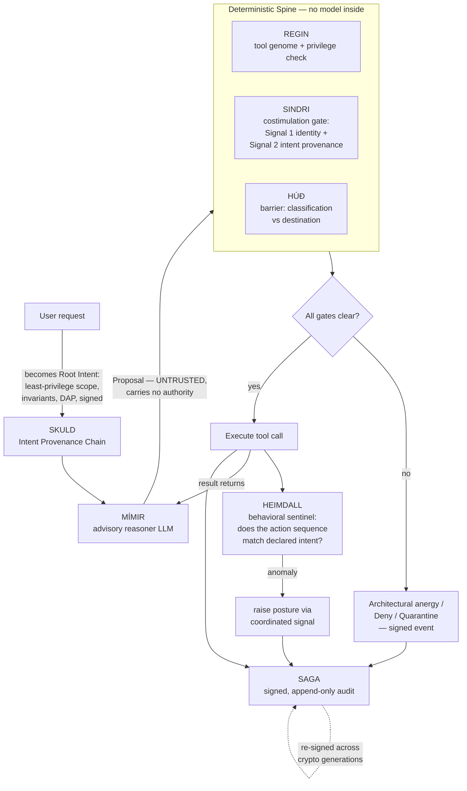

# BROKKR — Technical Architecture

## The Governed Autonomous Coding Agent

**Document ID:** BROKKR-ARCH-2026-001
**Component:** BROKKR — a Rust-native autonomous coding agent governed end-to-end by OQGF-1.0
**Binds to:** OQGF-1.0 (five organs), the Physiology Layer (OQGF-P-1 through OQGF-P-9), and Amendments AMD-001 through AMD-007 in full
**Author:** Jeremy Rose, CEO — Odin's LLC, Wasilla, Alaska
**Date:** 13 July 2026
**Status:** Architecture specification for the Odin's engineering team; input to the BROKKR build (Claude Code)
**Normative dependencies:** OQGF-M (Organ 3) and AMD-001 (costimulation) — load-bearing; OQGF-I (Organ 2) and AMD-007 (Barrier); OQGF-G (Organ 1); OQGF-A (Organ 5); OQGF-P-2 (non-suppressible gate), OQGF-P-9 (accountable risk acceptance)

---

## 1. Purpose and scope

### 1.1 What BROKKR is

BROKKR is an autonomous coding agent, written in Rust, whose every action is governed by a deterministic control spine derived from OQGF-1.0. It reads a codebase, reasons about a task, and edits files, runs commands, and calls tools to complete that task — structurally comparable to existing agentic coding harnesses, with one difference that defines the whole design: **no action BROKKR takes reaches the real world without first passing a deterministic gate that the reasoning model cannot influence, suppress, or talk its way past.**

This document specifies the architecture that makes that claim true. It is the technical architecture only. The companion documents in the BROKKR set — the `CLAUDE.md` build rules, the OQGF Governance Binding, and the operator dashboard architecture — are deferred and referenced here where relevant.

### 1.2 What BROKKR is not, stated plainly

BROKKR does not contain a reasoning engine of its own, and this specification does not claim to build one. Like every current agentic coding tool, BROKKR is a **harness**: a body that manages context, dispatches tool calls, and asks a frontier reasoning model — reached over an API — what to do next. The reasoning lives in the model, not in BROKKR. What Odin's builds and owns is the harness and the governance around it; the reasoning is rented and swappable.

This has three consequences that shape the architecture:

- **The reasoner is a dependency, not a component.** It sits behind a stable Rust trait and can be replaced with any capable model without touching the governance spine. "Improving BROKKR's reasoning over time" means adopting each new model as it ships and improving the harness and the governance — not training a model in-house.
- **The reasoner is untrusted by construction.** Its outputs are proposals, not commands. A proposal carries no authority. This is not a hedge against a weak model; it is the correct posture toward *any* model, however capable, because a model can be manipulated through its context (prompt injection, poisoned files, adversarial tool output), and a manipulated brain must not be able to act outside the authority it was granted.
- **Model-agnosticism is the reasoning analog of cryptographic agility.** OQGF-G-5 forbids hard-coding a cryptographic algorithm; BROKKR forbids hard-coding a reasoning model. The model identifier is negotiated at configuration time, never compiled into the trust path.

### 1.3 The question this document resolves

BROKKR binds to the **full framework** — the five organs, the Physiology Layer, and all seven amendments — not to the five organs alone. This is a deliberate architectural decision, not an omission of scope. The five organs establish anatomy; an autonomous agent that executes tool calls is defined more by two of the amendments than by any single organ:

- **AMD-001 (Costimulation / Intent Provenance)** is the single most important requirement for BROKKR. An agent decomposes one authorized request into many tool calls across many reasoning hops. Identity alone (an agent proving it is BROKKR) does not prove that a given tool call is a faithful derivation of what the user authorized. AMD-001 is the mechanism that closes exactly this gap.
- **AMD-007 (the Barrier)** governs the substance a coding agent moves: source code, secrets, proprietary data crossing between the repository it works in and any destination outside it. Nothing in the five organs governs data content at the boundary; AMD-007 does.

The five organs alone leave precisely the two holes an agent is most exposed through. BROKKR therefore binds to the framework in full.

---

## 2. The governing principle: the reasoner is never in the trust path

Every design choice below follows from one principle, carried directly from the Odin's engineering doctrine:

> **The model proposes; the deterministic spine disposes. The reasoning model is never in the trust path for any decision to block, permit, raise, or lower posture.**

Two kinds of governance are possible for an agent, and only one of them is structural.

**Behavioral governance** tells the model how to behave — rules written in natural language in a system prompt or a `CLAUDE.md` file, which the model is asked to follow. This is useful and BROKKR uses it, but it is advisory: a sufficiently manipulated or mistaken model can violate a behavioral rule, because the rule and the actor are the same system. A prompt cannot enforce itself.

**Structural governance** places a deterministic gate between the model's output and any real-world effect, such that violating the rule is not a behavior the model can choose — it is an operation the system refuses to perform. The rule and the enforcer are different systems, and the enforcer contains no model.

BROKKR's contribution is to make the governance of a coding agent **structural** rather than behavioral. Every path from a model output to a file written, a command run, or a byte sent over the network passes through a Rust gate that (a) contains no language model, (b) decides on cryptographic and policy evidence alone, and (c) cannot be addressed, persuaded, or bypassed by the model whose action it is gating. The model can propose anything; it can cause nothing that the spine does not independently authorize.

---

## 3. Architectural rationale

### 3.1 Why a Rust harness can enforce what a prompt cannot

The gate is code, not instruction. A costimulation check written in Rust (Section 6.4) evaluates a cryptographic chain and returns `Granted` or `Anergy`; there is no natural-language channel through which a model can argue with a boolean. The type system carries the safety properties: an `Anergy` value has no method that turns it into an authorization, a `Deny` verdict has no method that turns it into an `Allow`, and a `ToleranceGrant` cannot be constructed against a deterministic gate. These are the same structural encodings the OQGF reference implementation already uses (AMD-002 §5.1, AMD-007 §5.1); BROKKR inherits them and applies them to the agentic loop.

### 3.2 Why Rust specifically

The OQGF Part C rationale applies without modification and is not restated in full. In brief: memory safety where cryptography and untrusted input meet; predictable latency on the gate's hot path with no garbage-collection pauses; a type system strong enough to make "wrong algorithm" and "unauthorized action" compile-time or construction-time errors; and a `no_std` subset for the core governance types so the same code can run in constrained deployment surfaces. The production-code discipline from OQGF Part C — no `panic!`, `unwrap`, or `expect` in production paths, enforced by `clippy` lints set to `deny` — is a hard requirement for BROKKR, because a gate that panics is a gate that fails open under the wrong conditions.

---

## 4. System topology

BROKKR is composed of one external dependency (the reasoner) and a set of Rust subsystems, each named for its function and each mapped to the OQGF requirements it satisfies. The named subsystems mirror the pattern established by GARM and TÝR.

| Subsystem | Role | Governs / satisfies |
|---|---|---|
| **MÍMIR** | The advisory reasoner (frontier LLM behind a trait). Proposes; never acts. Outside the trust path. | Model-agnostic reasoning; the untrusted proposal source |
| **REGIN** | The Tool Genome. Signed, versioned registry of every tool BROKKR may invoke, each with a privilege class. | Organ 1 (OQGF-G); Self Set (OQGF-P-3) |
| **SKULD** | The Intent Provenance Chain. Carries the user's Root Intent through every reasoning hop; enforces attenuation and invariants. | AMD-001 (OQGF-M-8 … M-14) |
| **SINDRI** | The Costimulation Gate — the deterministic spine. Every tool call passes it: Signal 1 + Signal 2, or architectural anergy. | Organ 3 (OQGF-M-11); OQGF-P-2 |
| **HÚÐ** | The Barrier. Data-custody control on file and network crossings between governed and ungoverned compartments. | AMD-007 (OQGF-I-8 … I-15) |
| **HEIMDALL** | The Sentinel. Watches the sequence of executed actions for anomaly; cross-hop behavioral reconciliation. | Organ 2 (OQGF-I-6); OQGF-M-12 |
| **SAGA** | The Audit Spine. Signed, append-only record of every proposal, gate decision, and action; re-signed across crypto generations. | Organ 5 (OQGF-A) |

Naming glosses, for the record: **MÍMIR** — the counselor whose head gives Odin wisdom but has no hands; it speaks, it does not act. **REGIN** — Old Norse *regin*, "the powers"; the registry of the powers BROKKR may wield, and also the smith of the Völsung legend. **SKULD** — the Norn of *that which shall be* and of obligation; the intent chain is what an action *shall* be, bound to what was owed by its authorization. (GARM's memory organ takes the past-Norn Urðr; BROKKR's intent chain takes the future-Norn Skuld — parallel, distinct.) **SINDRI** — the master smith who directs each strike at the forge; the gate that permits or refuses each action. **HÚÐ** — Old Norse for *hide/skin*; the selective epithelial barrier the AMD-007 analogy names directly. **HEIMDALL** — the watchman who sees to the edge of the world and hears the grass grow. **SAGA** — *what is recorded and told*.

### 4.1 The governed action cycle



The load-bearing observation about this diagram: **MÍMIR feeds the spine but is never inside the decision.** Its only output is a proposal on the left; every box that decides — REGIN, SINDRI, HÚÐ, HEIMDALL — contains no model and cannot be reached by one. The result of an executed action returns to MÍMIR to inform the next reasoning step, and the intent chain in SKULD attenuates as the task decomposes into sub-tasks.

---

## 5. The governed action cycle, step by step

1. **The request becomes a Root Intent.** A user (or an authenticated upstream principal) issues a task. BROKKR does not hand this to the model as free text with implied authority. It constructs a **Root Intent** (SKULD): a least-privilege scope (OQGF-M-13), an invariant set (OQGF-M-10) — for example `no network egress`, `read-only outside ./src`, `no secret material in committed output` — a freshness nonce and expiry (OQGF-M-14), the accountable natural person (DAP, OQGF-A-5), and a signature. This is the sole source of authority for everything that follows.

2. **MÍMIR proposes.** The reasoner receives the current context and the *current attenuated intent scope* — not the raw Root Intent, and never more authority than the present hop holds. It returns a `Proposal`: one concrete action (write this file, run this command, fetch this URL) plus an advisory rationale. The proposal is untrusted input to the spine.

3. **REGIN checks the genome.** The proposed tool must be a declared, signed member of the Tool Genome, and the calling hop must hold the tool's required privilege class. A tool not in the genome does not exist as far as BROKKR is concerned. A privileged tool proposed by a hop that lacks the privilege is refused here.

4. **SINDRI runs the costimulation gate.** This is the deterministic spine and the load-bearing gate. It requires **both** signals (OQGF-M-11): Signal 1, BROKKR's own attestation for this hop (OQGF-M-1); and Signal 2, a valid Intent Provenance Chain (OQGF-M-8) tracing this action back to the Root Intent. It walks the chain, verifies each link's hash and signature, confirms `emitted_intent ⊆ received_intent` at every hop (monotonic attenuation, OQGF-M-9), confirms the action lies within the current scope, and evaluates the action against the accumulated invariant set. If any check fails, the action is placed in **architectural anergy**: denied, a signed denial emitted to HEIMDALL, recorded in SAGA. Identity alone never suffices.

5. **HÚÐ governs the crossing, when there is one.** If the action moves data across a controlled boundary — reading a file that carries a classification and writing its content to a network destination, staging content into a commit that will leave the governed compartment, or bringing fetched content of unknown origin into the working tree — the Barrier evaluates it. Declared classification against an unauthorized destination is a **deterministic Deny** (OQGF-I-10), non-suppressible. Unprovenanced ingress into a privileged context (a training corpus, a model registry, or here, source that will be treated as authoritative) is **quarantined** (OQGF-I-11) until provenance is established. Every crossing carries or is matched to a signed Boundary Custody Record (OQGF-I-9).

6. **The action executes only if all gates clear.** There is no other path to execution. The executed action is an `AuthorizedAction` — a type that can only be produced by the spine, never constructed directly.

7. **HEIMDALL reconciles behavior.** The sentinel compares the *sequence* of executed actions against the declared intent at each hop and against the Root Intent invariants (OQGF-M-12). A single authorized action can be benign while a pattern of them drifts from what was authorized; deviation raises posture through a coordinated signal (OQGF-P-7) into the graded-response path (OQGF-I-6).

8. **SAGA records everything.** Every proposal (including refused ones), every gate decision, every executed action, the DAP, and the intent chain state are written to a signed, append-only audit trail (Organ 5). Records are never deleted or overwritten; corrections are annotations. Audit signatures are re-signed under the prevailing cryptographic generation on schedule (OQGF-A-6).

9. **The loop continues.** The result returns to MÍMIR. As the model spawns sub-tasks, SKULD appends chain entries that can only narrow authority. The cycle repeats until the task completes or the intent expires.

---

## 6. Per-subsystem architecture

The core governance types are those already defined in `oqgf-core` by the amendments (`ResponseClass`, `IntentProvenanceChain`, `CostimulationGate`, `ToleranceController`, `BarrierVerdict`, `Signal`, and their supporting types). Per the decoupling decision in Section 8, BROKKR carries its own implementation of these types in `brokkr-core` rather than sharing a crate with ETERNAL WAR / FORSETI. The types below extend that base with the agent-specific surfaces.

### 6.1 MÍMIR — the advisory reasoner

MÍMIR is a trait, not a component Odin's builds. Its whole purpose is to keep the reasoning model swappable and outside the trust path.

```rust
/// A proposed action emitted by the advisory reasoner.
/// UNTRUSTED input to the deterministic spine. Carries no authority.
pub struct Proposal {
    pub action: Action,        // what the model wants to do
    pub rationale: String,     // the model's stated reason — advisory only
    pub hop: HopId,            // which reasoning hop produced it
}

/// The advisory reasoner: any capable frontier model behind a stable trait.
/// Model-agnostic by construction — the reasoning analog of crypto-agility.
/// MÍMIR proposes; the trust path never consults it.
pub trait Reasoner: Send + Sync {
    fn propose(
        &self,
        ctx: &Context,
        scope: &IntentScope,   // the CURRENT attenuated scope, never the raw Root Intent
    ) -> Result<Proposal, ReasonerError>;
}
```

Two rules bind every `Reasoner` implementation: the model is passed only the current attenuated scope, never more authority than the present hop holds; and the model receives no channel — none — to any gate's decision. There is no tool named "override," no invariant the model may edit, no path by which a rationale changes a boolean.

### 6.2 REGIN — the Tool Genome

REGIN is what BROKKR is *made of*, in the Genetic-Layer sense (OQGF-G), and simultaneously the declared known-good baseline against which tools are screened (the Self Set, OQGF-P-3).

```rust
/// The signed, versioned declaration of every tool BROKKR may invoke.
/// Genetic-Layer genome (OQGF-G) and Self Set (OQGF-P-3) for the agent.
pub struct ToolGenome {
    pub version: GenomeVersion,
    pub entries: Vec<ToolEntry>,
    pub corpus_digest: Digest,     // pinned; what the agent is made of
    pub owner: Dap,
    pub signature: DualSignature,  // ML-DSA (+ SLH-DSA at High-Assurance)
}

pub struct ToolEntry {
    pub id: ToolId,
    pub schema: ToolSchema,            // typed inputs and outputs
    pub privilege: PrivilegeClass,     // Unprivileged | Privileged | SelfModifying
    pub response_class: ResponseClass, // gates on this tool are Deterministic
}

pub enum PrivilegeClass {
    /// Read-only within the working tree, no side effects outside it.
    Unprivileged,
    /// File writes, shell execution, network — requires costimulation.
    Privileged,
    /// Actions that modify BROKKR's own governance (genome, invariants,
    /// gate config). Costimulated AND requires explicit DAP confirmation.
    /// The governor governs itself; there is no god-mode carve-out.
    SelfModifying,
}
```

### 6.3 SKULD — the Intent Provenance Chain

SKULD implements AMD-001 directly. The types are the amendment's (`RootIntent`, `IntentChainEntry`, `IntentProvenanceChain`); BROKKR's contribution is to maintain the chain across the reasoning loop — appending an entry at every hop, always narrowing.

```rust
/// Appends a hop to the chain. The emitted scope MUST be a subset of the
/// received scope (OQGF-M-9). Broadening is not an error to report — it is
/// an operation this method cannot perform; the return type has no widening path.
pub trait IntentChain: Send + Sync {
    fn attenuate(
        &self,
        current: &IntentProvenanceChain,
        hop: &Attestation,          // Signal 1 for the new hop
        emitted: IntentScope,       // checked ⊆ received at construction
        added_caveats: Vec<Caveat>,
        added_invariants: InvariantSet,
    ) -> Result<IntentProvenanceChain, AttenuationError>; // Err(WouldBroaden)
}
```

When a hop genuinely needs authority broader than it holds, it cannot self-broaden; it must surface a request for a new Root Intent to the DAP (OQGF-M-9). In BROKKR this is a visible, human-gated event, not a silent escalation.

### 6.4 SINDRI — the Costimulation Gate

SINDRI is the deterministic spine. It is the `CostimulationGate` of AMD-001, hardened by the non-suppressibility of OQGF-P-2.

```rust
/// Every privileged tool call passes here. Grants only if BOTH Signal 1
/// (identity) and Signal 2 (a valid Intent Provenance Chain) verify AND the
/// action lies within the attenuated scope AND violates no invariant.
/// Otherwise: Anergy. Contains no model and exposes no channel to one.
pub trait CostimulationGate: Send + Sync {
    fn authorize(
        &self,
        identity: &Attestation,          // Signal 1 (OQGF-M-1)
        chain: &IntentProvenanceChain,   // Signal 2 (OQGF-M-8)
        action: &Action,
    ) -> AuthorizationDecision;          // Granted(AuthorizedAction) | Anergy { reason, event }
}

/// Produced ONLY by a successful SINDRI authorization. There is no public
/// constructor. An action cannot be executed without one of these, and one of
/// these cannot exist without having passed the gate.
pub struct AuthorizedAction { /* private fields */ }
```

The `AuthorizedAction` type is the structural heart of BROKKR: the executor accepts nothing else, and only SINDRI can mint one. This is what makes "no ungoverned action" a property of the type system rather than a hope about control flow.

The verification algorithm is AMD-001 §5.3 unchanged: verify identity; verify the Root Intent signature and freshness; walk the chain verifying each hash link, HMAC, and signature and confirming subset attenuation; confirm the action is in the current scope; evaluate against the accumulated invariants; grant or return anergy with a signed event to HEIMDALL and a record in SAGA.

### 6.5 HÚÐ — the Barrier

HÚÐ implements AMD-007 for the file and network surfaces a coding agent touches. It is the enforcement counterpart to HEIMDALL's detection: HEIMDALL observes what crosses, HÚÐ decides whether it may.

```rust
pub enum BarrierVerdict {
    Allow,
    /// Deterministic, non-suppressible (OQGF-I-10, inheriting OQGF-P-2).
    /// The only sanctioned way past is an AMD-006 AcceptedRisk that keeps the
    /// finding visible — never suppression.
    Deny { finding: BarrierFinding },
    /// Unprovenanced ingress into a privileged context (OQGF-I-11).
    Quarantine { datum: DatumRef },
    /// A DAP has recorded a scoped, expiring, signed decision to proceed past a
    /// still-visible Deny (AMD-006 / OQGF-P-9). Distinct from Allow by construction.
    AcceptedRisk { entry: RiskAcceptanceId },
}

pub trait Barrier: Send + Sync {
    fn evaluate(&self, flow: &BoundaryFlow) -> BarrierVerdict;
}
```

There is deliberately no method that converts a `Deny` into an `Allow`. The egress classification gate is a deterministic gate; a model cannot suppress it, and neither can an operator by ordinary configuration. The single sanctioned path past it is an Accountable Risk Acceptance (Section 7), which keeps the finding fully visible and attaches a named DAP to the decision.

### 6.6 HEIMDALL — the Sentinel

HEIMDALL is Organ 2's heuristic layer for the agent (OQGF-I-6) plus cross-hop behavioral reconciliation (OQGF-M-12). It is the *trained*, tolerable layer — and therefore the layer to which self-tolerance applies (AMD-002). Its detectors are screened against REGIN's baseline before deployment (central tolerance, OQGF-P-3); confirmed false positives are suppressed only by signed, scoped, expiring Tolerance Grants (peripheral tolerance, OQGF-P-4). Crucially, HEIMDALL is heuristic and suppressible; SINDRI and HÚÐ's deterministic gates are neither. Tolerance reduces false alarms on HEIMDALL; it never opens a hole in SINDRI or HÚÐ (OQGF-P-2).

### 6.7 SAGA — the Audit Spine

SAGA is Organ 5 (OQGF-A). Every proposal, decision, and action is recorded, dual-PQC-signed (OQGF-A-3), DAP-attributed (OQGF-A-5), and append-only. Records are never deleted or overwritten — corrections are strikethrough annotations pointing to the correcting entry, per the standing Odin's convention. Signatures are re-signed under the prevailing cryptographic generation on a schedule not exceeding five years (OQGF-A-6). A read-only signed export is available for lawful review (OQGF-A-7).

---

## 7. The governor is itself governed

BROKKR is a governance product; it must not exempt itself from governance. Any action that would modify BROKKR's own control surface — editing the Tool Genome, altering an invariant set, changing gate configuration, adjusting a classification policy — is a `SelfModifying` privilege-class action. It is costimulated like any other privileged action **and** requires explicit DAP confirmation (OQGF-M-13, cross-organ human oversight A.6.3). There is no privileged path that BROKKR can grant to itself, no invariant it can quietly relax, and no god-mode. This carries the Odin's doctrine — *the governor is itself governed; no product gets a carve-out* — into the agent's construction.

One corollary constrains the whole design: **any automated proposal may only add or tighten a constraint, never relax one.** MÍMIR can propose adding an invariant; it cannot propose removing one. The model proposes; the DAP ratifies; and even a ratified change may only narrow, per the standing hard guardrail.

---

## 8. Crate and workspace layout

BROKKR is a single Cargo workspace, fully decoupled from ETERNAL WAR / FORSETI. The governance types are re-implemented in `brokkr-core` rather than shared through a common `oqgf-core` crate — a deliberate decision to keep BROKKR independently buildable and releasable, accepting the duplication of the governance types as the cost of that independence.

```
brokkr/
├── brokkr-core/        # Re-implemented OQGF governance types + agent types.
│                       #   ResponseClass, IntentProvenanceChain, CostimulationGate,
│                       #   ToleranceController, BarrierVerdict, Signal, AuthorizedAction,
│                       #   Proposal, ToolGenome, Reasoner trait. no_std + alloc where feasible.
├── brokkr-crypto/      # wolfCrypt (wolfSSL) FFI: ML-DSA, SLH-DSA, HMAC-SHA-384, AES-256.
│                       #   The sole crypto backend. FFI honesty rule (Section 10) applies.
├── brokkr-reasoner/    # MÍMIR: model backend adapters (swappable), context management.
├── brokkr-genome/      # REGIN: tool registry, signing, privilege classes, Self-Set screening.
├── brokkr-intent/      # SKULD: IPC construction, monotonic attenuation, invariant enforcement.
├── brokkr-gate/        # SINDRI: the costimulation gate; the deterministic spine dispatcher.
├── brokkr-barrier/     # HÚÐ: classification, egress deny, ingress quarantine, custody records.
├── brokkr-sentinel/    # HEIMDALL: behavioral anomaly, cross-hop reconciliation, tolerance.
├── brokkr-audit/       # SAGA: signed append-only audit, re-signing scheduler, signed export.
├── brokkr-tools/       # The tool implementations (file read/write, shell, fetch), behind REGIN.
└── brokkr-cli/         # The binary: the orchestrator loop wiring MÍMIR → spine → tools → SAGA.
```

The dependency direction is strict and one-way: `brokkr-tools` and `brokkr-cli` depend on the governance crates; the governance crates never depend on the tool or reasoner crates. The spine cannot be made to depend on the thing it governs.

---

## 9. Cross-cutting concerns

**Cryptographic backend.** wolfCrypt is the sole backend, consistent with FORSETI, GLEIPNIR, and TÝR. Classical FIPS 140-3 certificates are active; the PQC module validation is in CMVP submission, so BROKKR's posture is stated as *CNSA-2.0-aligned; FIPS module validation pending* rather than as a completed claim. Cryptographic agility (OQGF-G-5) is designed in: no algorithm identifier is hard-coded; signature and KEM selection go through a negotiation layer.

**FFI honesty rule.** wolfCrypt is a general-purpose C library reached over FFI. BROKKR does not assert a specific algorithm identity the manifest cannot confirm; where identity cannot be proven from the manifest, it is emitted as *quantum-vulnerable, algorithm unspecified* — still gate-blocking, never a fabricated identity. This carries the standing FFI honesty rule into BROKKR.

**Model-agnosticism.** The reasoning model is configuration, negotiated at startup, never compiled into the trust path. Adopting a new model is a configuration change to `brokkr-reasoner`, touching no governance crate.

**Production discipline.** No `panic!`, `unwrap`, or `expect` in production paths (`clippy::unwrap_used`, `clippy::expect_used` set to `deny`). `thiserror` in libraries, `anyhow` in the binary. `tracing` throughout; audit-relevant logs are themselves signed before export.

**Supply chain.** `cargo-audit`, `cargo-deny`, `cargo-cyclonedx` (per-crate SBOM), `cargo-vet` for high-risk imports, reproducible builds with `--locked` and a pinned `rust-toolchain.toml`, per OQGF Part C §5. A `THREAT_MODEL.md` ships per crate.

---

## 10. Threat model (agent-specific)

The value of the architecture is what it closes structurally. Each threat below is stated with the mechanism that closes it, and the honest residual follows in Section 11.

- **Prompt injection / poisoned context.** A file, a tool result, or a crafted instruction manipulates MÍMIR into proposing a malicious action. *Closed structurally:* the proposal is untrusted; SINDRI enforces intent provenance, so a malicious action either fails to trace to the Root Intent or violates an invariant, and is driven into anergy. A compromised brain cannot act outside the granted, attenuated intent — which is the entire reason the model is kept out of the trust path.
- **Intent broadening across reasoning hops.** A hop attempts to widen scope as the task decomposes. *Closed structurally:* monotonic attenuation (OQGF-M-9) makes broadening an operation the chain type cannot perform, not merely one it detects.
- **Data exfiltration (secret in repo → network).** The agent is induced to send sensitive file content to an external destination. *Closed structurally:* HÚÐ's egress classification gate is a deterministic, non-suppressible Deny (OQGF-I-10).
- **Data poisoning (fetched content treated as authoritative).** Content of unknown origin is pulled in and written into the tree or acted on as trusted. *Closed structurally:* HÚÐ quarantines unprovenanced ingress into privileged contexts (OQGF-I-11).
- **Self-modification / privilege escalation.** The agent edits its own genome, invariants, or gate config to grant itself capability. *Closed structurally:* such actions are `SelfModifying`, costimulated and DAP-gated, with no carve-out (Section 7).
- **Gate suppression by the model.** The model argues, instructs, or tricks its way past a gate. *Closed structurally:* MÍMIR has no channel to any gate's decision; OQGF-P-2 makes deterministic gates non-suppressible; the only path past a Deny is a DAP-signed Accountable Risk Acceptance that keeps the finding visible (OQGF-P-9), never the model's say-so.

---

## 11. What this closes, and what it does not

This architecture **closes**, structurally:

- Ungoverned action — no `AuthorizedAction` exists without having passed SINDRI, and the executor accepts nothing else.
- Model-in-the-trust-path — the reasoner proposes only; every deciding component contains no model and exposes no channel to one.
- Intent broadening, identity-only authorization, and untraceable intent drift — via AMD-001 (attenuation, costimulation, provenance chain, reconciliation).
- Ungoverned data egress and unprovenanced ingress — via AMD-007 (deterministic egress Deny, ingress quarantine).
- Self-exemption of the governor — via the `SelfModifying` class and DAP gating.
- Silent suppression of a finding — the only path past a deterministic gate keeps the finding visible and named (AMD-006).

This architecture **does not** fully close, and states so honestly — each residual has the same shape as a named residual in the amendments it inherits:

- **In-scope semantic reframing.** If a Root Intent is scoped too broadly, a manipulated model can do harm that remains technically within scope. No cryptographic construction fixes authority over-granted at the root. Mitigation is least-privilege Root scoping (OQGF-M-13) and human review for high-consequence actions (A.6.3). This is the AMD-001 residual, unchanged.
- **Covert-channel exfiltration.** A determined adversary can encode sensitive data to evade content inspection — steganography, paraphrase, or drip exfiltration in sub-threshold fragments. HÚÐ's content sentinel reduces this but cannot eliminate it; it is a fundamental limit of inspecting content rather than proving custody (AMD-007 residual).
- **Classification and Self-Set accuracy.** The deterministic gates enforce on correctly labeled data and a correct genome baseline. A mislabeled secret or a mislabeled tool creates a hole in the heuristic layer — but never in a deterministic gate, and never a path to suppress one (the AMD-002 Self-Set residual, bounded by OQGF-P-2).
- **Upstream provenance truth.** BROKKR verifies a custody record's signature but cannot verify the truth of what an upstream signer attested. Signature verification proves who attested, not that the attestation is true (the AMD-007 upstream-signer residual).
- **The reasoner's competence.** BROKKR governs what the model may *do*, not how well it *reasons*. A capable model that proposes a correct-but-suboptimal solution within authorized scope will be permitted to execute it; quality of reasoning is a property of MÍMIR, improved by adopting better models, not a property the spine can enforce.

The framework reduces the attack surface to exactly these named residuals rather than claiming their elimination.

---

## 12. Traceability

| OQGF requirement | BROKKR implementation hook |
|---|---|
| OQGF-G (genome, signing, agility) | `brokkr-genome::ToolGenome`; `brokkr-crypto` negotiation layer |
| OQGF-G-4 (non-bypassable gate) | `AuthorizedAction` minted only by `brokkr-gate::CostimulationGate` |
| OQGF-M-1 (attestation, Signal 1) | `Attestation` per hop, verified in `SINDRI` |
| OQGF-M-8 … M-14 (AMD-001) | `brokkr-intent` (SKULD): IPC, attenuation, invariants, freshness |
| OQGF-M-11 (costimulation) | `brokkr-gate::CostimulationGate::authorize` → `Granted` \| `Anergy` |
| OQGF-M-12 (behavioral reconciliation) | `brokkr-sentinel` (HEIMDALL) cross-hop reconciliation |
| OQGF-I-6 (graded response) | `brokkr-sentinel` posture raise via coordinated signal |
| OQGF-I-8 … I-15 (AMD-007 Barrier) | `brokkr-barrier` (HÚÐ): egress Deny, ingress Quarantine, custody records |
| OQGF-A (accountability) | `brokkr-audit` (SAGA): signed append-only, re-signing, signed export |
| OQGF-P-2 (non-suppressible gate) | `Deny` has no `→ Allow`; `ToleranceGrant` refused on `Deterministic` |
| OQGF-P-3 / P-4 (tolerance) | HEIMDALL detectors screened against REGIN; scoped, expiring grants |
| OQGF-P-7 (coordinated signaling) | `Signal` emission across subsystems, no central controller |
| OQGF-P-9 (AMD-006 risk acceptance) | `BarrierVerdict::AcceptedRisk`; finding stays visible, DAP-signed |

---

## 13. Change log

v1.0 — Initial architecture specification, 13 July 2026. Defines BROKKR as a Rust-native autonomous coding agent governed end-to-end by OQGF-1.0, binding to the full framework (five organs, Physiology Layer, AMD-001 through AMD-007) rather than the five organs alone, on the ground that AMD-001 (costimulation) and AMD-007 (Barrier) are the load-bearing requirements for an agent that executes tool calls. Establishes the governing principle that the reasoning model is never in the trust path: MÍMIR proposes, the deterministic spine disposes. Specifies seven subsystems — MÍMIR (advisory reasoner, swappable, untrusted), REGIN (tool genome), SKULD (intent provenance chain), SINDRI (costimulation gate / deterministic spine), HÚÐ (barrier / data custody), HEIMDALL (behavioral sentinel), SAGA (audit spine) — and the governed action cycle binding them. Encodes the safety properties structurally through the `AuthorizedAction` type (mintable only by the gate) and the non-widening `BarrierVerdict` and attenuation types, in the spirit of OQGF-P-2. Decouples BROKKR fully from ETERNAL WAR / FORSETI, re-implementing the governance types in `brokkr-core` rather than sharing `oqgf-core`. Carries the standing Odin's doctrine into the agent: the governor is itself governed, automated proposals may only tighten never relax, and the FFI honesty rule applies to the wolfCrypt backend. Five residuals named rather than claimed eliminated, each mapped to the shape of a prior amendment's residual. Companion documents — `CLAUDE.md` build rules, OQGF Governance Binding, dashboard architecture — deferred.

— End of BROKKR technical architecture.
