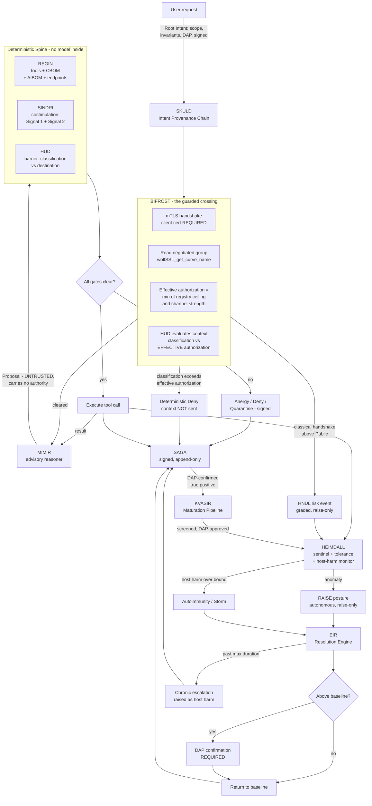
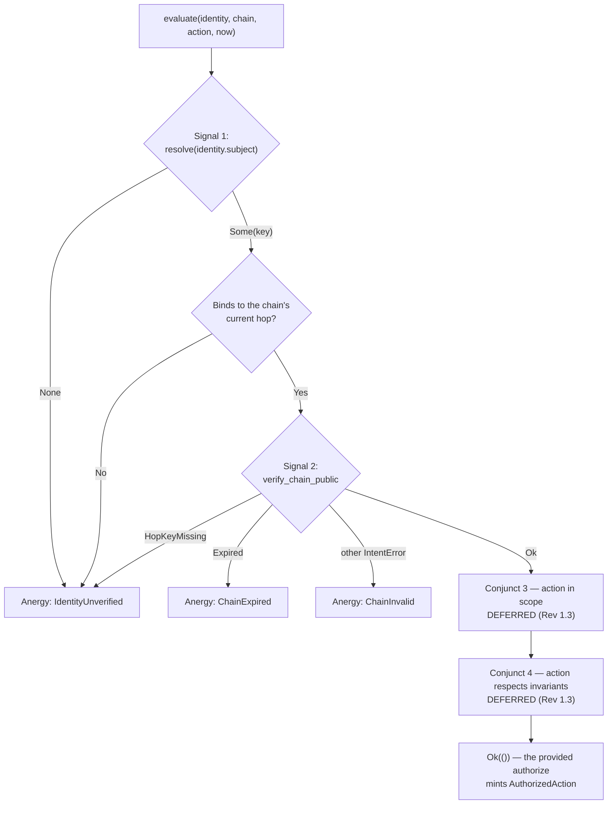

# BROKKR — Technical Architecture

## The Governed Autonomous Coding Agent

**Document ID:** BROKKR-ARCH-2026-001
**Revision:** 1.10
**Supersedes:** Rev 1.9 (commit `4b8e17c`), Rev 1.8 (commit `e4d38a6`), Rev 1.7 (commit `59476ec`), Rev 1.6 (commit `22e9360`), Rev 1.5 (commit `0b7d7f4`), Rev 1.4 (commit `4c1e44c`), Rev 1.3 (commit `612f4b5`), Rev 1.2 (commit `99b6c62`), Rev 1.1 (commit `4a94fad`), and Rev 1.0 (commit `0ed1849`). All preserved immutably in git. Superseded, not deleted. See §15.
**Component:** BROKKR — a Rust-native autonomous coding agent governed end-to-end by OQGF-1.0
**Binds to:** OQGF-1.0 (five organs), the Physiology Layer (OQGF-P-1 … P-11), and Amendments AMD-001 … AMD-009 in full
**Declared conformance level:** **Enhanced (OQGF-E)**, architected toward High-Assurance (OQGF-H). See §1.4.
**Author:** Jeremy Rose, CEO — Odin's LLC, Wasilla, Alaska
**Date:** 6 August 2026 (Rev 1.10)
**Status:** Architecture specification for the Odin's engineering team; input to the BROKKR build (Claude Code)
**Disposes:** GAP-2026-08-06-001 (Phase 7 buildability check — Rev 1.9 defined the chain-linkage digest two mutually exclusive ways). Rev 1.9 placed the Phase-7 audit surface and itemizes Organ 5's traceability, which a blanket row had been concealing. Rev 1.8 disposed GAP-2026-07-30-001 (Phase 6 buildability check — a barrier finding had no identity an acceptance could be scoped to). Rev 1.7 corrected a defect in Rev 1.6's egress rule (personal data classified Public crossed ungoverned) and places the AMD-009 Personal-Data Tag. Rev 1.6 placed the Phase-6 barrier surface. Rev 1.5 disposed GAP-2026-07-27-001 (Phase 5 surface check — promotion-gate predicate 5 referenced an uncommitted capability vocabulary). Rev 1.4 placed the Phase-5 REGIN surface and discharged the buildable half of RISK-2026-0004. Rev 1.3 disposed GAP-2026-07-24-001 and -002; Rev 1.2 disposed GAP-2026-07-14-001.

---

## 1. Purpose and scope

### 1.1 What BROKKR is

BROKKR is an autonomous coding agent, written in Rust, whose every action is governed by a deterministic control spine derived from OQGF-1.0. It reads a codebase, reasons about a task, and edits files, runs commands, and calls tools to complete that task — structurally comparable to existing agentic coding harnesses, with one difference that defines the whole design: **no action BROKKR takes reaches the real world without first passing a deterministic gate that the reasoning model cannot influence, suppress, or talk its way past.**

Rev 1.2 extends that sentence in the one direction Rev 1.1 left open. *No action* now includes **the act of asking the model.** A coding agent's largest and most continuous flow of data is not the file it writes — it is the context it ships to the reasoner, on every hop, containing whatever it has read. Rev 1.1 governed the tools and left that flow ungoverned. Rev 1.2 routes it through the same barrier as everything else.

### 1.2 What BROKKR is not, stated plainly

BROKKR does not contain a reasoning engine of its own, and this specification does not claim to build one. Like every current agentic coding tool, BROKKR is a **harness**: a body that manages context, dispatches tool calls, and asks a frontier reasoning model — reached over a network — what to do next. The reasoning lives in the model, not in BROKKR. What Odin's builds and owns is the harness and the governance around it; the reasoning is rented and swappable.

Three consequences shape the architecture:

- **The reasoner is a dependency, not a component.** It sits behind a stable Rust trait and can be replaced with any capable model without touching the governance spine. "Improving BROKKR's reasoning over time" means adopting each new model as it ships and improving the harness and the governance — not training a model in-house.
- **The reasoner is untrusted by construction.** Its outputs are proposals, not commands. A proposal carries no authority. This is not a hedge against a weak model; it is the correct posture toward *any* model, because a model can be manipulated through its context (prompt injection, poisoned files, adversarial tool output), and a manipulated brain must not be able to act outside the authority it was granted.
- **The reasoner is also a network destination** — and this is what Rev 1.1 missed. The model does not live inside BROKKR's trust boundary. Reaching it is a **crossing**, subject to the same custody rules as any other crossing (§6.6, §6.10).

### 1.3 Binding to the full framework

BROKKR binds to the **full framework** — the five organs, the Physiology Layer, and all seven amendments. The five organs establish anatomy; the amendments and the Physiology Layer establish what an autonomous agent must do that a static system need not.

- **AMD-001 (Costimulation / Intent Provenance)** is the single most important requirement for BROKKR. An agent decomposes one authorized request into many tool calls across many reasoning hops. Identity alone does not prove that a given tool call is a faithful derivation of what the user authorized. AMD-001 closes exactly this gap.
- **AMD-007 (the Barrier)** governs the substance a coding agent moves: source code, secrets, and proprietary data crossing between the repository and any destination outside it — **including the reasoner.**
- **The Physiology Layer** governs what happens after the gates fire. A defense with no bound on the harm it does to its own host is not a defense; a defense that can escalate but never de-escalate is a one-way ratchet; a defense that cannot learn repeats every mistake. AMD-002, AMD-005, and AMD-003 respectively, all load-bearing for an agent whose value is doing useful work under constraint.

### 1.4 Declared conformance level and applicability

**BROKKR targets Enhanced (OQGF-E), architected toward High-Assurance (OQGF-H).** Per OQGF-1.0 §A.0.6, a system shall not claim a level higher than its lowest-level organ; BROKKR claims Enhanced and forecloses nothing High-Assurance will later require.

What Enhanced binds:

| Requirement | Enhanced obligation on BROKKR |
|---|---|
| **OQGF-R-1** | **Dual PQC families (ML-DSA + SLH-DSA) for audit signatures.** SAGA is an audit spine. SLH-DSA is a hard prerequisite of Phase 2, not a High-Assurance deferral. |
| **OQGF-I-1, I-2, I-5** | **HNDL sentinel on BROKKR's own channel** (§6.10) |
| **OQGF-M-5** | **Mutual authentication on every connection; one-sided TLS does not satisfy** (§6.10) |
| **OQGF-M-6** | **Documented vendor trust score** per supplier, reviewed quarterly (§6.2) |
| **OQGF-G-7** | Key lifetime calculation documented per primitive (§6.11) |
| **OQGF-M-9, M-10, M-12, M-13** | Cryptographically enforced attenuation; invariants at every hop; cross-hop reconciliation; documented least-privilege Root Intent scoping |
| **OQGF-P-3, P-5** | Central-tolerance screening; autoimmunity and response-storm detection |
| **OQGF-P-6.5, P-6.6** | Reversible learned detectors; **no autonomous activation** — DAP approval required |
| **OQGF-P-7.3/.5/.6, P-8.4/.5/.6** | Decentralized signaling; cascade bounding; memory preserved on stand-down; DAP-confirmed de-escalation above baseline; chronic-escalation detection |
| **OQGF-P-9.4, P-9.5** | Risk-acceptance register distinct from the tolerance register; standing inventory of carried risks |
| **OQGF-I-11, I-12, I-14, I-15** | Ingress-provenance gating; screened content sentinel; enumerated Uncontrolled Channels; barrier-bypass detection |

**Requirements declared inapplicable, with justification.** OQGF §A.9.3 permits `n.a.` **with an evidence pointer**. Silently omitting a requirement is not the same as declaring it inapplicable — a distinction the Phase 0.5 conformance check enforced, and which found eight requirements falling through exactly that gap. Rev 1.2 disposes of all eight. The `n.a.` list is now:

| Requirement | Status | Justification |
|---|---|---|
| OQGF-I-3 (quantum cloud trust model) | n.a. | BROKKR consumes no quantum cloud provider |
| OQGF-M-3 (quantum hardware attestation) | n.a. | No quantum workload; no circuit, calibration, or sampling distribution to reconcile |
| OQGF-A-2 (quantum computation records) | n.a. | As above |
| OQGF-A-4 (quantum explanation artifacts) | n.a. | No variational or kernel quantum model in the decision path |
| OQGF-R-5 (cross-jurisdictional audit replication) | n.a. at Enhanced | High-Assurance requirement. **Deferred, not dismissed** — dated marker, revisited at the High-Assurance transition |
| OQGF-R-7 (quantum key distribution) | integration point only | Placeholder per the requirement's own terms; nothing depends on it |
| **OQGF-R-2 (no provider lock-in)** | **applicable, reinterpreted** | The cloud-lock-in analog for BROKKR is **model-provider lock-in.** Satisfied by the `Reasoner` trait and the AIBOM-declared endpoint registry (§6.1, §6.2). Lock-in to a single provider requires DAP risk acceptance. **R-2 is about substitutability; it does not absorb OQGF-M-6, which is about trustworthiness. The two are kept separate.** |
| **OQGF-A.6.1 (incident response)** | **split — see below** | Not `n.a.` |

**OQGF-A.6.1 is split, not declared inapplicable.** The incident-response *plan* — roles, timelines, annual tabletop exercises — is an organizational document Odin's maintains and is out of scope for this architecture. But A.6.1 names its **triggers**: HNDL detection, attestation failure, statistical reconciliation failure, audit-chain break. **Emitting those triggers is architectural**, and BROKKR SHALL emit them: HNDL detection from BIFRÖST (§6.10); attestation failure from SINDRI (§6.4); reconciliation failure from HEIMDALL (§6.7); audit-chain break from SAGA (§6.9). A flat `n.a.` on A.6.1 would have dropped the trigger obligation along with the paperwork. The requirement is recorded as *partially architectural*, with the architectural half specified (§11) and the organizational half assigned to Odin's operations.

**OQGF-R-6 is not a BROKKR disposition. It is a framework ambiguity, referred upward.** R-6's normative text is an **unqualified SHALL**: long-lived secrets — root signing keys, audit-signing keys — sharded via Shamir's Secret Sharing or threshold cryptography, quorum at least 3-of-5. But OQGF's own Organ 4 conformance table places threshold custody **only at High-Assurance**. An unqualified SHALL that the conformance table gates to one level is a contradiction in the framework, not a question about BROKKR, and this architecture does not resolve it by choosing whichever reading is convenient.

**Interim posture, which relaxes nothing:** BROKKR's long-lived signing keys — REGIN's genome key and SAGA's audit key — are **HSM-backed with dual-control issuance**, and their custody model is **declared in the CBOM** (§6.11). BROKKR does not claim 3-of-5 threshold custody at Enhanced, and does not claim R-6 satisfied. It is recorded **PARTIAL**, with the gap named, pending an OQGF amendment that resolves the tier ambiguity. Naming an unmet requirement is conformant. Quietly reading it down to a level where it disappears is not.

---

## 2. The governing principle: the reasoner is never in the trust path

> **The model proposes; the deterministic spine disposes. The reasoning model is never in the trust path for any decision to block, permit, raise, or lower posture.**

**Behavioral governance** tells the model how to behave — rules in a system prompt, asked to be followed. Useful, and BROKKR uses it, but advisory: a manipulated or mistaken model can violate a behavioral rule, because the rule and the actor are the same system. A prompt cannot enforce itself.

**Structural governance** places a deterministic gate between the model's output and any real-world effect, such that violating the rule is not a behavior the model can choose — it is an operation the system refuses to perform. The rule and the enforcer are different systems, and the enforcer contains no model.

BROKKR's contribution is to make the governance of a coding agent **structural** rather than behavioral. Every path from a model output to a file written, a command run, or a byte sent passes through a Rust gate that (a) contains no language model, (b) decides on cryptographic and policy evidence alone, and (c) cannot be addressed, persuaded, or bypassed by the model whose action it is gating.

Two corollaries, and Rev 1.2 exists because of the second.

**The principle is symmetric.** The spine must not be talked *past* — and it must not be allowed to strangle the work it exists to enable. A gate so tight that BROKKR denies most legitimate coding actions is not a safe agent; it is a useless one, and under OQGF-P-1 that failure has **equal standing** to a missed threat. §6.7 gives that failure a number, a bound, and an alarm.

**The principle is bidirectional.** Rev 1.1 governed everything flowing *out of* the model and nothing flowing *into* it. But the flow into the model is the larger one: the entire working context, on every hop, containing whatever BROKKR has read. **The gate must sit on both sides of the reasoner.** A barrier that inspects the agent's file writes while its source code streams out to a third party over an unexamined socket is not a barrier. It is a decoration. §6.10 closes it.

---

## 3. Architectural rationale

### 3.1 Why a Rust harness can enforce what a prompt cannot

The gate is code, not instruction. A costimulation check written in Rust (§6.4) evaluates a cryptographic chain and returns `Granted` or `Anergy`; there is no natural-language channel through which a model can argue with a boolean. The type system carries the safety properties: an `Anergy` value has no method that turns it into an authorization, a `Deny` verdict has no method that turns it into an `Allow`, and a `ToleranceGrant` cannot be constructed against a deterministic gate. These are the same structural encodings the OQGF reference implementation uses (AMD-002 §5.1, AMD-007 §5.1); BROKKR inherits them and applies them to the agentic loop.

### 3.2 Why Rust specifically

The OQGF Part C rationale applies without modification: memory safety where cryptography and untrusted input meet; predictable latency on the gate's hot path with no garbage-collection pauses; a type system strong enough to make "wrong algorithm" and "unauthorized action" construction-time errors; a `no_std` subset for the core governance types. The production discipline from OQGF Part C — no `panic!`, `unwrap`, or `expect` in production paths, enforced by `clippy` lints set to `deny` — is a hard requirement, because a gate that panics is a gate that fails open under the wrong conditions.

---

## 4. System topology

| Subsystem | Role | Governs / satisfies |
|---|---|---|
| **MÍMIR** | The advisory reasoner (frontier LLM behind a trait). Proposes; never acts. Outside the trust path. | Model-agnostic reasoning; the untrusted proposal source |
| **BIFRÖST** | **The guarded crossing to the reasoner.** mTLS-only, cipher-suite attested, HNDL-scored, HÚÐ-gated. Every context leaving for a model passes here. | **OQGF-I-1, I-2, I-5; OQGF-M-5** |
| **REGIN** | The Genome. Four signed registers: Tool Genome, CBOM, AIBOM, and the **Model Endpoint Registry** with M-6 trust scores. | Organ 1 (OQGF-G-1…G-9); **OQGF-M-6**; Self Set (OQGF-P-3) |
| **SKULD** | The Intent Provenance Chain. Carries the Root Intent through every hop; enforces attenuation and invariants. | AMD-001 (OQGF-M-8 … M-14) |
| **SINDRI** | The Costimulation Gate — the deterministic spine. Every tool call passes it: Signal 1 + Signal 2, or architectural anergy. | Organ 3 (OQGF-M-11); OQGF-P-2 |
| **HÚÐ** | The Barrier. Data-custody control on **every** crossing between governed and ungoverned compartments — files, tools, network, **and the reasoner**. | AMD-007 (OQGF-I-8 … I-15) |
| **HEIMDALL** | The Sentinel. Behavioral anomaly, cross-hop reconciliation, the tolerance controller, the host-harm monitor. **Guards BIFRÖST.** | Organ 2 (OQGF-I-6); OQGF-M-12; OQGF-P-1, P-3, P-4, P-5 |
| **EIR** | The Resolution Engine. The way down. Every escalation has a declared path back to baseline; de-escalation above baseline is DAP-confirmed. | AMD-005 (OQGF-P-8.1 … P-8.7) |
| **KVASIR** | The Maturation Pipeline. Learns refined detectors from DAP-confirmed incidents, under four poisoning gates. | AMD-003 (OQGF-P-6.1 … P-6.6) |
| **SAGA** | The Audit Spine. Signed, append-only record of every proposal, gate decision, and action; re-signed across crypto generations. | Organ 5 (OQGF-A) |

Naming glosses. **MÍMIR** — the counselor whose head gives Odin wisdom but has no hands; it speaks, it does not act. **BIFRÖST** — the one bridge between worlds, and **Heimdall's entire charge in the myths is to guard it.** That is not decoration: it encodes the actual relationship in the code, where HEIMDALL watches the crossing that BIFRÖST makes. Bifröst also burns at Ragnarök — the correct posture toward an external dependency is that it is expected to fail. **REGIN** — Old Norse *regin*, "the powers"; the register of what BROKKR is made of and what it may wield. **SKULD** — the Norn of *that which shall be* and of obligation. (GARM's memory organ takes the past-Norn Urðr; BROKKR's intent chain takes the future-Norn Skuld.) **SINDRI** — the master smith who directs each strike at the forge. **HÚÐ** — Old Norse *hide/skin*; the selective epithelial barrier the AMD-007 analogy names directly. **HEIMDALL** — the watchman who sees to the edge of the world and hears the grass grow. **EIR** — the physician of the gods; the return to health *is* the return to baseline, and the asymmetry is in the naming: the watchman may raise the alarm alone, the healer may not stand the body down without the DAP. **KVASIR** — the wisest being, distilled from mingled sources, whose wisdom was later stolen and misused; the maturation pipeline distills better detection from confirmed incidents, and the cautionary half of the myth is exactly the poisoning residual (§13). Kvasir is distinct from Mímir: Mímir advises in the moment and is untrusted; Kvasir refines detectors from history and is gated four ways. **SAGA** — *what is recorded and told*.

### 4.1 The governed action cycle



Four load-bearing observations.

**The gate is now on both sides of the reasoner.** BIFRÖST gates what goes *in*; SINDRI and HÚÐ gate what comes *out*. In Rev 1.1 the left half of this diagram did not exist, and the entire working context left the boundary unexamined.

**MÍMIR is never inside a decision.** Every box that decides — BIFRÖST, REGIN, SINDRI, HÚÐ, HEIMDALL, EIR, KVASIR — contains no model and cannot be reached by one.

**The fail-safe asymmetry is visible in the shape.** HEIMDALL raises posture on its own authority. Nothing lowers it on its own authority: the path down runs through EIR, and above baseline through a DAP. Where the system is uncertain, it stays escalated.

**The learning loop closes through a human.** KVASIR draws only from DAP-confirmed incidents and returns only detectors that survived four gates and a DAP approval. There is no arrow from MÍMIR to KVASIR. The agent does not teach itself.

---

## 5. The governed action cycle, step by step

1. **The request becomes a Root Intent.** BROKKR does not hand the task to the model as free text with implied authority. It constructs a **Root Intent** (SKULD): a least-privilege scope (OQGF-M-13), an invariant set (OQGF-M-10) — `no network egress`, `read-only outside ./src`, `no secret material in committed output` — a freshness nonce and expiry (OQGF-M-14), the accountable natural person (DAP, OQGF-A-5), and a signature. This is the sole source of authority for everything that follows.

2. **BIFRÖST guards the crossing to the reasoner.** *(New in Rev 1.2.)* Before any context reaches MÍMIR: the connection is established under **mutual TLS** — an endpoint that cannot present a valid client certificate is not merely refused, it **cannot be registered** (OQGF-M-5). BIFRÖST reads the **actually negotiated** key-exchange group. The endpoint's **effective authorization** is the *lesser* of its registry authorization and what its channel strength permits (§6.10). HÚÐ then evaluates the outbound context — classification against that effective authorization — exactly as it would any other crossing. Above it: **deterministic Deny; the context is not sent.** A classical handshake carrying above-Public content emits an **HNDL risk event** into the graded-response path (OQGF-I-1, I-2, I-5).

3. **MÍMIR proposes.** The reasoner receives the cleared context and the *current attenuated intent scope* — never the raw Root Intent, never more authority than the present hop holds. It returns a `Proposal`: one concrete action plus an advisory rationale. Untrusted input to the spine.

4. **REGIN checks the genome.** The proposed tool must be a declared, signed member of the Tool Genome, and the calling hop must hold the tool's privilege class. A tool not in the genome does not exist. A privileged tool proposed by a hop that lacks the privilege is refused here.

5. **SINDRI runs the costimulation gate.** The deterministic spine. Both signals required (OQGF-M-11): Signal 1, BROKKR's attestation for this hop (OQGF-M-1); Signal 2, a valid Intent Provenance Chain (OQGF-M-8) tracing this action to the Root Intent. It walks the chain, verifies each link's hash and signature, confirms `emitted ⊆ received` at every hop (OQGF-M-9), confirms the action lies within scope, and evaluates it against the accumulated invariants. Any failure → **architectural anergy**: denied, signed denial to HEIMDALL, recorded in SAGA. Identity alone never suffices. **Phase-4 scope (Rev 1.3):** of the four conjuncts named here, SINDRI enforces the two cryptographic signals; confirming the action lies within scope and evaluating it against the accumulated invariants are deferred under the Deferred-Conjunct Deadline and SHALL be enforced before the executor is wired at Phase 11 — see §6.4.

6. **HÚÐ governs the crossing, when there is one.** Classified content to an unauthorized destination is a **deterministic Deny** (OQGF-I-10), non-suppressible. Unprovenanced ingress into a privileged context is **quarantined** (OQGF-I-11). Every crossing carries a signed Boundary Custody Record (OQGF-I-9). **The reasoner endpoint is one such destination** — the same gate, the same logic (§6.6).

7. **The action executes only if all gates clear.** The executed action is an `AuthorizedAction` — a type only the spine can produce.

8. **HEIMDALL reconciles behavior and watches BROKKR's harm to its own host.** It compares the *sequence* of executed actions against the declared intent at each hop (OQGF-M-12); deviation raises posture (OQGF-P-7). Independently, it measures the **host-harm rate** (OQGF-P-1): how often BROKKR denies, anergizes, or quarantines a *legitimate* coding action. Sustained breach of the bound is **autoimmunity**; a response above the declared blast radius is a **storm**. Either is an incident in its own right (OQGF-P-5).

9. **EIR provides the way down.** Every escalation type is registered with a declared Resolution Path **before it may be used** — clear condition, target baseline, minimum dwell, hold window, maximum duration (OQGF-P-8.1, .3, .6). There are no one-way ratchets. Above baseline, nothing resolves without DAP confirmation (OQGF-P-8.5). Where uncertain, it stays escalated. De-escalation preserves the incident record and any learned detector (OQGF-P-8.4). An escalation past its maximum duration is a **Chronic Escalation** and is treated as host harm — a defense that never switches off is pathology, not vigilance.

10. **SAGA records everything.** Every proposal (including refused ones), gate decision, executed action, posture change, resolution, and **every BIFRÖST crossing with its negotiated channel parameters** — dual-signed (ML-DSA + SLH-DSA, OQGF-R-1), DAP-attributed, append-only. Never deleted; corrections are annotations. **SAGA continuously verifies its own hash chain and emits an audit-chain-break trigger on failure** (OQGF-A.6.1).

11. **KVASIR learns, slowly and under guard.** Only a DAP-confirmed true positive may seed a Refined Detector (OQGF-P-6.1). The candidate must beat an *independent* corpus, not its seed (OQGF-P-6.2); must pass central-tolerance screening and is **discarded regardless of detection gains** if it raises host harm above the bound (OQGF-P-6.3); must carry signed provenance (OQGF-P-6.4); must be reversible (OQGF-P-6.5); and at Enhanced **cannot activate without DAP approval** (OQGF-P-6.6).

12. **The loop continues.** The result returns through BIFRÖST to MÍMIR. As the model spawns sub-tasks, SKULD appends chain entries that can only narrow authority. The cycle repeats until the task completes or the intent expires.

---

## 6. Per-subsystem architecture

Core governance types live in `brokkr-core` (§9). The types below extend them with the agent-specific surfaces.

### 6.1 MÍMIR — the advisory reasoner

```rust
/// A proposed action emitted by the advisory reasoner.
/// UNTRUSTED input to the deterministic spine. Carries no authority.
pub struct Proposal {
    pub action: Action,
    pub rationale: String,     // advisory only
    pub hop: HopId,
}

/// Any capable frontier model behind a stable trait. Model-agnostic by
/// construction - the reasoning analog of crypto-agility.
/// MIMIR proposes; the trust path never consults it.
pub trait Reasoner: Send + Sync {
    /// The endpoint this reasoner speaks to. Registered in REGIN (6.2).
    /// A Reasoner CANNOT be constructed against an unregistered endpoint.
    fn endpoint(&self) -> &ModelEndpointId;

    /// Called ONLY with a context already cleared by BIFROST (6.10).
    /// The type makes this true: ClearedContext has no public constructor.
    fn propose(
        &self,
        ctx: &ClearedContext,   // NOT a raw Context - cleared by the barrier
        scope: &IntentScope,    // the CURRENT attenuated scope
    ) -> Result<Proposal, ReasonerError>;
}
```

**`propose` takes a `ClearedContext`, not a `Context`.** `ClearedContext` has no public constructor; it is minted only by BIFRÖST on a successful barrier evaluation. This is the same structural device as `AuthorizedAction` (§6.4), pointed the other way: **an ungoverned context cannot be handed to a model, because the function that takes it will not accept one.** In Rev 1.1 `propose` took a raw `Context`, and that single type signature was the hole.

Three rules bind every implementation: the model receives only the current attenuated scope, never more authority than the hop holds; it receives no channel to any gate's decision — no tool named "override," no invariant it may edit, no path by which a rationale changes a boolean; and its endpoint must be a registered member of the Model Endpoint Registry.

### 6.2 REGIN — the Genome

REGIN is what BROKKR is *made of*, in the Genetic-Layer sense (OQGF-G). **Six** signed registers, and simultaneously the Self Set against which detectors are screened (OQGF-P-3).

Rev 1.2 declared four registers. Rev 1.4 adds two, both assigned to REGIN by later decisions rather than by §6.2 itself: the **roots-of-trust register** (Rev 1.3 §6.4.1 — "belongs to REGIN (Phase 5)") and the **policy register** (the treatment target of RISK-2026-0004, and OQGF-G-8's "policy expressed as code, version-controlled, signed"). Both were obligations REGIN already carried; neither was written into this section until now.

```rust
pub struct Genome {
    pub version: GenomeVersion,
    pub tools: ToolGenome,           // what BROKKR may invoke
    pub cbom: Cbom,                  // what cryptography BROKKR contains (OQGF-G-1)
    pub aibom: Aibom,                // what models BROKKR reasons with (OQGF-G-2)
    pub endpoints: EndpointRegistry, // WHERE those models live, on what terms
    pub roots: RootsOfTrust,         // WHOSE signatures BROKKR will believe (NEW, Rev 1.4)
    pub policy: PolicyRegister,      // WHICH invariants and algorithms bind (NEW, Rev 1.4)
    pub corpus_digest: Digest,
    pub owner: Dap,
    pub signature: DualSignature,    // ML-DSA + SLH-DSA (OQGF-R-1 at Enhanced)
}
```

**I-10 extends to the new registers.** `roots` and `policy` are required fields, not `Option`s. A genome missing either is unrepresentable, exactly as an unsigned genome already is.

#### The roots-of-trust register (OQGF-M-8, Rev 1.3 §6.4.1)

SINDRI verifies chain signatures against **declared** public roots of trust. Rev 1.3 placed the `KeyResolver` seam and said the register belongs here. This is that register.

```rust
/// One declared root of trust: a subject and the dual-family public key
/// BROKKR will accept signatures from.
pub struct RootOfTrustEntry {
    pub subject: SubjectId,
    /// Raw ML-DSA-65 public key. Length-validated on import.
    pub ml_dsa_public: Vec<u8>,
    /// Raw SLH-DSA-SHAKE-192s public key. Length-validated on import.
    pub slh_dsa_public: Vec<u8>,
}

pub struct RootsOfTrust {
    pub entries: Vec<RootOfTrustEntry>,
    pub signature: DualSignature,
}
```

**Raw bytes, not a key type — and that is a dependency fact, not a style choice.** `DualPublicKey` lives in `brokkr-crypto`, which depends on `brokkr-core`. A core register that held `DualPublicKey` would invert that direction (I-5). The register therefore declares **bytes**, and SINDRI's resolver mints a `DualPublicKey` per resolution via `from_public_bytes`, which is length-validated and fail-closed. A malformed key in the register fails at resolution, not silently.

**This register is `SelfModifying` (I-7), and it is the most consequential register in the genome.** Adding an entry declares whose signatures BROKKR will obey. Modifying it is costimulated *and* DAP-confirmed, with no carve-out — the same tier as modifying BROKKR's own control surface, because in effect that is what it does.

**The residual is unchanged and named.** These roots are **pre-shared**: trust rests on out-of-band registration, not on a hardware root of trust certifying a key at attestation time (§13; RISK-2026-0005). Rev 1.4 does not close that; it gives the pre-shared model a signed, versioned, DAP-owned home rather than an ad-hoc one.

#### The tool-to-capability binding (OQGF-M-11 conjunct 3, OQGF-M-13)

SINDRI must confirm that an action lies within the chain's current attenuated scope. Scope is a set of `Capability`; an `Action` names a `ToolId`. Rev 1.3 deferred that conjunct because **no committed conversion existed** between the two vocabularies, and inventing one inside the gate would have been the gate authoring REGIN's vocabulary. Rev 1.4 places the conversion where it belongs — in the signed tool register, which already declares what a tool is:

```rust
pub struct ToolEntry {
    pub id: ToolId,
    pub schema: ToolSchema,
    pub privilege: PrivilegeClass,
    pub response_class: ResponseClass,
    /// The authority this tool exercises, in the intent vocabulary (NEW, Rev 1.4).
    /// EVERY capability listed here SHALL be present in the chain's current scope
    /// for the action to be authorized. Least-privilege declaration (OQGF-M-13):
    /// a tool declares the least authority it requires, not the most it could use.
    pub required_capabilities: Vec<Capability>,
}
```

**The check SINDRI performs, once this lands:** resolve `action.tool` in the tool genome; require that **every** capability in `required_capabilities` is present in `chain.current_scope()`. Any missing capability, or **a tool absent from the register**, yields `AnergyReason::OutOfScope`. An undeclared tool is not a permitted tool — the register is the closed vocabulary, and absence is denial, not silence.

**Why the binding belongs to the genome and not the gate.** The tool register is signed, DAP-owned, and version-controlled. Declaring that `write_file` requires the `write` capability is a governance statement about what authority a tool exercises. Putting it in the genome makes that statement reviewable, diffable, and attributable to a named DAP. Putting it in the gate would have made it an implementation detail invisible to review.

#### The policy register (OQGF-G-8, OQGF-M-10)

Policy expressed as code, version-controlled and signed. It carries two things the promotion gate and the costimulation gate each need:

```rust
/// A declarative invariant predicate. An action VIOLATES this invariant if the
/// tool it names requires any forbidden capability, or carries a forbidden
/// privilege class. Both are computable from the signed registers alone —
/// no interpretation of `Action.detail` (see the residual below).
pub struct InvariantEntry {
    pub invariant: Invariant,
    pub forbids_capabilities: Vec<Capability>,
    pub forbids_privilege: Vec<PrivilegeClass>,
}

pub struct PolicyRegister {
    /// The closed vocabulary of capabilities BROKKR recognizes (Rev 1.5). Every
    /// capability a tool requires, and every capability an invariant forbids, SHALL
    /// appear here. `Capability` is an open `String` newtype, so without this set
    /// there is nothing to check a declaration against.
    pub capabilities: Vec<Capability>,
    pub invariants: Vec<InvariantEntry>,
    /// Algorithms that fail the promotion gate (OQGF-G-4). Typed identifiers,
    /// never strings (OQGF-G-5).
    pub disallowed: Vec<AlgorithmId>,
    pub signature: DualSignature,
}
```

**Declarative invariants only, and the boundary is stated plainly.** An invariant like `no-network-egress` is expressible here: it forbids the capabilities that reach the network. An invariant like `read-only outside ./src` is **not** — evaluating it requires interpreting a path inside `Action.detail`, which is an opaque `String` whose contents no committed type defines. Building that would mean designing a path-policy language *and* the tool-schema language it depends on, inside REGIN's first build, with less information than later phases will have. Rev 1.4 declines to invent it. **Detail-level invariants are a named residual (§13), not a silent omission.**

**Undeclared invariants fail loudly at construction, not quietly at runtime.** A Root Intent SHALL NOT be constructed carrying an invariant absent from the policy register. This is the loud failure: a typo or an unsupported invariant is refused where a human is present, at the moment the intent is authored, rather than silently denying actions in production hours later.

**Capabilities are a declared vocabulary, for the same reason (Rev 1.5).** `Capability` is an open `String` newtype: any string is a well-formed capability, so nothing in the type system distinguishes `write` from `wirte`. The `capabilities` field is the closed set BROKKR recognizes, and it is what makes two of the promotion gate's predicates computable at all. **Without it, a typo in a tool's `required_capabilities` is undetectable** — the tool simply becomes un-authorizable forever, because the misspelled capability appears in no Root Intent scope. That failure is safe (it denies) but silent, and the operator discovers it at a denial hours later rather than at promotion with a human present. The vocabulary converts a silent permanent denial into a loud promotion failure.

**This is the same construction the invariant rule uses, applied to the other half of the vocabulary.** Rev 1.4 required invariants to be declared before use; Rev 1.5 requires capabilities to be. Both are governance statements about what words the system recognizes, both live in the signed policy register, and both fail at declaration time rather than at denial time.

**SINDRI nonetheless fails closed at runtime.** If the gate meets an invariant for which the register declares no predicate, it returns `AnergyReason::InvariantViolated` — it denies. This is the backstop, and under the construction-time check it should never fire. **The direction is deliberate:** an invariant nobody has defined a predicate for blocks the action rather than passing it, which is OQGF-P-2's non-suppressible posture applied to policy. The cost is stated: a malformed policy register denies work rather than permitting it. That is the correct failure direction for a gate, and it is why the construction-time check exists to catch it first.

#### The CBOM's typed algorithm inventory (OQGF-G-4, OQGF-G-5)

OQGF-G-4 requires the promotion gate to prove an artifact is "free of disallowed algorithms." The CBOM's CycloneDX document is an opaque string; deciding that question by parsing it would make a **deterministic** gate depend on document parsing. OQGF-G-5 already forbids string algorithm identifiers everywhere else in BROKKR. The CBOM therefore carries both:

```rust
pub struct Cbom {
    /// CycloneDX 1.6, the export format (OQGF-G-1).
    pub cyclonedx: String,
    /// The same inventory, typed — what the gate actually evaluates (OQGF-G-5).
    pub algorithms: Vec<AlgorithmId>,
    pub signature: DualSignature,
}
```

`AlgorithmId` is a typed enum over the signature, hash, and KEM identifiers already committed in `brokkr-core::crypto`. **The gate evaluates the typed inventory; the CycloneDX string remains the interchange artifact.** The two SHALL agree, and the FFI honesty rule (§10) applies to both: no entry asserts an algorithm identity the backend cannot confirm.

#### The vendor trust score (OQGF-M-6) — a corrected factor

OQGF-M-6 names five factors: declared attestation capability, FIPS validation, breach history, jurisdictional exposure, and **statistical reconciliation pass rate**. Rev 1.2's `VendorTrustScore` carried the first four and substituted `data_handling` for the fifth. Adding `data_handling` (retention, training use, sub-processors) is a tightening and is retained. **Dropping the reconciliation pass rate was a conformance gap**, found when Rev 1.4 audited the genome types against the corpus rather than against the traceability table. The field is placed:

```rust
pub struct VendorTrustScore {
    pub attestation_capability: Score,
    pub fips_validation: Score,
    pub breach_history: Score,
    pub jurisdictional_exposure: Score,
    pub data_handling: Score,              // retained: a tightening beyond M-6
    pub reconciliation_pass_rate: Score,   // NEW, Rev 1.4 — required by M-6
    pub reviewed: Timestamp,
    pub reviewer: Dap,
    pub signature: DualSignature,
}
```

**It cannot be populated yet, and that is recorded rather than glossed.** A reconciliation pass rate is *measured*, not declared — it is the output of HEIMDALL's cross-hop reconciliation (OQGF-M-12, Phase 8). Until HEIMDALL feeds it, the field exists and carries a declared placeholder score. **OQGF-M-6 is therefore recorded PARTIAL** (§14): five of five factors present in shape, four of five sourced from declaration and one awaiting measurement.

**Staleness is arithmetic, not judgment.** `Timestamp` is epoch milliseconds. Quarterly review means a score is **stale when `now - reviewed` exceeds 90 days (7,776,000,000 ms)**, and a stale score fails the promotion gate. Two implementation constraints follow and are normative: the subtraction SHALL saturate rather than underflow (§6 forbids panics in production code), and a `reviewed` timestamp **in the future** SHALL fail the gate — a register claiming review at a time that has not occurred is malformed, not fresh.

#### The registers, restated

| Register | Declares | Primary requirement |
|---|---|---|
| `ToolGenome` | what BROKKR may invoke, and the authority each tool exercises | OQGF-M-13, M-11 conjunct 3 |
| `Cbom` | what cryptography BROKKR contains, typed and as CycloneDX | OQGF-G-1, G-5 |
| `Aibom` | what models BROKKR reasons with, incl. prompt and corpus digests | OQGF-G-2 |
| `EndpointRegistry` | where those models live and on what terms | OQGF-M-5, M-6 |
| `RootsOfTrust` | whose signatures BROKKR will believe | OQGF-M-8 |
| `PolicyRegister` | which capabilities exist, which invariants bind, and which algorithms are disallowed | OQGF-G-8, G-4, M-10 |

**The AIBOM (OQGF-G-2)** requires an inventory of *models, weights provenance, frameworks, licenses, and — explicitly — prompts and system messages.* For BROKKR: the model each endpoint serves, its version and provider, and the digests of the governance corpus and system prompts it is given. **A swapped model is a genome change. A changed system prompt is a genome change.** Neither is an invisible configuration edit.

**The Endpoint Registry** is where OQGF-M-5 becomes structural. `client_cert` is a required field, not an `Option`. **An endpoint that cannot present a client certificate is not something this type can represent** — so "we'll just use the public API with a bearer token" is not a shortcut available to anyone, including a future maintainer in a hurry. It is not policy. It is the absence of a constructor.

**OQGF-M-6 is not folded into OQGF-R-2.** They ask different questions. R-2 asks *can you leave?* M-6 asks *should you have come?* A provider you can switch away from tomorrow may still be one whose jurisdictional exposure makes it wrong to send regulated source code to today. For a federal buyer, jurisdictional exposure is the first question asked, not the last.

#### The promotion gate (OQGF-G-4)

A **Deterministic Gate** under OQGF-P-2: fail-closed, non-suppressible. The only sanctioned path past a finding is an Accountable Risk Acceptance (§6.5) that keeps the finding visible. Rev 1.4 states its predicates explicitly, because "free of disallowed algorithms and no stale trust score" was not previously computable from the committed types:

| # | Predicate | Fails when |
|---|---|---|
| 1 | **All six registers present** | any register absent — unrepresentable by type (I-10), so this is a type-level guarantee, not a runtime check |
| 2 | **Every register signature verifies** | any register's `DualSignature` fails dual-family verification against the genome owner's declared root |
| 3 | **No disallowed algorithm** | `cbom.algorithms` intersects `policy.disallowed` (OQGF-G-4) |
| 4 | **No stale trust score** | any endpoint's `trust_score.reviewed` is older than 90 days, or is in the future (OQGF-M-6) |
| 5 | **Every tool's required capabilities are in the vocabulary** | a `ToolEntry` names a capability absent from `policy.capabilities` (Rev 1.5) |
| 6 | **Every policy invariant is well-formed** | an `InvariantEntry` forbids a capability absent from `policy.capabilities`, or declares neither a forbidden capability nor a forbidden privilege (Rev 1.5) |

**Predicates 5 and 6 both check against the vocabulary, and that symmetry is the point (Rev 1.5).** Rev 1.4 stated predicate 5 as *"a `ToolEntry` names a capability the intent vocabulary does not recognize"* — referencing a vocabulary that did not exist in any committed type. The only set derivable from the genome was the union of what tools themselves declared, which makes the check vacuous: tools cannot fail a test against their own union. **A predicate that can never fire is exactly what predicate 6 condemns**, so Rev 1.4's predicate 5 was convicted by its own neighbour. The `capabilities` vocabulary gives both predicates a real external referent: tools are checked against it, and invariants are checked against it.

**Predicate 6's failure condition is narrowed, deliberately, and this is the one thing in Rev 1.5 that is not purely additive.** Rev 1.4 failed an invariant forbidding *a capability no tool declares*. With a vocabulary that test is no longer the right one: forbidding a **recognized** capability that no tool happens to require today is legitimate forward-looking policy — the invariant fires the moment such a tool is registered, which is precisely when you want it to. What is now caught instead is a capability **outside the vocabulary**, which is a typo, and an invariant forbidding **nothing at all**, which is the can-never-fire case the original rule was aimed at. The narrowing trades a check that flagged sound defensive policy for one that flags misspellings; the can-never-fire guarantee is preserved.

**An invariant that cannot fire is still worse than absent.** It reads as protection in the register while enforcing nothing. Failing promotion on it makes the emptiness visible while a human is looking.

### 6.3 SKULD — the Intent Provenance Chain

```rust
/// Appends a hop. The emitted scope MUST be a subset of the received scope
/// (OQGF-M-9). Broadening is not an error to report - it is an operation this
/// method cannot perform; the return type has no widening path.
pub trait IntentChain: Send + Sync {
    fn attenuate(
        &self,
        current: &IntentProvenanceChain,
        hop: &Attestation,
        emitted: IntentScope,
        added_caveats: Vec<Caveat>,
        added_invariants: InvariantSet,
    ) -> Result<IntentProvenanceChain, AttenuationError>; // Err(WouldBroaden)
}
```

A hop that needs authority broader than it holds cannot self-broaden; it surfaces a request for a new Root Intent to the DAP (OQGF-M-9). A visible, human-gated event — never a silent escalation.

### 6.4 SINDRI — the Costimulation Gate

Every privileged tool call passes here. SINDRI contains no model and exposes no channel to one. It is the deterministic spine's decision point, and it is where OQGF-M-11 lands.

**The committed trait is a two-method split, and the split is load-bearing.** Rev 1.2 sketched `CostimulationGate` as a single `authorize` method supplied by the implementor. The committed `brokkr-core` inverts that, and the inversion is a stronger guarantee than the sketch:

```rust
/// Every privileged tool call passes here. It contains no model and exposes no
/// channel to one.
pub trait CostimulationGate: Send + Sync {
    /// Verdict logic, supplied by the implementor (SINDRI). Ok(()) grants;
    /// Err(reason) yields anergy. This method CANNOT mint.
    fn evaluate(
        &self,
        identity: &Attestation,          // Signal 1 (OQGF-M-1)
        chain: &IntentProvenanceChain,   // Signal 2 (OQGF-M-8)
        action: &Action,
    ) -> Result<(), AnergyReason>;

    /// Provided, and the sole minter of AuthorizedAction in the workspace.
    /// `mint` is private to the gate module, so an override gains nothing:
    /// it can only ever return Anergy.
    fn authorize(&self, identity: &Attestation, chain: &IntentProvenanceChain,
                 action: Action) -> AuthorizationDecision { /* provided */ }
}

/// Produced ONLY by the provided `authorize`. No public constructor.
/// Derives neither Clone nor Copy: a granted authorization cannot be duplicated.
pub struct AuthorizedAction { /* private fields */ }
```

The consequence is **fail-safe by construction**: an implementor of `CostimulationGate` cannot mint an `AuthorizedAction` even deliberately, because `mint` is module-private. The worst a buggy, misconfigured, or compromised SINDRI can do is **wrongly deny**. It cannot wrongly grant. This is I-1 enforced at a stronger point than "no public constructor" alone — the minter is not merely private, it is unreachable from the verdict logic. The `AuthorizedAction` type remains the structural heart: the executor accepts nothing else.

**OQGF-M-11 requires four conjuncts for a grant.** All four are stated here in full, because the requirement is not reduced by this revision — only the phase at which each is enforced:

| # | Conjunct | Source | Enforced at |
|---|---|---|---|
| 1 | **Signal 1** — identity attestation | OQGF-M-1, M-11 | **Phase 4** |
| 2 | **Signal 2** — a valid Intent Provenance Chain | OQGF-M-8, M-9, M-14 | **Phase 4** |
| 3 | **Action lies within the current attenuated scope** | OQGF-M-11 | **Deferred — see below** |
| 4 | **Action respects the accumulated invariant set** | OQGF-M-10, M-11 | **Deferred — see below** |



#### Signal 1 at Phase 4 — what it is, and what it is not

**Signal 1 is: the identity resolves to a declared root of trust, and it binds to the hop the chain's signature actually proves.** SINDRI SHALL require both of:

- **Resolution.** `resolve(identity.subject)` returns a key. A subject that is not a declared root of trust yields `AnergyReason::IdentityUnverified`. This is the architectural-anergy property of OQGF-M-11: recognition that is not *declared* recognition confers nothing.
- **Binding.** The presented identity SHALL be the identity the chain's cryptography actually proves possession for. Two cases, both of which SHALL be defined in the implementation:
  - **Chain with hops:** `identity.subject` SHALL equal the subject of the final entry's `hop_identity`, and that entry's signature SHALL have verified under `resolve(identity.subject)` during Signal 2.
  - **Root-only chain (no entries):** `identity.subject` SHALL equal `root.principal`, and the root signature SHALL have verified under `resolve(identity.subject)` during Signal 2.

  A presented identity that does not bind yields `AnergyReason::IdentityUnverified`. **The binding is not incidental — it is what makes Signal 1 mean anything.** Without it, an actor could present a declared identity A alongside a chain whose hops are all B: Signal 1 would "resolve," Signal 2 would "verify," and the two would never be connected to each other.

**Proof of possession comes from Signal 2, and it is real.** The chain-entry signature is verified under the key the registry declares for that subject. An actor that does not hold that private key cannot produce a verifying entry. Possession is therefore cryptographically proven, by dual-family PQC signature, without any separate attestation-signature check.

**The intrinsic attestation-signature check is dropped at Phase 4, and here is what that costs.** `Attestation` carries a `signatures: DualSignature` field, but the committed types define **no canonical signed content** for an attestation — there is nothing that says what those signatures cover. The only attestation encoding in the tree is private to `brokkr-intent` and *includes* the signatures themselves, so it describes how a chain entry commits to an attestation, not what the attestation's own signature covers. Verifying that field would require authoring an encoding, which would bind whatever component eventually issues attestations — and no attestation issuer exists yet.

Dropping the check does **not** weaken proof of possession (Signal 2 supplies it). It **does** mean that at Phase 4:

> **`Attestation.measurements` is carried but never verified.** Nothing checks the platform measurements against expected values, and nothing binds them to a hardware root of trust. Signal 1 at Phase 4 is therefore **key possession for a declared identity** — PKI-grade identity — **not hardware-attested platform state**.

**OQGF-M-1 is therefore recorded `partial`, not satisfied**, with that residual named. It is not made worse by this revision — measurements are unverifiable today regardless, because nothing issues attestations — but the architecture SHALL NOT record as satisfied a requirement whose central artifact goes unchecked. Closing M-1 requires an attestation issuer, a committed attestation signed-content encoding, and a measurement-expectation source. Those are later work and are listed in §13.

#### Conjuncts 3 and 4 — deferred, with a deadline

**Why they cannot be built at Phase 4.** `Action` is `{ tool: ToolId, detail: String }`. It carries no capability. `ToolId` is REGIN's tool-genome vocabulary; `Capability` is the intent vocabulary; the two are deliberately distinct types with no committed conversion. `Invariant` is an opaque `String` with no committed `(Action, Invariant) -> bool` predicate. For SINDRI to compute conjuncts 3 and 4, the gate would have to author the mapping between REGIN's vocabulary and intent's, and author an invariant-evaluation semantics — **defining, from inside Phase 4, the authorization vocabulary that Phase 5 exists to own.** That is the builder becoming the channel by which its own governing specification changes, which §0 and §1 of the build rules forbid.

**Why deferring is safe right now, and only right now.** Nothing consumes an `AuthorizedAction` until the executor is wired, and the executor is **Phase 11**, last by design. Between Phase 4 and Phase 11 there is no execution path for an under-checked authorization to reach. The deferral is safe because of build order, not because the conjuncts are optional.

**The Deferred-Conjunct Deadline (normative).**

> Conjuncts 3 and 4 SHALL be enforced by SINDRI **before the executor is wired (Phase 11)**. The executor SHALL NOT be wired to a gate that does not evaluate the action against the chain's current scope and accumulated invariant set. Expected landing: **Phase 5 (REGIN)**, which owns the tool-to-capability vocabulary, or a scoped SINDRI revision immediately following it — the same additive-revision pattern used for `DualPublicKey` (Phase 2 revision) and `verify_chain_public` (Phase 3 revision). This deadline is a gate on Phase 11, not a preference.

**What closing them requires**, so disposition is fast when REGIN lands:

- An **action-to-capability binding**: either a `required: Capability` field (or `Vec`) on `Action`, or a REGIN-owned `required_capability(&Action) -> Capability` consumed by SINDRI through a trait SINDRI does not implement — the same seam pattern as the key resolver.
- An **invariant-evaluator seam**: a REGIN- or policy-owned `(&Action, &Invariant) -> bool` reached through an interface, so SINDRI evaluates invariants without owning their semantics.

Until both exist, **OQGF-M-11 is recorded `partial`** (two of four conjuncts enforced) and **OQGF-M-10's action-evaluation clause remains `partial`** (accumulation and non-removal are satisfied in SKULD; evaluation of an action against the set is not yet performed anywhere).

#### The anergy mapping

SINDRI's `evaluate` returns `AnergyReason` values, and the mapping from the chain verifier's errors SHALL be:

| Condition | `AnergyReason` |
|---|---|
| `resolve()` returns `None`, or the identity does not bind to the chain's current hop | `IdentityUnverified` |
| `IntentError::HopKeyMissing` | `IdentityUnverified` |
| `IntentError::Attenuation(Expired)` | `ChainExpired` |
| `IntentError::Attenuation(WouldBroaden)` | `ChainInvalid` |
| `IntentError::RootSignatureInvalid` | `ChainInvalid` |
| `IntentError::EntrySignatureInvalid` | `ChainInvalid` |
| `IntentError::BrokenLink` | `ChainInvalid` |

`WouldBroaden` on a reconstructed chain maps to `ChainInvalid`, not `OutOfScope`: a chain whose entries broaden is an **integrity** failure of the chain itself, not a statement about the action. `OutOfScope` and `InvariantViolated` are reserved for conjuncts 3 and 4 and are unreachable at Phase 4 by construction.

**Freshness is a parameter, never a wall-clock read.** The current time is passed into the evaluation and through to chain verification, so freshness behavior is deterministic and testable.

**An attestation failure emits an A.6.1 incident-response trigger** (§11).

### 6.4.1 Key resolution — declared roots of trust

**The committed `Attestation` carries no public key.** SINDRI verifies chain signatures with `DualPublicKey` (via `Skuld::verify_chain_public`), so it must obtain each hop's verifying key from somewhere. Rev 1.2 was silent on this; Rev 1.3 settles it.

**Decision: keys come from a declared registry, reached through a resolver seam.** SINDRI depends on an interface, not on a concrete registry:

```rust
/// Resolve the verifying key for the hop that produced this attestation.
/// None means: this subject is not a declared root of trust.
pub trait KeyResolver: Send + Sync {
    fn resolve(&self, attestation: &Attestation) -> Option<DualPublicKey>;
}
```

The resolver is held in the gate's own state and injected at construction. **SINDRI SHALL NOT know where a key came from.** It asks only "resolve this attestation to a verifying key," and that ignorance is deliberate: it is what makes the seam a migration path rather than a hardcoded choice.

**Two resolution models, one seam.**

| Model | How a key is trusted | Status |
|---|---|---|
| **Declared registry** | A `SubjectId → DualPublicKey` mapping of declared roots of trust, established out of band | **Adopted at Phase 4** |
| **Attestation-carried, issuer-certified** | The attestation carries the subject's key, certified by an issuer whose root SINDRI holds; SINDRI verifies the attestation against the issuer root, then extracts the subject key | **Deferred; reachable without changing SINDRI** |

The registry model is adopted because BROKKR's hops are **its own internal pipeline** — the system controls its own hop identities — and because every other trust anchor in this architecture is a signed, DAP-owned REGIN register (the Tool Genome, CBOM, AIBOM, Endpoint Registry). A roots-of-trust register is the same pattern, and it belongs in REGIN.

**The registry is `SelfModifying` (I-7).** Adding, removing, or changing a declared root of trust changes who BROKKR will obey. When the roots-of-trust register lands in REGIN (Phase 5), it SHALL be a signed register, and modifying it SHALL be costimulated and DAP-confirmed like any other genome change. At Phase 4 the resolver is constructed from declared pairs supplied directly; **Phase 4 SHALL NOT implement a signed-register loader** — that is REGIN's.

**The migration to attestation-carried keys changes no SINDRI code.** It requires a public-key field on `Attestation` (a `brokkr-core` change), a committed attestation signed-content encoding, an issuer-root concept, and a new resolver implementation behind the same trait. The gate — the part hardest to get right — is untouched. This is why the seam exists.

### 6.5 HÚÐ — the Barrier

HÚÐ governs **the substance that crosses**, in both directions (AMD-007). Identity governs the mover; intent governs the action; neither governs the data. This section places what `Barrier::evaluate` needs in order to decide.

**A crossing is a sum type, not a struct with optional fields.** Rev 1.5's `BoundaryFlow` carried a classification and a destination — an egress shape. It could not express an ingress crossing at all, which made `BarrierVerdict::Quarantine { datum: DatumRef }` **unreachable from `evaluate`**: the method held no `DatumRef` to construct one with and no provenance to judge. AMD-007's own sketch passed direction as a separate parameter alongside the data; Rev 1.6 folds it into the type instead, so that an ingress crossing carrying a destination — or an egress crossing carrying a privileged-context class — is not a value that can be built.

```rust
/// A proposed crossing. The direction is the type, not a flag: an ingress flow
/// cannot carry a destination and an egress flow cannot carry a context class.
pub enum BoundaryFlow {
    /// Data leaving a controlled compartment (OQGF-I-10).
    Egress {
        datum: DatumRef,
        classification: Classification,
        /// Orthogonal to `classification`, never a tier of it (OQGF-P-11.1).
        /// Declared on the flow, not only on the record: without it the Barrier
        /// cannot distinguish a Public personal datum from a Public ordinary one
        /// when no BCR is presented.
        personal: Option<PersonalDataTag>,
        destination: Destination,
        /// Absent above Public — or for any personal datum — means Deny. The
        /// Barrier does not infer custody it was not given.
        bcr: Option<BoundaryCustodyRecord>,
    },
    /// Data arriving. Provenance is the BCR's `origin`; its absence is what
    /// quarantine responds to (OQGF-I-11).
    Ingress {
        datum: DatumRef,
        personal: Option<PersonalDataTag>,
        bcr: Option<BoundaryCustodyRecord>,
        context: ContextClass,
    },
}

pub trait Barrier: Send + Sync {
    fn evaluate(&self, flow: &BoundaryFlow, now: Timestamp) -> BarrierVerdict;
}
```

`now` is an explicit parameter, never a wall-clock read: BCR expiry is checked against it, and a gate whose verdict depends on an ambient clock is not deterministically testable.

#### The Boundary Custody Record (OQGF-I-9)

> *"Data authorized to cross a Controlled Boundary above the Public classification SHALL carry, or be matched at the Barrier to, a signed Boundary Custody Record stating at minimum the data's classification, its origin, and the destinations authorized for that classification... A BCR that is unsigned, malformed, or expired SHALL NOT authorize a crossing."*

```rust
/// A bill of materials for data in transit — sibling to the CBOM (OQGF-G-1) and
/// AIBOM (OQGF-G-2). The secretory-IgA analog: a mark that travels with the
/// material and states something verifiable about it.
pub struct BoundaryCustodyRecord {
    /// Which datum this record covers. `evaluate` requires it to equal the flow's
    /// `datum` — this is what "matched at the Barrier" means (OQGF-I-9).
    pub datum: DatumRef,
    pub classification: Classification,
    /// The provenance root. At ingress, this IS the established provenance
    /// (OQGF-I-11) — there is no separate provenance type.
    pub origin: OriginId,
    pub authorized: Vec<DestinationClass>,
    /// The declared Purpose and Retention Period, where this datum is Personal
    /// Data (OQGF-P-11.3, OQGF-P-11.4). `None` for data that is not personal.
    pub personal: Option<PersonalDataTag>,
    pub issued: Timestamp,
    pub expiry: Timestamp,
    pub signature: DualSignature,
}
```

**One record serves both directions.** At egress the classification and the authorized destinations decide; at ingress the `origin` is what makes provenance established. A separate ingress-provenance type would duplicate a field the BCR already carries.

**Authorized destinations are declared coarsely, and that is load-bearing.** `Destination::Network` carries a live `ChannelStrength` and `Destination::Reasoner` a negotiated `NamedGroup` — facts about *this* crossing, established at connection time. A BCR is signed before the crossing and cannot know them. If a BCR could pre-authorize a `ChannelStrength`, a record written when a strong channel was available would authorize a later crossing over a classical one:

```rust
/// What a BCR may pre-authorize: where, not over what pipe.
pub enum DestinationClass {
    LocalPath(ResourcePath),
    Network { host: Host },
    Reasoner { endpoint: ModelEndpointId },
}
```

Two questions stay separate: **is this destination authorized** (the BCR answers) and **is this channel strong enough** (`effective_authorization` answers, from the negotiated group). Collapsing them would let a valid BCR launder a weak channel.

#### The Personal-Data Tag (OQGF-P-11.1, P-11.3, P-11.4)

> *"A conforming system SHALL identify Personal Data... and SHALL mark it with a Personal-Data Tag: a Data Classification dimension (AMD-007) that composes with, and is orthogonal to, the sensitivity tier. The Personal-Data Tag SHALL trigger the lifecycle obligations of this requirement regardless of the datum's sensitivity tier, **including where that tier is Public**. A system that governs personal data only when it is also highly sensitive does not satisfy this requirement."*

```rust
/// Personal Data's governed dimension. It **composes with** `Classification` and
/// is **orthogonal** to it — never a tier, never a variant of it (OQGF-P-11.1).
/// A datum may be Public and personal; that combination is precisely the one a
/// sensitivity-only model gets wrong.
pub struct PersonalDataTag {
    /// The declared reason this data was collected (OQGF-P-11.3).
    pub purpose: Purpose,
    /// The declared span it may be held, tied to the Purpose (OQGF-P-11.4).
    pub retention: RetentionPeriod,
}
```

`Purpose` and `RetentionPeriod` are already committed in `brokkr-core::personal_data`; the tag composes them into what a crossing and a custody record each carry.

**Orthogonality is the requirement, not a modelling preference.** A tag expressed as a sensitivity tier — a `Classification::Personal` variant — would make "Public and personal" inexpressible and would satisfy the sensitivity gate while defeating the lifecycle one. P-11.1 forecloses that explicitly.

#### The egress decision (OQGF-I-10, OQGF-P-11.3) — deterministic, fail-closed

A **Deterministic Gate** under OQGF-P-2: non-suppressible, and no tolerance mechanism, exception, or operator action opens it. `evaluate` SHALL `Deny` unless every condition holds:

| # | Condition | On failure |
|---|---|---|
| 1 | `classification == Public` **and** `personal.is_none()` | *(short-circuit: Allow — I-9 and I-10 bind above Public. **The personal-data conjunct is load-bearing:** OQGF-P-11.1 governs personal data at every tier, Public included)* |
| 2 | A BCR is present | `Deny` — the Barrier does not infer custody it was not given |
| 3 | `bcr.datum == flow.datum` | `Deny` — an unmatched record authorizes nothing |
| 4 | `bcr.signature` verifies | `Deny` — unsigned or malformed |
| 5 | `now <= bcr.expiry` | `Deny` — expired |
| 6 | `bcr.classification == flow.classification` | `Deny` — a record for other data |
| 7 | The destination matches a `DestinationClass` in `bcr.authorized` | `Deny` — unauthorized destination |
| 8 | For `Network` and `Reasoner`: the crossing's effective authorization is at least `flow.classification` | `Deny` — channel-strength collapse (§6.10) |
| 9 | Where `flow.personal` is `Some`: `bcr.personal` is `Some` and equals it | `Deny` — personal data crossing without a declared Purpose and Retention Period recorded in its BCR (OQGF-P-11.3, P-11.4) |

Every `Deny` carries a still-visible `BarrierFinding`. **The only sanctioned way past is an AMD-006 `AcceptedRisk`** — scoped, expiring, DAP-signed, its finding preserved — expressed as a *distinct verdict variant*, never as suppression and never as a flag on `Allow`.

#### The ingress decision (OQGF-I-11) — quarantine is not denial

> *"Unprovenanced ingress data MAY be used in non-privileged contexts; it SHALL NOT be treated as authoritative, nor admitted to the artifacts from which models are built, on the strength of its mere arrival."*

```rust
/// Whether an ingress destination is a Privileged Context (AMD-007).
pub enum ContextClass {
    /// A training corpus, evaluation dataset, fine-tuning corpus, model registry,
    /// or any AIBOM-governed artifact (OQGF-G-2).
    Privileged,
    /// Any other context. Unprovenanced data MAY be used here (OQGF-I-11).
    NonPrivileged,
}
```

Provenance is established when a BCR is present, matches the datum, verifies, and has not expired — conditions 2 through 5 above. Then:

- **Provenance established** → `Allow`, in either context.
- **No provenance, `Privileged`** → `Quarantine { datum }`. Barred from the artifacts models are built from, until provenance is established and recorded.
- **No provenance, `NonPrivileged`** → `Allow`.

**Personal Data entering a Privileged Context additionally requires a declared Purpose.** OQGF-P-11.2 gates admission of Personal Data into a training corpus, evaluation dataset, fine-tuning corpus, model registry, or any AIBOM-governed artifact. Where `flow.personal` is `Some` and `context` is `Privileged`, a BCR carrying a matching `personal` tag is required; absent one the verdict is `Quarantine { datum }` — the datum is held, not destroyed, until a Purpose is declared and recorded. This composes with the provenance rule rather than replacing it: unprovenanced *and* undeclared-purpose personal data fails on both counts.

**The third row is a requirement, not a leniency.** Legitimately provenanceless data — public data — is useful, and discarding it is not what OQGF-I-11 asks for. Only its *promotion into model-building artifacts* is gated. An implementation that denied all unprovenanced ingress would be non-conformant, not merely strict.

#### The endpoint-ceiling seam

Condition 8 needs an endpoint's `max_classification`, which lives on `ModelEndpoint` in REGIN's `EndpointRegistry`. `evaluate` is handed no registry, so it comes through the gate's own state as an injected trait — the same seam pattern as SINDRI's `KeyResolver` (§6.4.1). **`brokkr-barrier` SHALL NOT depend on `brokkr-genome`**; it depends on the ability to resolve an endpoint's ceiling, and REGIN supplies an implementation. The barrier does not know where the ceiling came from.

#### Risk acceptance (AMD-006), and what a finding must carry

`BarrierVerdict::AcceptedRisk` is a variant of the verdict the Barrier returns, so **the AMD-006 acceptance machinery is built with the Barrier**, at Phase 6. The *persistent, append-only* `RiskRegister` implementor is Organ 5's — `brokkr-audit`, Phase 7 — as `brokkr-core`'s risk module already records. Phase 6 builds acceptance; Phase 7 persists the register.

**Rev 1.7 asserted this was buildable without checking that a finding could be named.** It could not be. OQGF-P-9.2 is exact about what an acceptance is scoped to:

> *"scoped to a specific finding by **exact component identity** and **the precise advisory or reason** (never a blanket acceptance of a class such as 'all quantum-vulnerable components')"*

A `BarrierFinding` of `{ classification, reason: String }` carries the *advisory* half and no identity at all. The only acceptance expressible against it would be *"any Secret datum, for this reason"* — **exactly the blanket acceptance P-9.2 forbids by name.** Rev 1.8 gives a finding the identity the requirement demands.

```rust
/// Which condition of the egress gate failed. Typed, not prose: an acceptance
/// scoped to "the precise advisory" (OQGF-P-9.2) needs the advisory to be a
/// value that can be matched, not a sentence that can be paraphrased.
pub enum BarrierCondition {
    MissingCustodyRecord,
    DatumMismatch,
    SignatureInvalid,
    Expired,
    ClassificationMismatch,
    UnauthorizedDestination,
    ChannelStrengthCollapse,
    PersonalDataUndeclared,
}

/// A still-visible finding attached to a deterministic `Deny` (OQGF-I-10).
/// It is never removed; the only sanctioned way past is an `AcceptedRisk`.
pub struct BarrierFinding {
    /// Exact component identity (OQGF-P-9.2).
    pub datum: DatumRef,
    /// The precise advisory (OQGF-P-9.2).
    pub condition: BarrierCondition,
    pub classification: Classification,
    /// Human-readable detail. Explanatory, and NOT part of the match key —
    /// an acceptance must not turn on the wording of a sentence.
    pub reason: String,
}

impl BarrierFinding {
    /// The deterministic identity an acceptance is scoped to: a function of
    /// `datum` and `condition` only.
    pub fn finding_id(&self) -> FindingId;
}
```

**The derivation is deterministic, and that is the load-bearing property.** A DAP accepts a risk *before* the crossing is attempted — that is the only moment acceptance is useful. If a finding's identity were minted at denial time, or drawn from a counter, or hashed over the `reason` prose, no acceptance could be written in advance and the mechanism would be unusable. `finding_id()` is therefore a pure function of `(datum, condition)`, and it lives in `brokkr-core` so the Barrier and any acceptance-issuing tool compute it identically. **Nobody encodes it twice.**

**`reason` is deliberately outside the match key.** An acceptance that turned on the exact wording of an explanatory sentence would break when the sentence was reworded — and would tempt a reviewer to widen the wording rather than widen the scope deliberately. The advisory is the typed `condition`; the prose is for the human reading the record.

**Two committed-type corrections follow, and both are named because the second is a muddle rather than an omission.**

- **`RiskAcceptance::finding` is retyped from `RiskAcceptanceId` to `FindingId`.** The field is documented as *"the still-visible finding this acceptance proceeds past"* — a **finding**. But `RiskAcceptanceId` is also what `BarrierVerdict::AcceptedRisk { entry }` carries, which is the **acceptance entry's own** id. One type served two different referents, which is why the finding-to-acceptance link read as missing: there was no type that meant *a finding*.
- **`DeterministicGateId` gains a `Barrier` variant.** It held only `Genome` and `Mhc`, so an acceptance issued for an OQGF-I-10 barrier finding could not name the gate it came from. Recording `None` would have been worse than an omission: `None` means *a non-gate risk* (OQGF-P-10.4), so a Deterministic-Gate finding would have been filed as though no gate had caught it.

**The acceptance is honored only when it matches, is signed, and is unexpired.** The Barrier returns `AcceptedRisk { entry }` in place of a `Deny` when a supplied acceptance satisfies all of: its `finding` equals the `finding_id()` of the finding actually raised; its `gate` is `Some(DeterministicGateId::Barrier)`; its signature verifies dual-family under a declared DAP key; and `now <= expiry`. Otherwise the `Deny` stands unchanged. On expiry the finding **reverts to blocking exactly as if no entry had existed** (OQGF-P-9.3) — acceptance is bounded and renewable, never a waiver, and re-acceptance is a fresh decision rather than an automatic renewal.

**`AcceptedRisk` is a distinct verdict, never a flag on `Allow`**, and the finding it proceeds past stays visible and reportable (OQGF-P-9.1). There is no method, `impl`, or `From` anywhere that turns a `Deny` into an `Allow` (I-2).

**At Enhanced the two registers must be demonstrably distinct** (OQGF-P-9.4): a Risk-Acceptance Entry is not a Tolerance Grant, no decision is expressible as both, and the standing inventory of carried risks is reportable on demand (OQGF-P-9.5). Tolerance grants are HEIMDALL's, Phase 8. Phase 6 therefore proves distinctness **structurally** — the two are unrelated types with no conversion between them — and the full two-register demonstration lands when tolerance exists. That is a `partial` verdict honestly recorded, not a gap.

#### Uncontrolled Channels (OQGF-I-14)

BROKKR enumerates the channels through which governed data could leave outside HÚÐ's enforcement — the developer's own terminal in another window, a personal device, an editor's telemetry — records that enumeration, and treats reducing reliance on them as a standing obligation, including by making the governed path the path of least resistance. The architecture does not claim to enforce what it does not control. **It names what it cannot reach.** Rev 1.1's most consequential failure was that the reasoner channel was an Uncontrolled Channel *that had not been enumerated*, because it had not been recognized as a channel at all.

The register is an enumeration with no `brokkr-core` consumer, so it is a **`brokkr-barrier` type**; no core surface is required for it.

#### What Phase 6 does not build

- **`ContextClearance`** (`brokkr-core::reasoner`) is a distinct trait implemented by BIFRÖST at **Phase 8.5**. Phase 6 implements `Barrier`, not `ContextClearance`. See §6.6 and §13 for the classification question that seam raises.
- **The data-content sentinel** (OQGF-I-12) is Heuristic and belongs to the sentinel network — HEIMDALL, Phase 8.
- **Barrier-bypass detection** (OQGF-I-15) is Phase 8, raised through the OQGF-I-6 graded response.

### 6.6 HÚÐ and the reasoner — one gate, one logic

Rev 1.2 adds **no new barrier mechanism.** HÚÐ already answers exactly the right question: *may this classification cross to this destination?* The reasoner is a destination. That is the entire fix. What was missing was not machinery; it was the **wire**.

### 6.7 HEIMDALL — Sentinel, Tolerance Controller, Host-Harm Monitor

HEIMDALL is Organ 2's heuristic layer (OQGF-I-6) plus cross-hop reconciliation (OQGF-M-12). It is the *trained*, tolerable layer — and therefore the layer to which self-tolerance applies. Detectors are screened against REGIN's Self Set before deployment (OQGF-P-3); confirmed false positives are suppressed only by signed, scoped, expiring Tolerance Grants (OQGF-P-4). **HEIMDALL is heuristic and suppressible; SINDRI, HÚÐ's egress gate, BIFRÖST's mTLS requirement, and REGIN's promotion gate are neither.** Tolerance reduces false alarms; it never opens a hole in a deterministic gate (OQGF-P-2), and a request to suppress one is *refused*, not silently honored.

**The host-harm bound (OQGF-P-1)** — the requirement most likely to be skipped, and the one a coding agent can least afford to skip. Host harm for BROKKR is the application of a defensive response — anergy, deny, quarantine, throttle — **to a legitimate coding action**. A BROKKR that denies half the legitimate work is not a cautious agent; it is a broken one. OQGF-P-1: *disruption of a legitimate operation is a governance failure of equal standing to a missed threat.*

```rust
pub struct HostHarmReport {
    pub rate: f64,                 // legitimate actions harmed / legitimate actions
    pub bound: f64,                // declared ceiling (OQGF-P-1)
    pub autoimmunity: bool,        // sustained breach (OQGF-P-5a)
    pub storm: Option<StormEvent>, // response beyond declared blast radius (OQGF-P-5b)
}

pub trait ToleranceController: Send + Sync {
    /// SHALL refuse if the target is Deterministic (OQGF-P-2).
    /// Returns Err. Never a silent no-op.
    fn grant(&self, grant: ToleranceGrant, class: ResponseClass)
        -> Result<GrantId, ToleranceError>;   // Err(NonSuppressibleGate)

    /// Screen a detector against the Self Set before deployment (OQGF-P-3).
    fn screen(&self, d: &DetectorSpec, s: &SelfSet)
        -> Result<ScreenPass, ToleranceError>; // Err(FailsCentralTolerance)

    fn host_harm(&self) -> HostHarmReport;
}
```

**Autoimmunity** is a sustained rise in host harm above the bound — BROKKR increasingly blocking the work it exists to do. **A response storm** is a single graded response whose magnitude threatens availability regardless of whether its target was correct: quarantining the entire tree, denying every action in a session, revoking the whole tool genome. *Autoimmunity is hitting the wrong target. The storm is hitting the right target far too hard.* Both are raised through the graded-response path and recorded, on the principle that the defense harming the host is itself an incident, not a side effect to be tolerated.

### 6.8 EIR — the Resolution Engine

```rust
/// Declared BEFORE an Escalation type may be used (OQGF-P-8.1, .3, .6).
/// Registration is refused without a resolution path and a baseline.
pub struct EscalationType {
    pub id: EscalationId,
    pub resolution_criteria: ClearCondition,
    pub baseline: BaselinePosture,
    pub dwell_min: Duration,      // hysteresis (OQGF-P-8.3)
    pub hold_window: Duration,    // clear must persist
    pub max_duration: Duration,   // chronic threshold (OQGF-P-8.6)
}

pub trait ResolutionEngine: Send + Sync {
    fn may_resolve(&self, e: &EscalationId) -> ResolutionVerdict;
    // Eligible { needs_dap } | NotYet { reason } | Chronic

    /// SHALL preserve the SAGA incident record and any learned detector
    /// (OQGF-P-8.4). The response stands down; the intelligence does not.
    fn resolve(&self, d: ResolutionDecision) -> Result<ReturnedToBaseline, ResolveError>;

    fn scan_chronic(&self) -> Vec<ChronicEscalation>;
}
```

**Fail-safe asymmetry (OQGF-P-8.5).** Autonomous action may *raise* posture. It may never autonomously *lower* it above baseline. Raising is cheap and reversible; lowering prematurely re-exposes the host. Where uncertain, **it stays escalated.** A forged or replayed Signal therefore cannot stand BROKKR down — at worst it over-tightens, and over-tightening is bounded and reported by the host-harm monitor.

**Resolution is an act, not a timeout (OQGF-P-8.2).** BROKKR does not drift back to baseline because a timer expired. De-escalation is an explicit recorded decision naming the cleared condition, the time, and the accountable DAP.

**Chronic escalation is host harm (OQGF-P-8.6).** An escalation outliving its declared maximum without resolving or being re-justified is flagged and treated as host harm. A response that never switches off is pathology, not vigilance — and for a coding agent, a permanently-escalated posture is indistinguishable from a broken tool.

### 6.9 SAGA — the Audit Spine

Organ 5 (OQGF-A). Every proposal, decision, action, posture change, resolution, tolerance grant, risk acceptance, detector activation, **and BIFRÖST crossing with its negotiated channel parameters** is recorded, **dual-PQC-signed (ML-DSA + SLH-DSA, OQGF-R-1 at Enhanced)**, DAP-attributed, append-only. Never deleted or overwritten — corrections are strikethrough annotations pointing to the correcting entry.

**SAGA continuously verifies its own hash chain and emits an audit-chain-break trigger** (OQGF-A.6.1, §11). It is the source of truth for KVASIR's seeding incidents and for EIR's incident preservation: de-escalation does not erase what happened (OQGF-P-8.4).

Rev 1.9 places what that requires. Rev 1.8 and earlier traced all of Organ 5 with a single §14 row — *"dual-signed append-only, re-signing, signed export"* — which read as coverage and was not. **OQGF-A-3's timestamp obligation, OQGF-A-1's field list, and OQGF-A-6's preservation clause were each invisible behind it**, and §1.4 already warns that silently omitting a requirement is not the same as declaring it inapplicable.

#### The record

An entry is a **chain header plus a typed event**. The header is uniform across every event kind; the event is what happened.

```rust
/// One append-only entry. The header is what makes the chain a chain; the
/// event is what the entry is about.
pub struct AuditRecord {
    pub seq: u64,
    /// Digest of the PRECEDING record's SIGNED CONTENT — `seq`, `prev`, `at`,
    /// `dap`, `event` — and of nothing else. Genesis carries the declared
    /// genesis digest. See "The three attestations" below: what attests to a
    /// record is never inside what it attests to.
    pub prev: Digest,
    pub at: Timestamp,
    /// The accountable natural person (OQGF-A-5). Never an entity.
    pub dap: Dap,
    pub event: AuditEvent,
    /// Signatures ACCUMULATE across cryptographic generations (OQGF-A-6);
    /// the first entry is the original and is never removed.
    pub signatures: Vec<GenerationSignature>,
    /// An RFC 3161 token, or the recorded fact of its absence (OQGF-A-3).
    pub timestamping: Timestamping,
}
```

**`AuditEvent` is a closed enum over what BROKKR does**, not an opaque blob with a kind tag. A blob would make the audit chain unreadable without the writing crate's private knowledge, and would let a future subsystem record anything under any label. Every payload type it names is already committed in `brokkr-core` — a barrier verdict and its flow, an authorization decision, a genome promotion, a resolution decision, a risk acceptance, a tolerance grant, a signal, a detector activation, a reasoner proposal — so the enum is buildable now even though several of those subsystems arrive at later phases.

**A correction is an event, not an edit.** `AuditEvent::Correction { corrects: u64, detail: String }` annotates a prior entry by sequence number. The corrected entry is never touched: its bytes, its digest, and the chain through it are all unchanged. Reading the chain means reading the corrections with it.

#### The three attestations, and the one rule that orders them

A record has exactly one canonical encoding: its **signed content** — `seq`, `prev`, `at`, `dap`, `event`. Three separate things attest to those same bytes, and **none of them is inside the bytes it attests to**:

| Attestation | What it proves | When it attaches |
|---|---|---|
| **The chain link** — the next record's `prev` | This record's content existed before the next one, in this order | At seal, once, permanently |
| **`GenerationSignature`s** | BROKKR attested this content under a named cryptographic generation | At seal, and again at each re-signing (OQGF-A-6) |
| **The RFC 3161 token** | A third party witnessed this content at a time (OQGF-A-3) | At seal, or never (`Unavailable`) |

**Rev 1.9 had `prev` cover the full record including its signatures, and that was a contradiction.** Re-signing appends a `GenerationSignature`, which changes the full bytes, which changes the digest the next record already committed to — so an OQGF-A-6 re-signing would break the chain that the same requirement says it preserves. SAGA would report its own scheduled maintenance as an integrity attack. It is precisely the failure §6.9 already resolves for erasure, left standing for re-signing.

**The timestamp shows the same problem is not merely inconsistent but circular.** A TSA token is the authority's signature *over the record's canonical bytes*. If the token were inside those bytes, computing them would require the token, and obtaining the token would require the bytes. The token cannot be inside the encoding it attests to — and neither can the signatures, for the same reason applied to a different signer.

**Tamper-evidence is stronger under this model, not weaker.** Altering an `event` after the fact now breaks the chain link, **every** accumulated signature, and the timestamp token — three independent detections instead of one. Verification walks the chain recomputing each `prev`, verifies each record's signature set, and checks any token; a mismatch anywhere emits the **audit-chain-break trigger** (OQGF-A.6.1) as a `Signal` from `OrganId::Audit`.

#### Why deletion is not available

That is also why **erasure is never deletion**. Removing a record would break the chain and SAGA would report its own compliance action as an integrity attack — the system detecting a lawful erasure as tampering. AMD-009 resolves this explicitly, and §"Erasure" below carries it.

#### Re-signing (OQGF-A-6) — signatures accumulate

> *"Audit signatures SHALL be re-signed under the prevailing cryptographic generation at intervals not exceeding five years, **preserving the original signatures and chain**."*

```rust
/// One generation's signature over a record. Re-signing APPENDS.
pub struct GenerationSignature {
    pub generation: CryptoGeneration,
    pub signed_at: Timestamp,
    pub signature: DualSignature,
}
```

**Re-signing SHALL append a `GenerationSignature` and SHALL NOT replace or remove any earlier one.** The original signature is the evidence that the record existed and was attested under the cryptography of its own era; a re-signing that overwrote it would destroy exactly what the requirement exists to preserve. It also SHALL NOT alter `seq`, `prev`, `at`, `dap`, or `event` — the signed content. **Because the chain links over signed content only, appending a signature leaves every link intact by construction**: a re-signed record is the same record, newly attested, and nothing downstream of it moves.

**And re-signing SHALL NOT resurrect erased data (OQGF-P-11.7).** This is the interaction most likely to be implemented wrong. A natural re-signing implementation reads a record, re-serializes it, and signs the result — but for a record whose personal data has been crypto-shredded, "reading" it must never mean decrypting it. **The re-signer operates over the ciphertext and the record's canonical bytes, never over plaintext**, and holds no subject key. AMD-009 states the obligation directly: *"a re-signed record of erased Personal Data SHALL remain irrecoverable."* An implementation that decrypted in order to re-sign would silently undo every erasure it touched, and would do so five years after the erasure, in a maintenance operation nobody was watching.

#### Timestamping (OQGF-A-3) — a seam, and an honest absence

> *"Audit records SHALL be signed under at least two PQC families **and timestamped via an RFC 3161-compliant authority that itself supports PQC signing**."*

BROKKR satisfies the first half by construction. The second half requires an **external** authority, and BROKKR's spine performs no network I/O — the only guarded crossing in the architecture is BIFRÖST's, to a reasoner. A timestamp authority is therefore an injected dependency, not something the audit crate can provide.

```rust
/// Whether a record carries a trusted timestamp — and if not, that fact,
/// recorded rather than omitted.
pub enum Timestamping {
    /// An RFC 3161 token from a PQC-signing authority.
    Token(TimestampToken),
    /// No authority was configured or reachable. The record states this;
    /// it does not silently omit it (OQGF-A-3, and the OQGF-I-13 pattern
    /// of recording "the BCR digest OR a record of its absence").
    Unavailable { reason: String },
}

/// The injected authority. Phase 7 defines the seam and provides no
/// production implementation.
pub trait TimestampAuthority: Send + Sync {
    fn stamp(&self, canonical: &[u8]) -> Result<TimestampToken, TimestampError>;
}
```

**OQGF-A-3 is therefore recorded PARTIAL**, not satisfied and not `n.a.` — the dual-family signing half is met; the timestamp half is a declared seam awaiting an authority. It is **not** deferred to High-Assurance: A-3 carries no level qualifier in the corpus, so it binds at Enhanced, and reclassifying an Enhanced requirement to make it disappear is the move §1.4 and the OQGF-R-6 posture both refuse. The residual is named in §13.

**A record marked `Unavailable` is still a valid record.** The absence of a trusted timestamp weakens what the record proves — the ordering is BROKKR's own claim rather than a third party's — but a system that refused to record anything without a TSA would lose the accountability trail entirely in exchange for a property it never had. The honest posture is to record, and to state what the record does not prove.

#### Erasure (OQGF-P-11.5), and the audit skeleton

> *"Erasure of Personal Data SHALL be performed by destroying the quantum-safe key under which it is encrypted at rest, and SHALL NOT be performed by deleting the record from the append-only store."*

Personal data in a record is held as ciphertext under a per-subject key (`brokkr-crypto`'s crypto-shred primitive, Phase 2 — AES-256-GCM under an ML-KEM-established key, quantum-safe because erasure by key destruction is durable only if the cipher is not quantum-vulnerable, OQGF-G-7). Erasure destroys the key. What survives is the **audit skeleton**: that a record existed, its timestamp, its classification, and the authority for erasure — plus a signed **Erasure Tombstone** appended to the chain, recording the erasure event, its time, and the acting DAP.

```rust
/// Appended on erasure. The audit skeleton that survives clearance.
pub struct ErasureTombstone {
    pub erased: u64,               // the record's seq
    pub classification: Classification,
    pub at: Timestamp,
    pub dap: Dap,
}
```

The tombstone is an `AuditEvent` variant, so it links into the chain like any other entry. **Nothing is removed; the chain is intact; the content is irrecoverable.** That is what makes the append-only obligation and the erasure obligation compatible rather than contradictory, and AMD-009 flags this as its load-bearing design assumption.

#### Export, and subject rights (OQGF-A-7, OQGF-P-11.6)

A read-only, signed export of the full chain for lawful review. The export is itself signed, so a recipient can verify it was not altered in transit, and it is read-only by construction — there is no export path that yields a mutable store.

**The same interface serves an authenticated data subject** (OQGF-P-11.6): what personal data relating to them is held, its declared Purpose and Retention Period, and erasure on lawful request. AMD-009 is explicit that this is the *same* accountable interface that serves a regulatory query, extended — not a separate privacy tool bolted alongside.

**A-7's 72-hour window is operational, not architectural**, and is split the way OQGF-A.6.1 was: the *capability* to produce a signed export on demand is architectural and BROKKR provides it; the *response-time commitment* is an Odin's operations obligation. Recording the split is what keeps the operational half from being quietly dropped along with the paperwork.

#### The two registers Organ 5 persists

**The Risk Register (OQGF-P-10.6).** `brokkr-core::risk::RiskRegister` is a trait with no implementor; SAGA provides it — append-only, with the standing inventory reportable on demand. Note the trait's `record(&self, ..)` takes `&self`, so an implementor carries interior mutability; that is an implementation consequence, not a new requirement.

**The Risk-Acceptance Register (OQGF-P-9.5).** Acceptances are recorded here and keyed by `RiskAcceptanceId`, **which SAGA assigns on record**. This settles a question Phase 6 left open: HÚÐ's acceptance resolver returns an `(id, record)` pair because a record in a register has a key, and this is the register. A `RiskAcceptance` carries no `id` field of its own and does not need one — the register holds the mapping, and `BarrierVerdict::AcceptedRisk { entry }` names the register key.

**The two registers are demonstrably distinct from tolerance grants** (OQGF-P-9.4): a Risk-Acceptance Entry is not a Tolerance Grant, no decision is expressible as both, and the standing inventory of carried risks is reportable on demand (OQGF-P-9.5). Tolerance grants are HEIMDALL's (Phase 8); the full two-register demonstration lands when they exist.

#### Boundary custody records (OQGF-I-13)

> *"Every Barrier decision — a crossing allowed, denied, or quarantined, in either direction — SHALL be recorded in Organ 5 with the BCR digest or a record of its absence, the classification, the destination or origin, the deciding policy, and, where applicable, the accountable DAP."*

Phase 6 decided; Phase 7 records. The crossing event carries the verdict, the flow, the BCR digest **or the recorded fact of its absence**, and — where the verdict was `AcceptedRisk` — the accountable DAP. Boundary custody is reconstructable after the fact because the record holds what the decision turned on, not merely its outcome.

#### OQGF-A-1's field list, and what it is scoped to

> *"For every regulated AI/ML decision the system SHALL record: the model identifier and version, the AIBOM digest, the input (or a privacy-preserving derivative thereof), the output, the explanation artifact, the timestamp, and the DAP."*

**A-1 is scoped to AI/ML decisions, and in BROKKR there is exactly one: a MÍMIR proposal.** Every other decision SAGA records — a costimulation verdict, a promotion, a barrier crossing, a resolution — is made by a deterministic gate over declared inputs, and has no model, no AIBOM digest, and no explanation artifact because no model made it. Recording a `ModelIdentity` against a gate's verdict would be a category error and would make the field meaningless where it appeared.

The proposal event therefore carries A-1's full field list; other events carry the header's `at` and `dap` and their own payload. **MÍMIR is Phase 10**, so Phase 7 places the variant and the fields; the proposals that fill them arrive later. Per OQGF-P-11.7, personal data in a recorded input is stored as a privacy-preserving derivative or under the crypto-shredding regime — the accountability record SHALL NOT become a store of un-erasable personal data.

#### What Phase 7 does not build

- **The timestamp authority itself.** The seam is defined; no production TSA implementation is provided (§13).
- **Tolerance grants** (HEIMDALL, Phase 8), **BIFRÖST crossings** (Phase 8.5), **detector activations** (KVASIR, Phase 9), **proposals** (MÍMIR, Phase 10). Their `AuditEvent` variants are placed; the subsystems that emit them are later.
- **The wiring that calls SAGA.** Phase 6 decides and Phase 7 records, but the orchestrator that hands a verdict to the audit spine is `brokkr-cli` (Phase 11). SAGA offers the recording surface; it does not reach into other crates to collect events, which would invert the dependency direction.
- **The A-7 response-time commitment**, which is operational (above).

### 6.10 BIFRÖST — the guarded crossing

**This is the subsystem Rev 1.1 needed and did not have.** It satisfies OQGF-I-1, I-2, I-5, and M-5, and it does so by supplying HÚÐ with facts HÚÐ was never given.

```rust
/// The guarded crossing to a reasoner. mTLS-only, cipher-attested, HNDL-scored.
pub trait Bifrost: Send + Sync {
    /// Establish the channel. Refuses without mutual authentication (OQGF-M-5).
    /// The client cert comes from REGIN; there is no anonymous path.
    fn connect(&self, e: &ModelEndpoint) -> Result<Channel, BifrostError>;

    /// Read the ACTUALLY NEGOTIATED key-exchange group.
    /// Not what was offered. What was agreed. (wolfSSL_get_curve_name)
    fn negotiated(&self, c: &Channel) -> NamedGroup;

    /// The heart of Rev 1.2: an endpoint's EFFECTIVE authorization is the LESSER
    /// of its registry ceiling and what the channel it actually got can carry.
    /// A registry saying "Internal" over a classical handshake yields Public.
    fn effective_authorization(&self, e: &ModelEndpoint, c: &Channel) -> Classification;

    /// Evaluate the outbound context through HUD against the EFFECTIVE level.
    /// Mints ClearedContext on Allow. There is no other way to make one.
    fn clear(&self, ctx: Context, c: &Channel, e: &ModelEndpoint)
        -> Result<ClearedContext, BarrierVerdict>;

    /// HNDL risk score, per session and per asset (OQGF-I-5).
    fn hndl_score(&self, c: &Channel, ctx: &Context) -> HndlScore;
}

/// Channel strength, derived from the negotiated group - never from the offer list.
pub enum ChannelStrength {
    /// PQC-hybrid, 1024-class. CNSA 2.0 + classical fallback in one handshake.
    /// wolfSSL: SECP384R1MLKEM1024 (4589). High-Assurance.
    PqcHybrid1024,
    /// PQC-hybrid, 768-class. wolfSSL: X25519MLKEM768 (4588). Enhanced.
    PqcHybrid768,
    /// Classical only (RSA, ECDH, no ML-KEM). HNDL-exposed.
    /// Above Public: a graded risk event today (OQGF-I-2), a reportable
    /// incident after 31 Dec 2030 - by SIGNED POLICY, not by a code change.
    Classical,
}
```

**Four properties carry the argument.**

**mTLS is enforced at registration, not at connection.** `ModelEndpoint::client_cert` is a required field. An endpoint that cannot do mutual TLS is not something the type system can express, so it cannot be reached — not by a hurried maintainer, not by a config flag, not by a model. OQGF-M-5 says one-sided TLS SHALL NOT satisfy the requirement; BROKKR makes one-sided TLS **unrepresentable**.

**The channel is measured, not assumed.** BROKKR reads what it *actually negotiated* (`wolfSSL_get_curve_name`), never what it offered. An offer list is an intention. A negotiated group is a fact. **Only facts reach the gate.**

**Authorization is the minimum of the two.** This is the whole design, in one line:

```
effective = min(endpoint.max_classification, channel_strength.permits())
```

REGIN says an endpoint may receive up to Internal. The handshake lands on plain ECDH. The endpoint's effective authorization collapses to **Public**, and above-Public context to it is a Deny — **by the logic HÚÐ already had.** No new gate. No new mechanism. Just a destination whose authorization is conditional on the pipe it is reached through.

**The 2030 ratchet is policy, not code (OQGF-G-8).** The registry declares the minimum channel strength per classification, signed and DAP-owned. Today, classical-over-Internal is a graded risk event (OQGF-I-2). In 2031 the same policy file says Deny. **No rebuild, no redeploy, no code review.**

**One choice stated honestly, because it is a choice.** Hard-Denying *every* classical handshake today would be stricter than OQGF-I-2 requires, which mandates a graded risk event before 31 December 2030. It would also be a mistake: if most reachable endpoints will not negotiate hybrid, a hard Deny makes BROKKR refuse its own legitimate work — which is **autoimmunity by name** (OQGF-P-5). The graded path is not softness. It *is* the requirement, and the alternative would violate a different one. The architecture chooses the requirement over the instinct, and says so.

**What this buys against a public API, stated with equal honesty.** A header proves an API exists; it does not prove a server will negotiate it. Against a public endpoint BROKKR can only *offer* hybrid and *observe* what it got. Against an endpoint you run, you *mandate* it — mTLS and `SECP384R1MLKEM1024`, enforced at your own listener. **That is the difference between a risk score and a guarantee**, and it is the entire reason the deployment model below is what it is.

#### 6.10.1 The deployment model, and its honest limits

**BROKKR speaks only to model endpoints that support mutual TLS.** Two conformant topologies:

**Full custody.** The model runs inside the boundary. Self-hosted weights, mTLS end to end, source code never crosses an uncontrolled boundary. **The cost, stated plainly: no open-weights model available today is Opus-class at agentic coding.** That is a real capability reduction and this document does not dress it up. It is the correct topology for classifications where the capability trade is worth it — and the only one where "nothing leaves" is a true sentence.

**Gateway with a declared boundary.** BROKKR does mTLS to a gateway **the operator runs**; the gateway forwards to a frontier provider. **Read this carefully: if that gateway forwards to a public API over a bearer token, the source code still leaves the operator's boundary. M-5 has been relocated, not satisfied.** What the gateway genuinely buys is that the crossing becomes **declared, classification-gated, trust-scored, and audited** instead of invisible. That is worth a great deal. It is not the same as containment, and the moment this document says otherwise it is overclaiming.

**Classification routes between them, and that routing is the product.** Public and Internal context may reach an external frontier model through the gateway, subject to trust score and channel strength. Above that: the local endpoint, or **Deny**. A single deterministic gate decides, and the operator's classification policy — not BROKKR — draws the line.

This constraint is not a limitation to apologize for. **A coding agent that ships source code over a bearer-token connection to a public API cannot be deployed on a CJIS or FedRAMP network at all.** Requiring an endpoint you control is what makes BROKKR deployable in the only environments that would pay for this much governance.

### 6.11 Cryptographic key management

**AES-256's purpose is declared** (closing a Rev 1.1 omission: the crate list named AES-256 and never said what it encrypts, leaving OQGF-G-7 unanswerable). AES-256-GCM protects **SAGA's audit records at rest** and **REGIN's private-key material at rest**. It protects nothing else. Any future confidentiality use requires a CBOM entry and a fresh Mosca calculation.

**OQGF-G-7 (Mosca's inequality) applies, and here is the calculation.** Mosca governs *confidentiality* keys — keys protecting data with a secrecy lifetime — because harvest-now-decrypt-later is a threat to secrecy, not to signatures. A signature has no secrecy lifetime, so BROKKR's signing keys are out of G-7's scope; **the AES-256 data-at-rest key is in it.**

- **X** (required secrecy lifetime) = **7 years.** SAGA's default retention (OQGF-G-9).
- **Y** (migration duration) = **1 year**, declared. BROKKR's crypto is agile by construction (OQGF-G-5) and re-signing is already scheduled (OQGF-A-6).
- **Z** (CRQC date) = **2030**, the OQGF-G-7 default; no sector-specific value is claimed.
- **Mosca:** X + Y = 8 > Z − now ≈ 4. **The inequality is already violated for any data encrypted today under a classically-protected key.**

**Therefore: BROKKR SHALL NOT protect at-rest confidentiality with a classically-derived key at any point in its life.** AES-256 keys are established under **ML-KEM** from first commit, never RSA/ECDH-derived. This is not a migration schedule. It is a constraint on Phase 2, because the migration deadline is already behind us.

**Long-lived signing keys — the R-6 posture, stated as a gap, not as a pass.** REGIN's genome key and SAGA's audit key are long-lived secrets. OQGF-R-6's normative text is an unqualified SHALL requiring Shamir or threshold custody at 3-of-5, while OQGF's own Organ 4 conformance table places threshold custody at High-Assurance only. **This architecture does not resolve that contradiction; it is a framework ambiguity referred upward (§1.4).**

Interim posture: HSM-backed keys with dual-control issuance, custody model declared in the CBOM. **BROKKR does not claim OQGF-R-6 satisfied at Enhanced.** It is recorded PARTIAL with the gap named. Naming an unmet requirement is conformant. Quietly reading it down to a tier where it vanishes is not — and reading it down would have been the disposition that unblocked the build, which is precisely why it was not chosen.

---

## 7. The governor is itself governed

Any action modifying BROKKR's own control surface — the genome (tools, CBOM, AIBOM, **endpoint registry**), an invariant set, gate configuration, classification policy, **a channel-strength policy**, a tolerance grant, or activation of a learned detector — is a `SelfModifying` privilege-class action. Costimulated like any other privileged action **and** requiring explicit DAP confirmation (OQGF-M-13, A.6.3). There is no privileged path BROKKR can grant itself, no invariant it can quietly relax, and no god-mode.

**Registering a model endpoint is `SelfModifying`.** It changes where BROKKR's thinking happens and what may be sent there. It is the most consequential configuration change in the system, and it requires a DAP.

One corollary constrains the whole design: **any automated proposal may only add or tighten a constraint, never relax one.** MÍMIR may propose adding an invariant; it cannot propose removing one. KVASIR may propose a detector that catches more; never one that catches less. The model proposes; the DAP ratifies; and even a ratified change may only narrow.

---

## 8. Structural invariants

Properties of the *code*, enforced by the type system. A violation is a build failure.

| ID | Invariant |
|---|---|
| **I-1** | `AuthorizedAction` has no public constructor. Only the gate mints one; the executor accepts nothing else. |
| **I-2** | `BarrierVerdict::Deny` has no conversion to `Allow`. The only path past is `AcceptedRisk`, which keeps the finding visible. |
| **I-3** | `IntentChain::attenuate` returns `Err(WouldBroaden)`. There is no widening constructor anywhere. |
| **I-4** | `ToleranceController::grant` returns `Err(NonSuppressibleGate)` on a `Deterministic` target. Never a silent no-op. |
| **I-5** | No governance crate depends on `brokkr-reasoner`, `brokkr-tools`, or `brokkr-cli`. One-way, CI-enforced. |
| **I-6** | Only `brokkr-reasoner` makes a model API call — **and only through `brokkr-bifrost`.** |
| **I-7** | Self-modifying actions are costimulated **and** DAP-confirmed. No carve-out, no bootstrap path. |
| **I-8** | An `EscalationType` is unconstructable without a resolution path and a baseline. Above baseline, only a DAP-confirmed decision resolves. |
| **I-9** | A `RefinedDetector` is `Heuristic` by construction. `brokkr-adapt` does not depend on `brokkr-reasoner`: **the agent does not teach itself.** |
| **I-10** | No promotion without a signed CBOM, AIBOM, and Endpoint Registry, and no stale trust score. |
| **I-11** | **`ModelEndpoint::client_cert` is a required field.** One-sided TLS to a reasoner is not representable (OQGF-M-5). |
| **I-12** | **`Reasoner::propose` takes `ClearedContext`, which only BIFRÖST can mint.** An ungoverned context cannot be handed to a model — the function will not accept one. |

**I-11 and I-12 are new in Rev 1.2**, and together they are the fix. I-11 makes an unauthenticated endpoint unrepresentable. I-12 makes an ungated context unpassable. Neither is a rule the code is asked to follow; both are shapes the code cannot take.

Each invariant carries at least one **negative test** naming its ID. Negative tests are the load-bearing tests here: a positive test proves the system works; a negative test proves it cannot be made to misbehave.

---

## 9. Crate and workspace layout

```
brokkr/
├── brokkr-core/        # Governance + agent types. no_std + alloc where feasible.
│                       #   ResponseClass, IntentProvenanceChain, CostimulationGate,
│                       #   AuthorizedAction, BarrierVerdict, Destination, Signal,
│                       #   ToleranceController, SelfSet, HostHarmReport,
│                       #   EscalationType, ResolutionEngine, RefinedDetector,
│                       #   MaturationPipeline, Proposal, Genome (ToolGenome + Cbom
│                       #   + Aibom + EndpointRegistry), ModelEndpoint, NamedGroup,
│                       #   ChannelStrength, Classification, ClearedContext, Reasoner.
├── brokkr-crypto/      # wolfCrypt FFI: ML-DSA, SLH-DSA, ML-KEM, HMAC-SHA-384,
│                       #   AES-256-GCM. Sole backend. FFI honesty rule.
├── brokkr-bifrost/     # BIFROST: mTLS, negotiated-group readback, channel strength,
│                       #   HNDL scoring, ClearedContext minting. Depends on crypto
│                       #   and barrier. NEVER on reasoner.
├── brokkr-reasoner/    # MIMIR: model adapters. The ONLY crate that speaks to a model,
│                       #   and only through brokkr-bifrost.
├── brokkr-genome/      # REGIN: tools, CBOM, AIBOM, endpoint registry, trust scores,
│                       #   the OQGF-G-4 promotion gate, Self-Set screening.
├── brokkr-intent/      # SKULD: IPC, monotonic attenuation, invariants, freshness.
├── brokkr-gate/        # SINDRI: the costimulation gate; the deterministic spine.
├── brokkr-barrier/     # HUD: classification, egress Deny, ingress Quarantine, BCRs,
│                       #   risk-acceptance registry, uncontrolled-channel register.
├── brokkr-sentinel/    # HEIMDALL: anomaly, reconciliation, tolerance, host-harm,
│                       #   autoimmunity/storm. EIR: resolution, hysteresis, chronic.
├── brokkr-adapt/       # KVASIR: maturation pipeline, four poisoning gates.
├── brokkr-audit/       # SAGA: dual-signed append-only, chain verification, re-signing.
├── brokkr-tools/       # Tool implementations, behind REGIN.
└── brokkr-cli/         # The binary. The executor is wired LAST.
```

**Dependency direction is strict and one-way.** Governance crates never depend on `brokkr-reasoner`, `brokkr-tools`, or `brokkr-cli`. **`brokkr-bifrost` is a governance crate** — it depends on `brokkr-crypto` and `brokkr-barrier`, and `brokkr-reasoner` depends on *it*, never the reverse. The gate cannot be made to depend on the thing it gates.

**Build-order consequence.** `brokkr-bifrost` must be built after `brokkr-barrier` (it calls HÚÐ) and before `brokkr-reasoner` (which cannot exist without it). It slots between them. `CLAUDE.md` §5 requires the corresponding phase insertion. The executor remains last.

**Phase 1 is affected, and this is why the timing mattered.** `ModelEndpoint`, `Classification`, `NamedGroup`, `ChannelStrength`, and `ClearedContext` are `brokkr-core` types. Had BIFRÖST been discovered after Phase 1, the core types would have been rebuilt. It was found in the correct window.

---

## 10. Cross-cutting concerns

**Cryptographic backend — verified facts, 14 July 2026.** wolfCrypt is the sole backend. Every claim below was verified on the engineering machine, not assumed:

- **Version:** wolfSSL `v5.9.2-stable`, public repository, confirmed by tag and commit.
- **FIPS: none.** Zero FIPS symbols in the built library. **A stock, non-FIPS build.** Fine to develop against. It would be a **false CBOM entry** to record it as FIPS 140-3 validated, and BROKKR SHALL NOT do so.
- **SLH-DSA: natively available, not yet enabled.** `wolfcrypt/src/wc_slhdsa.c` present; `--enable-slhdsa` / `-DWOLFSSL_SLHDSA=yes`; six parameter sets. **A build-flag task, not an architecture conflict.** Required at Enhanced (OQGF-R-1, dual-family audit signatures).
- **ML-KEM: compiled in.** 46 ML-KEM symbols in the existing library. Hybrid TLS 1.3 groups present as standards-track IDs: `X25519MLKEM768` (4588) and **`SECP384R1MLKEM1024` (4589)**.
- **Channel introspection: available.** `wolfSSL_get_curve_name(WOLFSSL*)` — BROKKR can read its own negotiated key exchange. **The HNDL sentinel is buildable, not hypothetical.**

**The group ladder.** Enhanced: `X25519MLKEM768` (4588). High-Assurance: `SECP384R1MLKEM1024` (4589) — CNSA 2.0's ML-KEM-1024 with a P-384 classical fallback in one handshake, satisfying OQGF-R-3's hybrid requirement through 2030 without tension. **Draft `_OLD` codepoints are a registry finding, not a pass.**

**FIPS posture, stated exactly.** wolfCrypt's classical FIPS 140-3 certificates exist as a licensed product; the PQC module validation is in CMVP submission and is not complete; the library presently in use is neither. The only correct statement is: **CNSA-2.0-aligned; FIPS module validation pending; current build non-FIPS.** No document, log line, console output, or CBOM entry may state otherwise.

**FFI honesty rule.** Where the manifest cannot confirm an algorithm identity, BROKKR emits *quantum-vulnerable, algorithm unspecified* — still gate-blocking, never a fabricated identity.

**Cryptographic agility (OQGF-G-5).** No hard-coded algorithm identifier. Signature, KEM, and named-group selection go through a negotiation layer supporting at minimum one classical and one PQC alternative per primitive class. Typed enums, never strings.

**Model agility (OQGF-R-2).** The model is configuration, resolved at startup, behind the `Reasoner` trait, declared in the AIBOM, reached through a registered endpoint. Adopting a new model touches `brokkr-reasoner` and the genome — never a governance crate. **Substitutability is not trustworthiness:** OQGF-M-6 trust scores are assessed independently (§6.2).

**Entropy (OQGF-R-4).** Two independent sources with SP 800-90B continuous health tests. Non-local QRNG and non-FIPS RNGs SHALL NOT be the sole source of entropy for confidentiality, authenticity, or key establishment (DoW CIO memorandum, 18 Nov 2025).

**Production discipline.** No `panic!`, `unwrap`, or `expect` in production paths. `thiserror` in libraries, `anyhow` in the binary. `#![forbid(unsafe_code)]` everywhere except `brokkr-crypto`, where FFI requires it and every `unsafe` block carries a `// SAFETY:` comment. `tracing` throughout — **a log line is not an audit record.**

**Supply chain (OQGF-A.6.2).** `cargo-audit`, `cargo-deny`, `cargo-cyclonedx` (feeding the CBOM), `cargo-vet`, reproducible builds with `--locked` and a pinned toolchain. SBOM, CBOM, and AIBOM ingested for every third-party component; **the vendor trust score is re-evaluated on every dependency update.** A `THREAT_MODEL.md` ships per crate.

---

## 11. Incident-response triggers (OQGF-A.6.1, architectural half)

The IR *plan* is an Odin's operations document. The **triggers** are BROKKR's obligation, and it emits all four:

| Trigger | Source | Requirement |
|---|---|---|
| HNDL detection | BIFRÖST — classical handshake carrying above-Public content | OQGF-I-1, I-2 |
| Attestation failure | SINDRI — Signal 1 or Signal 2 verification failure | OQGF-M-1, M-11 |
| Statistical reconciliation failure | HEIMDALL — cross-hop behavioral reconciliation deviation | OQGF-M-12 |
| Audit-chain break | SAGA — continuous hash-chain self-verification | OQGF-A-1, A-6 |

---

## 12. Threat model

- **Prompt injection / poisoned context.** *Closed structurally:* the proposal is untrusted; SINDRI enforces intent provenance, so a malicious action either fails to trace to the Root Intent or violates an invariant, and is driven into anergy. A compromised brain cannot act outside the granted, attenuated intent.
- **Intent broadening across hops.** *Closed structurally:* monotonic attenuation makes broadening an operation the chain type cannot perform.
- **Data exfiltration through a tool.** *Closed structurally:* HÚÐ's egress gate is a deterministic, non-suppressible Deny (OQGF-I-10).
- **Data exfiltration through the reasoner.** **The Rev 1.1 hole.** BROKKR reads source and ships it to a third-party model on every hop — the largest egress path in the system, and Rev 1.1 routed it around the barrier. *Closed structurally:* `Reasoner::propose` accepts only a `ClearedContext`, mintable only by BIFRÖST after a HÚÐ evaluation against the endpoint's **effective** authorization (§6.10).
- **Harvest-now-decrypt-later on BROKKR's own channel.** Source code shipped over classical TLS, harvested, decrypted post-CRQC. *Closed by measurement and gating:* BROKKR reads its negotiated group, collapses the endpoint's effective authorization to what the channel can carry, and emits a graded HNDL risk event (OQGF-I-1, I-2, I-5).
- **Bearer-token endpoint substitution.** An operator points BROKKR at a convenient public API. *Closed structurally:* `ModelEndpoint::client_cert` is required. **An endpoint without mTLS is not representable** (OQGF-M-5), and registration is `SelfModifying` and DAP-gated.
- **Silent model substitution.** *Closed structurally:* model identity, version, and provider are AIBOM-declared, and a release without a signed AIBOM fails the promotion gate (OQGF-G-2, G-4).
- **Untrustworthy-but-substitutable provider.** A provider you can switch away from but should never have sent code to. *Closed by measurement:* OQGF-M-6 trust scores — jurisdictional exposure, data handling, breach history — assessed quarterly and gate-blocking when stale. **R-2 does not absorb this.**
- **Self-modification / privilege escalation.** *Closed structurally:* `SelfModifying`, costimulated and DAP-gated, no carve-out.
- **Gate suppression by the model.** *Closed structurally:* MÍMIR has no channel to any gate's decision; OQGF-P-2 makes deterministic gates non-suppressible; the only path past a Deny is a DAP-signed risk acceptance that keeps the finding visible.
- **The agent learns its way past its own guardrails.** *Closed structurally:* learned detectors are Heuristic by construction and can never be, or modify, a deterministic gate. Learning is seeded only by DAP-confirmed incidents, selected on an independent corpus, tolerance-screened, and DAP-activated. **BROKKR can learn to see better. It cannot learn to see less.**
- **Autoimmunity: the agent strangles the work it exists to do.** *Closed by measurement:* the host-harm rate is a first-class metric with a declared bound; sustained breach is an incident (OQGF-P-1, P-5).
- **Chronic escalation.** *Closed structurally:* every escalation is registered with a declared way down; one past its maximum duration is flagged as host harm.
- **Forged de-escalation.** *Closed structurally:* autonomous Signals may only raise. De-escalation above baseline needs criteria *and* DAP confirmation. A forged Signal can at worst over-tighten — bounded and reported by the host-harm monitor.

---

## 13. What this does not close

Named, not claimed eliminated.

- **In-scope semantic reframing.** A Root Intent scoped too broadly lets a manipulated model do harm that remains technically within scope. No cryptographic construction fixes authority over-granted at the root. Mitigation: least-privilege Root scoping (OQGF-M-13) and human review for high-consequence actions. *(AMD-001 residual.)*
- **Covert-channel exfiltration.** Steganography, paraphrase, drip exfiltration in sub-threshold fragments. HÚÐ's content sentinel reduces it and cannot eliminate it — a fundamental limit of inspecting content rather than proving custody. **This now applies to the reasoner channel too:** a cleared context can carry a covert payload. *(AMD-007 residual.)*
- **The gateway does not contain.** §6.10.1, restated because it is the residual most likely to be misremembered as a guarantee: a gateway that forwards to a public provider **relocates** M-5; it does not satisfy it. The crossing becomes declared, gated, and audited. The data still leaves. Only full custody makes "nothing leaves" a true sentence, and full custody costs capability.
- **A trust score is a judgment.** OQGF-M-6 quantifies jurisdictional exposure, breach history, and data handling from what a provider *declares* and what is *publicly known*. It cannot verify a provider's internal practice. It makes the judgment explicit, dated, and attributable — not correct.
- **Classification and Self-Set accuracy.** Deterministic gates enforce on correctly labeled data and a correct baseline. A mislabeled secret creates a hole in the heuristic layer — but never in a deterministic gate, and never a path to suppress one. *(AMD-002 residual, bounded by OQGF-P-2.)*
- **Upstream provenance truth.** Signature verification proves *who* attested, not that the attestation is *true*. *(AMD-007 residual.)*
- **Adaptation poisoning.** An adversary who could engineer a falsely-confirmed incident, survive independent-corpus selection, and pass the tolerance screen could teach a subtly harmful detector. Bounded by reversibility (OQGF-P-6.5) and by the hard fact that **no learned detector can ever touch a Deterministic Gate.** *(AMD-003 residual.)*
- **Uncontrolled channels.** Data leaving through a channel BROKKR does not operate — the developer's own terminal, a personal device — is outside HÚÐ's reach. Enumerated and reduced (OQGF-I-14), never claimed as enforced.
- **OQGF-R-6 is unmet at Enhanced.** Threshold key custody is not implemented, the framework's own tiering of it is contradictory, and this is recorded as a gap rather than read down to a tier where it disappears (§1.4, §6.11).
- **The reasoner's competence.** BROKKR governs what the model may *do*, not how well it *reasons*. Quality of reasoning is a property of MÍMIR, improved by adopting better models — not something the spine can enforce.
- **Attestation is not verified as attestation.** *(New in Rev 1.3.)* At Phase 4, Signal 1 proves key possession for a declared identity; it does not verify `Attestation.measurements` against expected platform state, and no attestation issuer exists. OQGF-M-1 is PARTIAL. Closing it requires an issuer, a committed attestation signed-content encoding, and a measurement-expectation source (§6.4).
- **Two of OQGF-M-11's four conjuncts are not yet enforced.** *(New in Rev 1.3.)* Action-in-scope and action-respects-invariants are deferred pending the tool-to-capability vocabulary (REGIN, Phase 5) and an invariant-evaluator seam. Bounded by the **Deferred-Conjunct Deadline** (§6.4): both SHALL be enforced before the executor is wired at Phase 11.
- **Stripping an attestation is not chain-detectable.** *(New in Rev 1.10.)* Because the chain links over signed content only (§6.9), removing a `GenerationSignature` or a timestamp token from a record leaves the chain verifying. This is **inherent to any scheme where attestations accumulate after sealing**: making the next record commit to a record's signature set would reintroduce exactly the contradiction Rev 1.10 corrects, since that set grows at every re-signing. Detection is therefore by policy rather than by the chain — a record SHALL carry at least one `GenerationSignature`, generations SHALL appear in order, and a record whose signature set has fewer entries than the store's declared re-signing history is a finding. What the chain proves is that **content** was not altered; what it cannot prove is that **every attestation ever attached is still attached**. Closing that requires a signed store-level manifest of attestation counts, which is later work.
- **Audit records carry no trusted timestamp.** *(New in Rev 1.9.)* OQGF-A-3 requires records *"timestamped via an RFC 3161-compliant authority that itself supports PQC signing."* BROKKR's spine performs no network I/O, so an authority is an injected dependency the audit crate cannot provide. §6.9 defines the seam and records the absence explicitly (`Timestamping::Unavailable`) rather than omitting it; **OQGF-A-3 is PARTIAL** — the dual-family signing half is met, the timestamp half is not. What this costs is precise: the ordering of records is BROKKR's own claim rather than a third party's attestation, so the chain proves internal consistency and not independent time. Closing it requires wiring a PQC-signing TSA. It is **not** reclassified to High-Assurance: A-3 carries no level qualifier in the corpus and binds at Enhanced.
- **The promotion gate's findings have no identity either.** *(New in Rev 1.8.)* `DeterministicGateId::Genome` has existed since Phase 1, implying acceptances for OQGF-G-4 promotion-gate findings are anticipated — but Phase 5 built no acceptance path, and `brokkr-genome`'s findings carry no identity an acceptance could be scoped to. That is the same defect Rev 1.8 corrects for the Barrier, at a different gate. It is **not** corrected here: the Barrier is what blocks Phase 6, and reshaping the promotion gate's findings belongs with the phase that revisits REGIN. Named so it is a scheduled correction rather than a later discovery.
- **Minimization is declared, not verified.** *(New in Rev 1.7.)* OQGF-P-11.2 requires Personal Data admitted to a Privileged Context to be *"minimized to what the declared Purpose requires."* The Barrier enforces that a Purpose **is declared**; whether the payload is actually minimal for it is a judgment about content, not a computable predicate — the same shape as the detail-level invariants Rev 1.5 declined to invent. **OQGF-P-11.2 is therefore PARTIAL**: the declaration is gated, the minimization is not. Closing it needs either content inspection (Heuristic under OQGF-I-12, and so outside a Deterministic Gate by construction) or a DAP attestation that the minimization was performed.
- **A custody record binds to a datum reference, not to content bytes.** *(New in Rev 1.6.)* AMD-007's sketch describes the covered data as a *content digest*; the committed `DatumRef` is an opaque identity newtype. A BCR therefore states *which datum* it covers, not *what bytes* — a producer that re-points a reference at different content would still present a matching, validly-signed record. This is the same shape as AMD-007's own upstream-provenance-truth residual: signature verification proves who attested, not that the attestation is true. Closing it requires binding the BCR to a content digest and computing that digest at the boundary.
- **The reasoner crossing needs a classification that `Context` does not carry.** *(New in Rev 1.6.)* §6.6 holds that HÚÐ and the reasoner are one gate and one logic, which requires BIFRÖST's `ContextClearance::evaluate_context` to reach the same deterministic decision as `Barrier::evaluate`. But `Context` carries only a payload, and deriving a classification from unlabeled content is precisely what OQGF-I-12 designates **Heuristic** — *"a backstop to, never a replacement for, the deterministic enforcement of declared classification."* A deterministic gate cannot take its input from a heuristic one. Either a context carries a declared classification, or the reasoner crossing is governed on a different footing than §6.6 claims. This is a **Phase 8.5** question, named here rather than discovered there.
- **Declared roots of trust are pre-shared.** *(New in Rev 1.3.)* Trust in a hop's key rests on out-of-band registration, not on a hardware root of trust certifying that key at attestation time (§6.4.1).
- **Detail-level invariants are not evaluated.** *(New in Rev 1.4.)* The policy register expresses invariants computable from the signed registers — forbidden capabilities and forbidden privilege classes. An invariant requiring interpretation of `Action.detail` (a path rule such as *read-only outside ./src*, or a content rule such as *no secret material in committed output*) is **not** expressible and is not enforced. Building it requires a path/content policy language and the tool-schema language it depends on; both are later work. SINDRI fails closed on any invariant it cannot evaluate, and Root Intent construction refuses an undeclared invariant (§6.2). Tracked as the open half of RISK-2026-0004.
- **The vendor reconciliation pass rate is unmeasured.** *(New in Rev 1.4.)* OQGF-M-6's fifth factor is placed in the type but cannot be sourced until HEIMDALL performs cross-hop reconciliation (OQGF-M-12, Phase 8). Until then the field carries a declared placeholder and **OQGF-M-6 is PARTIAL** (§14) — four factors declared, one awaiting measurement.

---

## 14. Traceability

| OQGF requirement | BROKKR hook |
|---|---|
| **OQGF-G-1 (CBOM)** | **`brokkr-genome::Cbom` — CycloneDX 1.6 export PLUS a typed `algorithms` inventory the promotion gate evaluates (§6.2, Rev 1.4)** |
| OQGF-G-2 (AIBOM) | `brokkr-genome::Aibom` — model identity, version, provider, prompt and corpus digests |
| OQGF-G-3 (signed artifacts) | `Genome::signature` dual-family; artifacts embed CBOM/AIBOM digests |
| **OQGF-G-4 (non-bypassable gate)** | **`brokkr-genome` promotion gate (Deterministic) — six predicates stated in §6.2: registers present, signatures verify, no disallowed algorithm, no stale trust score, capabilities declared, invariants well-formed** |
| OQGF-G-5 (crypto agility) | `brokkr-crypto` negotiation layer; typed enums, no strings |
| **OQGF-G-7 (Mosca)** | **§6.11 — AES-256 purpose declared; X=7, Y=1, Z=2030; ML-KEM-established keys from first commit** |
| **OQGF-G-8 (policy as code)** | **`brokkr-genome::PolicyRegister` — the signed capability vocabulary (Rev 1.5), invariant predicates, and the disallowed-algorithm list (§6.2); plus channel-strength and classification policy in the Endpoint Registry** |
| OQGF-G-9 (BOM regeneration) | Regenerated and re-signed on every release; seven-year retention |
| **OQGF-I-1 (HNDL sentinel)** | **`brokkr-bifrost` — negotiated-group readback; HNDL risk event on classical exchange** |
| **OQGF-I-2 (classical TLS)** | **`ChannelStrength::Classical` → graded risk event; Deny after 2030 by signed policy** |
| OQGF-I-4 (layered auth) | mTLS (BIFRÖST) + Signal 1 attestation + Signal 2 intent chain |
| **OQGF-I-5 (HNDL risk score)** | **`Bifrost::hndl_score` — per session, per asset; inputs retained in SAGA** |
| OQGF-I-6 (graded response) | `brokkr-sentinel` posture raise via coordinated signal |
| OQGF-I-7 (recorded resolution) | `brokkr-sentinel` (EIR) — `ResolutionDecision`, never a timeout |
| **OQGF-I-8 … I-11, I-13, I-14 (AMD-007)** | **`brokkr-barrier` (HÚÐ), Phase 6 — `BoundaryFlow` as a directional sum type; the `BoundaryCustodyRecord` and its eight-condition egress gate; ingress quarantine gated on `ContextClass`; the uncontrolled-channel register (§6.5, Rev 1.6). I-13's recording is Organ 5 (Phase 7)** |
| **OQGF-P-9.1 … P-9.3 (AMD-006)** | **`brokkr-core::barrier::{BarrierFinding, BarrierCondition}` carry the exact component identity and precise advisory an acceptance is scoped to; `FindingId` and `BarrierFinding::finding_id()` make that identity deterministic and pre-issuable; `RiskAcceptance::finding: FindingId` and `DeterministicGateId::Barrier` complete the link (§6.5, Rev 1.8). Enforcement is `brokkr-barrier` (Phase 6). P-9.4/P-9.5 PARTIAL until tolerance grants exist (Phase 8)** |
| **OQGF-P-11.1, P-11.3, P-11.4 (AMD-009)** | **`brokkr-core::barrier::PersonalDataTag` — orthogonal to `Classification`; carried on both the flow and the BCR; egress condition 9 and the Privileged-Context ingress rule (§6.5, Rev 1.7). PARTIAL for P-11.2: the declared Purpose is gated, minimization is not (§13). P-11.5 crypto-shredding is `brokkr-crypto` (Phase 2); P-11.6/P-11.7 are SAGA (Phase 7)** |
| **OQGF-I-12, I-15 (AMD-007)** | **Heuristic — the data-content sentinel and bypass detection belong to the sentinel network (HEIMDALL, Phase 8), not to the deterministic barrier (§6.5)** |
| **OQGF-M-1 (attestation)** | **PARTIAL — `Attestation` per hop. SINDRI verifies key possession for a declared root of trust (§6.4.1) and binds identity to the chain's proven hop; `measurements` are not verified and no issuer exists (§6.4, §13)** |
| OQGF-M-4 (short-lived creds) | Root Intent freshness and expiry (OQGF-M-14) |
| **OQGF-M-5 (mutual auth)** | **`ModelEndpoint::client_cert` required at registration. One-sided TLS is unrepresentable (I-11)** |
| **OQGF-M-6 (vendor trust score)** | **PARTIAL — `brokkr-genome::VendorTrustScore`; all five M-6 factors placed incl. `reconciliation_pass_rate` (Rev 1.4), but that factor is unmeasured until HEIMDALL (Phase 8). Stale after 90 days; gate-blocking. Distinct from R-2** |
| OQGF-M-8 … M-14 (AMD-001) | `brokkr-intent` (SKULD). **Chain verified in SINDRI via `Skuld::verify_chain_public` against declared public roots of trust (§6.4.1)** |
| **OQGF-M-11 (costimulation)** | **PARTIAL — `brokkr-gate::CostimulationGate::evaluate`; the provided `authorize` is the sole minter. Signals 1-2 enforced at Phase 4. Conjunct 3 (action-in-scope) becomes computable via `ToolEntry::required_capabilities` and conjunct 4 via `PolicyRegister` (§6.2, Rev 1.4); both SHALL be enforced before Phase 11 (Deferred-Conjunct Deadline, §6.4)** |
| **OQGF-M-10 (invariant enforcement)** | **PARTIAL — accumulation and non-removal enforced in SKULD; action-evaluation lands via `PolicyRegister` for DECLARATIVE invariants (§6.2, Rev 1.4); detail-level invariants remain unevaluated (§13)** |
| OQGF-M-12 (reconciliation) | `brokkr-sentinel` cross-hop reconciliation |
| **OQGF-A-1 (decision records)** | **`brokkr-audit` — the proposal event carries model identity, AIBOM digest, input-or-derivative, output, explanation, timestamp, DAP. Scoped to AI/ML decisions; in BROKKR that is a MÍMIR proposal (Phase 10). Deterministic-gate verdicts carry the header and their own payload (§6.9)** |
| **OQGF-A-2 (quantum computation records)** | **n.a. — declared §1.4** |
| **OQGF-A-3 (dual-PQC + RFC 3161 timestamp)** | **PARTIAL — dual-family signing met; the timestamp authority is a declared seam (`TimestampAuthority`) with absence recorded (`Timestamping::Unavailable`). Residual §13 (§6.9)** |
| **OQGF-A-4 (quantum explanation artifacts)** | **n.a. — declared §1.4** |
| **OQGF-A-5 (named DAP, natural person)** | **`AuditRecord::dap`, required on every record; `Dap` is a natural person by type (§6.9)** |
| **OQGF-A-6 (re-signing ≤ 5 years)** | **`GenerationSignature` appended per generation, originals preserved and never replaced. The chain links over SIGNED CONTENT only (Rev 1.10), so appending a signature leaves every link intact by construction; re-signing operates over ciphertext and canonical bytes only, so it cannot resurrect crypto-shredded personal data (OQGF-P-11.7) (§6.9)** |
| **OQGF-A-7 (query interface, signed export)** | **Read-only signed export architectural and provided; the 72-hour response window is an Odin's operations commitment — split as OQGF-A.6.1 was, not dropped (§6.9)** |
| **OQGF-P-11.5, P-11.6, P-11.7 (erasure, subject rights, PD in the record)** | **Erasure by crypto-shredding with a signed `ErasureTombstone` and the surviving audit skeleton; subject rights served through the OQGF-A-7 interface; re-signing preserves irrecoverability (§6.9)** |
| **OQGF-A.6.1 (IR triggers)** | **§11 — four triggers emitted; the plan is organizational** |
| OQGF-A.6.2 (supply chain) | SBOM/CBOM/AIBOM ingestion; trust score re-evaluated on dependency update |
| OQGF-R-1 (dual PQC) | ML-DSA + SLH-DSA on all audit signatures at Enhanced |
| OQGF-R-2 (no lock-in) | `Reasoner` trait + Endpoint Registry. **Substitutability only — see M-6 for trust** |
| OQGF-R-3 (hybrid fallback) | `SECP384R1MLKEM1024` — PQC and classical in one handshake through 2030 |
| OQGF-R-4 (entropy) | Two independent sources, SP 800-90B health tests |
| **OQGF-R-6 (threshold custody)** | **PARTIAL — HSM + dual control. Not claimed satisfied. Framework tier ambiguity referred upward (§1.4, §6.11)** |
| OQGF-P-1 (host-harm bound) | `HostHarmReport`; `ToleranceController::host_harm` |
| OQGF-P-2 (non-suppressible) | `Deny` has no `→ Allow`; `ToleranceGrant` refused on `Deterministic` |
| OQGF-P-3 / P-4 (tolerance) | Detectors screened against REGIN's Self Set; scoped, expiring grants |
| OQGF-P-5 (autoimmunity, storm) | Host-harm monitor → graded response; incident in SAGA |
| OQGF-P-6.1 … 6.6 (adaptation) | `brokkr-adapt` (KVASIR) — four gates, reversible, DAP-activated |
| OQGF-P-7 (signaling) | `Signal` emission, raise-only, no central controller |
| OQGF-P-8.1 … 8.7 (resolution) | `brokkr-sentinel` (EIR) — declared paths, hysteresis, chronic scan |
| OQGF-P-9 (risk acceptance) | `BarrierVerdict::AcceptedRisk`; register distinct from tolerance; standing inventory |

**Bold rows are new or amended in Rev 1.2, Rev 1.3, and Rev 1.4.** Rev 1.2 disposed GAP-2026-07-14-001; Rev 1.3 amended the M-1, M-8…M-14, M-10, and M-11 rows per §6.4/§6.4.1; Rev 1.4 amended the G-1, G-4, G-8, M-6, M-10, and M-11 rows per §6.2; Rev 1.5 amended the G-8 row for the capability vocabulary; Rev 1.6 split the AMD-007 row, separating the deterministic barrier requirements (Phase 6) from the heuristic ones (Phase 8); Rev 1.7 added the AMD-009 row for the Personal-Data Tag; Rev 1.8 added the AMD-006 row for the finding-identity surface; Rev 1.9 replaced the single blanket Organ-A row with itemized rows for OQGF-A-1 … A-7 and the AMD-009 lifecycle requirements Organ 5 carries; Rev 1.10 amends the A-6 row for the corrected linkage digest.

---

## 15. Change log

**Rev 1.10 — 6 August 2026. Disposes GAP-2026-08-06-001. Corrects a contradiction Rev 1.9 introduced: the chain-linkage digest was defined two ways that cannot both hold.**

**Rev 1.9 said `prev` covers "full canonical bytes including signatures", and also that a re-signing leaves "the chain through it unchanged".** Re-signing appends a `GenerationSignature`. Appending changes the full bytes. The full bytes are what the next record's `prev` already committed to. So an OQGF-A-6 re-signing would break the chain that the same requirement says it preserves — **the identical failure §6.9 already resolves for erasure, left standing for re-signing.** The builder found it at the Phase-7 Step-0 check, before any audit code existed, and stopped rather than choosing whichever reading compiled.

- **§6.9 — the linkage digest is redefined over SIGNED CONTENT only**: `seq`, `prev`, `at`, `dap`, `event`, and nothing else. Signatures and the timestamp token attest to those bytes from outside them.
- **The model is stated as three attestations over one encoding.** The chain link proves ordering; the `GenerationSignature`s prove BROKKR's attestation under a named cryptographic generation; the RFC 3161 token proves a third party's witness. **What attests to a record is never inside what it attests to.**
- **The timestamp made the same defect visible as a circularity, not merely an inconsistency.** A TSA token is the authority's signature *over the record's canonical bytes*. Inside those bytes, computing them would require the token and obtaining the token would require the bytes. The token cannot live in the encoding it attests to — and neither can a signature, which is the same relation with a different signer. That is the general rule the correction now states.
- **Tamper-evidence is strengthened, not traded away.** Altering an `event` after the fact breaks the chain link, **every** accumulated signature, and the token: three independent detections where Rev 1.9 had one.
- **Re-signing now preserves the chain by construction rather than by assertion.** Rev 1.9 required that a re-signed record leave the chain unchanged while defining the chain so that it could not; the corrected linkage makes the property fall out of the encoding, with nothing left to enforce.
- **§13 records what the correction costs.** Because the chain no longer covers signatures, **stripping an attestation is not chain-detectable** — remove a `GenerationSignature` and the chain still verifies. This is inherent to attestations that accumulate after sealing: committing the next record to a signature set that grows at every re-signing would reintroduce the contradiction. Detection is by policy — at least one signature, generations in order, a set smaller than the declared re-signing history is a finding — and a signed store-level manifest of attestation counts is later work. **The chain proves content was not altered; it does not prove every attestation ever attached is still attached.**
- **§14's A-6 row is amended** to record the corrected linkage.

**On the pattern, again.** This is the fifth architecture defect found by grounding a specification against what it must actually support, and the second found by the Phase-N Step-0 buildability check. It is also the first that was **internal to a single section**: Rev 1.9 stated both halves of the contradiction eight lines apart, and neither the drafting nor the DAP review caught it, because each sentence is correct in isolation and only their conjunction fails. **A specification can be locally right everywhere and globally impossible.** The check that caught it was not a reading but an attempt to build.

**Rev 1.9 — 31 July 2026. Places the Phase-7 audit surface, and replaces the single blanket row that had been standing in for all of Organ 5's traceability.**

**§14 traced OQGF-A-1 through A-7 with one line** — *"`brokkr-audit` (SAGA) — dual-signed append-only, re-signing, signed export"* — while every other organ was itemized per requirement. That row read as coverage. Behind it, **OQGF-A-3's timestamp obligation appeared nowhere in the document at all**: not in §6.9, not in the `n.a.` list, not in §14. §1.4 already names this failure mode — *"silently omitting a requirement is not the same as declaring it inapplicable"* — and records that the Phase 0.5 check found eight requirements falling through it. A ninth was still there.

- **§6.9 replaced.** The record is a chain header plus a typed event: `seq`, `prev` digest over the preceding record's full canonical bytes **including its signatures**, timestamp, DAP, event, accumulated signatures, and timestamping state. `AuditEvent` is a **closed enum over what BROKKR does**, not an opaque blob with a kind tag — a blob would make the chain unreadable without the writing crate's private knowledge and would let a future subsystem record anything under any label. Every payload type it names is already committed in `brokkr-core`.
- **Corrections are events, not edits.** A `Correction` variant annotates a prior entry by sequence number; the corrected entry's bytes, digest, and the chain through it are untouched.
- **OQGF-A-6's preservation clause is made explicit: signatures accumulate.** The corpus says re-signing preserves *"the original signatures and chain"*, so a `GenerationSignature` is **appended** and no earlier one is replaced or removed. The original signature is the evidence that the record was attested under the cryptography of its own era; overwriting it would destroy precisely what the requirement exists to preserve.
- **And re-signing SHALL NOT resurrect erased data.** This is the interaction most likely to be implemented wrong, and OQGF-P-11.7 states it directly: *"a re-signed record of erased Personal Data SHALL remain irrecoverable."* A natural implementation reads a record, re-serializes it, and signs the result — but for a crypto-shredded record, "reading" must never mean decrypting. The re-signer operates over ciphertext and canonical bytes only and holds no subject key. **An implementation that decrypted in order to re-sign would silently undo every erasure it touched, five years later, in a maintenance operation nobody was watching.**
- **OQGF-A-3 is placed as a seam and recorded PARTIAL.** BROKKR's spine performs no network I/O, so an RFC 3161 authority is an injected dependency. `Timestamping` is an enum, not an `Option`: a record either carries a token or **states that it does not**, following the OQGF-I-13 pattern of recording "the BCR digest **or a record of its absence**." A-3 is not `n.a.` and is not deferred to High-Assurance — it carries no level qualifier in the corpus, so it binds at Enhanced, and reclassifying an Enhanced requirement to make it disappear is the move §1.4 and the OQGF-R-6 posture both refuse. A record marked `Unavailable` is still valid: refusing to record without a TSA would trade the whole accountability trail for a property BROKKR never had.
- **Erasure is reconciled with append-only, and §6.9 says why.** Personal data is held as ciphertext under a per-subject quantum-safe key; erasure destroys the key, preserves the ciphertext and the audit skeleton, and appends a signed `ErasureTombstone`. **Deletion is not merely disallowed — it is self-defeating:** removing a record breaks the hash chain, and SAGA would emit an audit-chain-break trigger against its own lawful compliance action, reporting an erasure as tampering.
- **OQGF-A-1's scope is settled.** A-1 binds *"every regulated AI/ML decision"*, and in BROKKR there is exactly one: a MÍMIR proposal. A costimulation verdict, a promotion, a barrier crossing, and a resolution are made by deterministic gates over declared inputs — no model, no AIBOM digest, no explanation artifact, because no model made them. Recording a `ModelIdentity` against a gate's verdict would be a category error that made the field meaningless wherever it appeared.
- **The two registers Organ 5 persists are named**, and one settles a question Phase 6 left open. The Risk-Acceptance Register is keyed by `RiskAcceptanceId`, **assigned by SAGA on record** — which is where HÚÐ's acceptance resolver gets the `(id, record)` pair it returns. A `RiskAcceptance` carries no `id` of its own and does not need one: the register holds the mapping.
- **OQGF-A-7 is split the way OQGF-A.6.1 was.** The capability to produce a signed, read-only export on demand is architectural and provided; the 72-hour response window is an Odin's operations commitment. Recording the split keeps the operational half from being dropped along with the paperwork.
- **§13 gains the timestamp residual; §14's blanket row is replaced by eight itemized rows** covering A-1 … A-7 and the AMD-009 lifecycle obligations Organ 5 carries.

**On what the blanket row cost.** Nothing was built wrong — Phase 7 had not started. But four revisions of this architecture passed DAP review with an Enhanced-level requirement invisible in the document, and it stayed invisible because the traceability table said *"OQGF-A (accountability)"* and a reader's eye supplied the rest. **A traceability row that names an organ instead of a requirement is not traceability.** The other organs were itemized; this one was not, and the asymmetry was the tell.

**Rev 1.8 — 30 July 2026. Disposes GAP-2026-07-30-001, filed by the builder at the Phase-6 buildability check before any barrier code was written. Gives a barrier finding the identity an AMD-006 acceptance must be scoped to.**

**Rev 1.7 asserted that the acceptance machinery was buildable at Phase 6 without checking that a finding could be named.** OQGF-P-9.2 requires an acceptance to be *"scoped to a specific finding by exact component identity and the precise advisory or reason (never a blanket acceptance of a class)."* A `BarrierFinding` of `{ classification, reason: String }` carried the advisory and **no identity**, so the only acceptance expressible against it would have been *"any Secret datum, for this reason"* — the blanket acceptance the requirement forbids by name. The builder found this at Step 0, reported all seven tasks' buildability, and stopped on the one that was not.

- **§6.5 — `BarrierFinding` gains `datum` and a typed `condition`.** The datum is P-9.2's exact component identity; `BarrierCondition` is the precise advisory as a **value** rather than prose, because an acceptance scoped to a sentence breaks when the sentence is reworded, and tempts a reviewer to widen the wording instead of widening the scope deliberately. `reason` remains, explanatory and **outside the match key**.
- **`FindingId` and `BarrierFinding::finding_id()` are placed, and determinism is the load-bearing property.** A DAP accepts a risk *before* the crossing is attempted — the only moment acceptance is useful. An identity minted at denial time, drawn from a counter, or hashed over prose would make advance acceptance impossible and the mechanism unusable. `finding_id()` is a pure function of `(datum, condition)` and lives in `brokkr-core`, so the Barrier and any acceptance-issuing tool compute it identically rather than encoding it twice.
- **`RiskAcceptance::finding` is retyped from `RiskAcceptanceId` to `FindingId`** — a muddle corrected, not merely an omission filled. The field means *a finding*, but `RiskAcceptanceId` is also what `BarrierVerdict::AcceptedRisk { entry }` carries, which is the acceptance entry's **own** id. One type served two referents, which is precisely why the finding-to-acceptance link read as missing: no type meant *a finding*.
- **`DeterministicGateId` gains `Barrier`.** It held only `Genome` and `Mhc`. Recording `None` for a barrier finding would have been worse than an omission — `None` means *a non-gate risk* (OQGF-P-10.4), so a Deterministic-Gate finding would have been filed as though no gate caught it.
- **The honoring rule is stated** (§6.5): matching `finding_id()`, `gate == Some(Barrier)`, dual-family signature under a declared DAP key, and unexpired. Otherwise the `Deny` stands. On expiry the finding **reverts to blocking exactly as if no entry had existed** (OQGF-P-9.3).
- **§13 records that the promotion gate has the same defect.** `DeterministicGateId::Genome` has existed since Phase 1, implying acceptances for OQGF-G-4 findings are anticipated, but Phase 5 built no acceptance path and `brokkr-genome`'s findings carry no identity either. **Rev 1.8 does not fix it** — the Barrier is what blocks Phase 6 — but naming it makes it a scheduled correction rather than a later discovery at REGIN.

**On the pattern.** This is the third architecture defect found by a builder grounding a specification against the committed types before writing code, and all three were the same error: the architecture asserted a capability without verifying that the types could express it — Rev 1.4's predicate 5 against a vocabulary that did not exist, Rev 1.6's egress rule against personal data it could not see, and Rev 1.7's acceptance machinery against a finding that could not be named. Each was caught before a line was written. The Phase-6 instruction that required a **buildability determination for every task before any code** is what caught this one; it is worth keeping.

**Rev 1.7 — 29 July 2026. Corrects a defect in Rev 1.6's egress rule and places the AMD-009 Personal-Data Tag. Found while scoping Phase 6, before any barrier code was written.**

**Rev 1.6's egress gate would have let personal data cross ungoverned.** Its first condition short-circuited to `Allow` whenever `classification == Public`. OQGF-P-11.1 says the opposite in as many words: the Personal-Data Tag *"SHALL trigger the lifecycle obligations of this requirement regardless of the datum's sensitivity tier, **including where that tier is Public**. A system that governs personal data only when it is also highly sensitive does not satisfy this requirement."* Rev 1.6 built exactly the system that sentence forecloses. It also omitted the BCR field OQGF-P-11.3 requires by name — *"Personal Data SHALL carry a declared Purpose recorded in its Boundary Custody Record (OQGF-I-9)."*

**The failure mode is worth naming, because it is not carelessness about the amendment in hand.** Rev 1.6 was written against AMD-007 and satisfies it. What it missed is what a *different* amendment requires of the same surface: AMD-009 places obligations on the Boundary Custody Record and on the egress decision, and neither is mentioned in AMD-007. A section-by-section reading of the amendment being implemented will not surface them. This is the second architecture defect in three revisions and both were found the same way — by enumerating the corpus against the surface rather than reading the surface's own source amendment. It is the same discipline CLAUDE.md §5.3 requires of conformance checks, applied to the architecture.

- **§6.5 — `PersonalDataTag { purpose, retention }` is placed**, composing the `Purpose` and `RetentionPeriod` value types already committed in `brokkr-core::personal_data`. It is **orthogonal to `Classification`, not a tier of it**: a tag expressed as a `Classification::Personal` variant would make "Public and personal" inexpressible and would satisfy the sensitivity gate while defeating the lifecycle one. P-11.1 forecloses that shape explicitly.
- **Egress condition 1 is corrected** to `classification == Public` **and** `personal.is_none()`. The conjunct is the whole fix.
- **Egress condition 9 is added:** where the flow declares Personal Data, the BCR SHALL carry a matching tag. No declared Purpose and Retention Period, no crossing — at any tier.
- **The tag is carried on the flow as well as on the record**, because without it `evaluate` cannot distinguish a Public personal datum from a Public ordinary one when no BCR is presented — and that is exactly the case condition 1 short-circuits on.
- **Ingress gains a Privileged-Context rule (P-11.2):** Personal Data entering a training corpus, evaluation dataset, fine-tuning corpus, model registry, or AIBOM-governed artifact requires a BCR carrying a declared Purpose; absent one the verdict is `Quarantine` — held, not destroyed, until a Purpose is declared.
- **§13 records what is deliberately not enforced.** P-11.2 also requires admitted Personal Data to be *"minimized to what the declared Purpose requires."* Whether a payload is minimal is a judgment about content, not a computable predicate — the same shape as the detail-level invariants Rev 1.5 declined to invent. **P-11.2 is PARTIAL**: the declaration is gated, the minimization is not.
- **§14 gains an AMD-009 row**, so the personal-data obligations are traced rather than assumed to be covered by the AMD-007 row.

**Rev 1.6 — 28 July 2026. Places the Phase-6 barrier surface: the crossing as a directional sum type, the Boundary Custody Record, and the egress and ingress decision rules. Found at the Phase-6 grounding read, before any barrier code was written.**

**Rev 1.5's `BoundaryFlow` could not express an ingress crossing.** It carried a classification and a destination — an egress shape — while `BarrierVerdict::Quarantine { datum: DatumRef }` sat in the same module for *"unprovenanced ingress into a privileged context."* `evaluate` held no `DatumRef` to construct a quarantine with and no provenance to judge, so the variant was **unreachable from the only method that returns it**. CLAUDE.md §5.1 names ingress Quarantine in Phase 6's scope, so it was not deferrable the way Rev 1.3's conjuncts were. This is the third revision in four whose finding was that the architecture, not the code, was wrong.

- **§6.5 replaced. `BoundaryFlow` becomes a two-variant sum type.** `Egress { datum, classification, destination, bcr }` and `Ingress { datum, bcr, context }`. AMD-007's sketch passed direction as a separate parameter; encoding it in the type instead makes an ingress crossing carrying a destination — or an egress crossing carrying a privileged-context class — **unrepresentable** rather than merely wrong. `evaluate` also takes `now` explicitly: BCR expiry is checked against it, and a gate whose verdict depends on an ambient clock is not deterministically testable.
- **The `BoundaryCustodyRecord` is placed, and it is load-bearing at evaluation — not merely a record.** OQGF-I-10 is explicit: *"Absent a valid BCR authorizing the crossing, the Barrier SHALL deny it."* The BCR is therefore an input to `evaluate`, which puts it in `brokkr-core` beside `BoundaryFlow`. It states I-9's required minimum — classification, origin, authorized destinations — plus the expiry and signature I-9 makes mandatory by declaring an unsigned, malformed, or expired record insufficient, plus the `datum` that gives *"matched at the Barrier"* its meaning.
- **One record serves both directions.** At egress the classification and authorized destinations decide; at ingress the record's `origin` **is** the established provenance. An earlier draft of this revision introduced a separate ingress-provenance type; reading AMD-007's sketch showed it would have duplicated a field the BCR already carries.
- **Authorized destinations are declared coarsely, and the reason is a real attack.** `Destination::Network` carries a live `ChannelStrength` and `Reasoner` a negotiated `NamedGroup` — facts established at connection time, which a record signed beforehand cannot know. If a BCR could pre-authorize a channel strength, **a record written when a strong channel was available would authorize a later crossing over a classical one.** `DestinationClass` states where data may go; `effective_authorization` decides whether the pipe is strong enough. Collapsing the two would let a valid BCR launder a weak channel.
- **The egress gate's eight conditions are stated explicitly** (§6.5), because *"deny unless authorized"* is not a specification. Every `Deny` keeps a visible finding, and the only sanctioned way past remains an AMD-006 `AcceptedRisk` — a distinct verdict variant, never suppression and never a flag on `Allow`.
- **Quarantine is not denial, and the difference is normative.** OQGF-I-11 permits unprovenanced ingress into non-privileged contexts: *"legitimately provenanceless data (public data) is useful and should not be discarded; only its promotion into model-building artifacts is gated."* An implementation that denied all unprovenanced ingress would be **non-conformant, not merely strict** — a case where the stricter reading is the wrong one.
- **Scope settlements, so Phase 6 does not have to guess.** The endpoint ceiling reaches condition 8 through an injected resolver — the `KeyResolver` seam pattern — so `brokkr-barrier` does **not** depend on `brokkr-genome`. AMD-006 acceptance is built with the Barrier (its verdict variant demands it); the persistent `RiskRegister` stays Phase 7 as `brokkr-core`'s risk module already records. The uncontrolled-channel register needs no core type. `ContextClearance`, the data-content sentinel (I-12), and bypass detection (I-15) are **not** Phase 6.
- **§14's AMD-007 row is split** so the deterministic requirements (Phase 6) are no longer recorded alongside the heuristic ones (Phase 8) as though one crate satisfied both.
- **§13 gains two residuals.** A BCR binds to a datum *reference*, not to content bytes — AMD-007's sketch wanted a content digest and the committed `DatumRef` is an identity newtype, so a producer could re-point a reference and still present a matching signed record. And §6.6's *"one gate, one logic"* requires BIFRÖST to hand HÚÐ a classification that `Context` does not carry; deriving one from a payload is what OQGF-I-12 designates Heuristic, and **a deterministic gate cannot take its input from a heuristic one**. That is a Phase-8.5 question, named here rather than discovered there.

**Rev 1.5 — 27 July 2026. Disposes GAP-2026-07-27-001, filed by the builder at the Phase 5 surface check before any gate code was written. Places the capability vocabulary that Rev 1.4's promotion-gate predicate 5 assumed and did not commit.**

**Rev 1.4 named a vocabulary that did not exist.** Predicate 5 failed a genome when *"a `ToolEntry` names a capability the intent vocabulary does not recognize."* There is no committed intent vocabulary: `Capability` is an open `String` newtype, and no register enumerates the recognized set. The only set derivable from the genome is the union of what tools themselves declare — against which no tool can fail. **Predicate 5 was therefore either uncomputable or a predicate that can never fire**, and the second is precisely what predicate 6 condemns as *"worse than absent."* The builder found this by checking the predicate against the committed types rather than against the sentence that described it, stopped, and filed rather than inventing a vocabulary source.

- **§6.2 — `PolicyRegister` gains `capabilities: Vec<Capability>`.** The closed vocabulary BROKKR recognizes, signed and DAP-owned like the rest of the register. **Predicate 5** now fails a `ToolEntry` naming a capability absent from it, and **predicate 6** fails an `InvariantEntry` forbidding one. Both predicates gain a real external referent and the asymmetry between them dissolves.
- **Why a vocabulary rather than dropping the predicate.** `Capability` being an open string means nothing distinguishes `write` from `wirte`. Without the vocabulary a typo in a tool's `required_capabilities` is **undetectable**: the tool becomes permanently un-authorizable, because the misspelled capability appears in no Root Intent scope. That failure is safe — it denies — but silent, surfacing as a mystery denial in production rather than a promotion failure with a human present. This is the same construction Rev 1.4 already applied to invariants ("a Root Intent SHALL NOT be constructed carrying an invariant absent from the policy register"), extended to the other half of the vocabulary.
- **Predicate 6 is narrowed, and this is the one change in Rev 1.5 that is not purely additive.** Rev 1.4 failed an invariant forbidding *a capability no tool declares*. With a vocabulary, forbidding a **recognized** capability no tool currently requires is legitimate forward-looking policy — the invariant fires when such a tool is registered, which is when it should. What is caught instead is a capability **outside the vocabulary** (a typo) and an invariant forbidding **nothing at all** (the can-never-fire case the original rule aimed at). The narrowing trades a check that flagged sound defensive policy for one that flags misspellings; **the can-never-fire guarantee is preserved**, which was the rule's actual purpose.
- **§14** — the OQGF-G-8 row records the vocabulary as part of the signed policy-as-code surface.

**Process note.** Rev 1.4 was drafted from the architect's reading of the committed types and still asserted a type that was not there. The predicate survived a DAP review and a placed commit; what caught it was the builder grounding each predicate against source before writing, and refusing the reading that would have let it proceed. **The rule that a specification is checked against the code it describes, not against its own description, applies to the architecture as much as to any build report** — and this is the second time in three revisions that the check found the architecture wrong rather than the code.

**Rev 1.4 — 27 July 2026. Places the Phase-5 REGIN surface: two additional signed registers, the tool-to-capability binding, and the promotion gate's predicates. Discharges the buildable half of RISK-2026-0004. Every change adds or tightens; nothing is relaxed.**

Rev 1.3 deferred two of OQGF-M-11's four conjuncts because the committed types could not express them, and bound that deferral with a deadline gating Phase 11. Rev 1.4 places the surfaces that make them computable — **in the genome, where the vocabulary belongs**, not in the gate that consumes it.

- **§6.2 replaced. Four registers become six.** The **roots-of-trust register** (`RootsOfTrust`) was assigned to REGIN by Rev 1.3 §6.4.1 but never written into §6.2; it is now a first-class signed register, `SelfModifying`, declaring whose signatures BROKKR will believe. It holds **raw public-key bytes rather than `DualPublicKey`** — a dependency fact, since a core register holding a `brokkr-crypto` type would invert I-5's direction. The **policy register** (`PolicyRegister`) carries signed invariant predicates and the disallowed-algorithm list, satisfying OQGF-G-8's "policy expressed as code, version-controlled, signed."
- **The tool-to-capability binding is placed (`ToolEntry::required_capabilities`).** This is what Rev 1.3's conjunct 3 was missing: `Action` names a `ToolId`, scope is a set of `Capability`, and no committed conversion existed. It is placed in the **signed tool register**, so that "`write_file` exercises the `write` capability" is a reviewable, diffable, DAP-attributable governance statement rather than an implementation detail inside the gate. **An undeclared tool is a denied tool** — the register is a closed vocabulary and absence is denial.
- **Conjunct 4 is placed for declarative invariants only, and the boundary is stated.** An `InvariantEntry` forbids capabilities and privilege classes — computable from the signed registers alone. An invariant requiring interpretation of `Action.detail` (a path or content rule) is **not expressible and is not enforced**; building it would mean designing a path-policy language and the tool-schema language beneath it inside REGIN's first build, with less information than later phases will have. **Rev 1.4 declines to invent it and records it as a residual (§13)** rather than shipping a predicate that looks like enforcement.
- **Undeclared invariants fail loudly, then fail closed.** A Root Intent SHALL NOT be constructed carrying an invariant the policy register does not declare — the loud failure, at authoring time, with a human present. SINDRI additionally denies at runtime on any invariant it cannot evaluate. The direction is deliberate and its cost is stated: **a malformed policy register denies work rather than permitting it**, which is OQGF-P-2's non-suppressible posture applied to policy.
- **The CBOM carries a typed algorithm inventory.** OQGF-G-4 requires the gate to prove an artifact free of disallowed algorithms; the CycloneDX document is an opaque string, and a **Deterministic** gate must not depend on document parsing. The typed inventory is what the gate evaluates (OQGF-G-5's typed-identifier rule, applied to the register the gate reads); CycloneDX remains the interchange artifact. The two SHALL agree.
- **A conformance gap in OQGF-M-6 is corrected.** M-6's normative text names five factors, the fifth being **statistical reconciliation pass rate**. Rev 1.2's `VendorTrustScore` carried four and substituted `data_handling` for the fifth. `data_handling` is a tightening and is retained; the missing factor is **placed**. It is found by auditing the genome types against the corpus rather than against the traceability table — the same non-circular discipline §5.3 of the build rules requires of conformance checks. **It cannot be populated until HEIMDALL measures it (OQGF-M-12, Phase 8), so M-6 is recorded PARTIAL** rather than counted as satisfied on the strength of a placeholder.
- **The promotion gate's predicates are stated (six, §6.2).** "Free of disallowed algorithms and no stale trust score" was not computable from the committed types. It now is: staleness is **`now - reviewed` exceeding 90 days**, on the epoch-millisecond `Timestamp` already committed, with two normative constraints — the subtraction SHALL saturate rather than underflow, and a `reviewed` timestamp **in the future SHALL fail the gate**, because a register claiming review at a time that has not occurred is malformed, not fresh. Predicate 6 fails an invariant that can never fire: **an invariant that cannot fire is worse than absent**, reading as protection while enforcing nothing.
- **§13 and §14 updated** with two new residuals and six amended traceability rows.

**What this does not do.** Rev 1.4 places surfaces; it does not build them. Each is a `brokkr-core` type change, which under §5.2 of the build rules is a scoped revision of a committed crate — placed here, implemented in its own commit, and only then consumed by Phase 5. And it closes neither deferred conjunct: it makes conjunct 3 fully computable and conjunct 4 computable **for declarative invariants only**. RISK-2026-0004 is **reduced, not closed**, and the Deferred-Conjunct Deadline continues to gate Phase 11.

**Rev 1.3 — 24 July 2026. Disposes GAP-2026-07-24-001 and GAP-2026-07-24-002, both filed by the builder at the Phase 4 surface check, before any gate code was written. This revision defers enforcement and does not claim to be add-only.**

Every prior revision of this architecture could truthfully state that each change added or tightened and nothing was relaxed. **This one cannot, and says so.** OQGF-M-11 stands in full; what changes is the phase at which two of its four conjuncts are enforced, bounded by a deadline that gates Phase 11. The alternatives were to have the gate invent the authorization vocabulary (forbidden), to fail open on two conjuncts (a gate that grants unchecked actions), or to deny all (autoimmunity, an OQGF-P-1 host-harm failure of equal standing to a missed threat). Deferral with a named deadline and a PARTIAL record was the only option that neither invents governance nor breaks the gate.

- **§6.4 replaced.** Records the committed two-method `CostimulationGate` — the Rev 1.2 single-method sketch was inverted in `brokkr-core`. Implementors supply `evaluate`; the provided `authorize` is the sole minter of `AuthorizedAction` via a module-private `mint`. **This is a stronger I-1 than "no public constructor" alone:** a gate implementation cannot mint at all, so the worst it can do is wrongly deny, never wrongly grant.
- **Signal 1 defined** as resolve-to-declared-root plus binding to the chain's verified current hop (both the with-hops and root-only cases). The intrinsic attestation-signature check is dropped as redundant with Signal 2, which supplies proof of possession by dual-family PQC signature. **The cost is named, not buried:** `Attestation.measurements` goes unverified, and **OQGF-M-1 is recorded PARTIAL**.
- **§6.4.1 added.** Key provenance is settled — Rev 1.2 asserted attestations were "verified in SINDRI" without saying against what key, and the committed `Attestation` carries none. Keys now come from a declared `SubjectId → DualPublicKey` registry reached through a `KeyResolver` seam. The attestation-carried, issuer-certified model is deferred and **reachable without changing SINDRI**, which is the point of the seam. The roots-of-trust register is `SelfModifying` and belongs to REGIN (Phase 5).
- **Two of OQGF-M-11's four conjuncts deferred.** Action-in-scope and action-respects-invariants cannot be computed from the committed types: `Action` carries no capability, `ToolId` and `Capability` are deliberately distinct with no committed conversion, and `Invariant` has no evaluation predicate. Computing them would mean the gate authoring REGIN's vocabulary from inside Phase 4. They are deferred under the **Deferred-Conjunct Deadline** — both SHALL be enforced before the executor is wired at Phase 11. **OQGF-M-11 and OQGF-M-10 are recorded PARTIAL.**
- **§5 step 5 annotated.** The governed-action-cycle description of SINDRI names all four conjuncts; a Phase-4 scope note now points to §6.4 so the cycle description and the subsystem specification cannot be read against each other.
- **§13 and §14 updated** to carry the three new residuals and the four amended traceability rows.
- **Front matter corrected.** The corpus binding read "AMD-001 … AMD-007" and the Physiology Layer "P-1 … P-9"; both predate AMD-008 (OQGF-P-10) and AMD-009 (OQGF-P-11). Now AMD-001 … AMD-009 and P-1 … P-11.

**Process note, recorded because it is architectural.** Rev 1.2 added the rule that a recommendation which would unblock the recommender SHALL be labeled as such. At the Phase 4 surface check that rule fired on its own: the builder identified that "reduce Phase-4 scope to Signals 1–2" would unblock it, labeled it, and stated that its genuine preference was the *additive* options that would keep it blocked. It then wrote no code and filed two gap reports. **The gate held at the point where holding cost the builder something.** Placed by the DAP.

**Rev 1.2 — 14 July 2026. Disposes GAP-2026-07-14-001 (eight ABSENT findings from conformance check CONF-2026-07-14-P0.5-R1). Every change adds or tightens. Nothing is relaxed.**

**The central finding: MÍMIR bypassed HÚÐ.** Rev 1.1 built a barrier governing what BROKKR's *tools* send, and routed the largest egress path in the system around it. A coding agent reads source code, packs it into a context window, and ships it to a third-party model **on every hop.** In Rev 1.1 that flow touched no gate. `Reasoner::propose` took a raw `Context`, and that single type signature was the hole. The model was modeled as a *trait* and not as a *destination* — and a trait boundary looks like architecture while a network boundary looks like risk. It was both, and only the first was drawn.

Five of the eight ABSENT findings — **I-1, I-2, I-5, M-5, M-6** — were symptoms of that one hole.

**Closed by BIFRÖST (§6.10),** the guarded crossing to the reasoner, and by one structural realization: **a destination is not merely where data goes, it is the pipe it goes through.** BIFRÖST enforces mutual TLS at *registration* (`ModelEndpoint::client_cert` is a required field, so a one-sided-TLS endpoint is **not representable** — I-11); reads the **actually negotiated** key-exchange group rather than what was offered; computes an endpoint's **effective authorization as the lesser of its registry ceiling and what its channel can carry**; and mints `ClearedContext`, the only type `Reasoner::propose` accepts (I-12). **No new barrier mechanism was needed.** HÚÐ already asked the right question. What was missing was the wire.

**Verified on the engineering machine before being specified:** wolfSSL v5.9.2 exposes `SECP384R1MLKEM1024` (4589) and `X25519MLKEM768` (4588) as standards-track hybrid groups, ships 46 compiled ML-KEM symbols, and provides `wolfSSL_get_curve_name` for negotiated-group readback. **The HNDL sentinel is buildable, not hypothetical**, and CNSA 2.0's ML-KEM-1024 coexists with OQGF-R-3's classical fallback in a single handshake.

**Two choices are stated as choices, because they are.** *(1)* A classical handshake above Public emits a **graded** HNDL risk event rather than a hard Deny. Hard-Denying every classical handshake today would be stricter than OQGF-I-2 requires and would make BROKKR refuse its own legitimate work the moment an endpoint declines to negotiate hybrid — **autoimmunity by name** (OQGF-P-5). The architecture chooses the requirement over the instinct. *(2)* **BIFRÖST is a named subsystem** rather than plumbing inside `brokkr-reasoner`, because a hole this size was possible precisely *because the model call had no name in the architecture.*

**The remaining three findings, disposed individually:**

- **OQGF-G-7 (Mosca) — closed, and it exposed an omission of Rev 1.1's own.** Rev 1.1's crate list named AES-256 and never said what it encrypts, which made G-7 unanswerable. §6.11 declares it: AES-256-GCM protects SAGA's records and REGIN's key material at rest, and nothing else. The calculation follows — X=7 (SAGA retention), Y=1 (declared migration), Z=2030 (the G-7 default) — and **X + Y = 8 exceeds the ~4 years remaining. The inequality is already violated for anything encrypted today under a classically-protected key.** BROKKR therefore SHALL NOT establish an at-rest confidentiality key classically at any point in its life: **ML-KEM from first commit.** Not a migration schedule — a Phase 2 constraint, because the deadline is behind us.
- **OQGF-A.6.1 — split, not `n.a.`** The IR *plan* is an Odin's operations document. Its **triggers** — HNDL detection, attestation failure, reconciliation failure, audit-chain break — are architectural, and §11 specifies all four. A flat `n.a.` would have dropped the trigger obligation along with the paperwork.
- **OQGF-R-6 — referred upward as a framework ambiguity, and recorded as an unmet requirement.** R-6's normative text is an unqualified SHALL requiring 3-of-5 threshold custody; OQGF's own Organ 4 conformance table places threshold custody at High-Assurance only. This architecture **does not resolve that contradiction by picking the convenient reading.** Interim posture: HSM-backed keys, dual-control issuance, custody declared in the CBOM. **BROKKR does not claim R-6 satisfied at Enhanced.** It is PARTIAL, named. Naming an unmet requirement is conformant; reading it down to a tier where it vanishes is not — and reading it down would have been the disposition that unblocked the build.

**OQGF-M-6 is not folded into OQGF-R-2.** The builder's gap report recommended it; the recommendation is declined. R-2 asks *can you leave?* M-6 asks *should you have come?* A provider you can switch away from tomorrow may still be one whose jurisdictional exposure makes it wrong to send regulated source code to today. For a federal buyer, that is the first question, not the last. **A vendor trust score is now a signed, quarterly, gate-blocking register (§6.2).**

**Process finding, recorded because it is architectural.** The builder's gap report was procedurally exemplary: it stopped, reported, cited the rules, and in its own words named the temptation — *"adopting the plausible reading myself is the Section-4-forbidden move of choosing what unblocks me."* And then **five of its eight recommended dispositions were `n.a.`** — the one disposition that clears the blocker. It did not act on them, which is the whole point of the gate. But it earns a rule: **a recommendation that happens to unblock the recommender SHALL be labeled as such.** Structural governance is not only about what a system is prevented from doing. It is about surfacing where its interests and its judgment coincide, so a human can weigh them.

**Deployment model (§6.10.1) is now normative.** BROKKR speaks only to endpoints supporting mutual TLS: full custody (self-hosted, honest capability cost stated) or a gateway the operator runs (which **relocates** M-5 rather than satisfying it, and the document says so). Classification routes between them. **A coding agent that ships source code over a bearer-token connection to a public API cannot be deployed on a CJIS or FedRAMP network at all.** The constraint is not a limitation to apologize for; it is what makes BROKKR deployable in the only environments that would pay for this much governance.

Also: invariants **I-11** and **I-12** added; `brokkr-bifrost` crate added between `brokkr-barrier` and `brokkr-reasoner` (`CLAUDE.md` §5 requires the corresponding phase insertion; the executor remains last); `ModelEndpoint`, `Classification`, `NamedGroup`, `ChannelStrength`, and `ClearedContext` added to `brokkr-core` — **which is why finding this before Phase 1 mattered**; endpoint registration declared `SelfModifying` and DAP-gated; SAGA extended to record every BIFRÖST crossing with its negotiated channel parameters and to continuously verify its own hash chain.

**Rev 1.1 — 13 July 2026** (commit `4a94fad`). Closed five conformance gaps in Rev 1.0. Added **EIR** (resolution — Rev 1.0 had escalation with no way down, a one-way ratchet prohibited by OQGF-P-8.1) and **KVASIR** (adaptation under four poisoning gates). Added the **host-harm bound** (OQGF-P-1) and autoimmunity/storm detection (OQGF-P-5). Declared the conformance level (**Enhanced**, toward High-Assurance) and the `n.a.` list. Broadened REGIN from a tool registry to the **Genome** — tools, CBOM, and AIBOM — closing OQGF-G-1 and G-2 and making silent model substitution impossible. *Superseded by Rev 1.2: the reasoner channel was ungoverned; `Reasoner::propose` accepted a raw `Context`; OQGF-G-7, I-1, I-2, I-5, M-5, M-6, R-6, and A.6.1 had no hook and no declaration.*

**Rev 1.0 — 13 July 2026** (commit `0ed1849`). Initial specification. Established the governing principle that the reasoning model is never in the trust path, seven subsystems, the governed action cycle, and the structural encoding of safety properties through `AuthorizedAction`. *Superseded by Rev 1.1: the Physiology Layer coverage was incomplete, no conformance level was declared, and the Genetic Layer omitted the CBOM and AIBOM.*

— End of BROKKR technical architecture, Rev 1.10.
